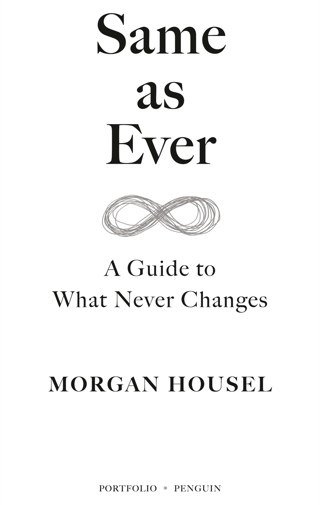

# Same as Ever 一如既往

Morgan Housel

PORTFOLIO / PENGUIN
投资组合/企鹅

An imprint of Penguin Random House LLC
企鹅兰登书屋有限责任公司的一个品牌

[penguinrandomhouse.com
企鹅兰登书屋网站](http://www.penguinrandomhouse.com/)

Copyright © 2023 by Morgan Housel
版权所有 © 2023 Morgan Housel

Penguin Random House supports copyright. Copyright fuels creativity, encourages diverse voices, promotes free speech, and creates a vibrant culture. Thank you for buying an authorized edition of this book and for complying with copyright laws by not reproducing, scanning, or distributing any part of it in any form without permission. You are supporting writers and allowing Penguin Random House to continue to publish books for every reader.
企鹅兰登书屋支持版权。版权推动创造力，鼓励多元声音，促进言论自由，创造出充满活力的文化。感谢您购买本书的授权版本，并遵守版权法，未经许可不复制、扫描或以任何形式分发其中任何部分。您的支持为作家提供了支持，并使企鹅兰登书屋能够继续为每位读者出版图书。

Library of Congress Cataloging-in-Publication Data
国会图书馆编目出版数据

Names: Housel, Morgan, author.
姓名：豪斯尔，摩根，作者。

Title: Same as ever : a guide to what never changes / Morgan Housel.
一如既往：永恒不变的指南 / 摩根·豪斯尔。

Description: [New York, NY] : Portfolio/Penguin, [2023] | Includes bibliographical references. |
描述：[纽约，纽约]：Portfolio/Penguin，[2023年] | 包含参考文献。

Identifiers: LCCN 2023010800 (print) | LCCN 2023010801 (ebook) |
标识符：LCCN 2023010800（印刷版）| LCCN 2023010801（电子书）|

ISBN 9780593332702 (hardcover) | ISBN 9780593716229 (international edition) | ISBN 9780593332719 (ebook)
ISBN 9780593332702（精装版）| ISBN 9780593716229（国际版）| ISBN 9780593332719（电子书）

Subjects: LCSH: Resilience (Personality trait) | Stability. | Change.
主题：LCSH：韧性（个性特质）| 稳定性。| 变化。

Classification: LCC BF698.35.R47 H656 2023 (print) | LCC BF698.35.R47 (ebook) | DDC 155.2/4—dc23/eng/20230624
分类：LCC BF698.35.R47 H656 2023（印刷版）| LCC BF698.35.R47（电子书）| DDC 155.2/4—dc23/eng/20230624

LC record available at https://lccn.loc.gov/2023010800
LC记录可在https://lccn.loc.gov/2023010800找到。

LC ebook record available at https://lccn.loc.gov/2023010801
LC电子书记录可在https://lccn.loc.gov/2023010801找到。

Cover design: Christopher Parker
封面设计：克里斯托弗·帕克

Cover image: Sumkinn / iStock / Getty Images Plus
封面图片：Sumkinn / iStock / Getty Images Plus

*Book design by Jessica Shatan Heslin/Studio Shatan, Inc., adapted for ebook by Estelle Malmed
由Jessica Shatan Heslin/Studio Shatan, Inc.设计，由Estelle Malmed适配电子书。*

pid_prh_6.1_145346964_c0_r0

*For the reasonable* *optimists**
对于理性的乐观主义者*

Our life is indeed the same as it ever was. . . . The same physiological and psychological processes that have been man’s for hundreds of thousands of years still endure.
我们的生活确实与以往一样……数十万年来一直存在的生理和心理过程仍然存在。

—Carl Jung
卡尔·荣格

The wise in all ages have always said the same thing, and the fools, who at all times form the immense majority, have in their way, too, acted alike, and done just the opposite.
聪明人在各个时代总是说同样的话，而愚蠢的人，无论何时都构成了绝大多数，他们也以自己的方式行事，做了完全相反的事情。

—Arthur Schopenhauer
亚瑟·叔本华

History never repeats itself; man always does.
历史永远不会重演；人类总是如此。

—Voltaire
"——伏尔泰"

I’ve learned an important trick: to develop foresight, you need to practice hindsight.
我学到了一个重要的诀窍：要培养远见，你需要练习回顾。

—Jane McGonigal
简简单单的翻译为：简·麦克冈尼格尔

The dead outnumber the living . . . fourteen to one, and we ignore the accumulated experience of such a huge majority of mankind at our peril.
死者人数超过活着的人...十四比一，如果我们忽视这么大多数人类的积累经验，那将是我们的危险。

—Niall Ferguson
—尼尔·弗格森

# 23 Little Stories about Things That Never Change 23个关于永恒不变的小故事

[Introduction
介绍]()

[The Little Laws of Life
生活的小法则]()

[Hanging by a Thread
岌岌可危]()

[If you know where we’ve been, you realize we have no idea where we’re going.
如果你知道我们曾经去过哪里，你就会意识到我们对未来一无所知。]()

[Risk Is What You Don’t See
风险就是你看不到的东西]()

[We are very good at predicting the future, except for the surprises—which tend to be all that matter.
我们非常擅长预测未来，除了那些意外情况——而这些往往是最重要的。]()

[Expectations and Reality
期望与现实]()

[The first rule of happiness is low expectations.
幸福的第一条规则是降低期望。]()

[Wild Minds
狂野的思维]()

[People who think about the world in unique ways you like also think about the world in unique ways you won’t like.
思考世界独特方式的人，你喜欢的方式也是你不喜欢的方式。]()

[Wild Numbers
狂野数字]()

[People don’t want accuracy. They want certainty.
人们不想要准确性，他们想要确定性。]()

[Best Story Wins
最好的故事获胜]()

[Stories are always more powerful than statistics.
故事总是比统计数据更有力量。]()

[Does Not Compute
无法计算]()

[The world is driven by forces that cannot be measured.
世界受到无法衡量的力量驱动。]()

[Calm Plants the Seeds of Crazy
平静种下疯狂的种子]()

[Crazy doesn’t mean broken. Crazy is normal; *beyond the point of crazy* is normal.
疯狂并不意味着破碎。疯狂是正常的；超越疯狂的地方才是正常的。]()

[Too Much, Too Soon, Too Fast
太多，太快，太早]()

[A good idea on steroids quickly becomes a terrible idea.
一个在类固醇作用下的好主意很快变成了一个糟糕的主意。]()

[When the Magic Happens
当魔法发生时]()

[Stress focuses your attention in ways that good times can’t.
压力会以一种好时光无法做到的方式集中你的注意力。]()

[Overnight Tragedies and Long-Term Miracles
一夜之间的悲剧和长期的奇迹]()

[Good news comes from compounding, which always takes time, but bad news comes from a loss in confidence or a catastrophic error that can occur in a blink of an eye.
好消息来自于积累，这通常需要时间，但坏消息来自于信心的丧失或一瞬间可能发生的灾难性错误。]()

[Tiny and Magnificent
微小而壮丽]()

[When little things compound into extraordinary things.
当小事变成了非凡的事情。]()

[Elation and Despair
喜悦与绝望]()

[Progress requires optimism and pessimism to coexist.
进步需要乐观和悲观共存。]()

[Casualties of Perfection
完美的牺牲品]()

[There is a huge advantage to being a little imperfect.
有一种巨大的优势在于稍微有些不完美。]()

[It’s Supposed to Be Hard
这应该是困难的]()

[Everything worth pursuing comes with a little pain. The trick is not minding that it hurts.
追求一切有价值的事物都伴随着一些痛苦。关键是不介意它会伤害。]()

[Keep Running
坚持奔跑]()

[Most competitive advantages eventually die.
大多数竞争优势最终都会消失。]()

[The Wonders of the Future
未来的奇迹]()

[It always feels like we’re falling behind, and it’s easy to discount the potential of new technology.
我们总是感觉落后，很容易低估新技术的潜力。]()

[Harder Than It Looks and Not as Fun as It Seems
比看起来更难，不如看起来的那么有趣]()

[“The grass is always greener on the side that’s fertilized with bullshit.”
草在施了牛粪的那一边总是更绿。]()

[Incentives: The Most Powerful Force in the World
激励：世界上最强大的力量]()

[When the incentives are crazy, the behavior is crazy. People can be led to justify and defend nearly anything.
当激励变得疯狂时，行为也会变得疯狂。人们会被引导去为几乎任何事情辩解和辩护。]()

[Now You Get It
现在你明白了]()

[Nothing is more persuasive than what you’ve experienced firsthand.
没有什么比亲身经历更具有说服力。]()

[Time Horizons
时间视角]()

[Saying “I’m in it for the long run” is a bit like standing at the base of Mount Everest, pointing to the top, and saying, “That’s where I’m heading.” Well, that’s nice. Now comes the test.
说“我会坚持到底”有点像站在珠穆朗玛峰的脚下，指着山顶说：“那就是我要去的地方。”好吧，那很好。现在是考验的时候了。]()

[Trying Too Hard
努力过度]()

[There are no points awarded for difficulty.
没有给予困难的奖励。]()

[Wounds Heal, Scars Last
伤口愈合，疤痕永存]()

[What have you experienced that I haven’t that makes you believe what you do? And would I think about the world like you do if I experienced what you have?
你经历了什么我没有经历过的事情，让你相信你所相信的？如果我经历了你经历过的事情，我会像你一样思考世界吗？]()

[Questions
问题]()

[Acknowledgments
致谢]()

[Notes
笔记]()

# Introduction 介绍

# The Little Laws of Life 生活的小法则

Ionce had lunch with a guy who’s close to Warren Buffett.
我曾与一个与沃伦·巴菲特关系密切的人共进午餐。

This guy—we’ll call him Jim (not his real name)—was driving around Omaha, Nebraska, with Buffett in late 2009. The global economy was crippled at this point, and Omaha was no exception. Stores were closed, businesses were boarded up.
这个人，我们称他为吉姆（非真实姓名），在2009年末与巴菲特一起在内布拉斯加州的奥马哈市四处驾车。全球经济在这个时候陷入困境，奥马哈也不例外。商店关闭，企业关门。

Jim said to Warren, “It’s so bad right now. How does the economy ever bounce back from this?”
吉姆对沃伦说：“现在情况太糟糕了。经济怎么能从这种情况中恢复过来呢？”

Warren said, “Jim, do you know what the bestselling candy bar was in 1962?”
沃伦说：“吉姆，你知道1962年最畅销的巧克力棒是什么吗？”

“No,” Jim said.
“不，”吉姆说。

“Snickers,” said Warren. “And do you know what the bestselling candy bar is today?”
“士力架，”沃伦说。“你知道今天最畅销的巧克力棒是什么吗？”

“No,” said Jim.
“不，”吉姆说道。

“Snickers,” Warren said.
"“Snickers，" 沃伦说道。

Then silence. That was the end of the conversation.
然后沉默。对话就此结束。

This is a book of short stories about what never changes in a changing world.
这是一本关于在不断变化的世界中永恒不变的短篇故事的书籍。

History is filled with surprises no one could have seen coming. But it’s also filled with so much timeless wisdom.
历史充满了无法预料的惊喜，但也充满了许多永恒的智慧。

If you traveled in time to five hundred years ago or five hundred years from now, you would be astounded at how much technology and medicine has changed. The geopolitical order would make no sense to you. The language and dialect might be completely foreign.
如果你穿越到五百年前或五百年后，你会对科技和医学的巨大变化感到震惊。地缘政治秩序对你来说毫无意义。语言和方言可能完全陌生。

But you’d notice people falling for greed and fear just like they do in our current world.
但你会注意到人们仍然会像我们现在的世界一样陷入贪婪和恐惧之中。

You’d see people persuaded by risk, jealousy, and tribal affiliations in ways that are familiar to you.
你会看到人们受到风险、嫉妒和部落关系的影响，这些方式对你来说是熟悉的。

You’d see overconfidence and shortsightedness that remind you of people’s behavior today.
你会看到过度自信和短视的行为，让你想起了今天人们的行为。

You’d find people seeking the secret to a happy life and trying to find certainty when none exists in ways that are entirely relatable.
你会发现人们寻求幸福生活的秘诀，试图在不存在确定性的情况下找到一种完全可以理解的方式。

When transported to an unfamiliar world, you’d spend a few minutes watching people behave and say, “Ah. I’ve seen this before. Same as ever.”
当被传送到一个陌生的世界时，你会花几分钟观察人们的行为并说：“啊，我以前见过这个。一如既往。”

Change captures our attention because it’s surprising and exciting. But the behaviors that never change are history’s most powerful lessons, because they preview what to expect in the future. Your future. *Everyone’s future*. No matter who you are, where you’re from, how old you are, or how much money you make, there are timeless lessons from human behavior that are some of the most important things you can ever learn.
变化引起我们的注意，因为它令人惊讶和兴奋。但那些永远不会改变的行为是历史上最有力的教训，因为它们预示着未来的发展。你的未来。每个人的未来。无论你是谁，来自哪里，年龄多大，赚多少钱，人类行为中都有一些永恒的教训，这些是你能学到的最重要的东西之一。

It’s a simple idea, but it’s so easy to overlook. And once you grasp it, you’ll be able to make better sense of your own life, understand why the world is the way it is, and become more at ease with what the future has in store.
这是一个简单的想法，但很容易被忽视。一旦你理解了它，你将能够更好地理解自己的生活，理解世界为什么是这样的，对未来的发展更加从容。

Amazon founder Jeff Bezos once said that he’s often asked what’s going to change in the next ten years. “I almost never get the question: ‘What’s not going to change in the next ten years?’ ” he said. “And I submit to you that that second question is actually the more important of the two.”
亚马逊创始人杰夫·贝索斯曾经说过，他经常被问到未来十年会发生什么变化。“我几乎从来没有被问到这个问题：‘未来十年不会发生什么变化？’”他说。“而我向你们提出，实际上第二个问题才是更重要的。”

Things that never change are important because you can put so much confidence into knowing how they’ll shape the future. Bezos said it’s impossible to imagine a future where Amazon customers don’t want low prices and fast shipping—so he can put enormous investment into those things.
永远不变的事物很重要，因为你可以对它们如何塑造未来充满信心。贝索斯说，无法想象未来亚马逊的顾客不想要低价和快速配送，所以他可以对这些方面进行巨额投资。

The same philosophy works in almost all areas of life.
相同的哲学在生活的几乎所有领域都适用。

I have no clue what the stock market will do next year (or any year). But I’m very confident about people’s penchant for greed and fear, which never changes. So that’s what I spend my time thinking about.
我对股市明年（或任何一年）的走势一无所知。但我对人们的贪婪和恐惧的倾向非常有信心，这是永恒不变的。所以这就是我花时间思考的内容。

I have no idea who will win the next presidential election. But I’m confident about the ways people’s attachment to tribal identities influences their thinking, which is the same today as it was a thousand years ago and will be a thousand years from now.
我不知道谁会赢得下一届总统选举。但我对人们对部落身份的依恋如何影响他们的思维方式充满信心，这与一千年前相同，也将与一千年后相同。

I cannot tell you what businesses will dominate the next decade. But I can tell you how business leaders let success go to their heads, becoming lazy and entitled and eventually losing their edge. That story hasn’t changed in hundreds of years and never will.
我不能告诉你哪些企业将主导未来十年。但我可以告诉你，商业领袖是如何因为成功而变得懒散和自以为是，最终失去竞争优势的。这个故事已经过去了几百年，将来也不会改变。

Philosophers have spent centuries discussing the idea that there are an infinite number of ways your life could play out, and you just happen to be living in this specific version. It’s a wild thing to contemplate, and it leads to the question: What would be true in *every imaginable* version of your life, not just this one? Those universal truths are obviously the most important things to focus on, because they don’t rely on chance, luck, or accident.
哲学家们花了几个世纪的时间讨论这样一个观点：你的生活有无数种可能的发展方式，而你恰好生活在这个特定的版本中。这是一个令人兴奋的思考，它引出了一个问题：在你的生活的每一个想象版本中，什么是真实的，而不仅仅是在这个版本中？那些普遍的真理显然是最重要的事情，因为它们不依赖于机遇、运气或意外。

Entrepreneur and investor Naval Ravikant put it this way: “In 1,000 parallel universes, you want to be wealthy in 999 of them. You don’t want to be wealthy in the fifty of them where you got lucky, so we want to factor luck out of it. . . . I want to live in a way that if my life played out 1,000 times, Naval is successful 999 times.”
企业家和投资者纳瓦尔·拉维坎特这样说：“在1,000个平行宇宙中，你希望在999个宇宙中变得富有。你不希望在那50个宇宙中变得富有，因为那只是侥幸，所以我们要排除运气的因素……我希望以一种方式生活，如果我的生活重复1,000次，纳瓦尔成功了999次。”

That’s what this book is about: In a thousand parallel universes, what would be true in every single one?
这本书的内容就是：在一千个平行宇宙中，有什么是每一个宇宙都是真实的？

Each of the following twenty-three chapters can be read independently, so there is no harm in skipping and choosing as you wish. What they have in common is that I’m confident each of these topics will be as relevant hundreds of years from now as they were hundreds of years ago.
以下的二十三个章节可以独立阅读，所以随意跳过和选择并不会有任何损害。它们的共同之处是，我相信这些主题中的每一个在几百年后仍然与几百年前一样相关。

None of the chapters are long, and you’re welcome for that. Many are derived from my blog at the Collaborative Fund, where I write about the intersection of money, history, and psychology.
没有任何一章很长，对此你表示欢迎。其中许多章节源自我在Collaborative Fund的博客，我在博客中写关于金钱、历史和心理学的交叉领域。

The first looks at how fragile the world is, with a personal story about the scariest day of my life.
第一个部分探讨了世界的脆弱性，通过一个关于我生命中最可怕的一天的个人故事。

# Hanging by a Thread 岌岌可危

> If you know where we’ve been, you realize we have no idea where we’re going. 如果你知道我们曾经去过哪里，你就会意识到我们对未来一无所知。

A big lesson from history is realizing how much of the world hangs by a thread. Some of the biggest and most consequential changes in history happened because of a random, unforeseeable, thoughtless encounter or decision that led to magic or mayhem.
历史给我们的一个重要教训是意识到世界有多少事情都是岌岌可危的。历史上一些最重大、最具影响力的变革都是因为一个偶然、无法预料、毫无思考的相遇或决定而引发了奇迹或混乱。

Author Tim Urban once wrote, “If you went back in time before your birth you’d be terrified to do anything, because you’d know that even the smallest nudges to the present can have major impacts on the future.”
作者蒂姆·厄尔班曾经写道：“如果你回到你出生之前的时间，你会害怕做任何事情，因为你会知道即使对现在的最小推动也会对未来产生重大影响。”

How hauntingly true.
多么令人心醉神迷的真实。

Let me tell you a personal story about how I became interested in this topic.
让我给你讲一个关于我如何对这个话题产生兴趣的个人故事。

------

—

I grew up ski racing in Lake Tahoe. I was on the Squaw Valley Ski Team, and it was the center of my life for a decade.
我在塔霍湖长大时参加了滑雪比赛。我曾是斯夸谷滑雪队的一员，它是我生活的中心长达十年。

Our ski team consisted of a dozen racers. By the early 2000s we were teenagers, and most of us had spent the majority of our lives together. We skied six days a week, ten months a year, traveling the globe to wherever we could find snow.
我们的滑雪队由十几名选手组成。到了2000年代初，我们都是十几岁的青少年，大部分时间我们都在一起度过。我们每周滑雪六天，一年十个月，到世界各地寻找雪地。

I wasn’t close to most of them—we spent too much time together and fought like cats. But four of us had become inseparable friends. This is the story of two of those friends—Brendan Allan and Bryan Richmond.
我和他们大多数人不亲近——我们在一起的时间太多，经常像猫一样打架。但我们中有四个人成为了形影不离的朋友。这是其中两个朋友——布伦丹·艾伦和布莱恩·里士满的故事。

On February 15, 2001, our team had just returned from a race in Colorado. Our flight home was delayed because Lake Tahoe had been hit with a blizzard extreme even by its own standards.
2001年2月15日，我们的团队刚刚从科罗拉多的一场比赛回来。我们的回程航班因为塔霍湖遭遇了一场暴风雪而延误，这场暴风雪甚至超出了它自己的标准。

You can’t ski race when there’s a blanket of new snow—racing requires hard-packed ice. So training was canceled, and Brendan, Bryan, and I prepared for a week of what we called free skiing: unstructured goofing off, skiing around, and having a good time.
当有一层新雪覆盖时，你不能进行滑雪比赛-比赛需要结冰的雪地。所以训练被取消了，布伦丹、布赖恩和我准备度过一个我们称之为自由滑雪的一周：无结构的闲逛，滑雪和玩得开心。

Earlier that month Tahoe received several feet of light, fluffy snow that comes from bitter-cold air. The storm that hit in mid-February was different. It was warm—barely at the freezing point—and powerful, leaving three feet of heavy, wet snow.
那个月初，塔霍收到了几英尺的轻盈、蓬松的雪，这是来自寒冷空气的。二月中旬来袭的暴风雪不同。它是温暖的，几乎接近冰点，而且强大，留下了三英尺的湿重雪。

We didn’t think about it at the time, but the combination of heavy snow on top of fluffy snow creates textbook avalanche conditions. A light base of snow with a heavy layer on top is incredibly fragile and prone to sliding.
我们当时没有考虑到，但是厚重的雪覆盖在松软的雪上会造成典型的雪崩条件。底部轻薄的雪层覆盖着厚重的雪层非常脆弱且容易滑动。

Ski resorts are pretty good at protecting customers from avalanches by closing off the most dangerous slopes and using explosives to intentionally set off avalanches late at night, before customers arrive in the morning.
滑雪度假村非常擅长保护顾客免受雪崩的伤害，他们会封闭最危险的坡道，并在深夜使用爆炸物故意引发雪崩，以确保顾客在早晨到达之前安全。

But if you’re skiing out of bounds—ducking under the do not cross ropes to ski the forbidden, untouched terrain—that system won’t help you.
但是，如果你在界外滑雪——越过禁止越界的绳子，滑行在未经触动的禁区地形上，那么这个系统对你没有帮助。

On the morning of February 21, 2001, Brendan, Bryan, and I met in the Squaw Valley Ski Team locker room, like we had hundreds of times before. Bryan’s last words when he left his house that morning were, “Don’t worry, Mom, I won’t ski out of bounds.”
2001年2月21日早上，布伦丹、布赖恩和我在斯夸谷滑雪队更衣室见面，就像我们之前数百次一样。布赖恩早上离开家时说的最后一句话是：“别担心，妈妈，我不会滑出界。”

But as soon as we clicked into our skis, that’s what we did.
但是一旦我们踏上滑雪板，那就是我们所做的。

------

—

The backside of Squaw Valley (now called Palisades Tahoe), behind the KT-22 chairlift, is a stretch of mountain about a mile long that separates Squaw from Alpine Meadows ski resort.
斯夸谷（现称为帕利塞德斯塔霍）的背面，位于KT-22缆车后方，是一段长约一英里的山脉，将斯夸谷与阿尔派恩草滑雪胜地分隔开来。

It’s amazing skiing—steep and wide-open, with rolling terrain.
这是令人惊叹的滑雪场——陡峭而开阔，地形起伏。

Before February 21 I had skied it maybe a dozen times. It wasn’t one of our frequent spots, because it takes so much time. It spits you out on a backcountry road, from where we would hitchhike back to our locker room.
2月21日之前，我可能已经滑过它十几次。这不是我们经常去的地方之一，因为需要花费很多时间。它会把你吐出到一个偏远的道路上，我们会搭便车回到我们的更衣室。

Brendan, Bryan, and I decided to ski it that morning.
布伦丹、布莱恩和我决定那天早上去滑雪。

Within seconds of ducking under the out-of-bounds ropes, I remember getting caught in an avalanche.
在越过界外绳索的几秒钟内，我记得自己被困在了雪崩中。

I had never experienced one before, but it was unforgettable. I didn’t hear or see the slide. I just suddenly realized my skis weren’t on the ground anymore—I was literally floating in a cloud of snow. You have no control in these situations, because rather than you pushing the snow to gain traction with your skis, the snow is pushing you. The best you can do is keep your balance to remain upright.
我以前从未经历过这种情况，但它是难以忘怀的。我没有听到或看到滑雪道，只是突然意识到我的滑雪板不再接触地面——我就像漂浮在一片雪云中。在这种情况下，你没有控制力，因为不是你用滑雪板推动雪来增加摩擦力，而是雪在推动你。你能做的最好的就是保持平衡，保持站立。

The avalanche was small, and ended quickly.
雪崩很小，很快就结束了。

“Did you see that avalanche?” I remember saying when we got to the road.
当我们到达公路时，我记得说：“你看到那次雪崩了吗？”

“Haha, that was awesome,” Brendan said.
“哈哈，太棒了，”布伦丹说道。

We didn’t say another word about it as we hitchhiked back to our locker room.
我们在搭便车回到更衣室的路上没有再提起这件事。

------

—

When we got back to Squaw, Brendan and Bryan said they wanted to ski the backside again.
当我们回到斯夸山时，布伦丹和布莱恩说他们想再次滑雪到山的背面。

I don’t know why, but I didn’t want to go.
我不知道为什么，但我不想去。

But I had an idea. Brendan and Bryan could ski the backside again, and I would drive around and pick them up so they wouldn’t have to hitchhike back.
但是我有一个主意。布伦丹和布莱恩可以再次滑雪到背面，我会开车绕过去接他们，这样他们就不用搭便车回来了。

We agreed on the plan and went our separate ways.
我们同意了这个计划，然后各自分道扬镳。

Thirty minutes later I drove to the backcountry road where I was scheduled to pick up Brendan and Bryan.
三十分钟后，我驾车去了预定的乡间小路上接布伦丹和布莱恩。

They weren’t there.
他们不在那里。

I waited another thirty minutes before giving up. It took about a minute to ski down, so I knew they weren’t coming. I figured they had beat me to the bottom and already hitchhiked back.
我再等了三十分钟后放弃了。滑下去大约需要一分钟，所以我知道他们不会来了。我猜想他们已经比我先到达底部并搭便车回来了。

I drove back to our locker room, expecting to find them. They weren’t there either. I asked around. No one had seen them.
我开车回到我们的更衣室，期望能找到他们。他们也不在那里。我四处打听，没有人见过他们。

Later that day, around 4:00 p.m., Bryan’s mom called me at home. I remember every word.
那天晚些时候，大约下午4点，布莱恩的妈妈给我打电话回家。我记得每一个字。

“Hi, Morgan, Bryan didn’t show up for work today. Do you know where he is?” she asked.
“嗨，摩根，布莱恩今天没有来上班。你知道他在哪里吗？”她问道。

I told her the truth. “We skied the backside of KT-22 this morning. He and Brendan did it again, I was going to pick them up on the road. But they weren’t there, and I haven’t seen them since.”
我告诉她实话。“今天早上我们滑了KT-22的背面。他和布伦丹又做了一次，我本来要在路上接他们。但他们不在那里，我从那以后就没见过他们。”

“Oh my God,” she said. Click.
“哦，天啊，”她说。咔嗒。

Bryan’s mom was an expert skier herself. I think in that moment she pieced together what may have happened. I did too.
布莱恩的妈妈本身就是一位熟练的滑雪者。我想在那一刻她也明白了可能发生了什么。我也是。

The hours ticked by, and everyone started to worry.
时间一分一秒地过去，每个人都开始担心起来。

Someone eventually called the police and filed a missing person report. The police didn’t take it very seriously, suggesting Brendan and Bryan likely snuck off to a party.
有人最终报警并提交了一份失踪人口报告。警方并没有太认真对待，暗示布伦丹和布莱恩可能偷偷溜去参加派对。

I knew that was wrong. “Their shoes are right there,” I said, pointing to Brendan’s and Bryan’s sneakers on the locker-room floor. “That means their ski boots are on their feet. And it’s now nine p.m. Think about that. It’s nine p.m. and they have their ski boots on their feet.” It was the first moment everyone looked around and realized how bad this was.
我知道那是错的。我指着布兰登和布赖恩的运动鞋说：“他们的鞋子就在那里。”“这意味着他们的滑雪靴已经穿在脚上了。而现在已经是晚上九点了。想想看吧，晚上九点他们还穿着滑雪靴。”这是第一次大家环顾四周，意识到情况有多糟糕。

Around ten I was told to go to the Squaw Valley Fire Department, where I met the local search and rescue team.
大约十点的时候，我被告知去斯夸谷消防局，那里我见到了当地的搜救队。

I explained everything that Brendan, Bryan, and I did that day. The search team pulled out these giant photo maps that must have been taken from a helicopter. I showed them exactly where we entered the out-of-bounds area.
我解释了布伦丹、布莱恩和我那天所做的一切。搜寻队拿出了这些巨大的航拍地图。我向他们展示了我们进入禁区的确切位置。

I told them about the small avalanche that morning. As soon as I mentioned it I could see the dots connecting in the rescuers’ heads. I remember that when I finished talking two of the rescuers looked at each other and sighed.
我告诉他们那天早上发生的小雪崩。我一提起，就看到救援人员脑海中的点点连接。我记得当我说完后，两名救援人员相互看了看，叹了口气。

In the middle of the night, with giant floodlights and a team of search dogs, the rescuers went looking for Brendan and Bryan.
在深夜，带着巨大的洪灾灯光和一队搜救犬，救援人员去寻找布伦丹和布莱恩。

I later learned that as soon as they entered the out-of-bounds area where I told them we skied, they discovered the fresh scars of a recent avalanche debris field. It was massive, “like half the mountain had been torn away,” one said.
后来我得知，他们一进入我告诉他们我们滑雪的禁区，就发现了最近雪崩残骸场的新鲜痕迹。那是巨大的，“就像山的一半被撕裂了一样”，有人说。

I drove back to the locker room around midnight. The Squaw Valley parking lot can hold several thousand cars. By this time it was almost empty. Everyone had gone home, except two cars parked next to each other: Brendan’s Jeep and Bryan’s Chevy pickup.
我在午夜左右开车回到更衣室。斯夸谷停车场可以容纳几千辆汽车。此时几乎空无一人。除了停在一起的两辆车：布伦丹的吉普车和布莱恩的雪佛兰皮卡车，其他人都已经回家了。

------

—

I tried to sleep on a bench in the locker room but couldn’t shut my eyes. I remember thinking Brendan and Bryan would come bounding through the door, and we could laugh about the time I had to call the cops to find them.
我试着在更衣室的长椅上睡觉，但无法闭上眼睛。我记得当时想着布伦丹和布莱恩会跳进门来，我们可以一起笑，回忆起我不得不报警找到他们的那个时刻。

By nine a.m. the locker room was packed with other ski racers, parents, friends, and family, all eager to help. It became a staging area for the search.
早上九点，更衣室里挤满了其他滑雪比赛选手、父母、朋友和家人，大家都急切地想要帮忙。它成为了搜寻的临时指挥中心。

I laid back down on the bench and finally fell asleep.
我躺回长椅上，最终入睡了。

A few minutes later I awoke to the sound of a scream, yelling, and commotion.
几分钟后，我被尖叫声、喊叫声和喧闹声吵醒。

I knew what had happened. No one needed to say it.
我知道发生了什么事情，没有人需要说出来。

I walked to the second floor of the locker room, where I saw Bryan’s mom on a couch. The scream was hers.
我走到更衣室的二楼，看到布莱恩的妈妈坐在沙发上。尖叫声是她发出的。

“I’m so sorry,” I told her, bawling.
我很抱歉，我告诉她，哭泣着。

It’s hard to describe a moment like that. I didn’t know what else to say then. I don’t know what else to say now.
这样的时刻很难形容。当时我不知道还能说什么。现在我也不知道还能说什么。

Search dogs had homed in on a spot in the avalanche field where rescuers with probe poles found Brendan and Bryan buried under six feet of snow.
搜救犬已经锁定了雪崩现场的一个地点，救援人员用探杆找到了布伦丹和布莱恩被埋在六英尺深的雪下。

They were born one day apart, and died ten feet from each other.
他们相隔一天出生，相隔十英尺离世。

------

—

Later that day I drove to see my dad at work. I wanted to be around my family. He met me in the parking lot and said, “I’ve never been so happy to see you.” It’s the only time in my life I’ve seen him cry.
那天晚些时候，我开车去看我爸爸上班。我想和家人在一起。他在停车场遇见我，说：“见到你我从来没有这么开心过。”那是我一生中唯一一次见到他哭泣。

It didn’t occur to me until that moment how close I was to going with Brendan and Bryan on that fateful run.
直到那一刻，我才意识到我离与布伦丹和布莱恩一起去那次命运般的跑步多么近。

Then I began wondering: Why did I ski the backside with them once that morning, then decline a second run—a decision that almost certainly saved my life?
然后我开始思考：为什么我早上和他们一起滑了一次背面，然后拒绝了第二次滑行——这个决定几乎肯定救了我的命？

I’ve thought about it a million times. I have no idea.
我已经思考了无数次。我不知道。

*I have no idea.
我不知道。*

There is no explanation.
没有解释。

I didn’t think it through, I didn’t calculate the danger, I didn’t consult an expert, I didn’t weigh the pros and cons.
我没有仔细考虑，没有计算危险，没有咨询专家，没有权衡利弊。

It was a complete fluke, a random and thoughtless bit of dumb luck that became the most important decision of my life—far more important than every intentional decision I’ve ever made—or ever will make.
这是一个完全的偶然事件，一个随机而毫无思考的幸运之事，却成为了我一生中最重要的决定——远比我曾经做过或将来会做的每一个有意识的决定都更重要。

That’s my personal story, and maybe you have a similar one about your own life. But if you look, I think you’ll see that a lot of history is the same.
这是我的个人故事，也许你有一个类似的关于自己生活的故事。但是如果你仔细看，我想你会发现很多历史都是相似的。

Let me give you three freakish examples about how much of today’s world relies on a few tiny things you’d never think about.
让我给你举三个关于当今世界多少依赖于一些你从未想过的微小事物的怪异例子。

------

—

The Battle of Long Island was a disaster for George Washington’s army. His ten thousand troops were crushed by the British and its four-hundred-ship fleet.
长岛战役对乔治·华盛顿的军队来说是一场灾难。他的一万名士兵被英军及其四百艘舰队击溃。

But it could have been so much worse. It could have been the end of the Revolutionary War.
但情况本可以更糟糕。这可能是美国革命战争的结束。

All the British had to do was sail up the East River and Washington’s cornered troops would have been wiped out.
英国人所要做的就是沿着东河航行，华盛顿的被困部队就会被消灭。

But it never happened, because the wind wasn’t blowing in the right direction and sailing up the river became impossible.
但是这从未发生过，因为风向不对，无法顺流而上。

Historian David McCullough once told interviewer Charlie Rose that “if the wind had been in the other direction on the night of August twenty-eighth [1776], I think it would have all been over.”
历史学家大卫·麦卡洛告诉采访者查理·罗斯：“如果1776年8月28日晚上风向相反，我认为一切都会结束。”

“No United States of America if that had happened?” Rose asked.
如果发生了那种情况，美利坚合众国就不存在了吗？罗斯问道。

“I don’t think so,” said McCullough.
“我不这么认为，”麦卡洛说道。

“Just because of the wind, history was changed?” asked Rose.
“仅仅因为风的缘故，历史就改变了吗？” 罗斯问道。

“Absolutely,” said McCullough.
“当然，”麦卡洛说道。

------

—

Compelled to save money, Captain William Turner shut down the fourth boiler room on his giant steamship for its passage from New York to Liverpool. The decision would slow the ship’s voyage by one day—an annoyance, but worth the savings as the passenger-ship industry struggled economically.
为了节省费用，威廉·特纳船长关闭了他的巨型蒸汽船上的第四个锅炉室，以便从纽约到利物浦的航行。这个决定将使船只的航行延迟一天，虽然有些烦恼，但在客运船业经济困难的情况下，这个节省是值得的。

Little did he or anyone else know how fateful the decision would be.
他或任何其他人都不知道这个决定会有多么重大的影响。

The delay meant Turner’s ship—the *Lusitania*—would now sail directly into the path of a German submarine.
延误意味着特纳的船——卢西塔尼亚号——现在将直接航行进入一艘德国潜艇的路径。

The *Lusitania* was hit with a torpedo, killing nearly twelve hundred passengers and becoming the most important trigger to rally U.S. public support for entering World War I.
卢西塔尼亚号遭到一枚鱼雷击中，造成近1200名乘客死亡，成为美国公众支持参与第一次世界大战的最重要导火索。

Had the fourth boiler room been operating, Turner would have reached Liverpool a day before the German submarine had even entered the Celtic Sea, where it crossed paths with the *Lusitania*. The ship likely would have avoided attack. A country may have avoided a war that became the seed event for the rest of the twentieth century.
如果第四个锅炉房运行正常，特纳会在德国潜艇进入凯尔特海之前一天抵达利物浦，那时它与卢西塔尼亚相遇。这艘船很可能会避免遭到袭击。一个国家可能会避免一场成为二十世纪其余事件的种子的战争。

------

—

Giuseppe Zangara was tiny, barely five feet tall. He stood on a chair outside a Miami political rally in 1933 because that was the only way he could aim his gun across the crowd.
朱塞佩·赞加拉身材矮小，几乎只有五英尺高。他站在1933年迈阿密的一次政治集会外的一把椅子上，因为那是他唯一能够瞄准人群的方式。

Zangara fired five shots. One of them hit Chicago mayor Anton Cermak, who was shaking hands with Zangara’s intended target. Cermak died. The target, Franklin Delano Roosevelt, was sworn in as president two weeks later.
Zangara开了五枪。其中一枪击中了正在与Zangara的目标握手的芝加哥市长Anton Cermak。Cermak死亡。两周后，目标Franklin Delano Roosevelt宣誓就任总统。

Within months of his inauguration Roosevelt transformed the U.S. economy through the New Deal. John Nance Garner—who would have become president had Zangara hit his target—opposed most of the New Deal’s deficit spending. He almost certainly wouldn’t have enacted many of the same policies, some of which still shape today’s economy.
罗斯福就职几个月后，通过新政改变了美国经济。如果札加拉击中目标，约翰·南斯·加纳将成为总统，他反对新政的赤字支出。他几乎肯定不会实施许多相同的政策，其中一些仍然影响着今天的经济。

------

—

You can play this game all day. Every big story could have turned out differently if a few little puffs of nothingness went the other direction.
你可以整天玩这个游戏。如果一些微不足道的无物之气朝着另一个方向去了，每个大故事都可能有不同的结局。

So much of the world hangs by a thread.
世界上很多事情都悬在一线之间。

An irony of studying history is that we often know exactly how a story ends, but we have no idea where it began.
研究历史的讽刺之处在于，我们通常确切地知道一个故事如何结束，但却不知道它从何开始。

Here’s an example: What caused the 2008 financial crisis?
这里有一个例子：是什么导致了2008年的金融危机？

Well, you have to understand the mortgage market.
嗯，你必须了解抵押贷款市场。

What shaped the mortgage market? Well, you have to understand the thirty-year decline in interest rates that preceded it.
什么塑造了抵押贷款市场？嗯，你必须了解它之前的30年利率下降。

What caused falling interest rates? Well, you have to understand the inflation of the 1970s.
什么导致了利率下降？嗯，你必须了解1970年代的通货膨胀。

What caused that inflation? Well, you have to understand the monetary system of the 1970s and the hangover effects from the Vietnam War.
是什么导致了通货膨胀？嗯，你必须了解20世纪70年代的货币体系以及越战带来的后遗症。

What caused the Vietnam War? Well, you have to understand the West’s fear of communism after World War II . . . and so on forever.
越南战争的原因是什么？嗯，你必须理解二战后西方对共产主义的恐惧……以及一直以来的种种原因。

------

—

Every current event—big or small—has parents, grandparents, great-grandparents, siblings, and cousins. Ignoring that family tree can muddy your understanding of events, giving a false impression of why things happened, how long they might last, and under what circumstances they might occur again. Viewing events in isolation, without an appreciation of their long roots, helps explain everything from why forecasting is hard to why politics is nasty.
每一个当前事件，无论大小，都有父母、祖父母、曾祖父母、兄弟姐妹和表兄弟姐妹。忽视这个家族谱系会混淆你对事件的理解，给人一种错误的印象，即为什么事情发生，它们可能持续多久，以及在什么情况下它们可能再次发生。孤立地看待事件，不理解它们的深层根源，可以解释为什么预测困难，为什么政治恶劣。

People like to say, “To know where we’re going, you have to know where we’ve been.” But more realistic is admitting that if you know where we’ve been, you realize we have no idea where we’re going. Events compound in unfathomable ways.
人们喜欢说：“要知道我们要去哪里，就必须知道我们来自哪里。”但更现实的是承认，如果你知道我们来自哪里，你会意识到我们对未来一无所知。事件以难以理解的方式累积。

I try to keep two things in mind in a world that’s this vulnerable to chance and accident.
在这个如此容易受到机遇和意外影响的世界中，我试着记住两件事情。

One is highlighting this book’s premise—to base predictions on how people behave rather than on specific events. Predicting what the world will look like fifty years from now is impossible. But predicting that people will still respond to greed, fear, opportunity, exploitation, risk, uncertainty, tribal affiliations, and social persuasion in the same way is a bet I’d take.
一个重点是强调这本书的前提是基于人们的行为而不是具体事件来进行预测。预测五十年后世界会是什么样子是不可能的。但是预测人们在面对贪婪、恐惧、机会、剥削、风险、不确定性、部落归属和社会说服时仍然会以相同的方式作出反应，这是我愿意赌的一注。

Forecasting events is hard because it’s easy to skip the question “And then what?”
预测事件很困难，因为很容易忽略问题：“接下来呢？”

Saying “Higher gas prices will cause people to drive less” seems logical.
说“油价上涨会导致人们减少驾驶”似乎是合乎逻辑的。

But then what?
那之后呢？

Well, people have to drive, so maybe they’ll look for more fuel-efficient vehicles. They’ll complain to politicians, who will offer tax breaks to buy those vehicles. OPEC is asked to drill more; energy entrepreneurs innovate. And the oil industry knows two speeds: boom and bust. So they’ll probably pump too much. Then prices fall, all while people own more efficient vehicles. Then maybe the suburbs become more popular—and people end up driving even more than before.
好吧，人们必须开车，所以也许他们会寻找更节能的车辆。他们会向政治家抱怨，政治家会提供购买这些车辆的税收优惠。OPEC被要求多开采石油；能源企业家进行创新。石油行业有两个速度：繁荣和萧条。所以他们可能会过度开采。然后价格下跌，而人们拥有更高效的车辆。然后也许郊区变得更受欢迎 - 人们最终比以前更多地开车。

So who knows.
那么谁知道呢。

Every event creates its own offspring, which impact the world in their own special ways. It makes prediction exceedingly hard. The absurdity of past connections should humble your confidence in predicting future ones.
每一个事件都会产生自己独特的后代，以其特殊的方式影响着世界。这使得预测变得极其困难。过去联系的荒谬性应该让你对预测未来联系的自信心感到谦卑。

The other thing to keep in mind is to have a wider imagination. No matter what the world looks like today, and what seems obvious today, everything can change tomorrow because of some tiny accident no one’s thinking about. Events, like money, compound. And the central feature of compounding is that it’s never intuitive how big something can grow from a small beginning.
另一件要记住的事情是要有更广阔的想象力。无论今天世界看起来如何，以及今天似乎显而易见的事情，由于一些没有人考虑到的微小事故，一切都可能在明天发生改变。事件和金钱一样，会不断积累。而复利的核心特点是，从一个小的开始，事物能够变得多么庞大从来都不是直观的。

Next, let me tell you another old story showing how easy it is to ignore risks.
接下来，让我给你讲另一个古老的故事，展示了忽视风险是多么容易。

# Risk Is What You Don’t See 风险就是你看不到的东西

> We are very good at predicting the future, except for the surprises—which tend to be all that matter. 我们非常善于预测未来，除了意外--这往往是最重要的。

It’s well-known that people are bad at predicting the future.
众所周知，人们不善于预测未来。

But this misses an important nuance: We are very good at predicting the future, except for the surprises—which tend to be all that matter.
但这忽略了一个重要的细微差别：我们非常善于预测未来，除了意外--这往往是最重要的。

The biggest risk is always what no one sees coming, because if no one sees it coming, no one’s prepared for it; and if no one’s prepared for it, its damage will be amplified when it arrives.
最大的风险总是没有人预料到的，因为如果没有人预料到，就没有人做好准备；如果没有人做好准备，当它来临时，其破坏力就会被放大。

A quick story about a guy who learned this the hard way.
有一个关于一个人的小故事，他从中学到了这个道理。

------

Before launching themselves into space on rockets, NASA astronauts ran tests in high-altitude hot-air balloons.
在乘坐火箭进入太空之前，美国国家航空航天局的宇航员在高空热气球上进行了测试。

A balloon flight on May 4, 1961, took American Victor Prather and another pilot to 113,720 feet, scraping the edge of space. The goal was to test NASA’s new space suit.
1961年5月4日，美国人维克多-普拉瑟和另一名飞行员乘坐热气球飞到了113720英尺的高空，擦过了太空的边缘。这次飞行的目的是测试美国宇航局的新型太空服。

The flight was a success. The suit worked beautifully.
飞行很成功。宇航服运转良好。

As Prather descended back to earth, he opened the faceplate on his helmet when he was low enough to breathe on his own, ostensibly to catch some fresh air.
在普拉瑟返回地面的过程中，当他下降到足以自行呼吸时，他打开了头盔上的面罩，表面上是为了呼吸一些新鲜空气。

He landed in the ocean as planned, where a helicopter was to pull him to safety. But there was a small mishap: While connecting himself to the helicopter’s rescue line, Prather slipped, falling into the ocean.
他按计划降落在海中，一架直升机将把他拉到安全的地方。但是发生了一个小意外：当普拉瑟把自己和直升机的救援绳索连接在一起时，他滑倒了，掉进了海里。

This shouldn’t have been that big a deal, and no one in the rescue helicopter panicked. The space suit should have been watertight and buoyant.
这本不应该是什么大事，救援直升机上的人也没有惊慌失措。太空服应该是防水和有浮力的。

But since Prather had opened his faceplate, he was now exposed to the elements. Water rushed into his suit. Prather drowned.
但由于普拉瑟打开了面罩，他现在暴露在大自然中。水冲进了他的宇航服。普拉瑟溺水身亡。

Think of how much planning goes into launching someone into space. So much expertise, so many contingencies. So many what-ifs and what-thens. Every detail is contemplated by thousands of experts. NASA is probably the most planning-centric organization that has ever existed; you don’t go to the moon by crossing your fingers and hoping for the best. Every conceivable risk has a plan A, plan B, plan C.
想想把一个人送入太空需要多少计划。那么多的专业知识，那么多的突发事件。那么多的 "如果 "和 "万一"。每一个细节都要经过成千上万专家的深思熟虑。美国国家航空航天局可能是有史以来最注重计划的组织。每一个可以想象的风险都有A计划、B计划和C计划。

But even then—despite so much planning—a tiny thing no one had considered invites catastrophe.
但即便如此--尽管有如此多的计划--一件微小的事情却没有人考虑过会招致灾难。

As financial advisor Carl Richards says, “Risk is what’s left over after you think you’ve thought of everything.”
正如财务顾问卡尔-理查兹（Carl Richards）所说："风险就是在你认为已经考虑到一切之后剩下的东西"。

That’s the real definition of risk—what’s left over after you’ve prepared for the risks you can imagine.
这才是风险的真正定义--当你为你能想象到的风险做好准备之后，剩下的就是风险。

Risk is what you don’t see.
风险就是你看不到的东西。

------

—

Look at the big news stories that move the needle—COVID-19, 9/11, Pearl Harbor, the Great Depression. Their common trait isn’t necessarily that they were big; it’s that they were surprises, on virtually no one’s radar until they arrived.
看看那些能牵动人心的大新闻--COVID-19、911、珍珠港事件、大萧条。它们的共同特点并不一定是大，而是出人意料，在出现之前几乎无人关注。

“After booms come busts” is about as close to economic law as it gets. Study history, and the calamity that followed the booming 1920s, late 1990s, and early 2000s seems more than obvious. It seems inevitable.
"盛极必衰 "是最接近经济规律的一句话。研究历史，20 世纪 20 年代、20 世纪 90 年代末和 21 世纪初繁荣之后的灾难似乎是显而易见的。它似乎是不可避免的。

In October 1929—the peak of history’s craziest stock bubble and the eve of the Great Depression—economist Irving Fisher famously told an audience that “stock prices have reached what looks like a permanently high plateau.”
1929 年 10 月--历史上最疯狂的股票泡沫的顶峰和大萧条的前夜--经济学家欧文-费雪对听众说："股票价格已经达到了一个看似永久性的高点。

We look at these comments today and laugh. How could someone so smart be so blind to something so inevitable? If you follow the rule that the crazier the boom, the harder the bust, the Great Depression must have been obvious.
我们今天看到这些评论，不禁哑然失笑。如此聪明的人怎么会对如此不可避免的事情视而不见呢？如果你遵循 "繁荣越疯狂，萧条越艰难 "的规律，那么大萧条一定是显而易见的。

But Fisher was a smart guy. And he wasn’t alone.
但费舍尔是个聪明人他并不孤单

In an interview years ago I asked Robert Shiller, who won the Nobel Prize for his work on bubbles, about the inevitability of the Great Depression. He responded:
在多年前的一次采访中，我曾问因研究泡沫问题而获得诺贝尔奖的罗伯特-席勒，大萧条是否不可避免。他回答说

> Well, nobody forecasted that. Zero. Nobody. Now there were, of course, some guys who were saying the stock market is overpriced. But if you look at what they said, did that mean a depression is coming? A decade-long depression? No one said that.
> 没有人预测到这一点。没有没人当然也有人说股市定价过高但如果你看看他们说的话 这是否意味着大萧条即将来临？长达十年的萧条？没人这么说
>
> I have asked economic historians to give me the name of someone who predicted the depression, and it comes up zero.
> 我曾请经济史学家给我一个预测过经济大萧条的人的名字，结果是零。

That stuck with me. Here we are today, blessed with hindsight, knowing the crash after the Roaring Twenties was obvious and inevitable. But for those who lived through it—people for whom the 1930s was a yet-to-be-discovered future—it was anything but.
我对此记忆犹新。今天，我们有幸后知后觉，知道 "咆哮的二十年代 "之后的崩溃是显而易见且不可避免的。但对于那些经历过二十世纪三十年代的人--对他们来说，二十世纪三十年代是一个尚未被发现的未来--来说，却并非如此。

Two things can explain something that looks inevitable but wasn’t predicted by those who experienced it at the time:
有两件事可以解释这种看起来不可避免，但当时的亲历者却没有预测到的事情：

• Either everyone in the past was blinded by delusion.
\- 要么是过去的每个人都被妄想蒙蔽了双眼。

• Or everyone in the present is fooled by hindsight.
\- 或者说，现在的每个人都被事后诸葛亮愚弄了。

We are crazy to think it’s all the former and none of the latter.
我们疯狂地认为只有前者而没有后者。

*The Economist*—a magazine I admire—publishes a forecast of the year ahead each January. Its January 2020 issue does not mention a single word about COVID-19. Its January 2022 issue does not mention a single word about Russia invading Ukraine.
《经济学人》--一本我很欣赏的杂志--每年一月都会发布未来一年的预测。其 2020 年 1 月刊只字未提 COVID-19。2022 年 1 月刊对俄罗斯入侵乌克兰只字未提。

That’s not a criticism—both events were impossible to know when the issues were planned in the months before publication.
这并不是批评--在出版前几个月计划发行时，这两个事件都是不可能知道的。

But that’s the point: The biggest news, the biggest risks, the most consequential events are always what you don’t see coming.
但这就是问题所在：最大的新闻、最大的风险、最有影响的事件总是你没有预料到的。

Put another way: There is rarely more or less economic uncertainty; just changes in how ignorant people are to potential risks. Asking what the biggest risks are is like asking what you expect to be surprised about. If you knew what the biggest risk was you would do something about it, and doing something about it would make it less risky. What your imagination can’t fathom is the dangerous stuff, and it’s why risk can never be mastered.
换一种说法：经济的不确定性很少有增减，只是人们对潜在风险的无知程度发生了变化。问什么是最大的风险，就好比问你会对什么感到惊讶。如果你知道最大的风险是什么，你就会有所行动，而有所行动就会降低风险。你的想象力无法理解的东西才是危险的，这也是风险永远无法被掌握的原因。

I can promise you that will be the case going forward. The biggest risk and the most important news story of the next ten years will be something nobody is talking about today. No matter what year you’re reading this book, that truth will remain. I can say that confidently because it’s always been true. The fact that you can’t see it coming is exactly what makes it risky.
我可以向你保证，未来的情况也将如此。未来十年最大的风险和最重要的新闻将是今天无人问津的事情。无论你在哪一年读这本书，这个事实都将继续存在。我可以自信地说，因为它一直都是事实。你无法预见它的到来正是它的风险所在。

Even for something as giant as the Great Depression, many people were blind to what was happening even when it was well under way.
即使是像大萧条这样的巨灾，许多人在大萧条发生时也视而不见。

The Depression, as we know today, began in 1929. But when the well-informed members of the National Economic League were polled in 1930 as to what they considered the biggest problem of the United States, they listed, in order:
我们今天所知的大萧条始于 1929 年。但是，1930 年，当全国经济联盟的知情成员接受调查，询问他们认为美国最大的问题是什么时，他们依次列出了以下问题：

1. Administration of justice

1.司法行政

2. Prohibition
3. Disrespect for law

3.不尊重法律

4. Crime
5. Law enforcement
6. World peace

And in *eighteenth place . . .* unemployment.
失业率排名第 18 位。

A year later, in 1931—a full two years into what we now consider the Great Depression—unemployment had moved to just fourth place, behind prohibition, justice, and law enforcement.
一年后，也就是 1931 年--我们现在认为的大萧条已经过去了整整两年--失业率仅排在第四位，仅次于禁酒令、司法和执法。

That’s what made the Great Depression so awful: No one was prepared for it because no one saw it coming. So people couldn’t deal with it financially (paying their debts) and mentally (the shock and grief of sudden loss).
这就是大萧条的可怕之处：没有人做好准备，因为没有人预见到它的到来。因此，人们在经济上（偿还债务）和精神上（突然失去亲人的震惊和悲痛）都无法应对。

A big part of this idea is coming to terms with how limited our view of what’s happening in the world can be.
这个想法的一个重要部分就是要认识到，我们对世界上发生的事情的看法是多么有限。

Franklin Delano Roosevelt looked around the room and chuckled when his presidential library opened in 1941. A reporter asked why he was so cheerful. “I’m thinking of all the historians who will come here thinking they’ll find the answers to their questions,” he said.
1941 年，富兰克林-德拉诺-罗斯福的总统图书馆开馆时，他环顾四周，开怀大笑。一位记者问他为何如此开心。"他说："我在想，所有的历史学家都会来到这里，以为他们会找到问题的答案。

There is so much we don’t know. And not just about the future, but the past.
我们不知道的事情太多了。不仅是未来，还有过去。

History knows three things: 1) what’s been photographed, 2) what someone wrote down or recorded, and 3) the words spoken by people whom historians and journalists wanted to interview and who agreed to be interviewed.
历史知道三件事：1) 拍下来的东西；2) 有人写下来或记录下来的东西；3) 历史学家和记者想要采访并同意接受采访的人所说的话。

What percentage of everything important that’s ever happened falls into one of those three categories? No one knows. But it’s tiny. And all three suffer from misinterpretation, incompleteness, embellishment, lying, and selective memory.
在所有重要事件中，有多少属于这三类？没人知道。但这是微乎其微的。这三种情况都存在曲解、不完整、美化、撒谎和选择性记忆等问题。

When your view of what’s happening and has happened in the world is so limited, it’s easy to underestimate what you don’t know, what else could be happening right now, and what could go wrong that you’re not even envisioning.
当你对世界上正在发生和已经发生的事情的看法如此有限时，就很容易低估你不知道的事情，低估现在还可能发生的事情，低估你甚至没有预见到的可能出错的事情。

Think of a content child, blissfully playing with toys and smiling as the sun hits their face.
想想一个满足的孩子，幸福地玩着玩具，当阳光洒在他们脸上时，他们会微笑。

In their mind, everything is great. Their world begins and ends with their immediate surroundings—Mom is here, Dad is there, toys are nearby, food is in my stomach. As far as they’re concerned, life is perfect. They have all the information they need.
在他们的心目中，一切都是美好的。他们的世界始于身边的环境，也止于身边的环境--妈妈在这里，爸爸在那里，玩具就在附近，食物就在我的肚子里。在他们看来，生活是完美的。他们拥有所需的一切信息。

What they’re unaware of is so much greater. In the mind of a three-year-old, the concept of geopolitics is completely unimaginable. The idea of rising interest rates hurting the economy, or the reason someone needs a paycheck, or what a career even is, or the risk of cancer, is utterly out of sight, out of mind.
他们所不知道的事情要多得多。在一个三岁孩子的脑海中，地缘政治的概念是完全无法想象的。至于利率上升会对经济造成伤害，或者一个人需要工资的原因，或者职业是什么，或者患癌症的风险，这些都是完全看不见、摸不着的。

Psychologist Daniel Kahneman says, “The idea that what you don’t see might refute everything you believe just doesn’t occur to us.”
心理学家丹尼尔-卡尼曼（Daniel Kahneman）说："我们不会想到，你看不到的东西可能会驳倒你所相信的一切。

The wild thing is adults are just as blind to what’s going on in the world.
疯狂的是，成年人对世界上发生的事情同样视而不见。

There’s a haunting video of a local New York City newscast from the morning of September 11, 2001, minutes before the terrorist attacks took place. It begins: “Good morning; sixty-four degrees at eight. It’s Tuesday, September eleventh. . . . It’s going to be a beautiful day today, sunshine throughout. Really a splendid September day. The afternoon temperature is about eighty degrees . . .”
2001 年 9 月 11 日上午，也就是恐怖袭击发生前几分钟，纽约市当地的一段新闻播报视频令人回味无穷。视频的开头是"早上好，八点钟气温六十四度。今天是 9 月 11 日，星期二。. . .今天天气很好，阳光普照。真的是九月的好天气。下午的气温大约是八十度....... ."

Risk is what they couldn’t see coming.
风险是他们无法预见的。

------

—

By definition there’s not much you can do about this. It’s one of those things that just is.
根据定义，你对此无能为力。事情就是这样。

It’s impossible to plan for what you can’t imagine, and the more you think you’ve imagined everything the more shocked you’ll be when something happens that you hadn’t considered.
你不可能为你无法想象的事情制定计划，而且你越是认为你已经想到了一切，当发生你没有考虑到的事情时，你就会越震惊。

But two things can push you in a more helpful direction.
但有两件事可以推动你朝着更有帮助的方向前进。

One, think of risk the way the State of California thinks of earthquakes. It knows a major earthquake will happen. But it has no idea when, where, or of what magnitude. Emergency crews are prepared despite no specific forecast. Buildings are designed to withstand earthquakes that may not occur for a century or more. Nassim Taleb says, “Invest in preparedness, not in prediction.” That gets to the heart of it.
首先，要像加利福尼亚州看待地震那样看待风险。它知道会发生大地震。但它不知道时间、地点和震级。尽管没有具体的预测，应急人员还是做好了准备。建筑物的设计可以抵御一个世纪或更长时间内可能不会发生的地震。纳西姆-塔勒布说："投资于准备，而非预测。这句话切中要害。

Risk is dangerous when you think it requires a specific forecast before you start preparing for it. It’s better to have expectations that risk will arrive, though you don’t know when or where, than to rely exclusively on forecasts—almost all of which are either nonsense or about things that are well-known. Expectations and forecasts are two different things, and in a world where risk is what you don’t see, the former is more valuable than the latter.
当你认为在开始准备应对风险之前，需要对风险进行具体预测时，风险就会很危险。虽然你不知道风险会在何时何地来临，但最好还是有风险会来临的预期，而不是完全依赖预测--几乎所有的预测要么是无稽之谈，要么是关于众所周知的事情。预期和预测是两码事，在一个风险就是你看不到的东西的世界里，前者比后者更有价值。

Two, realize that if you’re only preparing for the risks you can envision, you’ll be unprepared for the risks you can’t see every single time. So, in personal finance, the right amount of savings is when it feels like it’s a little too much. It should feel excessive; it should make you wince a little.
第二，要认识到，如果你只为你能预见的风险做准备，那么你就会对你无法预见的风险每一次都毫无准备。因此，在个人理财中，正确的储蓄金额是感觉有点多的时候。它应该让你感觉过多，应该让你有点畏缩。

The same goes for how much debt you think you should handle—whatever you think it is, the reality is probably a little less. Your preparation shouldn’t make sense in a world where the biggest historical events all would have sounded absurd before they happened.
你认为自己应该承受多少债务也是一样--无论你认为是多少，实际情况可能会少一点。在这个世界上，最大的历史事件在发生之前听起来都是荒谬的，你的准备工作不应该有任何意义。

Most of the time, when someone’s caught unprepared, it’s not because they didn’t plan. Sometimes it’s the smartest planners in the world, working tirelessly, mapping every scenario they can imagine, who end up failing. They planned for everything that made sense before getting hit by something they’d never imagined.
大多数情况下，当一个人措手不及时，并不是因为他们没有计划。有时，世界上最聪明的规划者也会失败，他们不知疲倦地工作，绘制出他们能想象到的每一种情况。他们计划好了一切有意义的事情，却遭到了从未想象过的打击。

------

—

Harry Houdini used to invite the strongest man in the audience onstage. Then he’d ask the man to punch him in the stomach as hard as he could.
哈里-胡迪尼曾经邀请台下最强壮的人上台。然后他会让那个人拼命打他的肚子。

Houdini was an amateur boxer and told crowds he could withstand any man’s punch with barely a flinch. The stunt matched what people loved about his famous escapes: the idea that his body could conquer physics.
胡迪尼曾是一名业余拳击手，他告诉观众，他可以抵挡任何人的拳头，几乎没有任何退缩。这一绝技与人们对他著名的逃脱术的喜爱不谋而合：他的身体可以征服物理学。

After a show in 1926 Houdini invited a group of students backstage to meet him. One, a guy named Gordon Whitehead, walked up and started punching Houdini in the stomach without warning.
1926 年，胡迪尼在一场演出结束后，邀请一群学生到后台与他会面。其中一个名叫戈登-怀特黑德（Gordon Whitehead）的家伙走上前去，毫无征兆地对着胡迪尼的肚子就是一拳。

Whitehead didn’t mean any harm. He thought he was just recreating the same trick he’d just seen Houdini perform.
白石并没有恶意他认为自己只是在重现胡迪尼表演过的戏法。

But Houdini wasn’t prepared to be punched like he would be onstage. He wasn’t flexing his solar plexus, steadying his stance, and holding his breath like he normally would before the trick. Whitehead caught him off guard. Houdini waved him off, clearly suffering.
但胡迪尼并没有像在舞台上那样做好被揍的准备。他没有像平时那样，在变戏法前弯曲太阳神经丛，稳住身形，屏住呼吸。白石让他措手不及。胡迪尼挥手示意他离开，显然很痛苦。

The next day Houdini woke up doubled over in pain.
第二天，胡迪尼醒来时疼得浑身发抖。

His appendix was ruptured, almost certainly from Whitehead’s punches.
他的阑尾破裂了，几乎可以肯定是 Whitehead 的拳头造成的。

And then Harry Houdini died.
然后哈里-胡迪尼死了。

He was probably the most talented person in history at surviving big risks. Tie him up in chains and throw him into a river? No problem. Bury him alive in sand? No issue, he could escape in seconds—because he had a plan.
他可能是历史上最有才华的人，能在巨大的风险中幸存下来。把他绑起来扔进河里？没问题。把他活埋在沙子里？没问题，他能在几秒钟内逃脱--因为他有计划。

But a little jab from a student that he didn’t see coming and wasn’t prepared for?
但是，学生的一个小插曲，他却没有预料到，也没有做好准备？

That was the biggest risk.
这是最大的风险。

What you don’t see coming always is.
你看不到的总是会发生。

Next, let’s chat about our expectations, and the tragedy of a life where almost everything gets better but happiness goes nowhere.
接下来，让我们谈谈我们的期望，以及几乎一切都变得更好但幸福却无处可寻的人生悲剧。

# Expectations and Reality 期望与现实

> The first rule of happiness is low expectations. 幸福的第一法则是低期望值。

Your happiness depends on your expectations more than anything else. So in a world that tends to get better for most people most of the time, an important life skill is getting the goalpost to stop moving. It’s also one of the hardest.
你的幸福取决于你的期望，而不是其他任何东西。因此，在这个大多数人在大多数时候都倾向于变得更好的世界里，一项重要的生活技能就是让门柱停止移动。这也是最难的技能之一。

A common storyline of history goes like this: Things get better, wealth increases, technology brings new efficiencies, and medicine saves lives. The quality of life goes up. But people’s expectations then rise by just as much, if not more, because those improvements also benefit other people around you, whose circumstances you anchor to. Happiness is little changed despite the world improving.
历史上常见的故事情节是这样的：情况变好了，财富增加了，技术带来了新的效率，医学拯救了生命。生活质量提高了。但是，人们的期望值也会随之提高，甚至更高，因为这些改善也惠及你周围的其他人，而你的生活环境是你所依赖的。尽管世界在进步，但幸福感却没有多大改变。

It’s been like this forever. Montesquieu wrote 275 years ago, “If you only wished to be happy, this could be easily accomplished; but we wish to be happier than other people, and this is always difficult, for we believe others to be happier than they are.”
一直以来都是这样。孟德斯鸠在 275 年前写道："如果你只希望自己快乐，这很容易做到；但我们希望自己比别人快乐，这总是很困难，因为我们相信别人比自己快乐。

John D. Rockefeller never had penicillin, sunscreen, or Advil. But you can’t say a low-income American with Advil and sunscreen today should feel better off than Rockefeller, because that’s not how people’s heads work. People gauge their well-being relative to those around them, and luxuries become necessities in a remarkably short period of time when the people around you become better off.
约翰-洛克菲勒从来没有青霉素、防晒霜或安乃近。但你不能说一个低收入的美国人今天有了安乃近和防晒霜，就应该比洛克菲勒感觉更好，因为这不是人们的思维方式。人们会根据周围人的情况来衡量自己的幸福感，当你周围的人变得更富裕时，奢侈品就会在很短的时间内变成必需品。

Investor Charlie Munger once noted that the world isn’t driven by greed; it’s driven by envy.
投资者查理-芒格曾指出，世界不是由贪婪驱动的，而是由嫉妒驱动的。

Let me show you what he means, with a little story about the 1950s.
让我用一个 20 世纪 50 年代的小故事来告诉你他的意思。

------

—

“The present and immediate future seem astonishingly good,” *Life* magazine’s January 1953 cover story begins.
"《生活》杂志 1953 年 1 月的封面故事开头写道："现在和不久的将来似乎都好得令人吃惊。

“The country has just lived through what was economically the greatest year in its history,” it went on. It had done this with “10 straight years of full employment, through new management attitudes which include an increasing realization that the well-paid worker, who does his job under healthy and agreeable conditions, is a valuable worker.”
"我国刚刚度过了历史上经济最辉煌的一年，"它接着说。它做到了 "连续 10 年的充分就业，这得益于新的管理态度，包括人们日益认识到，在健康和舒适的条件下工作的高薪工人是有价值的工人"。

Wealth came so fast to so many that it was jarring. “In the 1930s I worried about how I could eat,” *Life* quotes one taxi driver. “Now I’m worrying about where to park.”
财富对许多人来说来得如此之快，以至于令人感到震惊。"在20世纪30年代，我担心的是如何吃饭，"《生活》引用了一位出租车司机的话。"现在我担心的是在哪里停车"

If these quotes don’t surprise you, it’s because the 1950s are so often remembered as the golden age of middle-class prosperity. Ask Americans when the country was at its greatest and the 1950s is usually near the top. Compared to today? Different worlds, no comparison. The overwhelming feeling is: It was better then.
如果你对这些名言并不感到惊讶，那是因为在人们的记忆中，20 世纪 50 年代是中产阶级繁荣的黄金时代。如果问美国人这个国家最辉煌的时期是什么时候，20 世纪 50 年代通常会被排在前列。与今天相比呢？不同的世界，没有可比性。压倒性的感觉是：那时更好。

There is a common nostalgic vision of a typical American life in the 1950s. George Friedman, a geopolitical forecaster, once summarized:
人们普遍怀念 20 世纪 50 年代典型的美国生活。乔治-弗里德曼（George Friedman）是一位地缘政治预测家，他曾这样总结道

> In the 1950s and 1960s, the median income allowed you to live with a single earner—normally the husband, with the wife typically working as a homemaker—and roughly three children. It permitted the purchase of modest tract housing, one late model car and an older one. It allowed a driving vacation somewhere and, with care, some savings as well.
> 在二十世纪五六十年代，收入中位数允许你与一个单身收入者--通常是丈夫，妻子通常是家庭主妇--和大约三个孩子一起生活。收入中位数允许购买适中的小户型住房、一辆晚期汽车和一辆旧车。可以开车去某个地方度假，如果小心谨慎，还可以有一些积蓄。

This version of the 1950s lifestyle is true in the sense that the median American family indeed had three kids and a dog named Spot and a breadwinning husband who worked at the factory, on and on.
这种 20 世纪 50 年代的生活方式是真实的，因为中位数的美国家庭确实有三个孩子和一条名叫 "斑点 "的狗，还有一个在工厂里工作养家糊口的丈夫。

But the idea that the typical family was better off then than now—that they were more prosperous and more secure, by nearly any metric—is easy to debunk.
但是，那种认为当时的典型家庭比现在更富裕的观点--无论用什么标准来衡量，他们都更富裕、更安全--是很容易被推翻的。

Median family income adjusted for inflation was $29,000 in 1955. In 1965 it was $42,000. In 2021 it was $70,784.
1955 年，根据通货膨胀调整后的家庭收入中位数为 29,000 美元。1965 年为 42,000 美元。2021 年为 70,784 美元。

*Life* described the 1950s as prosperous in a way that would have seemed unbelievable to someone living in the 1920s. The same is true today—a 1950s family would have found it unfathomable that their grandchildren would earn more than twice as much as they did.
20 世纪 50 年代的生活之繁荣，在 20 世纪 20 年代的人看来是不可思议的。今天的情况也是如此--20 世纪 50 年代的家庭会认为，他们的孙辈收入是他们的两倍多，这简直不可思议。

And higher income wasn’t due to working more hours, or entirely due to women joining the workforce in greater numbers. Median hourly wages adjusted for inflation are nearly 50 percent higher today than in 1955.
收入增加并不是因为工作时间增加，也不完全是因为妇女加入劳动大军的人数增多。与 1955 年相比，根据通货膨胀率调整后的时薪中位数高出近 50%。

Some of today’s economic worries would have puzzled a 1950s family.
今天的一些经济问题会让 20 世纪 50 年代的家庭感到困惑。

The homeownership rate was 12 percentage points lower in 1950 than it is today.
1950 年的住房自有率比现在低 12 个百分点。

An average home was a third smaller than today’s, despite having more occupants.
当时，尽管住户增多，但普通住宅的面积却比现在小三分之一。

Food consumed 29 percent of an average household’s budget in 1950 versus 13 percent today.
1950 年，食品消费占普通家庭预算的 29%，而现在只占 13%。

Workplace deaths were three times higher than today.
当时的工伤死亡人数是现在的三倍。

That’s the economic era we long for?
这就是我们渴望的经济时代？

Yes. And it’s important to understand why.
是的。了解原因很重要。

------

—

Ben Ferencz had a hard childhood. His immigrant father didn’t speak English, was unemployable, and settled in an area of New York controlled by the Italian mob, where violence was a part of everyday life.
本-费伦茨的童年很艰苦。他的移民父亲不会说英语，没有工作，定居在纽约一个由意大利黑帮控制的地区，那里的暴力是日常生活的一部分。

But Ferencz said none of it seemed to bother his parents. They were thrilled. He recalled:
但费伦茨说，他的父母似乎并不在意这些。他们非常激动。他回忆说

> It was a tough life but they didn’t know it because where they’d come from it was tougher. So it was an improvement no matter what.
> 生活很艰苦，但他们不知道，因为他们来自更艰苦的地方。所以无论如何，这都是一种进步。

The Ferenczes fled Romania to escape Jewish persecution during the Holocaust. The family came to America on the open deck of a ship in the middle of winter, nearly freezing to death. Ferencz later became a lawyer and prosecuted Nazi war criminals during the Nuremberg trials, and he was one of the happiest people I came across.
大屠杀期间，为了躲避犹太人的迫害，费伦兹一家逃离了罗马尼亚。全家在隆冬时节乘船来到美国，在露天甲板上几乎冻死。费伦茨后来成为一名律师，在纽伦堡审判期间起诉纳粹战犯，他是我遇到的最快乐的人之一。

It’s staggering how expectations can alter how you interpret current circumstances.
期望可以改变你对当前环境的理解，这一点令人震惊。

I have a friend who grew up in abject poverty in Africa. He now works in tech in California. He says to this day he is still blown away when he eats a hot meal. It’s astounding to him how abundant food is in America. And that’s astounding for me to ponder—he finds immense pleasure in something I don’t think twice about.
我有一个在非洲赤贫中长大的朋友。他现在在加利福尼亚从事技术工作。他说，直到今天，当他吃上一顿热饭时，仍然会感到非常震惊。他对美国食物的丰富程度感到震惊。这让我深思--他从我不以为然的事情中找到了无穷的乐趣。

In 2007 *The New York Times* interviewed Gary Kremen, who founded Match.com. At the time, Kremen was forty-three years old and worth $10 million. That put him in the top half of 1 percent of people in the country, and probably the top one thousandth of 1 percent of people in the world. In Silicon Valley, however, it made him just another guy. “You’re nobody here at $10 million,” he said. *The Times* wrote: “He logs 60- to 80-hour workweeks because he does not think he has nearly enough money to ease up.”
2007 年，《纽约时报》采访了 Match.com 的创始人 Gary Kremen。当时，克瑞曼 43 岁，身价 1000 万美元。这使他跻身于全美身价最高的 1%，甚至可能是世界身价最高的 1%的千分之一。然而，在硅谷，他只是个普通人。"他说："在这里，拥有 1,000 万美元你就是无名小卒。《泰晤士报》写道："他每周工作 60 到 80 个小时，因为他认为自己没有足够的钱来放松"。

There is no such thing as objective wealth—everything is relative, and mostly relative to those around you. It’s the path of least resistance to determining what life owes you and what you should expect. Everyone does it. Subconsciously or not, everyone looks around and says, “What do other people like me have? What do they do? Because that’s what I should have and do as well.”
没有客观的财富，一切都是相对的，而且主要是相对于你周围的人而言。这是确定生活欠你什么、你应该期待什么的阻力最小的途径。每个人都会这么做。每个人都会下意识地或不自觉地环顾四周，然后说："像我这样的人有什么？他们是做什么的？因为那也是我应该拥有和做的"。

And this, I think, is a window into understanding why we yearn for the 1950s, despite today being better by almost any measure.
我认为，这正是我们理解为什么我们渴望回到 20 世纪 50 年代的一个窗口，尽管从几乎所有方面来看，今天都比过去好。

------

—

Money buys happiness in the same way drugs bring pleasure: incredible if done right, dangerous if used to mask a weakness, and disastrous when no amount is enough.
金钱能带来幸福，就像毒品能带来快感一样：如果方法得当，就会令人难以置信；如果用来掩盖弱点，就会有危险；如果数量不够，就会带来灾难。

What was so unique about the 1950s was the ability for people to find financial balance in a way that before and since has felt elusive.
20 世纪 50 年代的独特之处在于，人们能够找到财务平衡的方式，而在此之前和之后，这种方式都让人感觉难以实现。

World War II left its mark on America economically and socially. Between 1942 and 1945, virtually all wages were set by the National War Labor Board, which favored flatter pay—a smaller gap between low-income and high-income workers—than would otherwise exist.
二战给美国的经济和社会留下了深刻的烙印。1942 年至 1945 年间，几乎所有的工资都是由国家战争劳工委员会制定的，该委员会倾向于较低的工资水平--低收入工人与高收入工人之间的差距较小。

Part of that philosophy stuck around even after wage controls were lifted. The variance of income between classes that existed before the war shrank dramatically. A few years after the war, historian Frederick Lewis Allen noted that the biggest economic gains in percentage terms had gone to the lowest-earning members of society, considerably closing the gap between rich and poor.
即使在取消工资管制后，这一理念仍部分存在。战前存在的阶层间收入差异急剧缩小。战后几年，历史学家弗雷德里克-刘易斯-艾伦（Frederick Lewis Allen）指出，按百分比计算，社会中收入最低的成员获得了最大的经济收益，大大缩小了贫富差距。

If you look at the 1950s and ask, “What was different that made it feel so great?” this is at least part of your answer. The gap between you and most of the people around you wasn’t that large.
如果你回顾二十世纪五十年代，并问："是什么与众不同，让你感觉如此美好？"这至少是你答案的一部分。你和周围大多数人之间的差距并没有那么大。

It created an era when it was easy to keep your expectations in check because few people in your social circle lived dramatically better than you did.
它创造了一个易于控制期望值的时代，因为在你的社交圈中，很少有人的生活比你好得多。

Many (but not all) Americans could look around and find that not only were they living comfortable lives, they were living lives that were just about as comfortable as those around them whom they compared themselves to.
许多（但不是所有）美国人环顾四周，会发现他们不仅过着舒适的生活，而且与他们所比较的周围的人过着同样舒适的生活。

It’s the one thing that distinguishes the 1950s from other eras.
这是 20 世纪 50 年代有别于其他时代的一个特点。

So the comparatively lower wages than those of today felt great because everyone else earned a lower wage too.
因此，工资比现在低的人感觉很好，因为其他人的工资也低。

The smaller homes felt nice because everyone else lived in smaller homes too.
小房子感觉不错，因为其他人也都住在小房子里。

The lack of health care was acceptable because your neighbors were in the same circumstances.
缺乏医疗保健是可以接受的，因为你的邻居也处于同样的境况。

Hand-me-downs were acceptable clothes because everyone else wore them.
因为别人都穿旧衣服，所以旧衣服是可以接受的。

Camping was an adequate vacation because that’s what everyone else did.
露营是个不错的假期，因为其他人都这么做。

It was the one modern era when there wasn’t much social pressure to increase your expectations beyond your income. Economic growth accrued straight to happiness. People weren’t just better off; they *felt* better off.
那是一个没有太多社会压力要求你提高收入期望值的现代。经济增长直接带来幸福感。人们不仅生活得更好，而且感觉更好。

And it was short-lived, of course.
当然，这只是昙花一现。

By the early 1980s, the postwar togetherness that dominated the 1950s and ’60s gave way to more stratified growth, where many people plodded along while a few grew exponentially wealthier. The glorious lifestyles of the few inflated the aspirations of the many.
到 20 世纪 80 年代初，主导 20 世纪 50 和 60 年代的战后团结让位于更加分层的增长，许多人蹒跚前行，而少数人却成倍地富裕起来。少数人光鲜亮丽的生活方式膨胀了许多人的愿望。

Rockefeller never yearned for Advil because he didn’t know it existed. But social media today adds a new element, in which everyone in the world can see the lifestyles—often inflated, faked, and airbrushed—of other people. You compare yourself to your peers through a curated highlight reel of their lives, where positives are embellished and negatives are hidden from view. Psychologist Jonathan Haidt says people don’t really communicate on social media so much as they perform for one another. You see the cars other people drive, the homes they live in, the expensive schools they go to. The ability to say, *I want that, why don’t I have that? Why does he get it but I don’t?* is so much greater now than it was just a few generations ago.
洛克菲勒从未渴望过安乃近，因为他不知道它的存在。但如今的社交媒体又增添了新的元素，世界上的每个人都可以看到其他人的生活方式--往往是夸大的、虚假的和空中楼阁式的。你可以通过精心策划的生活亮点卷轴，将自己与同龄人进行比较，积极的一面被美化，消极的一面被隐藏。心理学家乔纳森-海特（Jonathan Haidt）说，人们在社交媒体上的真正交流，不如说是在互相表演。你会看到别人开的车，住的房子，上的贵族学校。你可以说，我想要那个，为什么我没有？为什么他有而我没有？"的能力现在比几代人之前要强得多。

Today’s economy is good at generating three things: wealth, the ability to show off wealth, and great envy for other people’s wealth.
当今的经济善于创造三样东西：财富、炫耀财富的能力以及对他人财富的极大羡慕。

It’s become so much easier in recent decades to look around and say, “I may have more than I used to. But relative to that person over there, I don’t feel like I’m doing that great.”
近几十年来，环顾四周，说 "我可能比过去拥有更多 "变得如此容易。但相对于那边的那个人，我不觉得我做得有多好"。

Part of that envy is useful, because saying “I want what they have” is such a powerful motivator of progress.
部分羡慕是有用的，因为说 "我想要他们拥有的东西 "是推动进步的强大动力。

Yet the point stands: We might have higher incomes, more wealth, and bigger homes—but it’s all so quickly smothered by inflated expectations.
然而，问题依然存在：我们可能会有更高的收入、更多的财富和更大的房子，但这一切很快就会被膨胀的期望所扼杀。

This isn’t to say the 1950s were better, or fairer, or even that we should strive to rebuild the old system—that’s a different topic.
这并不是说 20 世纪 50 年代更好或更公平，甚至也不是说我们应该努力重建旧制度--那是另一个话题。

But nostalgia for the 1950s is one of the best examples of what happens when expectations grow faster than circumstances.
但是，对 20 世纪 50 年代的怀念是期望值增长速度快于环境发展速度的最好例证之一。

In many ways it’s always been like that and always will be. Being driven by what other people have and you don’t is an unavoidable trait in most people.
在许多方面，情况一直如此，而且将永远如此。被别人拥有而自己没有的东西所驱使，是大多数人不可避免的特质。

It also highlights just how important managing expectations can be if you want to live a happy life.
这也凸显出，如果你想过上幸福的生活，管理好自己的期望值是多么重要。

------

—

There are so many examples of this that defy intuition.
这样的例子不胜枚举，让人无法直觉。

Actor Will Smith wrote in his biography that:
演员威尔-史密斯在他的传记中写道：

• Becoming famous is amazing.
\- 成名是一件了不起的事。

• Being famous is a mixed bag.
\- 成名是一件喜忧参半的事。

• Losing fame is miserable.
\- 失去名声是痛苦的。

The amount of fame almost doesn’t matter. Going from a nobody to a little famous creates a huge gap between what you expected your life to be and what it became—same on the way down, in the other direction. But being famous merely meets expectations.
名气的大小几乎无关紧要。从籍籍无名到小有名气，你对生活的期望与生活的现状之间会产生巨大的落差--从另一个方向看，落差也是一样的。但成名只是满足了人们的期望。

Tennis player Naomi Osaka said that she got to a point in her career when winning a tournament didn’t bring her any joy—“I feel more like a relief,” she said.
网球运动员大坂直美说，在她的职业生涯中，赢得一场比赛并不会给她带来任何快乐--"我觉得更多的是一种解脱，"她说。

Harry Truman—a failed retailer, failed farmer, failed zinc miner, failed oil driller, and senator held on a leash by local Missouri businessmen—was almost universally panned when he became president after Franklin Roosevelt died. *The Washington Post* wrote: “We should be less than candid at this grave moment if we did not recognize the great disparity between Mr. Truman’s experience and the responsibilities that have been thrust upon him.” David McCullough wrote: “To many it was not just that the greatest of men had fallen, but that the least of men—or at any rate the least likely of men—had assumed his place.” Today, Truman is consistently ranked among historians’ top ten presidents of all time, often ahead of Roosevelt.
哈里-杜鲁门--一个失败的零售商、失败的农民、失败的锌矿矿工、失败的石油钻探者，以及被密苏里州当地商人拴住的参议员--当他在富兰克林-罗斯福去世后成为总统时，几乎遭到了所有人的唾弃。华盛顿邮报》写道："在这个严峻的时刻，如果我们不认识到杜鲁门先生的经历与他所肩负的责任之间的巨大差距，我们就不够坦诚。戴维-麦卡洛写道："对许多人来说，这不仅仅是最伟大的人倒下了，而且是最不伟大的人--或者至少是最不可能的人--取代了他的位置"。如今，杜鲁门一直被历史学家评为史上十大总统之一，经常排在罗斯福之前。

Part of the reason, I’ve come to believe, is that expectations for Truman’s abilities were so low that any leadership qualities he exhibited blew people’s minds. A little success was a win; a big success felt like a miracle.
我认为，部分原因是人们对杜鲁门的能力期望太低，以至于他表现出的任何领导才能都让人大跌眼镜。小成功就是胜利，大成功就像是奇迹。

Actual circumstances don’t make much difference in all these cases. What generates the emotion is the big gap between expectations and reality.
在所有这些情况下，实际情况并没有多大差别。引发情绪的是期望与现实之间的巨大差距。

When you think of it like that, you realize how powerful expectations are. They can make a celebrity feel miserable and a destitute family feel amazing. It’s astounding. Everyone, everywhere, doing almost any task, is just in pursuit of some space between expectations and reality.
这样一想，你就会意识到期望是多么强大。它们能让名人感到悲惨，也能让贫困家庭感到神奇。这是令人震惊的。每个人，每个地方，几乎做任何事情，都只是在追求期望与现实之间的一些空间。

But that’s so easy to overlook.
但这一点很容易被忽视。

Peter Kaufman, CEO of Glenair and one of the smartest people you will ever come across, once wrote:
格莱纳尔公司首席执行官彼得-考夫曼（Peter Kaufman）曾经写道，他是你所遇到的最聪明的人之一：

> We tend to take every precaution to safeguard our material possessions because we know what they cost. But at the same time we neglect things which are much more precious because they don’t come with price tags attached: The real value of things like our eyesight or relationships or freedom can be hidden to us, because money is not changing hands.
> 我们往往会采取一切预防措施来保护我们的物质财富，因为我们知道它们的代价。但与此同时，我们却忽略了那些更为珍贵的东西，因为它们没有价格标签：我们的视力、人际关系或自由等事物的真正价值可能会被我们隐藏起来，因为金钱并没有易手。

Same with expectations—they’re easy to ignore because their value isn’t on a price tag.
期望也是一样，它们很容易被忽视，因为它们的价值并不在价格标签上。

But your happiness completely relies on expectations.
但你的幸福完全取决于你的期望。

Your boss’s impression of your career relies on them.
老板对你职业生涯的印象取决于他们。

Consumer confidence relies on them.
消费者的信心有赖于它们。

What moves the stock market relies on them.
股市的走势取决于它们。

So why do we pay so little attention to them?
那么，为什么我们很少关注它们呢？

We spend so much effort trying to improve our income, skills, and ability to forecast the future—all good stuff worthy of our attention. But on the other side there’s an almost complete ignorance of expectations, especially managing them with as much effort as we put into changing our circumstances.
我们花了很多精力来提高自己的收入、技能和预测未来的能力，这些都是值得我们关注的好事情。但另一方面，我们却几乎完全不了解自己的期望，尤其是不知道如何管理自己的期望，就像我们努力改变自己的处境一样。

Imagine a life where almost everything gets better but you never appreciate it because your expectations rise as fast as your circumstances. It’s terrifying, and almost as bad as a world where nothing gets better.
想象一下，在这样的生活中，几乎所有的事情都会变得更好，但你却从来没有珍惜过，因为你的期望值和你所处的环境一样高。这太可怕了，几乎和没有任何事情变得更好的世界一样糟糕。

When asked, “You seem extremely happy and content. What’s your secret to living a happy life?” ninety-eight-year-old Charlie Munger replied:
当被问及 "您看起来非常幸福美满。您快乐生活的秘诀是什么？"九十八岁的查理-芒格回答道：

> The first rule of a happy life is low expectations. If you have unrealistic expectations you’re going to be miserable your whole life. You want to have reasonable expectations and take life’s results, good and bad, as they happen with a certain amount of stoicism.
> 幸福生活的第一条规则就是低期望值。如果你有不切实际的期望，那么你的一生都将是痛苦的。你要有合理的期望，以一定的忍耐力接受生活的结果，无论好坏。

My friend Brent has a related theory about marriage: It only works when both people want to help their spouse while expecting nothing in return. If you both do that, you’re both pleasantly surprised.
我的朋友布伦特对婚姻有一套相关的理论：只有当两个人都想帮助自己的配偶，却不求回报时，婚姻才会起作用。如果你们都能做到这一点，你们都会有惊喜。

These pieces of advice are easier said than done. I think it’s often hard to distinguish high expectations from motivation. And low expectations feels like giving up and minimizing your potential.
这些建议说起来容易做起来难。我认为，人们往往很难区分高期望值和积极性。而低期望则让人感觉是在放弃，是在贬低自己的潜力。

The only way around that might be recognizing two things.
唯一的办法可能是认识到两点。

One is the constant reminder that wealth and happiness is a two-part equation: what you have and what you expect/need. When you realize that each part is equally important, you see that the overwhelming attention we pay to getting more and the negligible attention we put on managing expectations makes little sense, especially because the expectations side can be so much more in your control.
一是不断提醒自己，财富和幸福是一个由两部分组成的等式：你所拥有的和你所期望/需要的。当你意识到每一部分都同等重要时，你就会发现，我们对获得更多财富的过度关注和对管理期望值的微不足道是没有意义的，尤其是因为期望值方面可以由你控制得更多。

The other is to understand how the expectation game is played. It’s a mental game, and it’s often crazy and agonizing, but it’s a game that everyone is forced to play, so you should be aware of the rules and strategies. It goes like this: You think you want progress, both for yourself and for the world. But most of the time that’s not actually what you want. You want to feel a gap between what you expected and what actually happened. And the expectation side of that equation is not only important, but it’s often more in your control than managing your circumstances.
另一种是了解期望游戏是如何进行的。这是一种心理游戏，常常让人疯狂和痛苦，但每个人都不得不玩这种游戏，所以你应该了解游戏规则和策略。事情是这样的你以为自己想要进步，无论是为了自己还是为了世界。但大多数时候，这并不是你真正想要的。你希望感受到预期与实际之间的差距。而等式中的期望值不仅重要，而且往往比你对环境的管理更容易掌控。

Now let’s discuss one of the most complex topics in the world: people’s minds.
现在，让我们来讨论世界上最复杂的话题之一：人们的思想。

# Wild Minds疯狂的思想

> People who think about the world in unique ways you like also think about the world in unique ways you won’t like. 以你喜欢的独特方式思考世界的人，也会以你不喜欢的独特方式思考世界。

Eliud Kipchoge, the world’s best marathon runner, was being held in a staging room during the 2021 Olympic Games in Tokyo. He and two other runners—Bashir Abdi from Belgium and Abdi Nageeye of the Netherlands—were waiting to receive their Olympic medals after the marathon race, which Kipchoge won for the second time.
2021 年东京奥运会期间，世界最佳马拉松运动员埃利乌德-基普乔格被关押在一间中转室里。在基普乔格第二次赢得马拉松比赛后，他和另外两名选手--比利时的巴希尔-阿布迪和荷兰的阿布迪-纳吉耶--正等待领取奥运奖牌。

Logistics of the awards ceremony meant the runners would have to wait for several hours in a cramped, dull room with nothing to do but sit. Abdi and Nageeye later explained that they did what anyone else would do—they pulled out their cell phones, found a Wi-Fi network, and aimlessly scrolled social media.
颁奖仪式的后勤工作意味着选手们必须在狭窄、沉闷的房间里等待几个小时，除了坐着什么都不能做。阿卜迪和纳吉耶后来解释说，他们做了其他人会做的事--拿出手机，找到一个 Wi-Fi 网络，漫无目的地浏览社交媒体。

Kipchoge didn’t.
基普乔格没有。

Abdi and Nageeye said he just sat there, staring at the wall, in perfect silence and contentment.
阿布迪和纳吉耶说，他只是坐在那里，盯着墙壁，非常安静和满足。

*For hours.
小时*

“He is not human,” Abdi joked.
"他不是人，"阿布迪开玩笑说。

*He is not human.
他不是人类。*

He doesn’t think, act, or behave like an ordinary person.
他的思想、行为和举止都不像普通人。

Some variation of that phrase can be used for most of your role models. You like them because they do things other people would never consider or can’t even comprehend.
这句话的某些变体可以用在你的大多数榜样身上。你之所以喜欢他们，是因为他们做了别人想都不敢想、甚至无法理解的事情。

Some of those traits are awesome, and you should look up to them, maybe even try to emulate.
其中有些特质非常棒，你应该向他们学习，甚至尝试模仿。

Others aren’t. *Many* aren’t.
其他人不是。很多人都不是。

Something that’s built into the human condition is that people who think about the world in unique ways you like almost certainly also think about the world in unique ways you won’t like.
人类的固有特性是，以你喜欢的独特方式思考世界的人，几乎肯定也会以你不喜欢的独特方式思考世界。

It’s so easy to overlook, and it causes us to have poor judgment about who we should look up to and what we should expect from very successful people.
这一点很容易被忽视，导致我们对自己应该仰望的人以及对成功人士的期望产生错误的判断。

The key thing is that unique minds have to be accepted as a full package, because the things they do well and that we admire cannot be separated from the things we wouldn’t want for ourselves or we look down upon.
最关键的是，独特的思想必须作为一个完整的整体被接受，因为他们做得好的、让我们钦佩的东西，与我们自己不愿意做的或我们看不起的东西是分不开的。

Let me tell you a quick story about a fighter pilot whom everyone needed but no one could stand.
让我给你们讲一个关于战斗机飞行员的小故事，人人都需要他，但没人能忍受他。

------

—

John Boyd was probably the greatest fighter pilot to ever live.
约翰-博伊德可能是有史以来最伟大的战斗机飞行员。

He revolutionized his field more than anyone before or since. A manual he wrote, *Aerial Attack Study*, incorporated as much math into the science of fighting maneuvers as engineers used in building the planes.
他为自己的领域带来了前所未有的变革。他撰写的手册《空中攻击研究》在战斗演习科学中融入了与工程师在制造飞机时一样多的数学知识。

His insights were simple but powerful. In one, Boyd realized there was a tactical advantage not in how fast or high a plane could fly, but how quickly it could change course and begin climbing—a discovery that altered not only how pilots thought but how planes were built. He was as close to a flying savant as they come. Boyd’s manual, written in his twenties, became the official tactics guide of fighter pilots. It’s still used today.
他的见解简单而有力。其中，博伊德意识到飞机的战术优势不在于飞得多快多高，而在于如何迅速改变航向并开始爬升--这一发现不仅改变了飞行员的思维方式，也改变了飞机的制造方式。他是一个近乎飞行天才的人。博伊德在 20 多岁时撰写的手册成为战斗机飞行员的官方战术指南。至今仍在使用。

Boyd is known as one of the most influential thinkers in military history. Yet *The New York Times* once described him as “a virtual nonperson . . . even in the Air Force.”
博伊德被誉为军事史上最具影响力的思想家之一。然而，《纽约时报》曾将他描述为 "甚至在空军中也是一个无名小卒"。

That’s because as smart as Boyd was, he was a maniac.
这是因为博伊德虽然聪明，但他是个疯子。

He was rude. Erratic. Disobedient. Impatient. He screamed at his superiors to the astonishment of peers, and was once nearly court-martialed for setting ablaze hangars that didn’t have proper heating. In meetings he would chew calluses off his hands and spit the dead skin across the table.
他很粗鲁。反复无常不听话。不耐烦。他对上司大吼大叫，令同僚大吃一惊，有一次还差点因为放火烧了没有适当暖气的机库而被送上军事法庭。开会时，他会咬掉手上的老茧，然后把死皮吐在桌子上。

The Air Force loved, and needed, Boyd’s insights. But they couldn’t stand Boyd the man.
空军喜欢并需要博伊德的见解。但他们无法忍受博伊德这个人。

Boyd’s defining trait was that he thought about flying planes through a totally different lens than other pilots. Like he was using a different part of his brain and playing a different game than everyone else.
博伊德的特点是，他用一种与其他飞行员完全不同的视角来思考驾驶飞机的问题。就像他使用了大脑的不同部分，玩着与其他人不同的游戏。

That same personality made him naturally indifferent to established customs. So his superiors would, in the same performance report, rave of his contributions but then attempt to block his promotions.
同样的性格也让他天生对既定习俗漠不关心。因此，他的上司会在同一份业绩报告中大赞他的贡献，却又试图阻止他的晋升。

One review said, “This brilliant young officer is an original thinker,” but went on, “He is an intense and impatient man who does not respond well to close supervision. He is extremely intolerant of those who attempt to impede his program.” While Boyd was writing the definitive book on fighter maneuvers, two colonels denied his promotion.
一篇评论说："这位年轻有为的军官思想新颖"，但接着又说："他是一个紧张而急躁的人，不善于接受严密的监督。他极度不能容忍那些试图阻碍他计划的人"。博伊德正在撰写战斗机演习的权威著作时，两位上校拒绝了他的晋升。

Boyd was eventually promoted. He was too talented not to be. But throughout his career, no one knew what to do with him. He pissed off a lot of people. He was unique in every way—good, bad, awful, and occasionally illegal.
博伊德最终获得了晋升。他太有才华了。但在他的职业生涯中，没人知道该拿他怎么办。他得罪了很多人他在各方面都很独特 好的、坏的、糟糕的 偶尔也会犯法

------

—

John Maynard Keynes once purchased a trove of Isaac Newton’s original papers at auction.
约翰-梅纳德-凯恩斯（John Maynard Keynes）曾在拍卖会上购买了艾萨克-牛顿（Isaac Newton）的大量原始论文。

Many had never been seen before, as they had been stashed away at Cambridge for centuries.
其中许多从未见过，因为它们已在剑桥藏匿了几个世纪。

Newton is probably the smartest human to ever live. But Keynes was astonished to find that much of the work was devoted to alchemy, sorcery, and trying to find a potion for eternal life.
牛顿可能是有史以来最聪明的人。但凯恩斯惊奇地发现，牛顿的大部分著作都是关于炼金术、巫术和寻找永生药剂的。

Keynes wrote:
凯恩斯写道

> I have glanced through a great quantity of this at least 100,000 words, I should say. It is utterly impossible to deny that it is wholly magical and wholly devoid of scientific value; and also impossible not to admit that Newton devoted years of work to it.
> 我阅览了其中的大量内容，应该说至少有 10 万字。要否认它完全是魔幻之作，完全没有科学价值，是完全不可能的；要不承认牛顿为此付出了多年的心血，也是不可能的。

I wonder: Was Newton a genius in spite of being addicted to magic, or was being curious about things that seemed impossible part of what made him so successful?
我想知道牛顿是一个沉迷于魔术的天才，还是对看似不可能的事情充满好奇是他如此成功的原因之一？

I think it’s impossible to know. But the idea that crazy geniuses sometimes just look *straight-up* crazy is nearly unavoidable.
我认为这是不可能知道的。但 "疯狂的天才有时看起来就像个疯子 "这一观点几乎是不可避免的。

There’s a scene in the movie *Patton* in which the actor portraying the legendary World War II general George Patton meets his Russian counterpart after the war. Speaking through an interpreter, the Russian general proposes a toast.
电影《巴顿》中有这样一个场景：扮演二战传奇将军乔治-巴顿的演员在战后会见了他的俄罗斯同行。俄罗斯将军通过翻译向他敬酒。

“My compliments to the general,” Patton says, “but please inform him that I do not care to drink with him or any other Russian son of a bitch.”
"我向将军致意，"巴顿说，"但请转告他 我不想和他或其他俄国狗娘养的喝酒。"

The interpreter is stunned, and says he can’t relay that message. Patton insists.
翻译惊呆了，说他不能转达这个信息。巴顿坚持说

The Russian general responds through the interpreter that he thinks Patton is also a son of a bitch.
俄罗斯将军通过翻译回答说，他认为巴顿也是个狗娘养的。

Patton laughs hysterically, raises his glass, and says, “Now that’s something I can drink to. From one son of a bitch to another!”
巴顿歇斯底里地大笑起来，举起酒杯说："这才是我能为之干杯的东西。"一个狗娘养的敬另一个狗娘养的"

That may perfectly sum up how extremely successful people operate. Of course they have abnormal characteristics. That’s why they’re successful! And there is no world in which we should assume that all those abnormal characteristics are positive, polite, endearing, or appealing.
这句话可以完美地概括极其成功人士的工作方式。他们当然有不正常的特征。这就是他们成功的原因！在这个世界上，我们不应该认为所有这些反常的特征都是积极的、礼貌的、可爱的或吸引人的。

Something I’ve long thought true, and which shows up constantly when you look for it, is that people who are abnormally good at one thing tend to be abnormally bad at something else. It’s as if the brain has capacity for only so much knowledge and emotion, and an abnormal skill robs bandwidth from other parts of someone’s personality.
长期以来，我一直认为有一点是正确的，而且当你去寻找它时会不断地发现，那就是在某件事情上异常出色的人往往在其他方面异常糟糕。就好像大脑只能容纳这么多的知识和情感，而一项异常的技能会剥夺一个人个性中其他部分的带宽。

Take Elon Musk.
就拿埃隆-马斯克来说吧。

What kind of thirty-two-year-old thinks they can take on GM, Ford, and NASA at the same time? *An utter maniac*. The kind of person who thinks normal constraints don’t apply to them—not in an egotistical way, but in a genuine, believe-it-in-your-bones way. Which is also the kind of person who doesn’t worry about, say, Twitter etiquette.
什么样的三十二岁年轻人会认为自己可以同时对付通用、福特和美国国家航空航天局？一个彻头彻尾的疯子。这种人认为正常的限制对他们不适用--不是自负，而是真正的、相信自己的方式。这也是那种不担心推特礼仪的人。

A mindset that can dump a personal fortune into colonizing Mars is not the kind of mindset that worries about the downsides of hyperbole. And the kind of person who proposes making Mars habitable by constantly dropping nuclear bombs in its atmosphere is not the kind of person worried about overstepping the boundaries of reality.
能够倾家荡产殖民火星的人，是不会担心夸张的弊端的。而那种建议通过不断向火星大气层投掷核弹来使火星适宜居住的人，也不是那种担心超越现实界限的人。

The kind of person who says there’s a 99.9999 percent chance humanity is a computer simulation is not the kind of person worried about making untenable promises to shareholders.
那种说人类有 99.9999% 的可能是计算机模拟出来的人，是不会担心向股东做出站不住脚的承诺的。

The kind of person who promises to solve the water problems in Flint, Michigan, within days of trying to save a Thai children’s soccer team stuck in a cave, within days of rebuilding the Tesla Model 3 assembly line in a tent, is not the kind of person who views his lawyers signing off as a critical step.
那种承诺在几天内解决密歇根州弗林特市水源问题的人，不会把律师的签字看作是关键的一步，而是会在几天内设法拯救被困在山洞里的泰国儿童足球队，在几天内在帐篷里重建特斯拉 Model 3 组装线。

People love the visionary genius side of Musk, but want it to come without the side that operates in his distorted I-don’t-care-about-your-customs version of reality. But I don’t think those two things can be separated. They’re the risk-reward trade-offs of the same personality trait.
人们喜欢马斯克富有远见的天才一面，但又希望这一面能去掉他对现实扭曲的 "我不在乎你的习惯 "的那一面。但我不认为这两件事可以分开。它们是同一性格特征的风险回报权衡。

Same for John Boyd.
约翰-博伊德也是如此。

Same for Steve Jobs, who was both a genius and could be a monster of a boss.
史蒂夫-乔布斯也是如此，他既是天才，也可能是老板中的怪物。

Same for Walt Disney, whose ambitions pushed every company he touched to the razor’s edge of bankruptcy.
沃尔特-迪斯尼也是如此，他的野心将他接触过的每一家公司都推向了破产的边缘。

Former U.S. national security advisor McGeorge Bundy once told President John F. Kennedy that trying to go to the moon was a crazy goal. Kennedy responded: “You don’t run for president in your forties unless you have a certain moxie.”
美国前国家安全顾问麦乔治-邦迪（McGeorge Bundy）曾对约翰-肯尼迪总统说，试图登月是一个疯狂的目标。肯尼迪回答说"40多岁的人是不可能竞选总统的，除非你有一定的勇气"。

------

—

Part of this idea is realizing that people who are capable of achieving incredible things often take risks that can backfire just as powerfully.
这种想法的一部分是要认识到，能够取得不可思议成就的人往往会冒险，而这种冒险可能会产生同样强大的反作用力。

What kind of person makes their way to the top of a successful company, or a big country?
什么样的人才能成为一家成功公司或一个大国的高层？

Someone who is determined, optimistic, doesn’t take no for an answer, and is relentlessly confident in their own abilities.
坚定、乐观、不服输，对自己的能力充满信心。

What kind of person is likely to go overboard, bite off more than they can chew, and discount risks that are blindingly obvious to others?
什么样的人可能做得过火、咬得过紧、忽视对其他人来说显而易见的风险？

Someone who is determined, optimistic, doesn’t take no for an answer, and is relentlessly confident in their own abilities.
坚定、乐观、不服输，对自己的能力充满信心。

Reversion to the mean is one of the most common stories in history. It’s the main character in economies, markets, countries, companies, careers—everything. Part of the reason it happens is because the same personality traits that push people to the top also increase the odds of pushing them over the edge.
回归均值是历史上最常见的故事之一。它是经济、市场、国家、公司、职业--一切事物的主角。出现这种情况的部分原因是，把人推向顶峰的个性特征也会增加把人推向边缘的几率。

This is true for countries, particularly empires. A country determined to expand by acquiring more land is unlikely to be run by a person capable of saying, “Okay, that’s enough. Let’s be thankful for what we have and stop invading other countries.” They’ll keep pushing until they meet their match. Novelist Stefan Zweig said, “History reveals no instances of a conqueror being surfeited by conquests,” meaning no conqueror gets what they wish and then retires.
国家尤其是帝国也是如此。一个决心通过获取更多土地来扩张的国家，不可能由一个能够说 "好了，够了。让我们感谢我们所拥有的一切，停止侵略其他国家"。"他们会继续推进，直到遇到对手。小说家斯蒂芬-茨威格说过："历史上没有征服者被征服而糜烂的例子。"也就是说，没有征服者会如愿以偿，然后功成身退。

Perhaps the most important part of this topic is gaining better insight into who we should look up to, particularly who we want to be and who we want to emulate. Naval Ravikant once wrote:
也许这个话题最重要的部分是让我们更好地了解我们应该以谁为榜样，特别是我们想成为谁，我们想模仿谁。纳瓦尔-拉维康曾写道

> One day, I realized with all these people I was jealous of, I couldn’t just choose little aspects of their life. I couldn’t say I want his body, I want her money, I want his personality. You have to be that person. Do you want to actually be that person with all of their reactions, their desires, their family, their happiness level, their outlook on life, their self-image? If you’re not willing to do a wholesale, 24/7, 100 percent swap with who that person is, then there is no point in being jealous.
> 有一天，我意识到，面对这些我嫉妒的人，我不能只选择他们生活中的一点一滴。我不能说我想要他的身材，我想要她的钱，我想要他的个性。你必须成为那样的人。你想真正成为那个人，拥有他们所有的反应、欲望、家庭、幸福程度、人生观和自我形象吗？如果你不愿意全天候、百分之百地与那个人互换，那么嫉妒也就没有意义了。

Either you want someone else’s life or you don’t. Either is equally powerful. Just know which is which when finding role models.
要么你想要别人的生活，要么你不想要。两者都同样强大。只要在寻找榜样时知道哪个是哪个。

------

—

“You gotta challenge all assumptions. If you don’t, what is doctrine on day one becomes dogma forever after,” John Boyd once said.
"你必须挑战所有假设。否则，第一天的教条就会永远变成教条。"约翰-博伊德曾这样说过。

That’s the kind of philosophy you’ll always be remembered for—for better or worse.
不管是好是坏，这就是你将永远被铭记的哲学。

Next up: let’s talk a little about how bad people are at math.
接下来：让我们来谈谈人们的数学有多糟糕。

# Wild Numbers 狂野的数字

> People don’t want accuracy. They want certainty. 人们不需要准确性。他们要的是确定性。

> The fundamental cause of the trouble is that in the modern world the stupid are cocksure while the intelligent are full of doubt. —BERTRAND RUSSELL
> 问题的根本原因在于，在现代世界中，愚蠢的人自以为是，而聪明的人却充满怀疑。-罗素

Jerry Seinfeld was once driving around in his car with Jimmy Fallon.
杰瑞-宋飞曾和吉米-法伦一起开车兜风。

It was an old car, built in the 1950s.
这是一辆上世纪 50 年代制造的老爷车。

“Do you worry that the car doesn’t have an airbag?” Fallon asked.
"你担心汽车没有安全气囊吗？"法伦问道。

“No. And be honest,” Seinfeld said, “in your whole life how often have you needed an airbag?”
"没有，说实话，"宋飞说 "你这辈子有多少次需要安全气囊？"

It was a joke. But what a perfect example of how hard it is for people to think about probability and uncertainty.
这是一个笑话。但这是一个完美的例子，说明人们很难思考概率和不确定性。

To help his students think about this, Stanford professor Ronald Howard asked them to write a percentage representing the likelihood that they had responded correctly next to each answer on the tests he gave.
为了帮助学生思考这个问题，斯坦福大学教授罗纳德-霍华德（Ronald Howard）要求学生在他所做的测试中，在每个答案旁边写一个百分比，代表他们回答正确的可能性。

If you said you were 100 percent confident that your answer was correct and it turned out to be wrong, you failed the entire test.
如果你说你有百分之百的信心认为自己的答案是正确的，但结果却是错误的，那么你的整个测试就失败了。

If you said you were zero percent confident and your answer happened to be correct, you got no credit.
如果你说你的信心为零，而你的答案恰好是正确的，那么你就没有得分。

Everything in between gave you a confidence-adjusted score.
介于两者之间的所有数据都会给你一个置信度调整后的分数。

I’ve never heard of a better way to teach people that life is about managing probabilities. And what an amazing way to scare the daylights out of students, forcing them to realize the consequences of assuming that certainty exists in a world filled with unknowns.
我从来没听说过比这更好的方法来告诉人们，生活就是对概率的管理。这是一种多么神奇的方法啊！它可以吓得学生魂飞魄散，迫使他们认识到在一个充满未知的世界里假设确定性存在的后果。

A common trait of human behavior is the burning desire for certainty despite living in an uncertain and probabilistic world.
人类行为的一个共同特点是，尽管生活在一个不确定和概率性的世界，但对确定性的渴望却十分强烈。

Dealing with the math behind risk and uncertainty in general is difficult—something people have struggled with forever and always will. That something can be likely and not happen, or unlikely and still happen, is one of the world’s most important tricks.
处理风险和不确定性背后的数学问题很困难--这是人们一直在挣扎的问题，而且将永远如此。有些事情可能发生但不会发生，或者不太可能发生但仍然会发生，这是世界上最重要的诀窍之一。

------

—

There’s a scene in the movie *Zero Dark Thirty* in which the CIA director questions a group of analysts who claim to have located Osama bin Laden.
电影《零下三十分》（Zero Dark Thirty）中有这样一个场景：中情局局长质问一群声称已经找到本-拉登的分析人员。

“I’m about to go look the president in the eye,” he says. “And what I’d like to know, no bullshit, very simply, is he there, or is he not there?”
他说，"我正准备直视总统的眼睛""我想知道的，不是废话，非常简单，他在还是不在？"

The team’s leader says there’s a 60 percent to 80 percent chance Bin Laden is in the compound.
小组负责人说，本-拉登有 60% 到 80% 的可能就在这个院子里。

“Is that a yes or a no?” the director asks.
"导演问："是'是'还是'否'？

Most people get that certainty is rare, and the best you can do is make decisions in which the odds are in your favor. They understand you can be smart and end up wrong, or dumb and end up right, because that’s how luck and risk work.
大多数人都明白，确定性是罕见的，你能做的最好的事情就是做出对你有利的决定。他们明白，你可能很聪明，结果却错了，也可能很笨，结果却对了，因为这就是运气和风险的作用。

But few people actually use probability in the real world, especially when judging others’ success.
但在现实生活中，很少有人真正使用概率，尤其是在判断他人的成功时。

Most of what people care about is, “Were you right or wrong?”
人们最关心的是 "你是对还是错？"

“Was that a yes or a no?”
"是答应还是拒绝？"

Probability is about nuance and gradation. But in the real world people pay attention to black-and-white results.
概率是关于细微差别和渐变的。但在现实世界中，人们关注的是黑白分明的结果。

If you said something will happen and it happens, you were right. If you said it will happen and it doesn’t, you were wrong. That’s how people think, because it requires the least amount of effort. It’s hard to convince others—or yourself—that there could have been an alternative outcome when there’s a real-world outcome sitting in front of you.
如果你说某件事情会发生，而它发生了，那你就是对的。如果你说它会发生，但它没有发生，那你就错了。这就是人们的思维方式，因为它需要的努力最少。当现实世界的结果摆在你面前时，你很难让别人或你自己相信，本来可以有另一种结果。

The core here is that people think they want an accurate view of the future, but what they really crave is certainty.
这里的核心是，人们认为自己想要对未来有一个准确的看法，但他们真正渴望的是确定性。

It’s normal to want to rid yourself of the painful reality of not knowing what’s going to happen next. Someone who tells you there’s a 60 percent chance of a recession happening doesn’t do much to ease that pain. They might be adding to it. But someone who says “There is going to be a recession this year” offers something to grab on to with both hands, something that feels like taking control of your future.
想摆脱不知道下一步会发生什么的痛苦现实是正常的。如果有人告诉你经济衰退发生的几率是 60%，这对减轻你的痛苦并没有什么帮助。他们可能是在雪上加霜。但是，如果有人说 "今年会出现经济衰退"，你就可以用双手抓住一些东西，感觉就像掌控了自己的未来。

After the bin Laden raid, President Obama said the odds placed on whether the terrorist leader was actually in the target house were fifty-fifty. A few years ago I heard one of the SEALs involved in the mission speak at a conference. He said that regardless of whether bin Laden was in the house, the team felt the odds they’d all be killed in the mission were also fifty-fifty. So here we have very high odds that the raid would have ended in disappointment or catastrophe.
在突袭本-拉登之后，奥巴马总统说，恐怖分子头目是否真的在目标屋内的几率是五五开。几年前，我曾在一次会议上听过一名参与此次任务的海豹突击队员的发言。他说，不管本-拉登是否在房子里，队员们认为他们在任务中全部遇难的几率也是五五开。因此，这次突袭以失望或灾难告终的几率非常高。

It didn’t—but the alternative outcome isn’t a world many pay much attention to.
事实并非如此，但很多人并不关注另一种结果。

We rarely do.
我们很少这样做。

Probability and uncertainty are just so difficult for us to comprehend.
概率和不确定性对我们来说是如此难以理解。

------

—

A related and equally important problem here is how easy it is to underestimate rare events in a world as large as ours.
与此相关的一个同样重要的问题是，在一个像我们这样大的世界里，低估罕见事件是多么容易。

Daniel Kahneman once said, “Human beings cannot comprehend very large or very small numbers. It would be useful for us to acknowledge that fact.”
丹尼尔-卡尼曼曾经说过："人类无法理解非常大或非常小的数字。承认这一事实对我们是有益的"。

Evelyn Marie Adams won $3.9 million in the New Jersey lottery in 1986. Four months later she won again, collecting another $1.4 million.
伊芙琳-玛丽-亚当斯于 1986 年在新泽西州彩票中赢得 390 万美元。四个月后，她再次中奖，又获得了 140 万美元。

‘‘I’m going to quit playing,’’ she told *The New York Times*. ‘‘I’m going to give everyone else a chance.’’
她告诉《纽约时报》："我要退出比赛。''我要给其他人一个机会。

It was a big story at the time, because number crunchers put the odds of her double win at a staggering 1 in 17 trillion.
这在当时是个大新闻，因为数字计算专家认为，她获得双料冠军的几率是惊人的 17 万亿分之一。

Three years later two mathematicians, Persi Diaconis and Frederick Mosteller, threw cold water on the excitement.
三年后，两位数学家佩尔西-迪亚科尼斯和弗雷德里克-莫斯特勒给这一激动人心的消息泼了一盆冷水。

If one person plays the lottery, the odds of picking the winning numbers twice are indeed 1 in 17 trillion.
如果一个人玩彩票，两次中奖的概率确实是 17 万亿分之一。

But if one hundred million people play the lottery week after week—which is the case in America—the odds that *someone* will win twice are actually quite good. Diaconis and Mosteller figured it was 1 in 30.
但是，如果有一亿人每周都在玩彩票--在美国就是这种情况，那么有人中两次奖的几率实际上是相当大的。迪亚科尼斯和莫斯泰勒估计，中奖率为 1/30。

That number didn’t make many headlines.
这个数字并没有成为头条新闻。

‘‘With a large enough sample, any outrageous thing is apt to happen,” Mosteller said.
Mosteller说："只要样本足够大，任何离谱的事情都有可能发生。

That’s part of why the world seems so crazy, and why once-in-a-lifetime events seem to happen regularly.
这就是为什么这个世界看起来如此疯狂，为什么千载难逢的事件似乎经常发生的部分原因。

There are about eight billion people on this planet. So if an event has a one-in-a-million chance of occurring every day, it should happen to eight thousand people a day, or 2.9 million times a year, and maybe a quarter of a billion times during your lifetime. Even a one-in-a-billion event will become the fate of hundreds of thousands of people during your lifetime. And given the news media’s insatiable appetite for shocking headlines, the odds are nearly 100 percent that you will hear about these events when they happen.
地球上大约有 80 亿人。因此，如果一个事件每天都有百万分之一的几率发生，那么它每天就会发生在八千人身上，一年就会发生 290 万次，在你的一生中可能会发生 25 亿次。即使是十亿分之一的事件，在你的一生中也会成为成千上万人的命运。鉴于新闻媒体对震撼性标题的贪得无厌，当这些事件发生时，你听到的几率几乎是百分之百。

Physicist Freeman Dyson once explained that what’s often attributed to the supernatural, or magic, or miracles, is actually just basic math.
物理学家弗里曼-戴森（Freeman Dyson）曾解释说，人们通常认为的超自然现象、魔法或奇迹，其实只是基本的数学而已。

> In any normal person’s life, miracles should occur at the rate of roughly one per month: The proof of the law is simple. During the time that we are awake and actively engaged in living our lives, roughly for eight hours each day, we see and hear things happening at a rate of one per second. So the total number of events that happen to us is about 30,000 per day, or about a million per month.
> 在任何正常人的生活中，奇迹都应该以大约每月一次的速度出现：这个规律的证明很简单。在我们清醒并积极生活的时间里，大约每天 8 小时，我们看到和听到的事情以每秒一件的速度发生。因此，每天发生在我们身上的事件总数约为 30,000 件，每月约为一百万件。

If the chance of a “miracle” is one in a million, we should therefore experience one per month, on average.
如果出现 "奇迹 "的几率是百万分之一，那么我们平均每个月就应该经历一次。

The idea that incredible things happen because of boring statistics is important, because it’s true for terrible things too.
因为枯燥的统计数字而发生不可思议的事情，这个观点很重要，因为它也适用于可怕的事情。

Think about one-hundred-year events. One-hundred-year floods, hurricanes, earthquakes, financial crises, frauds, pandemics, political meltdowns, economic recessions, and so on endlessly. Lots of terrible things can be called one-hundred-year events.
想想百年一遇的事件。百年一遇的洪水、飓风、地震、金融危机、欺诈、大流行病、政治崩溃、经济衰退等等，层出不穷。很多可怕的事情都可以被称为百年一遇。

A one-hundred-year event doesn’t mean it happens every one hundred years. It means there’s about a 1 percent chance of it occurring in any given year. That seems low. But when there are hundreds of different independent one-hundred-year events, what are the odds that one of them will occur in a given year?
百年一遇并不意味着每一百年就会发生一次。它意味着在任何一年都有 1% 的几率发生。这似乎很低。但是，当有数百个不同的独立百年事件时，其中一个事件在某一年发生的几率有多大？

*Pretty good.
相当不错。*

If next year there’s a 1 percent chance of a new disastrous pandemic, a 1 percent chance of a crippling depression, a 1 percent chance of a catastrophic flood, a 1 percent chance of political collapse, and on and on, then the odds that *something* bad will happen next year—or any year—are . . . not bad.
如果明年发生新的灾难性大流行病的几率为 1%，发生严重萧条的几率为 1%，发生灾难性洪水的几率为 1%，发生政治崩溃的几率为 1%，如此等等，那么明年或任何一年发生坏事的几率......并不坏。

It’s always been like that. Even periods that we remember as stretches of good times were pockmarked with chaos. The glorious 1950s were actually a continuous chain of grief: Adjusted for population growth, more Americans lost their jobs during the 1958 recession than did in any single month during the Great Recession of 2008. Same with the 1990s: We remember it as a calm decade, but the global financial system nearly fell apart in 1998, during the greatest prosperity boom we’ve ever seen.
事情总是这样。即使是我们记忆中的美好时光，也充满了混乱。辉煌的 20 世纪 50 年代实际上是一连串的悲痛：经人口增长调整后，1958 年经济衰退期间失去工作的美国人比 2008 年经济大衰退期间任何一个月失去工作的人都多。20 世纪 90 年代也是如此：在我们的记忆中，那是平静的十年，但 1998 年，在我们有史以来最繁荣的时期，全球金融体系几乎崩溃。

What’s different now is the size of the global economy, which increases the sample size of potential crazy things that might happen. When eight billion people interact, the odds of a fraudster, a genius, a terrorist, an idiot, a savant, a jerk, or a visionary moving the needle in a significant way on any given day is nearly guaranteed.
现在不同的是全球经济的规模，它增加了可能发生的疯狂事件的样本量。当 80 亿人相互影响时，骗子、天才、恐怖分子、白痴、天才、混蛋或有远见的人在任何一天做出重大改变的几率几乎是必然的。

There have been roughly 100 billion humans to ever live. With an average age of roughly 30 years, individual humans have lived something like 1.2 quadrillion days (or 1.2 million billion). Crazy things that have a one-in-a-billion chance of happening have occurred millions of times.
人类的寿命大约有 1 000 亿。人类的平均年龄约为 30 岁，单个人类的寿命约为 1.2 Quadrillion 天（或 120 万亿天）。十亿分之一几率发生的疯狂事情已经发生了数百万次。

But the problem is far worse now than it’s ever been, and will almost certainly continue getting worse.
但现在的问题比以往任何时候都要严重得多，而且几乎肯定会继续恶化。

Frederick Lewis Allen describes how Americans stayed informed in the year 1900:
弗雷德里克-刘易斯-艾伦描述了 1900 年美国人如何保持信息灵通：

> It is hard for us today to realize how very widely communities were separated from one another. . . . To some extent a Maine fisherman, an Ohio farmer, and a Chicago businessman would be able to discuss politics with one another, but in the absence of syndicated newspaper columns appearing from coast to coast their information would be based mostly upon what they had read in very divergent local newspapers.
> 我们今天很难意识到，社区之间的距离是多么遥远。. . .在某种程度上，缅因州的渔民、俄亥俄州的农民和芝加哥的商人可以互相讨论政治，但由于没有从一个海岸到另一个海岸的联合报纸专栏，他们的信息主要是基于他们在非常不同的地方报纸上读到的内容。

Information was harder to disseminate over distances, and what was going on in other parts of the country or the world just wasn’t your top concern; information was local because life was local.
信息更难远距离传播，国家或世界其他地方发生的事情并不是你最关心的；信息是本地的，因为生活是本地的。

Radio changed that in a big way. It connected people to a common source of information.
广播极大地改变了这一状况。它将人们与共同的信息来源联系起来。

TV did it even more.
电视更是如此。

The internet took it to the next level.
互联网将其推向了新的高度。

Social media blew it up by orders of magnitude.
社交媒体将其放大了数倍。

Digital news has by and large killed local newspapers and made information global. Eighteen hundred U.S. print media outlets disappeared between 2004 and 2017.
数字新闻基本上扼杀了地方报纸，使信息全球化。2004年至2017年间，美国有1800家印刷媒体消失了。

The decline of local news has all kinds of implications. One that doesn’t get much attention is that the wider the news becomes the more likely it is to be pessimistic.
地方新闻的衰落有各种各样的影响。其中一个没有引起太多关注的问题是，新闻的范围越广，就越有可能是悲观的。

Two things make that so:
有两件事可以说明这一点：

• Bad news gets more attention than good news because pessimism is seductive and feels more urgent than optimism.
\- 坏消息比好消息更受关注，因为悲观主义比乐观主义更有诱惑力，感觉更紧迫。

• The odds of a bad news story—a fraud, a corruption, a disaster—occurring in your local town at any given moment is low. When you expand your attention nationally, the odds increase. When they expand globally, the odds of something terrible happening in any given moment are 100 percent.
\- 在任何时刻，你所在的地方发生坏消息--欺诈、腐败、灾难--的几率都很低。当你将注意力扩展到全国时，几率就会增加。当关注范围扩大到全球时，任何时刻发生可怕事件的几率都是百分之百。

To exaggerate only a little: Local news reports on softball tournaments. Global news reports on plane crashes and genocides.
夸张一点地方新闻报道垒球比赛。全球新闻报道飞机失事和种族灭绝。

A researcher once ranked the sentiment of news over time and found that media outlets all over the world have become steadily more gloomy over the last sixty years.
一位研究人员曾对一段时间内的新闻情绪进行了排名，发现在过去的 60 年里，全世界的媒体都变得越来越阴郁。

Compare this to the past. Here’s Frederick Lewis Allen again, writing about life in 1900:对比过去。这是弗雷德里克-刘易斯-艾伦写的 1900 年的生活：

> The majority of Americans were less likely than their descendants to be dogged by that frightening sense of insecurity which comes from being jostled by forces—economic, political, international—beyond one’s personal ken. Their horizons were close to them.
> 与他们的后代相比，大多数美国人较少受到那种可怕的不安全感的困扰，这种不安全感来自于超出个人能力范围的经济、政治和国际力量的冲击。他们的视野离他们很近。

*Their horizons were close to them*. In modern times our horizons cover every nation, culture, political regime, and economy in the world.
他们的视野离他们很近。在现代，我们的视野涵盖了世界上所有的国家、文化、政治制度和经济。

There are so many good things that come from that.
这样做有很多好处。

But we shouldn’t be surprised that the world feels historically broken in recent years and will continue that way going forward. It’s not—we just see more of the bad stuff that’s always happened than we ever saw before.
但是，我们不应该对近年来这个世界感到历史性的破碎感到惊讶，而且这种情况还将继续下去。其实不然，我们只是看到了比以往更多的坏事，而这些坏事一直都在发生。

The world breaks about once every ten years, on average—always has, always will. Sometimes it feels like terrible luck, or that bad news has new momentum. More often it’s just raw math at work. A zillion different things can go wrong, so at least one of them is likely to be causing havoc at any given moment. And given how connected we are, you’re going tohear about it.
世界平均每十年就会崩溃一次，过去如此，将来也是如此。有时感觉是运气不好，或者是坏消息带来了新的动力。更多时候，这只是原始数学在起作用。数以百万计的不同事情都可能出错，因此在任何时刻，至少有一件事可能会造成严重破坏。鉴于我们之间的联系是如此紧密，你一定会有所耳闻。

------

—

A few things to keep in mind here.
这里有几点需要注意。

> People don’t want accuracy. They want certainty. 人们不需要准确性。他们要的是确定性。

A lot of what goes on in the prediction world is an attempt to rid yourself of the painful reality of not knowing what’s going to happen next. When you realize that making people feel better is more appealing than giving people useful figures, you start to see why thinking in probabilities is rare.
预测界的很多事情都是为了摆脱不知道下一步会发生什么的痛苦现实。当你意识到让人们感觉更好比给人们提供有用的数据更有吸引力时，你就会开始明白为什么用概率思维是罕见的。

Charlie Munger gave a talk in the 1990s called “The Psychology of Human Misjudgment.” He listed twenty-five biases that lead to bad decisions. One is the “Doubt-Avoidance Tendency,” which he described:
查理-芒格（Charlie Munger）曾在 20 世纪 90 年代发表过一次名为 "人类错误判断的心理学 "的演讲。他列举了 25 种导致错误决策的偏见。其中之一就是他所描述的 "怀疑-回避倾向"：

> The brain of man is programmed with a tendency to quickly remove doubt by reaching some decision.
> 人脑的程序倾向于通过做出某种决定来迅速消除疑虑。
>
> It is easy to see how evolution would make animals, over the eons, drift toward such quick elimination of doubt. After all, the one thing that is surely counterproductive for a prey animal that is threatened by a predator is to take a long time in deciding what to do.
> 不难理解，进化是如何使动物在漫长的岁月中逐渐倾向于这种快速消除疑虑的方式。毕竟，对于受到捕食者威胁的猎物来说，花很长时间来决定该怎么做肯定会适得其反。

Professor Philip Tetlock has spent most of his career studying experts, self-proclaimed or otherwise. A big takeaway from his research is how awful so many experts are at predicting politics and the economy. Given that track record, will people ever choose to ignore the experts? “No way,” Tetlock once said. “We need to believe we live in a predictable, controllable world, so we turn to authoritative-sounding people who promise to satisfy that need.”
菲利普-泰特洛克（Philip Tetlock）教授职业生涯的大部分时间都在研究专家，不管他们是自称专家还是其他专家。他的一项重要研究成果是，许多专家在预测政治和经济方面都非常糟糕。鉴于这种记录，人们会选择忽视专家吗？"特特洛克曾说："不可能。"我们需要相信我们生活在一个可预测、可控制的世界里，所以我们会求助于那些听起来很权威的人，他们承诺会满足我们的这种需求"。

The inability to forecast the past has no impact on our desire to forecast the future. Certainty is so valuable that we’ll never give up the quest for it, and most people couldn’t get out of bed in the morning if they were honest about how uncertain the future is.
无法预测过去并不影响我们预测未来的愿望。确定性是如此宝贵，以至于我们永远不会放弃对它的追求，如果大多数人都能坦然面对未来的不确定性，他们早上就不会起床了。

> It often takes too long for a sufficient sample size to play out. So everyone is left guessing. 要有足够的样本量，往往需要很长时间。因此，每个人都只能猜测。

Let’s say you’re a seventy-five-year-old economist. You started your career at age twenty-five. So you have half a century of experience predicting what the economy will do next. You’re as seasoned as they come.
假设你是一位七十五岁的经济学家。你从 25 岁开始职业生涯。因此，你有半个世纪的经验来预测经济下一步的走势。你可谓经验丰富。

But how many recessions have there been in the last fifty years?
但在过去五十年里，经济衰退又有多少次呢？

Seven.
7.

There have only been seven times in your career that you’ve been able to measure your skills.
在你的职业生涯中，只有七次能够衡量你的技能。

If you want to really judge someone’s abilities you would compare dozens, hundreds, or thousands of attempts against reality. But a lot of fields don’t generate that many opportunities to measure. It’s no one’s fault; it’s just that the reality of the real world is messier than an idealized spreadsheet.
如果你想真正评判一个人的能力，你就需要将几十次、几百次或几千次的尝试与现实进行比较。但很多领域都没有那么多机会来衡量。这不是谁的错，只是现实世界比理想化的电子表格更混乱。

It’s an important quirk, because if someone says there’s an 80 percent chance of a recession, the only way to tell if they’re right is to compare dozens or hundreds of times they made that exact call and see if it came true 80 percent of the time.
这是一个重要的怪圈，因为如果有人说经济衰退的可能性为 80%，那么判断他们是否正确的唯一方法就是比较他们数十次或数百次的准确判断，看看是否有 80% 的时间是正确的。

If you don’t have dozens or hundreds of attempts—sometimes you only have one or two—there’s no way to know whether someone who says 75 percent chance of this or 32 percent chance of that is right or not. So we’re all left guessing (or preferring those who profess certainty).
如果你没有几十次或几百次的尝试--有时你只有一两次--就无法知道那些说75%的几率是这样或32%的几率是那样的人是对还是错。因此，我们只能猜测（或者更喜欢那些自称有把握的人）。

> Distinguishing between unfortunate odds and recklessness is hard when risk has painful consequences. It’s easier to see black and white even when the odds are apparent. 当风险带来痛苦的后果时，区分不幸的几率和鲁莽是很困难的。即使几率显而易见，也更容易看到黑与白。

I valeted at a hotel in college. Our team parked ten thousand cars a month. And we banged one of them up every month, like clockwork.
我大学时在一家酒店做代客服务。我们的团队一个月要停上万辆车每个月都有一辆被撞坏，就像钟表一样

Management found this intolerable. Every few weeks we’d be scolded for our recklessness.
管理层对此难以容忍。每隔几个星期，我们就会因为鲁莽而挨骂。

But one accident in ten thousand parks is pretty good. If you drive twice a day, it’ll take you fourteen years to park ten thousand times. One bent fender every fourteen years is a driving record your insurance company won’t bat an eye at.
但一万次停车中发生一次事故已经很不错了。如果你每天开两次车，那么你要花十四年的时间才能停一万次车。每十四年撞坏一次挡泥板，你的保险公司可不会对你的驾驶记录嗤之以鼻。

But try explaining that to your boss, who had to file so many damage reports they got to know the insurance claims adjusters by name. You’ll get no sympathy. It’s so much easier to say, “You guys are clearly being reckless. Slow down or you’re fired.”
但是，你可以试着向你的老板解释一下，因为你的老板需要提交大量的损失报告，他们都能叫出保险理赔员的名字了。你不会得到任何同情。说 "你们显然太鲁莽了。慢点，不然你们就被解雇了。"

The same thing happens in many parts of life. Take the stock market. You can show people that the market historically crashes every five to seven years. But every five to seven years people say, “This is wrong, this feels broken, my advisor screwed up.” Knowing the high odds of something happening loses its meaning when that thing happening hurts. Probability goes out the window.
同样的事情也发生在生活的许多方面。就拿股票市场来说吧。你可以向人们展示，历史上市场每五到七年就会崩溃一次。但每隔五到七年，人们就会说，"这是错的，这感觉坏了，我的顾问搞砸了"。当发生的事情伤害了人们的时候，知道事情发生的高概率就失去了意义。概率也就失去了意义。

What you always want to avoid are catastrophic risks. A pilot who crashes once every ten thousand flights is a catastrophe. But our difficulty dealing with probability and large numbers makes us overly sensitive to run-of-the-mill, inevitable risks.
你总想避免的是灾难性风险。一个飞行员每飞行一万次就会坠毁一次，这就是灾难。但是，我们在处理概率和大数字方面的困难使我们对普通的、不可避免的风险过于敏感。

Same as ever.
还是老样子。

------

—

In the next chapter, we’ll look at a little-known fact about Martin Luther King Jr.’s most famous speech and at the incredible power of stories.
在下一章中，我们将了解有关小马丁-路德-金最著名演讲的一个鲜为人知的事实，以及故事的惊人力量。

# Best Story Wins 最佳故事奖

> Stories are always more powerful than statistics. 故事总是比统计数据更有说服力。

The best story wins.
最佳故事获胜。

Not the best idea, or the right idea, or the most rational idea. Just whoever tells a story that catches people’s attention and gets them to nod their heads is the one who tends to be rewarded.
不是最好的想法，也不是正确的想法，更不是最合理的想法。只要谁讲的故事能吸引人们的注意力，让他们点头，谁就往往能得到回报。

Great ideas explained poorly can go nowhere, while old or wrong ideas told compellingly can ignite a revolution. Morgan Freeman can narrate a grocery list and bring people to tears, while an inarticulate scientist might cure a disease and go unnoticed.
伟大的想法如果解释不清，就会无疾而终，而陈旧或错误的想法如果讲述得令人信服，就会引发一场革命。摩根-弗里曼（Morgan Freeman）可以娓娓道来一份杂货清单，让人潸然泪下；而一位不善言辞的科学家可能会治愈一种疾病，却无人问津。

There is too much information in the world for everyone to calmly sift through the data, looking for the most rational, most correct answer. People are busy and emotional, and a good story is always more powerful and persuasive than ice-cold statistics.
世界上有太多的信息，每个人都需要冷静地筛选数据，寻找最理性、最正确的答案。人们忙碌而感性，一个好故事总是比冰冷的统计数据更有力量和说服力。

If you have the right answer, you may or may not get ahead.
如果你有正确的答案，你可能会出人头地，也可能不会。

If you have the wrong answer but you’re a good storyteller, you’ll probably get ahead (for a while).
如果你的答案是错的，但你很会讲故事，你可能会出人头地（暂时）。

If you have the right answer and you’re a good storyteller, you’ll almost certainly get ahead.
如果你有正确的答案，又善于讲故事，几乎肯定能出人头地。

That’s always been true, always will be true, and it shows up in so many areas of history.
历史上的许多领域都证明了这一点。

------

—

Martin Luther King Jr.’s famous speech at the Lincoln Memorial on August 28, 1963, did not go according to plan.
1963 年 8 月 28 日，小马丁-路德-金在林肯纪念堂发表了著名的演讲，但演讲并未按计划进行。

King’s advisor and speechwriter, Clarence Jones, drafted a full speech for King to deliver, based on, he recalled, a “summary of ideas we had talked about.”
金的顾问兼演讲稿撰写人克拉伦斯-琼斯（Clarence Jones）为金起草了一份完整的演讲稿，据他回忆，这份演讲稿是根据 "我们讨论过的观点摘要 "撰写的。

The first few minutes of King’s speech followed the script. Video shows him constantly looking down at his notes, reading verbatim. “Go back to Georgia, go back to Louisiana, go back to the slums and ghettos of our northern cities, knowing that somehow this situation can and will be changed.”
金演讲的前几分钟是按照讲稿进行的。视频显示，他不断低头看笔记，逐字逐句地朗读。"回到佐治亚州，回到路易斯安那州，回到我们北方城市的贫民窟和贫民区，知道以某种方式这种状况能够并将会得到改变"。

Just then, around halfway through the speech, gospel singer Mahalia Jackson—who was standing to King’s left, maybe ten feet away—shouts out, “Tell ’em about the dream, Martin! Tell ’em about the dream!”
就在这时，演讲进行到一半时，福音歌手马哈里娅-杰克逊（Mahalia Jackson）站在金的左侧，距离他大约十英尺远，她大声喊道："告诉他们梦想，马丁！告诉他们梦想！"

Jones recalled: “[King] looks over at her in real time, then he takes the text of the written speech and he slides it to the left side of the lectern. He grabs the lectern and looks out on more than 250,000 people.”
琼斯回忆道："[金]实时注视着她，然后拿起书面演讲稿，滑到演讲台左侧。他抓住讲台，看着 25 万多名观众"。

There’s then a six-second pause before King looks up at the sky and says:
然后停顿了 6 秒钟，国王抬头望着天空说：

> I have a dream. It is a dream deeply rooted in the American dream.
> 我有一个梦想。这是一个深深植根于美国梦的梦想。
>
> I have a dream that one day this nation will rise up and live out the true meaning of its creed: “We hold these truths to be self-evident, that all men are created equal.”
> 我有一个梦想，希望有一天这个国家能够崛起，践行其信条的真正含义："我们认为这些真理是不言而喻的，人人生而平等"。
>
> I have a dream that my four little children will one day live in a nation where they will not be judged by the color of their skin but by the content of their character.
> 我有一个梦想，希望我的四个孩子有一天能生活在一个不以肤色而以品格内容来评判他们的国家。
>
> I have a dream today!
> 我今天做了一个梦！

The rest was history.
剩下的就是历史了。

Jones said, “That portion of the speech which is most celebrated in this country and around the world is not the speech that he planned to give.”
琼斯说："在这个国家和全世界最为人称道的那部分演讲，并不是他计划发表的演讲"。

It wasn’t what King prepared. It wasn’t what he and his speechwriter assumed would be the best material for that day.
这不是金准备的。这也不是他和他的演讲稿撰写人认为当天最合适的材料。

But it was one of the best stories ever told, evoking emotion and connecting the dots in millions of people’s heads in a way that changed history.
但这是有史以来最精彩的故事之一，它唤起了人们的情感，并在数百万人的脑海中留下了深刻的印象，从而改变了历史。

Good stories tend to do that. They have extraordinary ability to inspire and evoke positive emotions, bringing insight and attention to topics that people tend to ignore when they’ve previously been presented with nothing but facts.
好故事往往能做到这一点。它们具有非凡的启发和唤起积极情绪的能力，能让人们深入了解和关注那些人们以前只看到事实而容易忽视的话题。

Mark Twain was perhaps the best storyteller of modern times. When editing his writing, he would read aloud to his wife and kids. When a passage caused them to look bored, he would cut it. When their eyes widened, when they sat forward or furrowed their brow, he knew he was onto something, and he doubled down.
马克-吐温也许是现代最会讲故事的人。在修改自己的文章时，他会大声朗读给妻子和孩子们听。当某个段落让他们感到厌烦时，他就会删掉它。当他们的眼睛睁得更大时，当他们坐得更前或皱起眉头时，他就知道自己发现了什么，于是加倍努力。

Even within a good story, a powerful phrase or sentence can do most of the work. There is a saying that people don’t remember books; they remember sentences.
即使在一个好故事中，一个有力的短语或句子也能发挥大部分作用。俗话说，人们记不住书，却能记住句子。

------

—

C. R. Hallpike is an anthropologist who once wrote a review of a young author’s new book on the history of humans. The review states:
C.R. Hallpike 是一位人类学家，他曾为一位年轻作家关于人类历史的新书写过一篇评论。书评中写道

> It would be fair to say that whenever his facts are broadly correct they are not new, and whenever he tries to strike out on his own he often gets things wrong, sometimes seriously. . . . [It is not] a contribution to knowledge.
> 可以说，只要他的事实大致正确，就不会有什么新意，而每当他试图独辟蹊径时，往往会弄巧成拙，有时甚至是大错特错。. . .[这不是]对知识的贡献。

Two things are notable here.
这里有两点值得注意。

One is that the author, Yuval Noah Harari, has sold over twenty-eight million books, making him one of the bestselling contemporary authors in any field, and his book *Sapiens*—which Hallpike was reviewing—is the most successful anthropology book of all time.
其一是，作者尤瓦尔-诺亚-哈拉里（Yuval Noah Harari）的图书销量已超过 2,800 万册，使他成为所有领域最畅销的当代作家之一，他的《智人》（Sapiens）一书--哈尔派克正在评论这本书--是有史以来最成功的人类学著作。

The other is that Harari doesn’t seem to disagree with Hallpike’s assessment.
另一方面，哈拉里似乎并不反对霍尔皮克的评估。

Harari once said about writing *Sapiens*:
哈拉里在写作《智者》时曾经说过：

> I thought, “This is so banal!” . . . There is absolutely nothing there that is new. I’m not an archeologist. I’m not a primatologist. I mean, I did *zero* new research. . . . It was really reading the kind of common knowledge and just presenting it in a new way.
> 我想，"这太平庸了！" .. . .那里绝对没有什么新东西我不是考古学家也不是灵长类动物学家我是说，我没有做任何新的研究. . .我只是读了一些常识，然后以一种新的方式呈现出来。

What *Sapiens* does have is excellent writing. *Beautiful* writing. The stories are captivating, the flow is effortless. Harari took what was already known and wrote it better than anyone had done before. The result was fame greater than anyone before him could imagine. Best story wins.
Sapiens 所拥有的是出色的文笔。文笔优美。故事引人入胜，行文流畅自如。哈拉里把已知的东西写得比前人更好。其结果是，他的声名远扬，超乎前人的想象。最佳故事奖

It’s nothing to be ashamed of, because so many successes work this way.
这没什么好羞愧的，因为很多成功者都是这样成功的。

The Civil War is probably the most well-documented period in American history. There are thousands of books analyzing every conceivable angle, chronicling every possible detail. But in 1990 Ken Burns’s *The Civil War* documentary became an instant phenomenon, with forty million viewers and winning forty major television and film awards. As many Americans watched Ken Burns’s *The Civil War* in 1990 as watched the Super Bowl that year.
南北战争可能是美国历史上记载最详尽的时期。数以千计的书籍分析了每一个可以想象的角度，记录了每一个可能的细节。但在 1990 年，肯-伯恩斯（Ken Burns）的《南北战争》纪录片一炮而红，吸引了 4000 万观众，赢得了 40 个重要的电视和电影奖项。1990 年观看肯-伯恩斯的《南北战争》的美国观众人数与当年观看超级碗比赛的人数相当。

And all Burns did—not to minimize it, because it’s such a feat—is take 130-year-old existing information and weave it into a (very) good story.
伯恩斯所做的一切--并不是要贬低它，因为这是一项壮举--就是把 130 年前的现有信息编织成一个（非常）精彩的故事。

Burns once described perhaps the most important part of his storytelling process—the music that accompanies images in his documentaries:
伯恩斯曾描述过他讲故事过程中最重要的部分--他的纪录片中伴随图像的音乐：

> I went into old hymnals and old song books and I had someone plunk them out on the piano. And whenever something hit me I’d go, “That one!” And then we’d go into a studio with a session musician and probably do thirty different recordings.
> 我翻出旧赞美诗集和旧歌集，让人把它们放在钢琴上。每当有什么东西打动了我 我就会说 "就是那首！"然后我们和一个录音师一起进录音棚 大概录了三十多张不同的唱片

Burns says that when writing a documentary script he will literally extend a sentence so that it lines up with a certain beat in the background music; he will cut a sentence to do the same. “Music is God,” he says. “It’s not just the icing on the cake. It’s the fudge, baked right in there.”
伯恩斯说，在撰写纪录片脚本时，他会延长一个句子，使其与背景音乐中的某个节拍一致；他也会剪切一个句子，使其与背景音乐中的某个节拍一致。"他说："音乐就是上帝。"它不仅仅是蛋糕上的糖衣。它是软糖，就在里面烘烤着"。

Now imagine you’re a world-class historian who has spent decades uncovering new and groundbreaking information about an important topic. How much time do you spend thinking about whether a specific sentence of what you’ve discovered will match the beat of a song? Probably none. Ken Burns does. And that is why he’s a household name.
现在想象一下，你是一位世界级的历史学家，花了几十年的时间来发掘关于某个重要主题的突破性新信息。你会花多少时间考虑你所发现的某个具体句子是否与歌曲的节拍相吻合？可能没有。肯-伯恩斯却会。这就是他家喻户晓的原因。

Author Bill Bryson is the same. His books fly off the shelves, which can drive the little-known academics who uncovered the things he writes about crazy. One of his books—*The Body: A Guide for Occupants*—is basically an anatomy textbook. It has no new information, no discoveries. But it’s so well written—he tells such a good story—that it became an instant *New York Times* bestseller and *The Washington Post*’s Book of the Year.
作家比尔-布莱森也是如此。他的书在书架上一飞冲天，这可能会让发掘他笔下事物的鲜为人知的学者们抓狂。他的一本书《身体：A Guide for Occupants》基本上就是一本解剖学教科书。书中没有新信息，没有新发现。但这本书写得很好--他讲了一个很好的故事--因此立刻成为《纽约时报》的畅销书和《华盛顿邮报》的年度图书。

There are so many examples of this.
这样的例子不胜枚举。

Charles Darwin was not the first to discover evolution; he just wrote the first and most compelling book about it.
查尔斯-达尔文不是第一个发现进化论的人，他只是写了第一本关于进化论的书，也是最有说服力的一本书。

Professor John Burr Williams had more profound insight on the topic of valuing stocks than Benjamin Graham. But Graham knew how to write a good paragraph, so he became the legend and sold millions of books.
约翰-伯尔-威廉姆斯教授在股票估值方面的见解比本杰明-格雷厄姆更深刻。但格雷厄姆知道如何写好一段话，所以他成为了传奇人物，卖出了数百万本书。

Andrew Carnegie said he was as proud of his charm and ability to befriend people as he was of his business acumen. Elon Musk is as skilled at getting investors to believe a vision as he is at engineering.
安德鲁-卡内基（Andrew Carnegie）说，他为自己的魅力和与人交朋友的能力感到自豪，也为自己的商业头脑感到自豪。埃隆-马斯克（Elon Musk）善于让投资者相信他的愿景，就像他善于工程设计一样。

Everyone knows the story of the sinking of the *Titanic*, which claimed fifteen hundred lives.
每个人都知道泰坦尼克号沉没的故事，它夺去了一千五百条生命。

But almost no one ever mentions a word about the 1948 sinking of the Chinese ferryboat SS *Kiangya*, which claimed nearly four thousand lives.
但是，几乎没有人提及 1948 年造成近四千人丧生的中国渡轮 SS Kiangya 号沉没事件。

Or the 1987 sinking of the ferryboat MV *Dona Paz*, which killed 4,345 people.
还有 1987 年渡轮 "多纳帕斯 "号的沉没，造成 4345 人死亡。

Or the capsizing of the MV *Le Joola*, which claimed 1,863 lives off the coast of Gambia in 2002.
还有 2002 年在冈比亚外海倾覆的 Le Joola 号轮船，它夺去了 1 863 条生命。

Perhaps the *Titanic* sticks out because of its story potential: the famous and wealthy passengers, the firsthand accounts from survivors, and, of course, the eventual blockbuster movie.
泰坦尼克号之所以引人注目，也许是因为它的故事潜力：著名而富有的乘客、幸存者的第一手资料，当然还有最终的大片。

The influence of a good story drives you crazy if you assume the world is swayed by facts and objectivity—if you assume the best idea or the largest numbers or the correct answer wins. There’s a devoted group of Harari critics obsessed with showing how unoriginal his work is; Musk is viewed with the same mix of confusion and contempt.
如果你假定世界被事实和客观所左右--如果你假定最好的想法、最多的数字或正确的答案会获胜，那么好故事的影响力就会让你发疯。有一群忠实的哈拉里评论家痴迷于展示他的作品有多么缺乏原创性；马斯克也同样受到了困惑和蔑视。

In a perfect world, the importance of information wouldn’t rely on its author’s eloquence. But we live in a world where people are bored, impatient, emotional, and need complicated things distilled into easy-to-grasp scenes.
在一个完美的世界里，信息的重要性并不取决于作者的口才。但在我们生活的世界里，人们无聊、急躁、情绪化，需要将复杂的事情提炼成易于理解的场景。

If you look, I think you’ll find that wherever information is exchanged—wherever there are products, companies, careers, politics, knowledge, education, and culture—the best story wins.
如果你仔细观察，我想你会发现，只要有信息交流的地方，只要有产品、公司、职业、政治、知识、教育和文化，最好的故事就会胜出。

Stephen Hawking once noted of his bestselling physics books: “Someone told me that each equation I included in the book would halve the sales.” Readers don’t want a lecture; they want a memorable story.
斯蒂芬-霍金在谈到他的畅销物理书时曾说："有人告诉我，我在书中加入的每一个方程式都会让销量减半"。读者要的不是说教，而是令人难忘的故事。

Winston Churchill was, by most accounts, a mediocre politician. But he was a master storyteller and orator, a savant at getting people’s attention through motivation and provoking emotion—which is what made all the difference during his time in office.
大多数人认为，温斯顿-丘吉尔是一位平庸的政治家。但他是讲故事和演说的高手，善于通过激励和煽情来吸引人们的注意力--这正是他在任期间的与众不同之处。

Or take the stock market. The valuation of every company is simply a number from today multiplied by a story about tomorrow. Some companies are incredibly good at telling stories, and during some eras investors become captivated by the wildest ideas of what the future might bring. If you’re trying to figure out where something is going next, you have to understand more than its technical possibilities. You have to understand the stories everyone tells themselves about those possibilities, because it’s such a big part of the forecasting equation.
或者以股票市场为例。每家公司的估值都只是一个今天的数字乘以一个关于明天的故事。有些公司非常善于讲故事，在某些时代，投资者会被未来可能带来的最疯狂的想法所吸引。如果你想知道某件事情的下一步走向，你必须了解的不仅仅是它在技术上的可能性。你必须了解每个人自己讲述的关于这些可能性的故事，因为这是预测等式的重要组成部分。

Perhaps no one has mastered the art of storytelling better than comedians. They are the best thought leaders because they understand how the world works, but they want to make you laugh rather than make themselves feel smart. They take insights from psychology, sociology, politics, and every other dry field and squeeze out amazing stories. That’s why they can sell out arenas while an academic researcher who discovers a great insight about social behavior can go unnoticed.
也许没有人比喜剧演员更擅长讲故事的艺术了。他们是最好的思想领袖，因为他们了解世界是如何运作的，但他们想让你发笑，而不是让自己觉得聪明。他们从心理学、社会学、政治学以及其他所有枯燥的领域中汲取见解，挤出精彩的故事。这就是为什么他们能让观众大呼过瘾，而学术研究人员发现的关于社会行为的伟大见解却可能无人问津。

Mark Twain said, “Humor is a way to show you’re smart without bragging.”
马克-吐温说过："幽默是一种不吹牛也能显示自己聪明的方式"。

------

—

A few things about good stories worth remembering:
关于好故事，有几件事值得记住：

> When a topic is complex, stories are like leverage. 当一个话题很复杂时，故事就像杠杆。

Leverage squeezes the full potential out of something with less effort. Stories leverage ideas in the same way that debt leverages assets.
杠杆作用使人事半功倍，充分发挥潜力。故事利用创意，就像债务利用资产一样。

Trying to explain something like physics is hard if you’re deadlifting facts and formulas. But if you can explain things like how fire works with a story about balls rolling down hills and running into one another—that’s what physicist Richard Feynman, an astounding storyteller, used to do—you can explain something complex in seconds, without much effort.
如果你死搬事实和公式，要解释物理学这样的东西是很难的。但是，如果你能用一个关于球从山上滚下并撞在一起的故事来解释火是如何工作的--物理学家理查德-费曼（Richard Feynman）就是这样讲故事的，他是一个令人惊叹的故事家--你就能在几秒钟内解释复杂的东西，而且不费吹灰之力。

Stories do more than persuade others. They can help you just as much. Part of what made Albert Einstein so talented was his imagination and ability to distill complexity into a simple scene in his head. When he was sixteen he started imagining what it would be like to ride on a beam of light, holding on to the sides like a flying carpet and thinking through how it would travel and bend. Soon after, he began imagining what your body would feel like if you were in an enclosed elevator riding through space. He contemplated gravity by imagining bowling balls and billiard balls competing for space on a trampoline surface. He could process a textbook of information with the effort of a daydream.
故事不仅能说服他人。故事同样可以帮助你。阿尔伯特-爱因斯坦之所以如此才华横溢，部分原因在于他的想象力和将复杂的事物提炼成脑海中简单场景的能力。16 岁时，他开始想象骑在光束上的感觉，像飞毯一样抓住光束的两侧，思考光束是如何行进和弯曲的。不久之后，他开始想象如果你在一个封闭的电梯里穿越太空，身体会是什么感觉。他通过想象保龄球和台球在蹦床表面争夺空间来思考重力问题。他可以像做白日梦一样处理教科书上的信息。

Ken Burns once said, “The common stories are one plus one equals two. We get it, they make sense. But the good stories are about one plus one equals three.” That’s leverage.
肯-伯恩斯曾经说过："普通的故事是一加一等于二。我们明白，它们是有意义的。但好故事是一加一等于三"。这就是杠杆作用。

> The most persuasive stories are about what you want to believe is true, or are an extension of what you’ve experienced firsthand. 最有说服力的故事是关于你愿意相信的事实，或者是你亲身经历的事情的延伸。

Poet Ralph Hodgson put this well when he said, “Some things have to be believed to be seen.” Poor evidence can be a very compelling story if that story scratches an itch someone wants to go away, or gives context to a belief they want to be true.
诗人拉尔夫-霍奇森（Ralph Hodgson）说得好："有些事情必须相信才能看到"。拙劣的证据可以是一个非常引人入胜的故事，如果这个故事能够挠到某人想要消除的痒处，或者为他们希望成为真实的信念提供背景。

> Stories get diverse people to focus attention on a single point. 故事能让不同的人将注意力集中在一个点上。

Steven Spielberg noted this:
史蒂文-斯皮尔伯格注意到了这一点：

> The most amazing thing for me is that every single person who sees a movie . . . brings a whole set of unique experiences. Now, through careful manipulation and good storytelling, you can get everybody to clap at the same time, to laugh at the same time, and to be afraid at the same time.
> 对我来说，最令人惊叹的是，每一个观看电影的人......都会带来一整套独特的体验。现在，通过精心设计和讲好故事，你可以让每个人同时鼓掌、同时大笑、同时害怕。

Mark Twain once said he knew he was a successful author when Kaiser Wilhelm II said he’d read every Twain book, and later that day a porter at his hotel said the same. “Great books are wine,” Twain said, “but my books are water. But everybody drinks water.” He found the universal emotions that influence everyone, regardless of who they were or where they were from, and got them to nod their heads in the same direction. It’s nearly magic.
马克-吐温曾经说过，当德皇威廉二世说他读过吐温的每一本书时，他就知道自己是一位成功的作家，而当天晚些时候，他下榻酒店的一名门童也说了同样的话。"好书是酒"，吐温说，"但我的书是水但每个人都喝水"。他找到了影响每个人的普遍情感，无论他们是谁，来自哪里，他都能让他们朝着同一个方向点头。这几乎就是魔法。

Guiding people’s attention to a single point is one of the most powerful life skills.
将人们的注意力引导到一个点上是最强大的生活技能之一。

> Good stories create so much hidden opportunity among things you assume can’t be improved. 好的故事能在你认为无法改进的事情中创造出许多隐藏的机会。

How many great ideas have already been discovered but could grow one hundred times or more if someone explained them better?
有多少伟大的想法已经被发现，但如果有人能更好地解释它们，它们就能增长一百倍或更多？

How many products have found only a fraction of their potential market because the companies that made them are so bad at describing them to customers?
有多少产品只找到了其潜在市场的一小部分，因为生产这些产品的公司不善于向客户描述这些产品？

So, so many.
太多太多了。

Visa founder Dee Hock once said, “New ways of looking at things create much greater innovation than new ways of doing them.”
Visa 创始人迪-霍克（Dee Hock）曾经说过："看待事物的新方法比做事的新方法更能创造创新"。

You’ll get discouraged if you think every new book has to be about an original idea, or that every new company has to sell a brand-new invention. There is so much more opportunity if you see the world like Yuval Noah Harari—that it’s not what you say or what you do, but how you say it and how you present it.
如果你认为每本新书都必须是关于原创思想的，或者每家新公司都必须销售全新的发明，你就会气馁。如果你像尤瓦尔-诺亚-哈拉拉（Yuval Noah Harar）那样看待世界，机会就会多得多--不是你说了什么或做了什么，而是你如何说，如何展示。

> Some of the most important questions to ask yourself are: Who has the right answer, but I ignore because they’re inarticulate? And what do I believe is true but is actually just good marketing? 要问自己的一些最重要的问题是：谁的答案是正确的，但我却因为他们不善于表达而忽略了他们？什么是我相信的事实，但实际上只是很好的营销？

They are uncomfortable questions and difficult to answer. But if you’re honest with yourself you’ll see how many people, and how many beliefs, fall into these buckets. And then you’ll see the truth—that the best story wins.
这些问题让人不舒服，也很难回答。但如果你对自己诚实，你就会发现有多少人、多少信念属于这些范畴。然后你就会明白一个道理--最好的故事才是赢家。

------

—

Next I’ll share another timeless truth: It has to do with war, fitness, stock markets, and other crazy things that cannot be measured.
接下来，我将分享另一个永恒的真理：它与战争、健身、股票市场以及其他无法衡量的疯狂事物有关。

# Does Not Compute 无法计算

> The world is driven by forces that cannot be measured. 世界是由无法测量的力量驱动的。

A lot of things don’t make any sense. The numbers don’t add up, the explanations are full of holes. And yet they keep happening—people making crazy decisions and reacting in bizarre ways that seem to defy rational thinking.
很多事情都说不通。数字不符，解释漏洞百出。然而，这些事情却一直在发生--人们做出疯狂的决定，做出怪异的反应，似乎违背了理性思维。

Most decisions aren’t made on a spreadsheet, where you just add up the numbers and a clear answer pops out. There’s a human element that’s hard to quantify and explain, and that can seem totally detached from the original goal, yet it carries more influence than anything else.
大多数决策都不是在电子表格上做出来的，你只需把数字加起来，一个明确的答案就会跳出来。有一种难以量化和解释的人为因素，看似完全脱离了最初的目标，却比任何其他因素都更具影响力。

Historian Will Durant once said, “Logic is an invention of man and may be ignored by the universe.” And it often is, which can drive you mad if you expect the world to work in rational ways.
历史学家威尔-杜兰特曾经说过："逻辑是人类的发明，可能会被宇宙所忽视"。如果你期望世界以理性的方式运转，那么它往往会让你发疯。

Attempting to distill emotional and hormonal humans into a math equation is the cause of so much frustration and surprise in the world.
试图将人类的情感和荷尔蒙提炼成一个数学公式，是这个世界充满挫折和惊喜的原因。

------

—

Robert McNamara was hired by Henry Ford II to help turn Ford Motors around. Ford was losing money after World War II and needed a “whiz kid”—that’s what Henry Ford called it—who saw running a business as an operations science, driven by the ice-cold truth of statistics.
罗伯特-麦克纳马拉受雇于亨利-福特二世，帮助福特汽车公司扭亏为盈。二战后，福特汽车亏损严重，需要一位 "奇才"--亨利-福特就是这么称呼他的--他将企业经营视为一门运营科学，以冰冷的统计学真理为驱动力。

Later, McNamara took that skill to Washington when he became Secretary of Defense during the Vietnam War. He demanded that everything be quantified, with daily, weekly, and monthly charts tracking the progress of every imaginable wartime statistic.
后来，麦克纳马拉在越战期间担任国防部长，将这一技能带到了华盛顿。他要求所有事情都要量化，每天、每周、每月都要用图表追踪每一个可以想象得到的战时统计数据的进展情况。

But the strategy that worked at Ford had a flaw when applied at the Department of Defense. Edward Lansdale, head of special operations at the Pentagon, once looked at McNamara’s numbers. He said something was missing.
但是，在福特公司行之有效的战略在国防部应用时却出现了缺陷。五角大楼特别行动负责人爱德华-兰斯代尔曾经看过麦克纳马拉的数据。他说其中缺少了一些东西。

“What?” McNamara asked.
"什么？"麦克纳马拉问道。

“The feelings of the Vietnamese people,” Lansdale replied.
"越南人民的感情，"兰斯戴尔回答道。

You couldn’t reduce that to a statistic or a chart.
你无法用统计数据或图表来说明这一点。

This was a central issue with managing the Vietnam War. The difference between battle statistics brought to Washington and the feelings among those involved could be a million miles apart.
这是管理越南战争的一个核心问题。提交给华盛顿的战斗统计数据与参战人员的感受可能相差十万八千里。

General Westmoreland, who commanded U.S. forces, told Senator Fritz Hollings, “We’re killing these people at a rate of ten to one.” Hollings replied, “The American people don’t care about the ten. They care about the one.”
指挥美军的威斯特摩兰将军对参议员弗里茨-霍林斯说："我们正在以十比一的比例杀害这些人。"霍林斯回答说："美国人民不在乎十比一。他们关心的是一

Ho Chi Minh once put it more bluntly, allegedly stating: “You will kill ten of us, and we will kill one of you, but it is you who will tire first.”
胡志明有一次说得更直白 据称他说："你们杀我们十个，我们也会杀你们一个" "但最先累倒的是你们"

It’s hard to contextualize that on a chart.
这很难在图表中体现出来。

Some things are immeasurably important. They’re either impossible, or too elusive, to quantify. But they can make all the difference in the world, often because their lack of quantification causes people to discount their relevance or even deny their existence.
有些事情的重要性无法估量。它们要么无法量化，要么太难以捉摸。但它们却能带来世界上所有的不同，这往往是因为它们无法量化，导致人们对它们的相关性大打折扣，甚至否认它们的存在。

Carved on the wall at University of Chicago is a quote from Lord Kelvin that says, “When you cannot measure, your knowledge is meager and unsatisfactory.”
芝加哥大学的墙上刻着开尔文勋爵的一句话："当你无法测量时，你的知识是微薄和不令人满意的"。

He’s not wrong, but the danger is assuming that if something can’t be measured it doesn’t matter. The opposite is true: Some of the most important forces in the world—particularly those regarding people’s personalities and mindsets—are nearly impossible to measure and impossible to predict.
他并没有错，但危险在于，他认为如果有些东西无法测量，那么它就无关紧要。事实恰恰相反：世界上一些最重要的力量--尤其是与人的个性和心态有关的力量--几乎无法测量，也无法预测。

Jeff Bezos once said, “The thing I have noticed is when the anecdotes and the data disagree, the anecdotes are usually right. There’s something wrong with the way you are measuring it.”
杰夫-贝索斯曾经说过："我注意到，当轶事和数据不一致时，轶事通常是对的。你衡量的方式出了问题"。

I love and hate that quote in equal parts, because I know it’s true but I don’t want it to be. You see its wisdom so often in history.
我对这句话又爱又恨，因为我知道它是真的，但我又不希望它是真的。在历史上，你经常能看到它的智慧。

The Battle of the Bulge was one of the deadliest American military battles of all time. Nineteen thousand American soldiers were killed, another seventy thousand wounded or missing, in just over a month as Nazi Germany made an ill-fated final push against the Allies.
突出部战役是美国有史以来伤亡最惨重的军事战役之一。在短短一个多月的时间里，有 1.9 万名美国士兵阵亡，另有 7 万名士兵受伤或失踪，纳粹德国对盟军发动了最后一击，但却命运多舛。

Part of the reason it was so bloody is that Americans were surprised. And part of the reason they were surprised is that in the rational minds of American generals, it made no sense for Germany to attack.
之所以如此血腥，部分原因是美国人感到惊讶。他们感到惊讶的部分原因是，在美国将领的理性思维中，德国的进攻毫无意义。

The Germans didn’t have enough troops to mount a successful counterattack, and the few that were left were often children under age eighteen with no combat experience. They didn’t have enough fuel. They were running out of food. The terrain of the Ardennes Forest in Belgium stacked the odds against them. The weather was atrocious.
德军没有足够的兵力发动成功的反击，剩下的少数部队往往是没有作战经验的十八岁以下儿童。他们没有足够的燃料。他们的食物也快吃完了。比利时阿登森林的地形对他们不利。天气十分恶劣。

The Allies knew all this. They reasoned that any rational German commander would not launch a counterattack. So the American lines were left fairly thin and ill-supplied.
盟军知道这一切。他们认为，任何理性的德军指挥官都不会发动反击。因此，美军的防线相当薄弱，而且补给不足。

And then, *boom*. The Germans attacked anyway.
然后，砰，德国人还是发动了进攻

What the American generals overlooked was how unhinged Hitler had become. He wasn’t rational. He was living in his own world, detached from reality and reason. When his generals asked where they should get fuel to complete the attack, Hitler said they could steal it from the Americans. Reality didn’t matter.
美国将军们忽略了希特勒已经变得多么疯狂。他没有理性。他活在自己的世界里，脱离现实和理性。当他的将军们问他们应该从哪里获得燃料来完成进攻时，希特勒说他们可以从美国人那里偷。现实并不重要。

Historian Stephen Ambrose notes that Eisenhower and General Omar Bradley got all the war-planning reasoning and logic right in late 1944, except for one detail—the extent to which Hitler had lost his mind.
历史学家斯蒂芬-安布罗斯（Stephen Ambrose）指出，1944年底，艾森豪威尔和奥马尔-布雷德利将军的所有战争规划推理和逻辑都是正确的，除了一个细节--希特勒在多大程度上失去了理智。

An aide to Bradley mentioned during the war: “If we were fighting reasonable people they would have surrendered long ago.” But they weren’t, and it—the one thing that was hard to measure with logic—mattered more than anything.
布拉德利的一个助手在战争期间提到："如果我们打的是有理智的人 他们早就投降了"但他们不是，这是很难用逻辑来衡量的一件事，它比任何东西都要重要。

------

—

Archibald Hill ran every morning, starting on a track at 7:15. He was good at it—a great athlete and competitive runner.
阿奇博尔德-希尔每天早上 7:15 都要在跑道上跑步。他很擅长跑步，是一名出色的运动员和竞技选手。

Hill, a British physiologist born in 1886, was in many ways a perfect scientist, because he devoted most of his career to answering a question he was personally interested in and could test on himself: How fast and how far can people run?
希尔是英国生理学家，出生于 1886 年，从很多方面来说，他都是一位完美的科学家，因为他将自己职业生涯的大部分时间都投入到了回答一个他个人感兴趣的问题上，并且可以在自己身上进行试验：人到底能跑多快、多远？

Given my body, or your body, or Hill’s own body, what’s the theoretical limit to how much we can push ourselves? That’s the question he wanted to answer.
考虑到我的身体、你的身体或希尔自己的身体，我们能把自己逼到什么理论极限？这就是他想回答的问题。

Hill’s early work was based on the idea that maximum running performance is a function of an athlete’s muscles—overwhelmingly their heart. If my heart can pump more blood to my running muscles than yours, I can run faster. It was something you could cleanly measure, and Hill won the Nobel Prize in medicine in 1922 for some of his work in understanding body mechanics.
希尔早期的研究基于这样一个观点，即最高的跑步成绩是运动员肌肉的功能，而绝大部分是心脏的功能。如果我的心脏能比你的心脏向我的跑步肌肉泵出更多的血液，我就能跑得更快。这是你可以清楚测量的东西，1922 年，希尔因其在理解身体力学方面的一些工作而获得了诺贝尔医学奖。

The idea that you can measure the limit of how fast someone can run made sense, and in the laboratory and on the test track it more or less holds up.
你可以测量一个人跑多快的极限，这个想法是有道理的，而且在实验室和测试跑道上，这个想法或多或少都能成立。

On the racetrack, in the real world, it’s a different story. Hill’s calculations had almost zero ability to predict race winners.
在赛马场上，在现实世界中，情况则完全不同。希尔的计算结果预测比赛胜负的能力几乎为零。

If the best competitive athletes merely had the strongest hearts and the greatest capacity to transport oxygen, finding and knowing who will be the best athlete would be straightforward.
如果最优秀的竞技运动员只是拥有最强壮的心脏和最强大的氧气运输能力，那么寻找和了解谁将成为最优秀的运动员就会变得简单易行。

But it’s not.
但事实并非如此。

Great athletes are more likely to have stronger hearts than a couch potato. But the correlation between cardiovascular capacity and athletic performance is far from perfect, which is why competitive races like marathons and Olympic sprints are exciting. Sometimes great athletes choke. Sometimes dark horses win.
优秀的运动员更有可能拥有比沙发土豆更强壮的心脏。但心血管能力与运动成绩之间的关系远非完美，这也是马拉松和奥运会短跑等竞技比赛令人兴奋的原因。有时伟大的运动员会窒息。有时黑马获胜。

Hill, once wedded to the idea that running performance should be tied solely to muscular ability, was stumped. Asked why his initial calculations of athletic ability were of little use at predicting race winners, he responded: “To tell you the truth, we don’t do it because it is useful, but because it’s amusing.”
希尔曾一度认为，跑步成绩应完全与肌肉能力挂钩。当被问及为什么他最初计算的运动能力对预测比赛获胜者没什么用时，他回答说："说实话，我们这样做并不是因为它有用，而是因为它很有趣："实话告诉你吧，我们这么做并不是因为它有用，而是因为它很有趣"。

But he eventually figured out what was going on, and it changed how scientists think about athletic performance forever.
但他最终弄清了事情的原委，并从此改变了科学家们对运动表现的看法。

Athletic performance isn’t just what you’re physically capable of. It’s what you’re capable of within the context of what your brain is willing to endure for the risk and reward in a given moment.
运动成绩不仅仅是你的体能。而是你的大脑在某一特定时刻愿意为风险和回报所承受的范围内的能力。

Your brain’s first job is to make sure you don’t die. So like a speed governor on a car, it won’t let you exert true maximum performance—which could leave you exhausted to the point of being vulnerable—unless the stakes are high enough. It will shut you down at a lower physical “limit” if the risk of exertion isn’t worth the reward.
大脑的首要任务是确保你不会死亡。因此，就像汽车上的调速器一样，除非赌注足够大，否则它不会让你发挥出真正的最大性能--这可能会让你精疲力竭，以至于不堪一击。如果付出的风险不值得回报，它就会让你在较低的身体 "极限 "时停止工作。

Physical running limits on a test track may be different than physical limits during an Olympic final, which may be different than physical limits when being chased by an ax murderer.
在测试跑道上的体能极限可能不同于奥运会决赛时的体能极限，而奥运会决赛时的体能极限可能不同于被斧头杀人犯追杀时的体能极限。

This helps explain crazy stories about people lifting up cars when someone is pinned underneath, their life in jeopardy. Capabilities are a function of in-the-moment circumstances.
这就解释了为什么会发生这样的疯狂故事：当有人被压在车下，生命危在旦夕时，人们却把车抬起来。能力是瞬间环境的函数。

In his early days, Hill wrote that “our bodies are machines, whose energy expenditures may be closely measured.”
希尔早年曾写道："我们的身体是机器，其能量消耗可以精确测量"。

Later on, as his views came around to a more nuanced view of human performance, he noted that “there is more in athletics than sheer chemistry.”
后来，随着他对人的表现有了更细致入微的看法，他指出，"竞技体育中不仅仅有纯粹的化学因素"。

There was a behavioral and psychological side that was much harder to measure.
行为和心理方面的问题更难衡量。

You never know how an athlete can perform until you put them in the heat of the moment, with the pressures, risks, and incentives of real-world conditions that can’t be emulated in the laboratory.
你永远不知道运动员能有怎样的表现，除非你把他们放到激烈的比赛中，让他们面对现实环境中的压力、风险和激励，这些都是实验室无法模拟的。

Hill, in an interesting coincidence, was married to John Maynard Keynes’s sister.
一个有趣的巧合是，希尔的妻子是约翰-梅纳德-凯恩斯的妹妹。

Keynes, the British economist, had discovered in his work that economies are not machines. They have souls, emotions, and feelings. Keynes called them “animal spirits.”
英国经济学家凯恩斯在其著作中发现，经济不是机器。它们有灵魂、情感和感觉。凯恩斯称之为 "动物精神"。

Hill discovered the same, but for our bodies. He called them “moral factors.” Our bodies are not machines, and we shouldn’t expect them to perform as such. They have feelings, emotions, and fears, all of which regulate what we’re capable of.
希尔也发现了同样的现象，不过是针对我们的身体。他称之为 "道德因素"。我们的身体不是机器 我们也不应该期望它们像机器一样运作它们有感情、情绪和恐惧，所有这些都能调节我们的能力。

All of which are very hard to measure.
所有这些都很难衡量。

------

—

Investor Jim Grant once said:
投资者吉姆-格兰特曾经说过

> To suppose that the value of a common stock is determined purely by a corporation’s earnings discounted by the relevant interest rates and adjusted for the marginal tax rate is to forget that people have burned witches, gone to war on a whim, risen to the defense of Joseph Stalin and believed Orson Welles when he told them over the radio that the Martians had landed.
> 如果认为普通股的价值纯粹是由公司的收益决定的，而收益是按相关利率贴现并根据边际税率进行调整的，那就等于忘记了人们曾经烧死过女巫，曾经因为一时兴起而参战，曾经为约瑟夫-斯大林辩护，也曾经相信奥逊-威尔斯通过收音机告诉他们火星人已经登陆。

That’s always been the case. And it will always be the case.
情况一直如此。以后也是如此。

Every investment price, every market valuation, is just a number from today multiplied by a story about tomorrow.
每一个投资价格，每一个市场估值，都只是一个今天的数字乘以一个关于明天的故事。

The numbers are easy to measure, easy to track, easy to formulate. It’s getting easier as almost everyone has cheap access to information.
数字易于衡量、易于跟踪、易于制定。由于几乎每个人都能廉价获取信息，这变得越来越容易。

But the stories are often bizarre reflections of people’s hopes, dreams, fears, insecurities, and tribal affiliations. And they’re getting more bizarre as social media amplifies the most emotionally appealing views.
但这些故事往往离奇地反映了人们的希望、梦想、恐惧、不安全感和部落归属。随着社交媒体放大了最吸引人的情感观点，这些故事也变得越来越离奇。

A few examples of how powerful this can be:
举几个例子来说明这一点有多么强大：

Lehman Brothers was in great shape on September 10, 2008. Its tier 1 capital ratio—a measure of a bank’s ability to endure loss—was 11.7 percent. That was higher than the previous quarter. Higher than Goldman Sachs. Higher than Bank of America. It was more capital than Lehman had in 2007, when the banking industry was about as strong as it had ever been.
2008 年 9 月 10 日，雷曼兄弟状况良好。其一级资本比率（衡量银行承受损失能力的指标）为 11.7%。高于上一季度。高于高盛。高于美国银行。这比 2007 年雷曼的资本金还要多，当时银行业的实力已达到有史以来的最高水平。

Seventy-two hours later Lehman was bankrupt.
72 小时后，雷曼宣告破产。

The only thing that changed during those three days was investors’ faith in the company. One day they believed in the company and bought its debt. The next day that belief stopped, and so did its funding.
在这三天里，唯一发生变化的是投资者对公司的信心。前一天，他们相信这家公司并购买了它的债务。第二天，这种信心停止了，资金也停止了。

That faith is the only thing that mattered. But it was the one thing that was hard to quantify, hard to model, hard to predict, and didn’t compute in a traditional valuation model.
信仰是唯一重要的东西。但这是很难量化、很难建模、很难预测的一件事，在传统的估值模型中无法计算。

GameStop was the opposite. It looked like it was on the edge of going out of business in 2020. Then it became a cultural obsession on Reddit, the stock surged, the company raised a ton of money, and at one point in 2021 it was worth $11 billion.
GameStop 却恰恰相反。2020 年，它看起来就快倒闭了。然后，它在 Reddit 上成为了一种文化痴迷，股价飙升，公司筹集了大量资金，2021 年，它的市值一度达到 110 亿美元。

Same thing here: The most important variable was the stories people told themselves. And that was the only thing you couldn’t measure and couldn’t predict with foresight. That’s why the results don’t compute.
这里也是一样：最重要的变量是人们给自己讲的故事。而这是唯一你无法测量，也无法预见的事情。这就是结果无法计算的原因。

Whenever something like this happens you see people shocked and angry about how the world has become detached from fundamentals.
每当这样的事情发生时，你都会看到人们对世界已经脱离了基本面感到震惊和愤怒。

But Grant was right: It’s always been like this.
但格兰特是对的：情况一直都是这样。

The 1920s were giddy. The ’30s were pure panic. The world was coming to an end in the ’40s. The ’50s, ’60s, and ’70s were boom to bust, over and over. The ’80s and ’90s were insane. The 2000s have been like a reality TV show.
二十年代是眩晕的。30 年代是纯粹的恐慌。40 年代，世界末日即将来临。50 年代、60 年代和 70 年代是繁荣到萧条，一次又一次。80 年代和 90 年代是疯狂的。2000 年代就像电视真人秀。

If you’ve relied on data and logic alone to make sense of the economy, you’d have been confused for a hundred years straight.
如果你仅仅依靠数据和逻辑来理解经济，那你就会连续困惑一百年。

Economist Per Bylund once noted: “The concept of economic value is easy: whatever someone wants has value, regardless of the reason (if any).”
经济学家佩尔-比伦德曾经指出"经济价值的概念很简单：只要有人想要的东西就有价值，不管原因是什么（如果有的话）"。

Not utility, not profits—just whether people want it or not, for *any* reason. So much of what happens in the economy is rooted in emotions, which can, at times, be nearly impossible to make sense of.
不是效用，不是利润，只是人们是否想要它，无论出于何种原因。经济中发生的很多事情都源于情绪，而情绪有时几乎是无法理解的。

To me it’s obvious that the one thing you can’t measure, can’t predict, and can’t model in a spreadsheet is the most powerful force in all of business and investing—just like it’s the most powerful force in the military. Same in politics. Same in careers. Same in relationships. A lot of things don’t compute.
在我看来，很明显，你无法测量、无法预测、无法在电子表格中建模的一件事，是所有商业和投资中最强大的力量--就像它是军队中最强大的力量一样。政治中也是如此。职业生涯也是如此。人际关系也是如此。很多事情都无法计算。

The danger, one you see often in investing, is when people become too McNamara-like—so obsessed with data and so confident in their models that they leave no room for error or surprise. No room for things to be crazy, dumb, unexplainable, and to remain that way for a long time. Always asking “Why is this happening?” and expecting there to be a rational answer. Or worse, always mistaking what happened for what you think should have happened.
你在投资中经常看到的一种危险是，当人们变得太像麦克纳马拉（McNamara），对数据如此痴迷，对自己的模型如此自信，以至于不给错误或意外留下任何余地。没有空间让事情变得疯狂、愚蠢、无法解释，并且长时间保持这种状态。总是问 "为什么会发生这种情况？"并期待有一个合理的答案。或者更糟的是，总是把发生的事情误认为是你认为应该发生的事情。

The ones who thrive long term are those who understand the real world is a never-ending chain of absurdity, confusion, messy relationships, and imperfect people.
那些懂得现实世界是一个由荒诞、混乱、混乱的人际关系和不完美的人组成的永无止境的链条的人，才能长期茁壮成长。

Making sense of that world requires admitting a few things.
要了解这个世界，就必须承认一些事情。

------

—

John Nash is one of the smartest mathematicians to ever live; he won the Nobel Prize. He was also schizophrenic and spent most of his life convinced that aliens were sending him coded messages.
约翰-纳什是有史以来最聪明的数学家之一，曾获得诺贝尔奖。他还患有精神分裂症，一生中大部分时间都坚信外星人在向他发送密码信息。

In her book *A Beautiful Mind*, Sylvia Nasar recounts a conversation between Nash and Harvard professor George Mackey:
西尔维娅-纳萨尔在《美丽心灵》一书中记述了纳什与哈佛大学教授乔治-麦基的一次对话：

> “How could you, a mathematician, a man devoted to reason and logical proof . . . how could you believe that extraterrestrials are sending you messages? How could you believe that you are being recruited by aliens from outer space to save the world? How could you . . . ?”
> "你，一个数学家，一个致力于理性和逻辑证明的人............你怎么会相信外星人在向你传递信息？你怎么能相信你被外星人从外太空招募来拯救世界？你怎么能.. .?"
>
> “Because,” Nash said slowly in his soft, reasonable southern drawl, “the ideas I had about supernatural beings came to me the same way that my mathematical ideas did. So I took them seriously.”
> "因为，"纳什用他那温柔、合理的南方口音慢慢地说，"我对超自然生物的想法和我的数学想法是一样的。所以我把它们当真了。"

The first step toward accepting that some things don’t compute is realizing that the reason we have innovation and advancement is because we are fortunate to have people in this world whose minds work differently from ours.
接受 "有些事情无法计算 "这一事实的第一步就是要认识到，我们之所以有创新和进步，是因为我们有幸在这个世界上拥有那些思维方式与我们不同的人。

It would be great if the world worked in predictable, rational ways. But constant uncertainty, misunderstanding, and the inability to know what people will do next is the truth. Author Robert Greene once wrote, “The need for certainty is the greatest disease the mind faces.” It’s what causes us to overlook that the world is not one big spreadsheet whose outputs can be computed. We’d never get anywhere if everyone viewed the world as a clean set of rational rules to follow.
如果世界以可预测的、理性的方式运转，那该有多好。但是，持续的不确定性、误解以及无法知道人们下一步会做什么才是事实。作家罗伯特-格林曾写道："对确定性的需求是心灵面临的最大疾病"。正是这种需求让我们忽略了世界并不是一张可以计算输出结果的大电子表格。如果每个人都把世界看成是一套可以遵循的理性规则，我们将一事无成。

The next is accepting that what’s rational to one person can be crazy to another. Everything would compute if everyone had the same time horizon, goals, ambitions, and risk tolerances. But they don’t. Panic-selling stocks after they’ve declined 5 percent is a terrible idea if you’re a long-term investor, and a career imperative if you’re a professional trader. There is no world in which every business or investing decision you see other people make will align with your own hopes and dreams of how things should be.
其次是接受对一个人来说理性的东西对另一个人来说可能是疯狂的。如果每个人都有相同的时间跨度、目标、抱负和风险承受能力，那么一切都会变得合理。但事实并非如此。如果你是一个长期投资者，那么在股票下跌 5% 后恐慌性抛售股票就是一个糟糕的主意；如果你是一个专业交易员，那么恐慌性抛售股票就是你职业生涯的当务之急。在这个世界上，你所看到的其他人所做的每一个商业或投资决策，都不可能与你自己的希望和梦想一致。

Third is understanding the power of incentives. A financial bubble might seem irrational, but the people who work in industries that are in bubbles—mortgage brokers in 2004 or stockbrokers in 1999—make so much money from them that there’s a powerful incentive to keep the music playing. They delude not only their customers but themselves.
第三，了解激励的力量。金融泡沫看似不合理，但在泡沫行业工作的人--2004 年的抵押贷款经纪人或 1999 年的股票经纪人--却从中赚得盆满钵满，以至于他们有强大的动力让音乐继续奏响。他们不仅欺骗客户，也欺骗自己。

Last is the power of stories over statistics. “Housing prices in relation to median incomes are now above their historic average and typically mean revert” is a statistic. “Jim just made $500,000 flipping homes and can now retire early and his wife thinks he’s amazing” is a story. And it’s way more persuasive in the moment.
最后是故事的力量胜过统计数据。"房价与收入中位数的关系目前高于历史平均水平，通常会出现均值回归 "是一个统计数据。"吉姆刚刚炒房赚了 50 万美元，现在可以提前退休了，他的妻子觉得他很了不起 "是一个故事。在当下，这更有说服力。

It’s hard to compute, but it’s how the world works.
这很难计算，但世界就是这样运转的。

In the next chapter, we’ll look at life’s guaranteed ability to swing from one absurdity to the next.
在下一章中，我们将探讨生活在荒谬与荒谬之间摇摆不定的保证能力。

> Calm Plants the Seeds of Crazy 冷静埋下疯狂的种子

Crazy doesn’t mean broken. Crazy is normal; *beyond the point of crazy* is normal. 疯狂并不意味着崩溃。疯狂是正常的，超越疯狂才是正常的。

There is a very common life cycle of greed and fear. It goes like this:
贪婪和恐惧有一个非常普遍的生命周期。它是这样的

First you assume good news is permanent.
首先，你认为好消息是永久性的。

Then you become oblivious to bad news.
然后你就会对坏消息视而不见。

Then you ignore bad news.
然后你就会忽略坏消息。

Then you deny bad news.
那你就否认坏消息。

Then you panic at bad news.
听到坏消息就惊慌失措。

Then you accept bad news.
那你就接受坏消息吧。

Then you assume bad news is permanent.
那么你就会认为坏消息是永久性的。

Then you become oblivious to good news.
然后，你就会对好消息视而不见。

Then you ignore good news.
那你就忽略了好消息。

Then you deny good news.
那你就否认好消息。

Then you accept good news.
那你就接受好消息吧。

Then you assume good news is permanent.
那你就认为好消息是永久性的。

And we’re back where we began. The cycle repeats.
我们又回到了起点。周而复始。

Let’s dig deeper on why this cycle happens, and why it always will.
让我们深入探讨一下为什么会出现这种循环，以及为什么这种循环会一直存在。

------

—

The 1960s were a period of scientific optimism. In the previous fifty years the world had gone from horse and buggy to rockets, and from bloodletting to organ transplants.
20 世纪 60 年代是科学乐观主义盛行的时期。在过去的五十年里，世界从马车发展到火箭，从放血疗法发展到器官移植。

This caused a push among economists to try to eradicate the scourge of recessions. If we could launch intercontinental ballistic missiles and walk on the moon, surely we could prevent two quarters of negative GDP growth.
这促使经济学家们努力消除经济衰退的祸害。如果我们能发射洲际弹道导弹并登上月球，我们肯定也能避免两个季度的国内生产总值负增长。

Hyman Minsky, who spent most of his career as an economist at Washington University in St. Louis, was fascinated by the boom-and-bust nature of economies. He also thought the idea of eradicating recessions was nonsense, and always would be.
海曼-明斯基（Hyman Minsky）的大部分职业生涯都是在圣路易斯华盛顿大学度过的，他对经济繁荣与萧条的本质非常着迷。他还认为消除经济衰退的想法是无稽之谈，而且永远都是无稽之谈。

Minsky’s seminal theory was called the financial instability hypothesis.
明斯基的开创性理论被称为金融不稳定假说。

The idea isn’t heavy on math and formulas. It describes a psychological process that basically goes like this:
这个想法并没有太多的数学和公式。它描述的心理过程基本上是这样的：

• When an economy is stable, people get optimistic.
\- 经济稳定时，人们会变得乐观。

• When people get optimistic, they go into debt.
\- 人们一旦乐观起来，就会负债累累。

• When they go into debt, the economy becomes unstable.
\- 当他们负债累累时，经济就会变得不稳定。

Minsky’s big idea was that *stability is destabilizing*.
明斯基的主要观点是，稳定就是不稳定。

A lack of recessions actually plants the seeds of the next recession, which is why we can never get rid of them.
缺乏衰退实际上埋下了下一次衰退的种子，这就是为什么我们永远无法摆脱衰退的原因。

“Over periods of prolonged prosperity, the economy transits from financial relations that make for a stable system to financial relations that make for an unstable system,” he wrote.
"他写道："在长期繁荣时期，经济从形成稳定体系的金融关系过渡到形成不稳定体系的金融关系。

A growing belief that things will be okay pushes us—like a law of physics—toward something not going okay.
我们越来越相信事情会好起来，就像物理定律一样，把我们推向不顺利的事情。

This applies to so many things.
这适用于很多事情。

Imagine a world where the stock market never went down. Market stability is all but assured, and stocks only go up.
想象一下一个股市永不下跌的世界。市场稳定，股票只涨不跌。

What would you do?
你会怎么做？

You would buy as many stocks as you possibly could. You would mortgage your house and buy more. You’d consider selling a kidney and buy more still. That would be the reasonable thing to do!
你会尽可能多地购买股票。你会抵押房子，买更多的股票。你会考虑卖掉一个肾，然后再买更多。这才是合理的做法！

And in the process, the price of stocks would get bid up. Their valuations would become ever more expensive. They would get so expensive that their future return prospects would decline close to zero.
在这个过程中，股票价格会被抬高。它们的估值会变得越来越高。它们会变得如此昂贵，以至于它们的未来回报前景会下降到接近于零。

And at that very moment, the seeds of breakdown would start to sprout.
就在那一刻，崩溃的种子开始萌芽。

The higher stock valuations become, the more sensitive markets are to being caught off guard by life’s ability to surprise you in ways you never imagined.
股票估值越高，市场就越敏感，就越容易被生活以你意想不到的方式给你带来的惊喜弄得措手不及。

Surprise has six common characteristics:
惊喜有六个共同特点：

• Incomplete information
\- 信息不完整

• Uncertainty
\- 不确定性

• Randomness
\- 随机性

• Chance
\- 机会

• Unfortunate timing
\- 不巧的时机

• Poor incentives
\- 激励措施不力

With assets priced high and no room for error, markets would be hanging on by a thread, crushed at the first sniff of anything less than perfection.
由于资产价格高企，没有犯错的余地，市场将岌岌可危，稍有差池就会被击垮。

The irony is that when markets are guaranteed not to crash—or more realistically, when people think that’s the case—they are far more likely to crash.
具有讽刺意味的是，当市场被保证不会崩盘时，或者更现实地说，当人们认为市场会崩盘时，市场崩盘的可能性就会大得多。

The mere idea of stability causes a *smart and rational* movement toward bidding asset prices up high enough to cause instability.
仅仅是 "稳定 "这个想法，就会让人们聪明而理性地将资产价格抬高到足以造成不稳定的程度。

Stability is destabilizing.
稳定就是不稳定。

Or, put another way: Calm plants the seeds of crazy. Always has, always will.
或者换一种说法：冷静会埋下疯狂的种子。过去如此，将来也会如此。

------

—

“Everything feels unprecedented when you haven’t engaged with history,” writer Kelly Hayes once wrote.
"作家凯利-海耶斯曾写道："当你没有接触过历史时，一切都感觉前所未有。

It’s such an important idea.
这是一个非常重要的想法。

Historian Dan Carlin wrote in his book *The End Is Always Near*:
历史学家丹-卡林（Dan Carlin）在他的著作《末日总是临近》（The End Is Always Near）中写道：

> Pretty much nothing separates us from human beings in earlier eras than how much less disease affects us. . . . If we moderns lived for one year with the sort of death rates our pre-industrial age ancestors perpetually lived with, we’d be in societal shock.
> 除了疾病对我们的影响要小得多之外，我们与早期人类之间几乎没有什么区别。. . .如果我们现代人能像我们前工业时代的祖先那样生活一年，我们就会受到社会的冲击。

Modern life in general is about as safe as it’s ever been. And effectively all the improvement over the last century has come from a decline in infectious disease. In 1900 roughly eight hundred per one hundred thousand Americans died each year from infectious disease. By 2014 that was forty-six per one hundred thousand—a 94 percent decline.
现代生活的总体安全程度与以往任何时候都差不多。上个世纪所有的进步实际上都来自传染病的减少。1900 年，每年大约有十万分之八十的美国人死于传染病。到2014年，这一数字为十万分之四十六，下降了94%。

This decline is probably the best thing ever to happen to humanity.
这种衰落可能是人类有史以来最美好的事情。

To follow that sentence with “but” is a step too far. It’s an entirely good thing.
在这句话后面加上 "但是 "就太过分了。这完全是件好事。

*However*, it creates an anomaly.
不过，这也造成了一种反常现象。

The decline in deaths from infectious diseases has made the world less equipped to handle them—maybe not medically, but certainly psychologically. What was a tragic but expected part of life a hundred years ago is now a tragic and *inconceivable* part of modern life—which is indeed what made the COVID-19 pandemic so shocking and overwhelming.
传染病造成的死亡人数减少，使得世界应对传染病的能力下降--也许不是医学上的，但肯定是心理上的。一百年前，这是生活中悲惨但可预期的一部分，而现在，这是现代生活中悲惨和不可想象的一部分--这的确是 COVID-19 大流行病如此令人震惊和难以承受的原因。

Clark Whelton, a former speechwriter for New York City mayor Ed Koch, once wrote:
纽约市市长埃德-科赫（Ed Koch）的前演讲稿撰写人克拉克-惠尔顿（Clark Whelton）曾经写道：

> For those who grew up in the 1930s and 1940s, there was nothing unusual about finding yourself threatened by contagious disease. Mumps, measles, chicken pox, and German measles swept through entire schools and towns; I had all four. Polio took a heavy annual toll, leaving thousands of people (mostly children) paralyzed or dead. There were no vaccines. Growing up meant running an unavoidable gauntlet of infectious disease.
> 对于在二十世纪三四十年代长大的人来说，发现自己受到传染病的威胁并不稀奇。流行性腮腺炎、麻疹、水痘和德国麻疹席卷了整个学校和城镇；我就得过这四种病。小儿麻痹症每年都造成重大损失，导致成千上万人（大部分是儿童）瘫痪或死亡。当时还没有疫苗。成长意味着不可避免地要面对传染病的侵袭。

Compare this to my generation—who benefit from a half dozen vaccines within weeks of birth—and it’s like we live in separate worlds. I can’t fathom what was normal two generations ago.
与我们这一代人相比--他们在出生后几周内就接种了半打疫苗--我们就像是生活在不同的世界里。我无法想象两代人之前的正常生活。

My guess is if COVID-19 struck the world in 1920, it would be a single page in the history books about yet another deadly pandemic wedged in between a long list of common tragedies. But since it struck in the comparative calm of 2020, it will leave a mark that reshapes how some people think about viral risk.
我猜想，如果 COVID-19 在 1920 年肆虐全球，它将成为历史书上的一页，成为夹杂在一长串常见悲剧中的又一个致命大流行病。但由于它是在相对平静的 2020 年发生的，它将留下一个印记，重塑一些人对病毒风险的看法。

The odd thing to ponder is the Hyman Minsky version of this development.
值得深思的怪事是海曼-明斯基版本的这一发展。

Did a lack of pandemics over the last fifty years make the world more vulnerable to COVID-19? Did the decline of infectious disease death make us underestimate the odds that it could happen in modern times?
过去五十年中没有发生过大流行病是否使世界更容易受到 COVID-19 的影响？传染病死亡人数的减少是否让我们低估了它在现代发生的几率？

Part of what made COVID dangerous is that we got so good at preventing pandemics in the last century that few people before 2020 assumed an infectious disease would ever impact their lives. It was hard to comprehend. So people were utterly unprepared for a pandemic when it arrived. The irony of good times is that they breed complacency and skepticism of warnings.
使 COVID 变得危险的部分原因是，上个世纪我们在预防流行病方面做得非常好，以至于 2020 年之前很少有人认为传染病会影响他们的生活。这是难以理解的。因此，当大流行来临时，人们完全没有做好准备。好时光的讽刺之处在于，它滋生了自满情绪和对警告的怀疑。

Epidemiologists had been warning something like COVID could happen for years—but mostly to deaf ears and a public that assumed pandemics were something that happened only in history books and other parts of the world. It’s hard to convince someone they’re in danger of a risk they assume has been defeated.
多年来，流行病学家一直在警告像 COVID 这样的事情可能会发生--但大多数人充耳不闻，公众也认为大流行病只发生在历史书和世界其他地方。很难说服人们相信他们面临的危险已经被战胜。

“As public health did its job, it became a target” of budget cuts, Lori Freeman, CEO of the National Association of Health Officials, said in 2020.
全国卫生官员协会首席执行官洛里-弗里曼 2020 年表示，"随着公共卫生工作的开展，它成为了预算削减的目标"。

Calm planted the seeds of crazy. And that happens so often.
平静埋下了疯狂的种子。这种情况经常发生。

A common irony goes like this:
一个常见的讽刺是这样的：

• Paranoia leads to success because it keeps you on your toes.
\- 偏执会带来成功，因为它会让你时刻保持警惕。

• But paranoia is stressful, so you abandon it quickly once you achieve success.
\- 但偏执会给人带来压力，所以一旦取得成功，你就会很快放弃偏执。

• Now you’ve abandoned what made you successful and you begin to decline—which is even more stressful.
\- 现在，你放弃了让你成功的东西，开始走下坡路，这让你压力更大。

It happens in business, investing, careers, relationships—all over the place.
在商业、投资、职业生涯、人际关系中，到处都会发生这种情况。

------

—

Carl Jung had a theory called enantiodromia. It’s the idea that an excess of something gives rise to its opposite.
卡尔-荣格有一个理论，叫做 "对立统一"（enantiodromia）。它认为过量的东西会产生相反的东西。

Let me give you an example from Mother Nature.
让我举个大自然的例子。

California was hit with an epic drought in the mid-2010s. Then 2017 came, dropping a preposterous amount of moisture. Parts of Lake Tahoe received—I’m not making this up—more than sixty-five feet of snow in a few months. The six-year drought was declared over.
2010 年代中期，加州遭遇了史诗般的干旱。随后，2017 年来临，降下了大量水汽。太浩湖部分地区在几个月内降雪量超过 65 英尺，这可不是瞎编的。长达六年的干旱宣告结束。

You’d think that would be great. But it backfired in an unexpected way.
你会觉得这很好。但结果却出乎意料。

Record rain in 2017 led to record vegetation growth that summer. It was called a superbloom, and it caused even desert towns to be covered in green.
2017 年创纪录的降雨导致那年夏天植被生长创下纪录。这就是所谓的超级大花，它让沙漠小镇也被绿色覆盖。

A dry 2018 meant all that vegetation died and became dry kindling. That led to some of the biggest wildfires California had ever seen.
干燥的 2018 年意味着所有植被都枯死了，变成了干柴。这引发了加州有史以来最大的几场野火。

So record rain directly led to record fires.
因此，创纪录的降雨量直接导致了创纪录的火灾。

There’s a long history of this, verified by looking at tree rings, which inscribe both heavy rainfall and subsequent fire scars. The two go hand in hand. “A wet year reduces fires while increasing vegetation growth, but then the increased vegetation dries out in subsequent dry years, thereby increasing the fire fuel,” the National Oceanic and Atmospheric Administration wrote.
这种情况由来已久，可以通过观察树木年轮得到验证，年轮上刻有暴雨和随后的火灾痕迹。两者相辅相成。"美国国家海洋和大气管理局写道："潮湿的年份会减少火灾，同时增加植被的生长，但在随后干燥的年份，增加的植被会变干，从而增加火灾的燃料。

That’s hardly intuitive, but here again—calm plants the seeds of crazy.
这并不直观，但在这里，冷静再次埋下了疯狂的种子。

What calm planting the seeds of crazy does is important: It makes us fundamentally underestimate the odds of things going wrong, and the consequences of something going wrong. Things can become the most dangerous when people perceive them to be the safest.
冷静地埋下疯狂的种子的重要作用在于：它让我们从根本上低估了事情出错的几率和出错的后果。当人们认为最安全的时候，事情就会变得最危险。

After slapping Chris Rock on stage at the Oscars, Will Smith turned to Denzel Washington for advice. Washington said, “At your highest moment, be careful. That’s when the devil comes for you.”
威尔-史密斯（Will Smith）在奥斯卡颁奖典礼上扇了克里斯-洛克（Chris Rock）一耳光后，向丹泽尔-华盛顿（Denzel Washington）寻求建议。华盛顿说："在你最辉煌的时刻，一定要小心。那是魔鬼来找你的时候"。

------

—

A final word about why things have a tendency of getting out of hand. It’s that optimism and pessimism always have to overshoot what seems reasonable, because the only way to discover the limits of what’s possible is to venture a little way past those limits.
最后，我想说说为什么事情总是容易失控。这是因为乐观主义和悲观主义总是要超出看似合理的范围，因为发现可能的极限的唯一方法就是冒险超越这些极限。

Jerry Seinfeld had the most popular show on TV. Then he quit.
杰瑞-宋飞曾是电视上最受欢迎的节目主持人。后来他退出了。

He later said the reason he killed his show while it was thriving was because the only way to know where the top is, is to experience the decline, which he had no interest in doing. Maybe the show could keep rising, maybe it couldn’t. He was fine not knowing the answer.
他后来说，他之所以在节目蒸蒸日上时将其扼杀，是因为只有经历过衰落，才能知道顶峰在哪里，而他对衰落毫无兴趣。也许节目能继续上升，也许不能。他不知道答案也无所谓。

If you want to know why there’s a long history of economies and markets blowing past the boundaries of sanity, bouncing from boom to bust, bubble to crash, it’s because so few people have Seinfeld’s mentality. We insist on knowing where the top is, and the only way to find it is to keep pushing until we’ve gone too far, when we can look back and say, “Ah, I guess *that* was the top.”
如果你想知道为什么经济和市场会长期突破理智的界限，从繁荣到萧条，从泡沫到崩溃，那是因为很少有人拥有宋飞的心态。我们坚持要知道顶点在哪里，而找到顶点的唯一方法就是不断突破，直到我们走得太远，当我们回头看时，可以说 "啊，我想那就是顶点"。

*Are stocks overvalued? What is bitcoin worth? How high can Tesla go?* You can’t answer those questions with a formula. They’re driven by whatever someone else is willing to pay for them in any given moment—how they feel, what they want to believe, and how persuasive the storytellers are. And the stories change all the time. They can’t be predicted any more than you can predict what kind of mood you’ll be in three years from now.
股票价值被高估了吗？比特币值多少钱？特斯拉能涨多高？你无法用公式来回答这些问题。这些问题的驱动力来自于别人在任何特定时刻愿意为之付出的代价--他们的感受、他们想要相信的东西，以及讲故事的人的说服力。故事一直在变。它们无法预测，就像你无法预测自己三年后的心情一样。

If an investment might have potential to go higher, somebody somewhere will test it to find out. People’s desire to get rich far exceeds the number of easy and obvious opportunities. So if you put up a sign that says “There might be an opportunity in this box,” somebody will always open the box. Which is to say: we have to identify where the top is.
如果某项投资可能会有更高的升值潜力，某个地方的某个人就会对其进行测试以找出答案。人们对致富的渴望远远超过了容易和显而易见的机会。因此，如果你挂出 "这个盒子里可能有机会 "的牌子，总会有人打开盒子。这就是说：我们必须确定顶部在哪里。

That’s why markets don’t stay within the limits of sanity, and why they always overdose on pessimism and optimism.
这就是为什么市场不能保持理智，为什么它们总是过度悲观和乐观。

*They have to.
他们必须这样做。*

The only way to know we’ve exhausted all potential opportunity from markets—the only way to identify the top—is to push them not only past the point where the numbers stop making sense, but beyond the stories people believe about those numbers.
要想知道我们是否已经耗尽了市场的所有潜在机会--要想确定市场的顶部--唯一的办法就是不仅要把市场推到数字不再有意义的地步，而且还要超越人们对这些数字所相信的故事。

When a tire company develops a new tire and wants to know its limitations, the process is simple. They put it on a car and run it until it blows up. Markets, desperate to know the limits of what other investors can endure, do the same thing.
当一家轮胎公司开发出一种新轮胎并想知道它的局限性时，过程很简单。他们把它装在汽车上运行，直到爆胎为止。市场急于了解其他投资者的承受极限，也会做同样的事情。

Always been the case, always will be.
过去是这样，将来也是这样。

There are two things you can do about it.
对此，您可以做两件事。

One is accepting that crazy doesn’t mean broken. Crazy is normal; *beyond the point of crazy* is normal.
一是接受疯狂并不意味着崩溃。疯狂是正常的，超越疯狂才是正常的。

Every few years there seems to be a declaration that markets don’t work anymore—that they’re all speculation or detached from fundamentals. But it’s always been that way. People haven’t lost their minds; they’re just searching for the boundaries of what other investors are willing to believe.
似乎每隔几年就会有一种说法，说市场不再起作用了--说它们都是投机或脱离了基本面。但事实一直如此。人们并没有失去理智，他们只是在寻找其他投资者愿意相信的界限。

The second is realizing the power of enough. Being more like Seinfeld. Investor Chamath Palihapitiya was once asked about earning the highest returns, and remarked:
其次是认识到 "足够 "的力量。更像《宋飞正传》。有一次，投资人查马特-帕利哈皮蒂亚（Chamath Palihapitiya）被问及如何赚取最高回报时，他说："我的回报率是最高的：

> I would really love to just compound at fifteen percent per year. Because if I can do that for fifty years that’s just enormous. Just slow and steady against hard problems.
> 我真的很希望每年的复利能达到 15%。因为如果我能这样做五十年，那就太了不起了。缓慢而稳健地解决难题。

Maybe there’s more potential out there, but it’s fine to say, “You know what, I’m pretty happy with this level of risk and I’m fine just watching this game play out.” Not everyone can do it—and markets on average can never do it—but more of us should try.
也许还有更多的潜力，但我们可以说："你知道吗，我对这样的风险水平很满意，我只想看着这个游戏玩下去"。不是每个人都能做到这一点，市场的平均水平也不可能做到这一点，但我们应该有更多的人去尝试。

Next, let’s talk about another wild problem: people’s tendency to want to make good things bigger and faster.
接下来，让我们谈谈另一个疯狂的问题：人们总想把好事做得更大更快。

# Too Much, Too Soon, Too Fast 太多、太快、太急

> A good idea on steroids quickly becomes a terrible idea. 一个好主意被打上类固醇后，很快就会变成一个糟糕的主意。

Warren Buffett once joked that you can’t make a baby in one month by getting nine women pregnant.
沃伦-巴菲特曾开玩笑说，让九个女人怀孕，一个月也生不出一个孩子。

You’d be surprised, though, how common it is for people to attempt to speed up a process beyond what it can handle.
不过，你会惊讶地发现，人们试图加快处理速度，使其超出处理能力的情况是多么常见。

Whenever people discover something valuable—particularly a lucrative investment or a special skill—there is a tendency to ask, “Great, but can I have it all faster?” Can we push it twice as hard? Can we make it twice the size? Can we squeeze some more juice out of it?
每当人们发现有价值的东西，特别是利润丰厚的投资或特殊技能时，都倾向于问："太好了，但我能不能更快地拥有它？我们能加倍努力吗？我们能把它做大一倍吗？我们能从它身上榨出更多的果汁吗？

It’s a natural question, and understandable.
这是一个很自然的问题，也是可以理解的。

But the history of taking something valuable and pushing it too far, trying to make it go too fast, and asking too much, is long.
但是，把有价值的东西推得太远，试图让它走得太快，要求太多，这种情况由来已久。

Most things have a natural size and speed and backfire quickly when you push them beyond that.
大多数事物都有其天然的大小和速度，如果超出这个范围，就会很快适得其反。

------

—

Let me tell you about Robert Wadlow. He was enormous, the largest human ever known.
让我给你讲讲罗伯特-瓦德洛。他非常巨大，是有史以来最大的人类。

A pituitary gland abnormality bombarded Wadlow’s body with growth hormone, leading to staggering size. He was six feet tall at age seven, seven feet tall by age eleven, and when he died at twenty-two stood an inch shy of nine feet, weighed five hundred pounds, and wore size 37 shoes. His hand was a foot wide.
由于脑垂体异常，瓦德洛体内的生长激素大量分泌，导致他的体型惊人。他七岁时身高六英尺，十一岁时身高七英尺，二十二岁去世时身高还差一英寸就达到九英尺，体重五百磅，穿 37 码的鞋子。他的手有一英尺宽。

He was what fiction would portray as a superhuman athlete, capable of running faster, jumping higher, lifting more weight, and crushing more bad guys than any normal person. A real-life Paul Bunyan.
他就是小说中描绘的超人运动员，能比常人跑得更快、跳得更高、举得更重、压得更狠。他就是现实生活中的保罗-班扬。

But that was not Wadlow’s life at all.
但这根本不是瓦德洛的生活。

He required steel leg braces to stand and a cane to walk. His walk wasn’t much more than a limp, requiring tremendous effort. What few videos of Wadlow exist show a man whose movements are strained and awkward. He was rarely seen standing on his own, and usually leaned on a wall for support. So much pressure was put on his legs that near the end of his life he had little feeling below his knees. Had Wadlow lived longer and kept growing, casual walking would have caused his leg bones to break. What actually killed him was nearly as grim: Wadlow had high blood pressure in his legs due to his heart straining to pump blood around his enormous body, which caused an ulcer, which led to a deadly infection.
他需要钢制腿支架才能站立，需要拐杖才能行走。他走路一瘸一拐，需要付出极大的努力。仅有的几段瓦德洛的视频显示，他的动作紧张而笨拙。人们很少看到他自己站立，通常都是靠墙支撑。他的双腿承受着巨大的压力，以至于在生命的最后阶段，他的膝盖以下几乎没有知觉。如果瓦德洛活得更长，继续生长，随意行走就会导致他的腿骨断裂。他的真正死因几乎同样可怕：瓦德洛的腿部血压很高，这是因为他的心脏在他庞大的身躯上费力地泵送血液，导致溃疡，进而引发致命的感染。

You can’t triple the size of a human and expect triple the performance—the mechanics don’t work like that. Huge animals tend to have short, squatty legs (rhinos), or extremely long legs relative to their torso (giraffes). Wadlow grew too large given the structure of the human body. There are limits to scaling.
你不可能把人的体型增大三倍，却期望获得三倍的成绩--力学原理并非如此。体型巨大的动物往往腿短而蹲（犀牛），或者相对于躯干来说腿特别长（长颈鹿）。从人体结构来看，瓦德洛长得太大了。缩放是有限度的。

Writing before Wadlow’s time, biologist J. B. S. Haldane once showed how many things this scaling issue applies to.
生物学家霍尔丹（J. B. S. Haldane）在瓦德洛之前写过一篇文章，说明了这个比例问题适用于多少事物。

A flea can jump two feet in the air, an athletic man about four. But if a flea were as large as a man, it would not be able to jump thousands of feet—it doesn’t scale like that. Air resistance would be far greater for the giant flea, and the amount of energy needed to jump a given height is proportional to weight. If a flea were a thousand times its normal size, its hop might increase from two feet to perhaps six, Haldane assumed.
一只跳蚤能在空中跳两英尺，一个运动健将能跳四英尺。但是，如果一只跳蚤和一个人一样大，它就不可能跳到几千英尺高的地方--因为它不可能那样跳。对于巨大的跳蚤来说，空气阻力要大得多，而且跳到一定高度所需的能量与体重成正比。霍尔丹假设，如果一只跳蚤的大小是正常情况下的一千倍，那么它的跳跃高度可能会从两英尺增加到六英尺。

A human exiting a bathtub has perhaps a pound of water dripping off them—no big deal. A wet mouse, on the other hand, must lug around its body weight in excess water, and a wet fly is effectively pinned to the ground. The same action at different sizes produces massively different problems.
人从浴缸里出来时，身上可能会滴下一磅水，这没什么大不了的。而湿漉漉的老鼠则必须在多余的水里拖着自己的体重，湿漉漉的苍蝇则会被钉在地上。同样的动作，在不同大小的情况下产生的问题大不相同。

“For every type of animal there is a most convenient size, and a change in size inevitably carries with it a change of form,” Haldane wrote.
"霍尔丹写道："对于每一种动物来说，都有一种最合适的体型，而体型的改变必然会带来形态的改变。

*A most convenient size.
最方便的尺寸。*

A proper state where things work well but break when you try to scale them to a different size or speed.
这是一种正常状态，在这种状态下，事物运行良好，但当你试图将其扩展到不同的尺寸或速度时，就会出现问题。

It applies to so many things in life.
它适用于生活中的许多事情。

------

—

A good summary of investing history is that stocks pay a fortune in the long run but seek punitive damages when you demand to be paid sooner.
投资史上有一个很好的总结，那就是股票从长远来看会给你带来巨大的收益，但当你要求更早地获得收益时，就会寻求惩罚性赔偿。

Here’s how often the U.S. stock market has generated a positive return based on how long you held stocks for.
以下是美国股市根据您持有股票的时间长短而产生正收益的频率。

One way to think about this chart is that there’s a “most convenient” investing time horizon—probably somewhere around ten years or more. That’s the period in which markets nearly always reward your patience. The more your time horizon compresses, the more you rely on luck and tempt ruin.
对这张图的一种理解是，有一个 "最方便 "的投资时间跨度--大概在十年左右或更长。在这段时间内，市场几乎总是会回报你的耐心。你的时间跨度压缩得越多，你就越依赖运气，也就越容易失败。

Go down the list of historical investing blunders, and I’m telling you, no less than 90 percent of them are caused by investors trying to compress this natural, “most convenient” time horizon.
翻开历史上的投资失误清单，我告诉你，不少于 90% 的失误都是由于投资者试图压缩这种自然的、"最方便 "的时间跨度造成的。

The same thing happens to companies.
公司也是如此。

Starbucks had 425 stores in 1994, its twenty-third year in existence. In 1999 it *opened* 625 new stores. By 2007 it was opening 2,500 stores per year—a new coffee shop every four hours.
1994 年，即星巴克成立的第 23 个年头，星巴克共有 425 家分店。1999 年，星巴克新开了 625 家门店。到 2007 年，星巴克每年新开 2500 家分店，即每四小时就有一家新咖啡店开张。

One thing led to another. The need to hit growth targets eventually elbowed out rational analysis. Examples of Starbucks saturation became a joke. Same-store sales growth fell by half as the rest of the economy boomed.
一物降一物。实现增长目标的需要最终挤掉了理性分析。星巴克饱和的例子成了笑话。在其他经济部门蓬勃发展的同时，星巴克的同店销售增长却下降了一半。

Howard Schultz wrote to senior management in 2007: “In order to go from less than 1,000 stores to 13,000 stores we have had to make a series of decisions that, in retrospect, have led to the watering down of the Starbucks experience.” Starbucks closed six hundred stores in 2008 and laid off twelve thousand employees. Its stock fell 73 percent, which was dreadful even by 2008 standards.
2007 年，霍华德-舒尔茨写信给高级管理层："为了从不到 1000 家门店发展到 13000 家门店，我们不得不做出一系列决定，现在回想起来，这些决定导致了星巴克体验的淡化"。2008 年，星巴克关闭了 600 家门店，裁员 1.2 万人。星巴克的股价下跌了 73%，即使以 2008 年的标准来看，这也是非常可怕的。

Schultz wrote in his 2011 book *Onward*: “Growth, we now know all too well, is not a strategy. It is a tactic. And when undisciplined growth became a strategy, we lost our way.”
舒尔茨在 2011 年出版的《前进》一书中写道："我们现在非常清楚，增长不是一种战略。它是一种战术。当无节制的增长成为一种战略时，我们就迷失了方向。

There was a most convenient size for Starbucks—there is for all businesses. Push past it and you realize that revenue might scale but disappointed customers scale faster, in the same way Robert Wadlow became a giant but struggled to walk.
星巴克有一个最方便的规模，所有企业都是如此。如果突破了这个界限，你就会发现，收入可能会增加，但失望的顾客会更多，就像罗伯特-瓦德洛（Robert Wadlow）成为巨人，但却步履维艰一样。

Tire tycoon Harvey Firestone understood this well, and wrote in 1926:
轮胎大亨哈维-凡世通（Harvey Firestone）对此深有体会，他在 1926 年写道：

> It does not pay to try to get the business all at once. In the first place, you can’t get it, so a good deal of your money is thrown away. In the second place, if you did get it, the factory could not handle it. And in the third place, if you did get it, you could not hold it. A company that gets business too quickly acts just about as a boy does who gets money too quickly.
> 试图一下子获得业务并不划算。首先，你不可能得到它，因此你的大量资金就会白白浪费掉。其次，即使你得到了，工厂也无法承受。第三，即使拿到了，也拿不下来。一家公司太快得到业务，就像一个男孩太快得到钱一样。

Corporate mergers often fall for the same trap. Growth by acquisition often occurs when management wants faster growth than customers think the business deserves. The customers’ desire is likely closer to the “most convenient” size of a business, and force-feeding beyond that point leads to all kinds of disappointment.
企业兼并往往也会陷入同样的陷阱。当管理层希望企业的增长速度超过客户的预期时，往往就会通过并购实现增长。客户的愿望很可能更接近于企业 "最方便 "的规模，而强行灌输超出这个规模的想法会导致各种失望。

Nassim Taleb says he’s a libertarian at the federal level, a Republican at the state level, a Democrat at the local level, and a socialist at the family level. People handle risk and responsibility in totally different ways when a group scales from 4 people to 100 to 100,000 to 100 million.
纳西姆-塔勒布说，他在联邦层面是自由主义者，在州层面是共和党人，在地方层面是民主党人，在家庭层面是社会主义者。当一个群体的规模从 4 人到 100 人，从 10 万人到 1 亿人，人们处理风险和责任的方式完全不同。

Same for corporate culture. A management style that works brilliantly at a ten-person company can destroy a thousand-person company, which is a hard lesson to learn when some companies grow that fast in a few short years. Travis Kalanick, the former CEO of Uber, is a great example. No one but him was capable of growing the company early on, and anyone but him was needed as the company matured. I don’t think that’s a flaw, just a reflection that some things don’t scale.
企业文化也是如此。在十个人的公司运作出色的管理方式，可能会毁掉一千人的公司，当一些公司在短短几年内发展如此之快时，这是一个很难吸取的教训。优步（Uber）公司前首席执行官特拉维斯-卡兰尼克（Travis Kalanick）就是一个很好的例子。在公司发展初期，除了他没有人有能力让公司发展壮大，而随着公司的成熟，除了他也需要其他人。我认为这不是缺点，只是反映了有些事情是无法扩展的。

There are endless similar examples in nature, most highlighting that a good idea sped up too fast quickly becomes a terrible idea.
自然界中类似的例子不胜枚举，其中大多数都突出表明，一个好主意加速得太快，很快就会变成一个糟糕的主意。

------

—

Most young tree saplings spend their early decades under the shade of their mother’s canopy. Limited sunlight means they grow slowly. Slow growth leads to dense, hard wood.
大多数幼树都是在母亲树冠的遮荫下度过最初的几十年。有限的阳光意味着它们生长缓慢。缓慢的生长会产生致密坚硬的木材。

But something interesting happens if you plant a tree in an open field: free from the shade of bigger trees, the sapling gorges on sunlight and grows fast.
但是，如果把一棵树种在空地上，就会发生一些有趣的事情：树苗没有了大树的遮挡，可以尽情享受阳光，快速生长。

Fast growth leads to soft, airy wood that never had time to densify. And soft, airy wood is a breeding ground for fungus and disease. “A tree that grows quickly rots quickly and therefore never has a chance to grow old,” forester Peter Wohlleben wrote. Haste makes waste.
快速生长会导致木质松软、透气性差，没有时间致密化。而松软多气的木材是真菌和疾病的温床。"林学家彼得-沃勒本（Peter Wohlleben）写道："快速生长的树木很快就会腐烂，因此永远没有机会变老。匆忙造成浪费。

Or consider animal growth.
或者考虑一下动物的生长。

Take two groups of identical baby fish. Put one in abnormally cold water, the other in abnormally warm water. There’s a certain temperature on either end that does something interesting: Fish living in cold water will grow slower than normal, while those in warm water will grow faster than normal.
取两组相同的幼鱼。将其中一组放入异常冰冷的水中，另一组放入异常温暖的水中。两端都有一定的温度，会产生一些有趣的现象：生活在冷水中的鱼的生长速度会比正常情况下慢，而生活在温水中的鱼的生长速度会比正常情况下快。

Put both groups back in regular-temperature water and they’ll eventually converge to become normal, full-sized adults.
将这两组生物放回常温水中，它们最终会汇聚成正常的成年生物。

But then something astounding happens.
但是，令人震惊的事情发生了。

Fish with slowed-down growth in their early years go on to live 30 percent longer than average. Those with artificial, supercharged growth early on die 15 percent earlier than average.
早年生长缓慢的鱼类比平均寿命长 30%。而那些早年人工加速生长的鱼则比平均寿命早死 15%。

That’s what a team of biologists from Glasgow University once found.
格拉斯哥大学的一个生物学家小组曾经发现了这一点。

The cause isn’t complicated. Supercharged growth can lead to tissue damage and, as the biologists put it, “may only be achieved by diversion of resources away from maintenance and repair of damaged biomolecules.” Slowed-down growth does the opposite, “allowing an increased allocation to maintenance and repair.”
原因并不复杂。超高速生长会导致组织损伤，正如生物学家所说，"只有将资源从受损生物分子的维护和修复中转移出来，才能实现超高速生长"。而放慢生长速度则恰恰相反，"可以增加用于维护和修复的资源分配"。

“You might well expect a machine built in haste to fail quicker than one put together carefully and methodically, and our study suggests that this may be true for bodies too,” Neil Metcalfe, one of the researchers, said.
"研究人员之一尼尔-梅特卡夫（Neil Metcalfe）说："你很可能会认为，匆忙建造的机器比精心、有条不紊地组装起来的机器故障更快，而我们的研究表明，人体可能也是如此。

Growth is good, if only because runts eventually get eaten. But forced growth, accelerated growth, *artificial* growth—that tends to backfire.
增长是好事，如果只是因为矮子最终会被吃掉的话。但强迫增长、加速增长、人为增长往往会适得其反。

------

—

Robert Greene writes: “The greatest impediment to creativity is your impatience, the almost inevitable desire to hurry up the process, express something, and make a splash.”
罗伯特-格林（Robert Greene）写道："创造力的最大障碍是你的急躁情绪，你几乎不可避免地想要加快进程，表达一些东西，并引起轰动"。

An important thing about this topic is that most great things in life—from love to careers to investing—gain their value from two things: patience and scarcity. Patience to let something grow, and scarcity to admire what it grows into.
关于这个话题的重要一点是，生活中大多数伟大的事情--从爱情到事业再到投资--其价值都来自于两点：耐心和稀缺。耐心是让事物成长，稀缺是欣赏事物的成长。

But what are two of the most common tactics when people pursue something great? Trying to make it faster and bigger.
但是，当人们追求伟大的事物时，最常见的两种策略是什么呢？试图让它变得更快、更大。

It’s always been a problem, and always will be.
这一直是个问题，以后也会是。

Same as ever.
还是老样子。

In the next chapter, let’s look at another timeless topic: how, when, and why people find motivation.
下一章，我们将探讨另一个永恒的话题：人们如何、何时以及为什么会找到动力。

# When the Magic Happens 当魔术发生时

> Stress focuses your attention in ways that good times can’t. 压力会集中你的注意力，而顺境却无法做到这一点。

Aconstant truth you see throughout history is that the biggest changes and the most important innovations don’t happen when everyone is happy and things are going well. They tend to occur during, and after, a terrible event. When people are a little panicked, shocked, worried, and when the consequences of not acting quickly are too painful to bear.
纵观历史，一个永恒不变的真理是，最大的变革和最重要的创新不会发生在人人都很幸福、一切都很顺利的时候。它们往往发生在可怕的事件发生期间和之后。当人们有些恐慌、震惊、担忧，当不迅速采取行动的后果令人难以承受。

------

—

The Triangle Shirtwaist Factory fire was one of the biggest tragedies in New York City’s history.
三角衬衫厂大火是纽约市历史上最大的悲剧之一。

On March 25, 1911, a fire broke out in a garment factory staffed with hundreds of mostly immigrant women—many of them young teenagers, few older than age twenty-two.
1911 年 3 月 25 日，一家制衣厂发生火灾，厂内有数百名员工，其中大部分是移民妇女，她们中许多是年轻的少女，很少有超过 22 岁的。

Within minutes, the factory was nearly engulfed.
几分钟内，工厂几乎被吞没。

Firefighters were at the scene soon after. But their ladders could only reach as high as the sixth floor—four stories below the helpless workers.
消防员很快就赶到了现场。但他们的梯子只能爬到六楼，也就是无助的工人们所在的四层楼以下。

“Everybody was running, trying to get out,” said Bessie Cohen, a survivor of the fire.
"火灾幸存者贝西-科恩（Bessie Cohen）说："每个人都在跑，试图逃出去。

Panicked workers crowded in the building’s windows, searching for the last gasps of oxygen.
惊慌失措的工人们挤在大楼的窗户前，寻找最后一丝氧气。

Crowds began congregating on the streets below. What they saw next, no one would ever forget.
人群开始聚集在下面的街道上。接下来他们所看到的一切，没有人会忘记。

One passerby said something that looked like a burning bale of old clothes fell out of the building and hit the ground with a thud. Another commented that they must be throwing burning clothes out the window to try to stop the fire.
一位路人说，有一个看起来像燃烧的旧衣服包的东西从大楼里掉了出来，砰的一声砸在地上。另一位路人说，他们一定是把燃烧的衣服扔出窗外，试图阻止火势。

With more thuds, it became apparent that factory workers were jumping to their death.
随着 "砰砰 "声越来越多，工厂工人显然是在跳楼自杀。

First one, then a few more, then dozens.
先是一个，接着是几个，然后是几十个。

“Thud-dead, thud-dead, thud-dead, thud-dead,” is how one witness described it.
"砰--死了，砰--死了，砰--死了，砰--死了"，一位目击者如此描述。

The doors and fire escapes of the factory had been locked shut to prevent workers from taking unscheduled breaks. When a freight elevator stopped working, jumping became the only way out of the inferno.
工厂的大门和消防通道都被锁死，以防止工人在计划外休息。当货运电梯停止工作时，跳楼成了逃离地狱的唯一办法。

“There was this beautiful little girl, my friend, Dora,” Cohen recalled. “I remember her face before she jumped.”
"有一个漂亮的小女孩 我的朋友多拉" 科恩回忆道"我记得她跳楼前的表情"

The whole tragedy was over in less than thirty minutes. One hundred and forty-six workers died.
整个悲剧不到三十分钟就结束了。146 名工人丧生。

Later that evening, a woman named Frances Perkins, who witnessed the fire from the street below, described to a reporter what she saw.
当天傍晚，一位名叫弗朗西斯-珀金斯（Frances Perkins）的女士在楼下的街道上目睹了火灾的发生，她向记者描述了她所看到的一切。

“They came down in twos and threes, jumping together in a kind of desperate hope,” Perkins said. “The life nets were broken. The firemen kept shouting for them not to jump. But they had no choice; the flames were right behind them.”
"帕金斯说："他们三三两两地跳下来，抱着一种绝望的希望一起跳。"救生网被打破了。消防员不停地呼喊，让他们不要跳。但他们别无选择，火焰就在他们身后。

Thirty years later, Perkins would be appointed by President Franklin Roosevelt as secretary of labor—the first woman member of a presidential cabinet.
30 年后，珀金斯被富兰克林-罗斯福总统任命为劳工部长，这是总统内阁中的第一位女性成员。

Appalled by what she witnessed at the Triangle fire, and how preventable the deaths could have been had the employees had better working conditions—as simple as fire escapes and unlocked doors—Perkins and countless others devoted much of the rest of their lives to fighting for workers’ rights.
她目睹了三角区火灾的全过程，如果员工们能有更好的工作条件--仅仅是逃生梯和没有上锁的门那么简单--死亡是完全可以避免的，这令她震惊不已。

“We banded ourselves together,” Perkins wrote, “moved by a sense of stricken guilt, to prevent this kind of disaster from ever happening again.” She called it “a never-to-be-forgotten reminder of why I had to spend my life fighting conditions that could permit such a tragedy.”
"我们团结在一起，"珀金斯写道，"被一种强烈的负罪感所感动，以防止此类灾难再次发生。她称这是 "一个永远无法忘记的提醒，让我明白为什么我必须用一生的时间来与可能导致这种悲剧的条件作斗争"。

The Triangle fire tragedy was in many ways the beginning of a workers’ rights movement that transformed the twentieth century.
三角火灾悲剧在许多方面都是一场工人权利运动的开端，这场运动改变了二十世纪。

Looking back almost half a century after the fire, Perkins said that the New Deal—the 1930s economic policies to remake the U.S. economy with an eye toward workers’ rights—began in spirit on March 25, 1911, the day of the Triangle fire.
珀金斯在火灾发生近半个世纪后回首往事时说，"新政"--20 世纪 30 年代旨在重塑美国经济、关注工人权利的经济政策--在精神上始于 1911 年 3 月 25 日，也就是 "三角 "大火发生的那一天。

Stress, pain, discomfort, shock, and disgust—for all its tragic downsides, it’s also when the magic happens.
压力、痛苦、不适、震惊和厌恶--所有这些悲惨的坏处，也正是神奇发生的时候。

------

—

Cars and airplanes are two of the biggest innovations of modern times.
汽车和飞机是现代最大的两项创新。

But there’s an interesting thing about their early years.
但关于他们的早年，有一件有趣的事。

Few looked at early cars and said, “Oh, there’s a thing I can commute to work in.”
很少有人看了早期的汽车后会说："哦，我可以开着它上下班了"。

Few saw a plane and said, “Aha, I can use that to get to my next vacation.”
极少数人看到一架飞机后说："啊哈，我可以用它去度假"。

It took decades for people to see that potential.
几十年后，人们才看到这种潜力。

What they did say early on was, “Can we mount a machine gun on that? Can we drop bombs out of it?”
他们一开始说的是 "我们能在上面安装机枪吗？我们能从上面扔炸弹吗？"

Adolphus Greely was one of the first people outside the car industry to realize the “horseless carriage” could be useful. Greely, a brigadier general, purchased three cars in 1899—almost a decade before Ford’s Model T—for the U.S. Army to experiment with.
阿道夫-格里利（Adolphus Greely）是汽车行业之外最早意识到 "无马马车 "可以派上用场的人之一。格雷利是一名准将，他在 1899 年--比福特的 T 型车早了近十年--购买了三辆汽车供美国陆军试验。

In one of its first mentions of automobiles, the *Los Angeles Times* wrote about General Greely’s purchase:
《洛杉矶时报》是最早提及汽车的报纸之一，它报道了格里利将军的收购：

> It can be used for the transportation of light artillery such as machine guns. It can be utilized for the carrying of equipment, ammunition and supplies; for taking the wounded to the rear, and, in general, for most of the purposes to which the power of mules and horses is now applied.
> 它可以用来运输机枪等轻型火炮。它还可用于运送装备、弹药和补给品；将伤员运往后方，总之，可用于骡马目前可用于的大多数用途。

Nine years later, the *Los Angeles Times* did an interview with young brothers Wilbur and Orville Wright, who talked about the prospects of their new flying machine:
九年后，《洛杉矶时报》对年轻的威尔伯和奥维尔-莱特兄弟进行了一次采访，他们谈到了新飞行器的前景：

> The utility of the airship, they think, will lie entirely in its advantage as a reconnoitering agent in time of war. They have no desire to sell their invention to a private company but desire to have the War Department at Washington take it up.
> 他们认为，飞艇的效用完全在于它在战争时期作为侦察工具的优势。他们并不想把自己的发明卖给私人公司，而是希望华盛顿的陆军部能够采纳。

The Wrights had reason to believe this was true. Their only real customer in their early years—the only group to show interest in airplanes—was the U.S. Army, which purchased the first “flyer” in 1908.
莱特家族有理由相信这是真的。他们早年唯一真正的客户--唯一对飞机感兴趣的团体--是美国陆军，后者于 1908 年购买了第一架 "飞行器"。

The army’s early interest in cars and planes wasn’t a fluke of lucky foresight. Go down the list of big innovations, and militaries show up repeatedly.
军队早期对汽车和飞机的兴趣并非侥幸的先见之明。纵观所有重大创新，军队的身影屡屡出现。

Radar.
雷达

Atomic energy.
原子能

The internet.
互联网

Microprocessors.
微处理器

Jets.
喷气机

Rockets.
火箭队

Antibiotics.
抗生素

Interstate highways.
州际公路。

Helicopters.
直升机

GPS.
全球定位系统。

Digital photography.
数码摄影。

Microwave ovens.
微波炉

Synthetic rubber.
合成橡胶。

They all either came directly from, or were heavily influenced by, the military.
他们要么直接来自军队，要么深受军队影响。

Why?
为什么？

Are militaries home to the greatest technical visionaries? The most talented engineers?
军队是最伟大的技术远见者的家园吗？最有才华的工程师？

Perhaps.
也许吧。

But more importantly, they’re home to Really Big Problems That Need to Be Solved Right Now.
但更重要的是，它们是亟待解决的大问题的发源地。

Innovation is driven by incentives, which come in many forms.
创新的动力来自激励机制，而激励机制有多种形式。

On one hand there’s “If I don’t figure this out I might get fired.” That will get your brain in gear.
一方面是 "如果我不解决这个问题，我可能会被炒鱿鱼"。这会让你的大脑运转起来。

Then there’s “If I figure this out I might help people and make a lot of money.” That will produce creative sparks.
然后是 "如果我想出了这个办法，我可能会帮助别人，赚很多钱"。这就会产生创造性的火花。

Then there’s what militaries have dealt with: “If we don’t figure this out right now we’re all going to die and Adolf Hitler might take over the world.” That will fuel the most incredible problem-solving and innovation in the shortest period of time that the world has ever seen.
这就是军队所面对的问题："如果我们现在不解决这个问题 我们都会死 阿道夫-希特勒可能会统治世界"这将在最短的时间内激发出世界上前所未有的解决问题的能力和创新能力。

Frederick Lewis Allen describes the burst of scientific progress that took place during World War II:
弗雷德里克-刘易斯-艾伦（Frederick Lewis Allen）描述了第二次世界大战期间科学进步的突飞猛进：

> What the government, through its Office of Scientific Research and Development and other agencies, was constantly saying during the war was, in effect: “Is this discovery or that one of any possible war value? If so, then develop it and put it to use, and damn the expense!”
> 在战争期间，政府通过其科学研究与发展办公室和其他机构一直在说："这个发现或那个发现是否有任何战争价值？如果有，那就开发出来并投入使用，花多少钱都无所谓！"

Militaries are engines of innovation because they occasionally deal with problems so important—so urgent, so vital—that money and manpower are removed as obstacles, and those involved collaborate in ways that are hard to emulate during calm times.
军队是创新的引擎，因为它们偶尔会处理如此重要--如此紧迫--如此至关重要的问题，以至于金钱和人力都不再是障碍，相关人员的合作方式是平静时期难以效仿的。

You cannot compare the incentives of Silicon Valley coders trying to get you to click on ads to Manhattan Project physicists trying to end a war that threatened the country’s existence. You can’t even compare their capabilities.
你不能将硅谷程序员试图让你点击广告的动机与曼哈顿计划物理学家试图结束一场威胁国家存亡的战争的动机相提并论。你甚至无法比较他们的能力。

The same people with the same intelligence have wildly different potential under different circumstances.
智力相同的人，在不同的环境下，潜力也大相径庭。

And the circumstances that tend to produce the biggest innovations are those that cause people to be worried, scared, and eager to move quickly because their future depends on it.
而能够产生最大创新的环境，往往是那些让人们感到担忧、恐惧、渴望迅速行动的环境，因为他们的未来取决于此。

“Nothing can become truly resilient when everything goes right,” Shopify founder Toby Lütke said.
"Shopify 创始人托比-吕特克（Toby Lütke）说："当一切顺利时，没有什么能成为真正的弹性。

“The excess energy released from overreaction to setbacks is what innovates!” wrote Nassim Taleb.
纳西姆-塔勒布写道："对挫折的过度反应所释放出的过剩能量才是创新之源！"。

Stress focuses your attention in ways good times can’t. It kills procrastination and indecision, taking what you need to get done and shoving it so close to your face that you have no choice but to pursue it, right now and to the best of your ability.
压力能集中你的注意力，这是顺境无法做到的。它能消除拖延和优柔寡断，把你需要完成的事情推到你面前，让你别无选择，只能现在就竭尽全力去完成。

During World War II an unnamed U.S. soldier was interviewed by a newspaper. Asked what he was thinking during combat, the soldier replied: “I was hoping to remember to stay afraid because that is the best way to stay alive and not make careless mistakes.”
二战期间，一名不愿透露姓名的美国士兵接受了一家报纸的采访。当被问及在战斗中他在想什么时，这名士兵回答说："我希望记住要保持恐惧 因为这是最好的保命方法" "不要犯粗心大意的错误"

It’s good advice and a smart insight that applies to many things.
这是一个很好的建议，也是一个聪明的见解，适用于很多事情。

------

—

The 1930s were a disaster, one of the darkest periods in American history.
20 世纪 30 年代是一场灾难，是美国历史上最黑暗的时期之一。

Almost a quarter of Americans were out of work in 1932. The stock market fell 89 percent.
1932 年，近四分之一的美国人失业。股市下跌了 89%。

Those two economic stories dominate the decade’s attention, and they should.
这两个经济故事主导着这十年的注意力，它们也应该如此。

But there’s another story about the 1930s that rarely gets mentioned: it was, by far, the most productive and technologically progressive decade in U.S. history.
但关于 20 世纪 30 年代，还有一个故事很少被提及：到目前为止，这是美国历史上生产力最高、技术最先进的十年。

The number of problems people solved, and the ways they discovered how to build stuff more efficiently, is a forgotten story of the ’30s that helps explain a lot of why the rest of the twentieth century was so prosperous.
人们解决了大量问题，并发现了如何更有效地制造物品，这是 30 年代一个被遗忘的故事，它有助于解释 20 世纪其他时期为何如此繁荣。

Here are the numbers: total factor productivity—that’s economic output relative to the number of hours people worked and the amount of money invested in the economy—hit levels not seen before or since.
数字如下：全要素生产率--即相对于人们工作小时数和经济投资金额的经济产出--达到了前无古人、后无来者的水平。

Economist Alex Field wrote that by 1941 the U.S. economy was producing 40 percent more output than it had in 1929, with virtually no increase in the total number of hours worked. Everyone simply became staggeringly more productive.
经济学家亚历克斯-菲尔德（Alex Field）写道，到 1941 年，美国经济的产出比 1929 年增加了 40%，而总工作时数几乎没有增加。每个人的生产力都惊人地提高了。

A couple of things happened during this period that are worth paying attention to, because they explain why this happened when it did.
这期间发生的几件事值得关注，因为它们解释了为什么会发生这样的事情。

Take cars. The 1920s was the era of the automobile. The number of cars on the road in America jumped from one million in 1912 to twenty-nine million by 1929.
就拿汽车来说吧。20 世纪 20 年代是汽车的时代。美国道路上行驶的汽车数量从 1912 年的 100 万辆猛增至 1929 年的 2,900 万辆。

But roads were a different story. Cars were sold in the 1920s faster than roads were built.
但道路却是另一回事。20 世纪 20 年代，汽车的销售速度超过了道路的建设速度。

That changed in the 1930s when road construction, driven by the New Deal’s Public Works Administration, took off.
这种情况在 20 世纪 30 年代发生了变化，在新政公共工程管理局的推动下，公路建设开始起步。

Spending on road construction went from 2 percent of GDP in 1920 to over 6 percent in 1933 (versus less than 1 percent today). The Department of Highway Transportation tells a story of how quickly projects began:
公路建设支出从 1920 年占国内生产总值的 2% 增加到 1933 年的 6%（而现在还不到 1%）。公路运输部（Department of Highway Transportation）讲述了一个关于项目如何快速启动的故事：

> Construction began on August 5, 1933, in Utah on the first highway project under the act. By August 1934, 16,330 miles of new roadway projects were completed.
> 1933 年 8 月 5 日，该法案下的第一个公路项目在犹他州开工建设。到 1934 年 8 月，16,330 英里的新公路项目竣工。

What this did to productivity is hard to overstate. The Pennsylvania Turnpike, as one example, cut travel times between Pittsburgh and Harrisburg by 70 percent. The Golden Gate Bridge, built in 1933, opened up Marin County, which had previously been accessible from San Francisco only by ferryboat.
这对生产率的影响难以言表。例如，宾夕法尼亚州高速公路将匹兹堡和哈里斯堡之间的旅行时间缩短了 70%。1933 年建成的金门大桥打开了马林县的大门，以前从旧金山到马林县只能乘坐渡轮。

Multiply those kinds of leaps across the nation and the 1930s was the decade that transportation blossomed in the United States. It was the last link that made the century-old railroad network truly efficient, creating last-mile service that connected the world.
20 世纪 30 年代是美国运输业蓬勃发展的十年。它是最后一环，使拥有百年历史的铁路网真正高效，创造了连接世界的最后一英里服务。

Electrification also surged in the 1930s, particularly to rural Americans left out of the urban electrification of the 1920s.
电气化在 20 世纪 30 年代也得到了迅猛发展，尤其是对 20 世纪 20 年代城市电气化进程之外的美国农村地区而言。

The New Deal’s Rural Electrification Administration (REA) brought power to farms in what may have been the decade’s only positive development in regions that were economically devastated. The number of rural American homes with electricity rose from less than 10 percent in 1935 to nearly 50 percent by 1945.
新政的农村电气化管理局（REA）为农场带来了电力，这可能是经济遭受重创的地区在这十年中取得的唯一积极进展。美国农村家庭的用电率从 1935 年的不到 10% 上升到 1945 年的近 50%。

It is hard to fathom, but it was not long ago—during some of our lifetimes and most of our grandparents’—that a substantial portion of America was literally dark. Franklin Roosevelt said in a speech on the REA:
难以想象，就在不久前--在我们的有生之年和祖辈的大部分时间里--美国的大部分地区简直是一片黑暗。富兰克林-罗斯福在一次关于 REA 的演讲中说道：

> Electricity is no longer a luxury. It is a definite necessity. . . . In our homes it serves not only for light, but it can become the willing servant of the family in countless ways. It can relieve the drudgery of the housewife and lift the great burden off the shoulders of the hardworking farmer.
> 电力不再是奢侈品。它绝对是必需品。. . .. 在我们的家中，它不仅可以照明，还可以在无数方面成为家庭的忠实仆人。它可以减轻家庭主妇的辛劳，减轻辛勤劳作的农民的沉重负担。

Electricity becoming a “willing servant”—introducing washing machines, vacuum cleaners, and refrigerators—freed up hours of household labor in a way that let female workforce participation rise. It’s a trend that lasted more than half a century and is a key driver of both twentieth-century growth and gender equality.
电力成为 "心甘情愿的仆人"--洗衣机、吸尘器和冰箱的问世--解放了家庭劳动时间，使女性劳动力参与率上升。这一趋势持续了半个多世纪，是 20 世纪经济增长和性别平等的主要推动力。

Another productivity surge of the 1930s came from everyday people forced by necessity to find more bang for their buck.
20 世纪 30 年代的另一次生产力激增，是由于普通人迫于生计，不得不寻求更多的实惠。

The first supermarket opened in 1930. The traditional way of purchasing food was to walk from your butcher, who served you from behind a counter, to the bakery, who served you from behind a counter, to a produce stand, who took your order. Combining everything under one roof and making customers pick it from the shelves themselves was a way to make the economics of selling food work during a time when a quarter of the nation was unemployed.
第一家超市于 1930 年开业。购买食品的传统方式是从柜台后面为你服务的屠夫走到柜台后面为你服务的面包店，再走到接受你订单的农产品摊位。在全国四分之一的人失业的年代，把所有的东西都集中在一个屋檐下，让顾客自己从货架上挑选，是让食品销售的经济效益发挥作用的一种方式。

Laundromats were also invented in the 1930s after sales of individual washing machines fell; they marketed themselves as washing machine rentals.
20 世纪 30 年代，在个人洗衣机销量下降之后，人们还发明了自助洗衣店；自助洗衣店以出租洗衣机为市场定位。

Factories of all kinds looked at bludgeoned sales and said, “What must we do to survive?” The answer often was to build the kind of assembly line Henry Ford introduced to the world in the previous decade.
各类工厂看着惨淡的销售额，心想："为了生存，我们必须做些什么？"答案往往是建造亨利-福特在前十年向世界推出的那种流水线。

Output per hour in factories had grown 21 percent during the 1920s. “During the Depression decade of 1930–1940—when many plants were shut down or working part time,” Frederick Lewis Allen wrote, “there was intense pressure for efficiency and economy—it had increased by an amazing 41 per cent.”
20 世纪 20 年代，工厂的每小时产出增长了 21%。弗雷德里克-刘易斯-艾伦写道，"在 1930-1940 年大萧条的十年间，许多工厂停工或半工半读"，"在追求效率和经济效益的巨大压力下，每小时产出惊人地增长了 41%"。

“The trauma of the Great Depression did not slow down the American invention machine,” economist Robert Gordon wrote. “If anything, the pace of innovation picked up.”
"经济学家罗伯特-戈登写道："大萧条的创伤并没有减缓美国发明机器的运转。经济学家罗伯特-戈登写道，"如果有的话，创新的步伐加快了"。

Driving knowledge work in the ’30s was the fact that more young people stayed in school because they had nothing else to do. High school graduation surged during the Depression to levels not seen again until the 1960s.
推动 30 年代知识工作的原因是，越来越多的年轻人因为无事可做而留在学校。在经济大萧条期间，高中毕业人数激增，直到 20 世纪 60 年代才再次达到这一水平。

All of this—the better factories, the new ideas, the educated workers—became vital in 1941 when America entered the war and became the Allied manufacturing engine.
所有这一切--更好的工厂、新的理念、受过教育的工人--在 1941 年美国参战并成为盟军制造业引擎时变得至关重要。

The big question is whether the technical leap of the 1930s could have happened without the devastation of the Depression.
最大的问题是，如果没有大萧条的破坏，20 世纪 30 年代的技术飞跃是否可能发生。

And I think the answer is no—at least not to the extent that it occurred.
我认为答案是否定的--至少没有达到这种程度。

You could never push through something like the New Deal without an economy so wrecked that people were desperate to try anything to fix it.
如果经济没有受到严重破坏，人们不惜一切代价来修复，就不可能推行新政这样的政策。

It’s doubtful that business owners and entrepreneurs would so urgently have found new efficiencies without the record threat of business failure.
如果没有记录在案的企业倒闭威胁，企业主和企业家们是否会如此迫切地找到新的增效方法，令人怀疑。

Managers looking at their employees and saying, “Go try something new. Blow up the playbook, I don’t care,” is not something that gets said when the economy is booming and the outlook is bright.
管理者看着自己的员工说："去尝试新的东西吧。在经济繁荣、前景光明的时候，他们是不会这么说的。

Big, fast changes happen only when they’re forced by necessity.
只有在迫不得已的情况下，才会发生巨大而快速的变化。

World War II began on horseback in 1939 and ended with nuclear fission in 1945. NASA was created in 1958, two weeks after the Soviets launched Sputnik, and landed on the moon just eleven years later. Stuff like that rarely happens that fast without fear as a motivator.
第二次世界大战始于 1939 年的马背上，结束于 1945 年的核裂变。美国国家航空航天局（NASA）成立于1958年，苏联发射人造卫星两周后，11年后就登上了月球。在没有恐惧作为动力的情况下，这样的事情很少发生得如此之快。

Same with commercial airplanes. Flying is as safe as it is because after every accident comes an intense learn-and-fix process that reduces the odds of similar future accidents.
商用飞机也是如此。飞行之所以如此安全，是因为每次事故发生后，都会有一个紧张的学习和修复过程，以降低今后发生类似事故的几率。

The same thing occurred in the 2000s, when an oil shock in 2008 that made prices surge incentivized oil companies to innovate on drilling techniques, which brought American oil production to record highs. Would the innovation boom have occurred without the previous crisis? Almost certainly not.
同样的情况也发生在 2000 年代，2008 年的石油危机导致价格飙升，激励石油公司在钻井技术上进行创新，从而使美国的石油产量创下历史新高。如果没有之前的危机，会出现创新热潮吗？几乎肯定不会。

Same during COVID-19, when a generational risk and panic set off an astounding development and production of new vaccines.
在 COVID-19 期间也是如此，当时一代人的风险和恐慌引发了新疫苗的惊人研发和生产。

Vannevar Bush, who ran the U.S. Office of Scientific Research and Development during World War II, controversially suggested the medical advances that came about from the war—most notably the production and use of antibiotics—may have saved more lives than were lost during the war.
第二次世界大战期间负责管理美国科学研究与发展办公室的范内瓦尔-布什（Vannevar Bush）曾有争议地表示，战争带来的医学进步--尤其是抗生素的生产和使用--所挽救的生命可能比战争期间失去的生命还要多。

It’s so difficult to imagine these upsides as a crisis is happening. But time and again throughout history, the upsides indeed occur.
在危机发生时，很难想象这些好处。但是，历史上一次又一次地出现了这些上风。

------

—

There’s an obvious limit to stress-induced innovation.
压力引发的创新显然是有限度的。

There’s a delicate balance between helpful stress and crippling disaster. The latter prevents innovation as resources are sapped and people turn their attention from getting out of a crisis to merely surviving it.
有益的压力和致命的灾难之间存在着微妙的平衡。后者会阻碍创新，因为资源会被消耗殆尽，人们会将注意力从摆脱危机转向仅仅度过危机。

And perhaps just as important is what happens when we have the opposite. When everything is great—when wealth is flush, when the outlook is bright, when responsibility is low, and threats appear gone—you get some of the worst, dumbest, least-productive human behavior.
也许同样重要的是，当我们遇到相反的情况时会发生什么。当一切都很好的时候--财富充裕、前景光明、责任感低、威胁消失--就会出现一些最糟糕、最愚蠢、最没有生产力的人类行为。

President Richard Nixon once observed:
理查德-尼克松总统曾说过

> The unhappiest people of the world are those in the international watering places like the South Coast of France, and Newport, and Palm Springs, and Palm Beach. Going to parties every night. Playing golf every afternoon. Drinking too much. Talking too much. Thinking too little. Retired. No purpose.
> 世界上最不快乐的人是那些在法国南海岸、纽波特、棕榈泉和棕榈滩等国际嬉水胜地的人。每天晚上参加派对。每天下午打高尔夫。喝得太多。话太多。思考太少。退休了。没有目标
>
> So while there are those that would totally disagree with this and say “Gee, if I could just be a millionaire! That would be the most wonderful thing.” If I could just not have to work every day, if I could just be out fishing or hunting or playing golf or traveling, that would be the most wonderful life in the world—they don’t know life. Because what makes life mean something is purpose. A goal. The battle, the struggle—even if you don’t win it.
> 因此，尽管有些人完全不同意这种说法，他们会说："哎呀，如果我能成为百万富翁！那将是最美妙的事情"。如果我可以不用每天工作，如果我可以出去钓鱼、打猎、打高尔夫或旅行，那将是世界上最美妙的生活--他们不了解生活。因为让生活有意义的是目标。一个目标。战斗、奋斗--即使你没有赢。

Entrepreneur Andrew Wilkinson echoed the same when he said, “Most successful people are just a walking anxiety disorder harnessed for productivity.”
企业家安德鲁-威尔金森（Andrew Wilkinson）也有同感，他说："大多数成功人士都是一种行走的焦虑症，被利用来提高生产力。

Investor Patrick O’Shaughnessy writes: “In my experience many of the most talented people I’ve met couldn’t be described as happy. In fact there are probably more that could be described as ‘tortured.’ ”
投资人 Patrick O'Shaughnessy 写道："根据我的经验，我遇到的许多最有才华的人都不能用快乐来形容。事实上，可能有更多的人可以用'折磨'来形容。"

The fear, the pain, the struggle are motivators that positive feelings can never match.
恐惧、痛苦、挣扎是积极情绪永远无法比拟的动力。

That’s a big takeaway from history, and it leads to a realization that will always be true: **Be careful what you wish for.**
这是从历史中得到的一个重要启示，它让我们认识到一个永远正确的道理：小心驶得万年船。

A carefree and stress-free life sounds wonderful only until you recognize the motivation and progress it prevents. No one cheers for hardship—nor should they—but we should recognize that it’s the most potent fuel of problem-solving, serving as both the root of what we enjoy today and the seed of opportunity for what we’ll enjoy tomorrow.
无忧无虑、毫无压力的生活听起来很美好，但只有当你认识到它所阻碍的动力和进步时才会如此。没有人会为困难欢呼，也不应该为困难欢呼，但我们应该认识到，困难是解决问题的最有力的燃料，它既是我们今天享受生活的根源，也是我们明天享受生活的机会种子。

Next, a story of Dwight Eisenhower’s worst day, and the timeless topic of miracles and disasters.
接下来是德怀特-艾森豪威尔最糟糕的一天的故事，以及奇迹与灾难这个永恒的话题。

# Overnight Tragedies and Long-Term Miracles 一夜悲剧与长期奇迹

> Good news comes from compounding, which always takes time, but bad news comes from a loss in confidence or a catastrophic error that can occur in a blink of an eye. 好消息来自于复利，而复利总是需要时间的，但坏消息则来自于信心的丧失或灾难性的错误，这些都可能在眨眼之间发生。

An important fact that explains a lot of things is that good news takes time but bad news tends to occur instantly.
一个可以解释很多事情的重要事实是，好消息需要时间，而坏消息往往是瞬间发生的。

Warren Buffett says it takes twenty years to build a reputation and five minutes to destroy one.
沃伦-巴菲特（Warren Buffett）说，建立声誉需要二十年，毁掉声誉只需五分钟。

A lot of things work just like that.
很多事情都是这样的。

It’s a natural part of how the world works, driven by the fact that good news comes from compounding, which always takes time, but bad news comes from a loss in confidence or a catastrophic error that can occur in the blink of an eye.
这是世界运行的自然规律，因为好消息来自复利，而复利总是需要时间的，但坏消息来自信心的丧失或灾难性的错误，而这些都可能在眨眼之间发生。

------

—

Dwight Eisenhower ate a hamburger for lunch on September 23, 1955. Later that evening he complained of chest pain and told his wife the onions gave him heartburn. Then he began to panic. The president was having a massive heart attack. It could easily have killed him. If it had, Eisenhower would have joined more than seven hundred thousand Americans who died of heart disease that year.
1955 年 9 月 23 日，德怀特-艾森豪威尔中午吃了一个汉堡包。当天晚上，他抱怨胸痛，并告诉妻子洋葱让他胃灼热。然后他开始恐慌。总统心脏病大发作。这很可能会要了他的命。如果是这样，艾森豪威尔就会加入当年死于心脏病的 70 多万美国人的行列。

What’s happened since has been extraordinary. But few have paid attention.
此后发生的事情非同寻常。但很少有人关注。

The age-adjusted death rate per capita from heart disease has declined more than 70 percent since the 1950s, according to the National Institutes of Health.
根据美国国立卫生研究院（National Institutes of Health）的数据，自 20 世纪 50 年代以来，经年龄调整后的人均心脏病死亡率下降了 70% 以上。

So many Americans die of heart disease that cutting the fatality rate by 70 percent leads to a number of lives saved that is hard to comprehend.
如此多的美国人死于心脏病，将死亡率降低 70% 所挽救的生命数量是难以想象的。

Had the rate not declined—if we hadn’t become better at treating heart disease and the mortality rate hadn’t plateaued since the 1950s—twenty-five million more Americans would have died from heart disease over the last sixty-five years than actually did.
如果死亡率没有下降--如果我们没有更好地治疗心脏病，如果死亡率没有自 20 世纪 50 年代以来趋于稳定--那么在过去 65 年里，死于心脏病的美国人将比实际死亡人数多出 2,500 万人。

Twenty-five million!
两千五百万

Even in a single year the improvement is incredible: more than half a million fewer Americans now die of heart disease each year than if we hadn’t made any improvements since the 1950s. That’s a full football stadium saved every month.
即使是在一年之内，这种改善也是令人难以置信的：现在每年死于心脏病的美国人比 20 世纪 50 年代以来没有任何改善的情况下少了 50 多万。这相当于每个月节省了一个足球场的面积。

How is this not a bigger story?
这怎么不是一个更大的故事？

Why are we not shouting in the streets about how incredible this is and building statues for cardiologists?
为什么我们不在大街上大声疾呼这是多么不可思议，并为心脏病学家建造雕像？

I’ll tell you why: because the improvement happened too slowly for anyone to notice.
我来告诉你为什么：因为进步太慢，没有人注意到。

The average annual decline in heart disease mortality between 1950 and 2014 was 1.5 percent per year.
1950 年至 2014 年期间，心脏病死亡率平均每年下降 1.5%。

How would you react if you saw a news headline that read, “Heart Disease Deaths Decline 1.5% Last Year.” You’d yawn and move on.
如果你看到一则新闻标题为 "去年心脏病死亡人数下降 1.5%"，你会作何反应？你会打个哈欠，然后继续前行。

So that’s what we’ve done.
这就是我们所做的。

We do it all the time. The most important things come from compounding. But compounding takes awhile, so it’s easy to ignore.
我们一直在这样做。最重要的东西来自复利。但复利需要一段时间，所以很容易被忽视。

New technologies take years or decades for people to even notice, then years or decades more for people to accept and put to use. Show me a new technology that was immediately recognized for its full potential and instantly adopted by the masses. It doesn’t exist. A lot of pessimism is fueled by the fact that it often looks like we haven’t innovated in years—but that’s usually because it takes years to notice a new innovation. This is true even in hard sciences: Historian David Wooton says it took two hundred years from discovering germs to the medical acceptance that germs cause disease, another thirty years to discover antisepsis, and another sixty years before penicillin was in use.
新技术需要数年或数十年的时间才能引起人们的注意，然后又需要数年或数十年的时间才能被人们接受并投入使用。让我看看有哪项新技术能立即被人们认识到其全部潜力，并立即被大众所采用。这种情况根本不存在。很多人的悲观情绪源于这样一个事实，那就是我们似乎已经很多年没有创新了，但这通常是因为人们需要很多年才能注意到一项新的创新。即使在硬科学领域也是如此：历史学家戴维-伍顿（David Wooton）说，从发现病菌到医学界接受病菌致病的观点花了两百年，发现防腐剂又花了三十年，青霉素的使用又花了六十年。

Same for economic growth.
经济增长也是如此。

Real GDP per capita increased eightfold in the last hundred years. America of the 1920s had the same real per-capita GDP as Turkmenistan does today. Our growth over the last century has been unbelievable. But GDP growth averages about 3 percent per year, which is easy to ignore in any given year, decade, or lifetime. Americans over age fifty have seen real GDP per person at least double since they were born. But people don’t remember the world when they were born. They remember the last few months, when progress is always invisible.
在过去的一百年里，实际人均国内生产总值增长了八倍。20 世纪 20 年代美国的实际人均国内生产总值与今天土库曼斯坦的实际人均国内生产总值相同。我们在上个世纪的增长令人难以置信。但GDP平均每年增长约3%，这在任何一年、十年或一生中都很容易被忽视。50 岁以上的美国人自出生以来，人均实际 GDP 至少翻了一番。但人们并不记得自己出生时的世界。他们只记得过去的几个月，那时的进步总是无形的。

Same for careers, social progress, brands, companies, and relationships. Progress always takes time, often too much time to even notice it’s happened.
职业生涯、社会进步、品牌、公司和人际关系都是如此。进步总是需要时间的，往往时间太长，甚至无法察觉。

But bad news?
但坏消息呢？

It’s not shy or subtle. It comes instantly, so fast that it overwhelms your attention and you can’t look away.
它不羞涩，也不含蓄。它瞬息而至，快得让你目不暇接，目不转睛。

Pearl Harbor and September 11 are probably the two biggest news events of the last hundred years. Both took about an hour to play out, start to finish.
珍珠港事件和 9 月 11 日事件可能是近百年来最大的两起新闻事件。从开始到结束，两起事件都用了大约一个小时的时间。

It took less than thirty days for most people to go from never having heard of COVID-19 to it upending their life.
大多数人从从未听说过 COVID-19 到它改变了他们的生活，只用了不到三十天的时间。

It took less than fifteen months for Lehman Brothers—a 158-year-old company—to go from an all-time high to bankrupt. Same with Enron, Fannie Mae and Freddie Mac, Nokia, Bernie Madoff, Muammar Gaddafi, Notre-Dame Cathedral, and the Soviet Union. Things that thrived for decades can be ruined in minutes. There is no equivalent in the other direction.
雷曼兄弟--一家拥有 158 年历史的公司--从历史最高点到破产只用了不到 15 个月的时间。安然、房利美和房地美、诺基亚、麦道夫、卡扎菲、圣母大教堂和苏联也是如此。繁荣了几十年的事物可能在几分钟内就毁于一旦。反之亦然。

There’s a good reason why.
这是有原因的。

Growth always fights against competition that slows its rise. New ideas fight for attention, business models fight incumbents, skyscrapers fight gravity. There’s always a headwind. But everyone gets out of the way of decline. Some might try to step in and slow the fall, but it doesn’t attract masses of outsiders who rush in to push back in the other direction the way progress does.
增长总是与减缓其上升速度的竞争作斗争。新创意争夺注意力，商业模式对抗现有模式，摩天大楼对抗地心引力。逆风总是存在的。但每个人都会避开衰退的道路。有些人可能会试图介入，减缓衰落的速度，但它不会像进步那样吸引大批外来者冲进来，向另一个方向反扑。

------

—

Tens of billions of individual steps have to go right in the correct order to create a human. But only one thing has to happen to cause its demise.
要创造一个人，必须按照正确的顺序完成数百亿个步骤。但只有一件事的发生才会导致人类的灭亡。

After just five weeks a human embryo has a brain, a beating heart, a pancreas, a liver, and a gallbladder. By birth, a baby has 100 billion neurons, 250 trillion synapses, 11 cooperating organ systems, and a personality. It’s staggeringly complex.
人类胚胎在短短五周后就拥有了大脑、跳动的心脏、胰腺、肝脏和胆囊。到出生时，婴儿已经拥有 1000 亿个神经元、250 万亿个突触、11 个相互合作的器官系统和一个人格。其复杂程度令人咋舌。

Death, on the other hand, is simple. Most deaths—trauma, heart disease, stroke, some cancers, infections, drug overdoses—are caused by blood and oxygen deficiencies. That’s it. A disease itself might be complex, but the fatal strike is not enough blood and oxygen getting to where it’s needed.
而死亡则很简单。大多数死亡--创伤、心脏病、中风、某些癌症、感染、药物过量--都是由缺血缺氧引起的。就是这样。疾病本身可能很复杂，但致命的打击是没有足够的血液和氧气到达需要的地方。

Making a human: incomprehensibly complex.
造人：复杂得难以理解。

The death of a human: really simple.
人类的死亡：其实很简单。

On a similar note, author Yuval Noah Harari writes: “To enjoy peace, we need almost everyone to make good choices. By contrast, a poor choice by just one side can lead to war.”
同样，作家尤瓦尔-诺亚-哈拉里（Yuval Noah Harari）写道："为了享受和平，我们需要几乎每个人都做出正确的选择。相比之下，只要有一方做出错误的选择，就会导致战争"。

The idea of “complex to make, simple to break” is everywhere. Construction requires skilled engineers; demolition requires only a sledgehammer. Even when something doesn’t break easily, the thing that could break it is usually simpler than whatever made it.
制造复杂，破坏简单 "的理念无处不在。建筑需要技术娴熟的工程师，而拆除只需要一把大锤。即使是不容易损坏的东西，能损坏它的东西通常也比制造它的东西简单。

The irony is that growth and progress are way more powerful than setbacks. But setbacks will always get more attention because of how fast they occur. So slow progress amid a drumbeat of bad news is the normal state of affairs. It’s not an easy thing to get used to, but it’ll always be with us.
具有讽刺意味的是，成长和进步比挫折更有力量。但是，挫折总是会因为其发生速度之快而受到更多关注。因此，在坏消息的鼓噪声中缓慢前进才是正常状态。要习惯这种状态并不容易，但它会一直伴随着我们。

A couple things stick out here.
这里有几件事很突出。

> A lot of progress and good news concerns things that didn’t happen, whereas virtually all bad news is about what did occur. 很多进展和好消息都与没有发生的事情有关，而几乎所有的坏消息都与已经发生的事情有关。

Good news is the deaths that didn’t take place, the diseases you didn’t get, the wars that never happened, the tragedies avoided, and the injustices prevented. That’s hard for people to contextualize or even imagine, let alone measure.
好消息是那些没有发生的死亡、没有患上的疾病、没有发生的战争、避免的悲剧和避免的不公正。这对人们来说很难理解，甚至难以想象，更不用说衡量了。

But bad news is visible. More than visible, it’s in your face. It’s the terrorist attack, the war, the car accident, the pandemic, the stock market crash, and the political battle you can’t look away from.
但坏消息是可见的。不仅可见，而且就在你的眼前。它是恐怖袭击、战争、车祸、大流行病、股市崩盘，以及你无法回避的政治斗争。

> It is so easy to discount how much progress is achievable. 我们很容易忽视可以取得多大的进步。

If I were to say, “What are the odds the average American will be twice as rich fifty years from now?” it sounds preposterous. The odds seem very low. *Twice* as rich as they are today? *Doubling* what we already have? It seems too ambitious.
如果我说："五十年后，美国人平均富裕两倍的几率有多大？"这听起来很荒谬。几率似乎很低。比现在富两倍？把我们已经拥有的财富翻一番？这似乎太雄心勃勃了。

But then if I said, “What are the odds we can achieve 1.4 percent average annual growth for the next fifty years?” I almost sound like a pessimist. *One percent? That’s it?*
但如果我说："在未来五十年里，我们实现年均 1.4% 增长的几率有多大？"我听起来就像个悲观主义者。百分之一？就这么简单？

But those numbers, of course, are the same.
但这些数字当然是一样的。

It’s always been like that, and always will be.
过去是这样，将来也是这样。

------

—

On a related topic: Let me share a story about nuclear bombs to show how easy it is to discount risks.
关于一个相关的话题：让我来分享一个关于核弹的故事，以说明不考虑风险是多么容易。

# Tiny and Magnificent 微小而宏伟

> When little things compound into extraordinary things. 当琐碎的小事变成非凡的大事

Acommon theme in history is that people assume the biggest companies, nations, and innovations pose the biggest threats and create the biggest opportunities.
历史的一个常见主题是，人们认为最大的公司、国家和创新会带来最大的威胁，也会创造最大的机遇。

But that’s usually not how it works.
但通常不是这样的。

A 2010 Yale study showed that one of the leading causes of the increase in obesity is not necessarily people eating larger meals; it’s eating more small snacks throughout the day.
2010 年耶鲁大学的一项研究表明，肥胖症增加的主要原因之一不一定是人们吃得更多，而是全天吃更多的小零食。

It’s a good example of how lots of things work.
这是一个很好的例子，说明了很多事情是如何运作的。

Most catastrophes come from a series of tiny risks—each of which is easy to ignore—that multiply and compound into something huge. The opposite is true: Most amazing things happen when something tiny and insignificant compounds into something extraordinary.
大多数灾难都来自于一系列微小的风险--每个风险都很容易被忽视--然后乘以倍数，复合成巨大的风险。事实恰恰相反：当微不足道的小事情复合成非同寻常的事情时，就会发生最令人惊叹的事情。

------

—

The Soviets once built a nuclear bomb fifteen hundred times stronger than the one dropped on Hiroshima.
苏联曾经制造出比投在广岛的核弹强 1500 倍的核弹。

Called Tsar Bomba (king of bombs), it was ten times more powerful than every conventional bomb dropped during World War II combined. When tested in Russia, its fireball was seen six hundred miles away. Its mushroom cloud went forty-two miles into the sky.
它被称为 "炸弹之王"（Tsar Bomba），其威力是第二次世界大战期间投掷的所有常规炸弹总和的十倍。在俄罗斯进行试验时，人们在六百英里之外就能看到它的火球。它的蘑菇云飞向 42 英里之外的天空。

Historian John Lewis Gaddis wrote:
历史学家约翰-刘易斯-加迪斯写道：

> The island over which the explosion took place was literally leveled, not only of snow but also of rocks, so that it looked like an immense skating rink. One estimate calculated . . . the resulting firestorm would have engulfed an area the size of the state of Maryland.
> 发生爆炸的岛屿上，不仅积雪被夷为平地，岩石也被夷为平地，看起来就像一个巨大的溜冰场。据估计，......由此引发的大火将吞噬相当于马里兰州大小的区域。

The first nuclear bomb was developed to end World War II. Within a decade we had enough bombs to end the world—all of it.
第一颗核弹的研制是为了结束第二次世界大战。十年之内，我们就拥有了足以毁灭世界的核弹。

But there was a weird silver lining to how deadly these bombs were: countries were unlikely to use them in battle because they raised the stakes so high. Wipe out an enemy’s capital city and they’ll do the same to you sixty seconds later—so why bother? John F. Kennedy said neither country wanted “a war that would leave not one Rome intact but two Carthages destroyed.”
不过，这些炸弹的致命之处也有一丝诡异之处：各国不太可能在战争中使用这些炸弹，因为它们的风险太高了。摧毁敌人的首都，六十秒后他们也会这样对你--所以何必呢？约翰-肯尼迪说过，两个国家都不希望 "一场战争不是让一个罗马完好无损，而是摧毁两个迦太基"。

By 1960 we got around this predicament by going the other way. We built smaller, less deadly nuclear bombs.
到 1960 年，我们反其道而行之，摆脱了这一困境。我们制造了体积更小、杀伤力更小的核弹。

One, called Davy Crockett, was 650 times less powerful than the bomb dropped on Hiroshima and could be fired from the back of a Jeep. We built nuclear landmines that could fit in a backpack, with a warhead the size of a shoebox.
其中一枚名为 "戴维-克罗克特"，威力比广岛原子弹小 650 倍，可以从吉普车后座发射。我们制造的核地雷可以装进背包，弹头只有鞋盒大小。

These tiny nukes felt more responsible, less risky. We could use them without ending the world.
这些小核弹让人感觉更有责任感，风险更小。我们可以在不毁灭世界的情况下使用它们。

But they backfired.
但却适得其反。

Small nuclear bombs were more likely to actually be used in combat. That was their whole purpose. They lowered the bar of justified use.
小型核弹更有可能被实际用于战斗。这就是它们的全部目的。它们降低了合理使用的门槛。

It changed the game, all for the worse.
它改变了游戏规则，而且越变越糟。

The risk was that a country would “responsibly” use a tiny nuclear weapon in battle, starting a retaliatory escalation that opened the door to launching one of the big bombs.
风险在于，一个国家会在战斗中 "负责任地 "使用一枚微小的核武器，从而引发报复性升级，为发射一枚大型核弹打开大门。

Neither country would start a war with a big bomb. But would they launch a small one? Probably. And would a small bomb justify retaliating with a big one? Yes.
两个国家都不会用大炸弹发动战争。但它们会发射小型炸弹吗？也许会。小炸弹会成为用大炸弹进行报复的理由吗？有理由。

So the small bombs increased the odds of the big bombs being used.
因此，小炸弹增加了大炸弹被使用的几率。

Small risks weren’t the alternative to big risks; they were the trigger.
小风险不是大风险的替代品，而是触发器。

Soviet missiles in Cuba during the Cuban Missile Crisis were four thousand times less powerful than *Tsar Bomba*. But if the Soviets had launched even one of them, according to Secretary of Defense Robert McNamara, there would have been a “99 percent probability” that America would have retaliated with its full nuclear force.
古巴导弹危机期间，苏联在古巴的导弹威力比 "沙皇炸弹 "小四千倍。但据美国国防部长罗伯特-麦克纳马拉称，如果苏联发射了哪怕一枚导弹，"99%的可能性 "美国会动用全部核力量进行报复。

Robert Oppenheimer, the physicist who helped create the atomic bomb, was guilt-stricken about its destructiveness and pushed for smaller nukes to reduce the risk. He later admitted that was a mistake, because it increased the odds of a large nuclear attack.
罗伯特-奥本海默是帮助制造原子弹的物理学家，他对原子弹的破坏性感到内疚，并推动使用更小的核弹来降低风险。他后来承认这是一个错误，因为这增加了大规模核攻击的几率。

Big risks are easy to overlook because they’re just a chain reaction of small events, each of which is easy to shrug off. So people always underestimate the odds of big risks.
大风险很容易被忽视，因为它们只是一系列小事件的连锁反应，每一个小事件都很容易被推卸掉。因此，人们总是低估大风险的几率。

We’ve seen it happen time after time.
我们看到这种情况一次又一次地发生。

No one in 1929 thought there would be a Great Depression. You’d be laughed away if you warned in 1929 that the stock market was about to fall nearly 90 percent and unemployment rise to 25 percent.
1929 年，没有人想到会发生大萧条。如果你在 1929 年警告说股市将下跌近 90%，失业率将上升至 25%，你会被嘲笑。

People weren’t complacent. The late 1920s saw an overvalued stock market, real estate speculation, and poor farm maintenance. That was obvious. It was well-documented. It was discussed. But so what? None of those things are a big deal in isolation.
人们并不自满。20 世纪 20 年代末，股市估值过高，房地产投机盛行，农场维护不善。这是显而易见的。这是有据可查的。人们讨论过这些问题。但那又怎样？孤立地看，这些都不是什么大事。

It wasn’t until they happened at the same time, and fed off one another, that they turned into the Great Depression.
直到它们同时发生，相互促进，才演变成大萧条。

The stock market falls, the boss loses his savings, he lays people off, those people default on their mortgage, and the bank goes under. When banks fail, people lose their savings. When they lose their savings, they stop spending. When they stop spending, businesses fail. When businesses fail, banks fail. When banks fail, people lose their savings—and so on endlessly.
股市下跌，老板失去积蓄，他解雇员工，这些人拖欠房贷，银行倒闭。银行倒闭，人们失去积蓄。失去储蓄，人们就会停止消费。人们停止消费，企业就会倒闭。企业倒闭，银行也会倒闭。银行倒闭，人们失去储蓄，如此循环往复，无穷无尽。

Same thing with COVID-19.
COVID-19 也是如此。

Its initial impact was catastrophic, seemingly out of the blue.
它最初的影响是灾难性的，似乎是突然发生的。

But we didn’t get hit with a single, one-in-billions risk. What happened—and I can say this only with hindsight—was a bunch of small risks colliding and multiplying at once.
但是，我们并没有遇到单一的、亿万分之一的风险。发生的事情--我只能用事后诸葛亮来形容--是一堆小风险同时发生碰撞并成倍增加。

A new virus transferred to humans (something that has happened forever), and those humans interacted with other people (of course). It was a mystery for a while (understandable), and then bad news was likely suppressed (bad, but common). Other countries thought it would be contained (standard denial) and didn’t act fast enough (bureaucracy). We weren’t prepared (overoptimism) and could respond only with blunt-force lockdowns (panic, do what you gotta do).
一种新病毒转移到了人类身上（这种事情一直都在发生），而这些人类又与其他人发生了互动（当然）。这在一段时间内是个谜团（可以理解），然后坏消息很可能被压制下去（很糟糕，但很常见）。其他国家认为它会被控制住（标准的否认），行动不够迅速（官僚主义）。我们没有做好准备（过于乐观），只能用钝器封锁（恐慌，做你必须做的）来应对。

None of those on their own are surprising. But combined they turned into a disaster.
单看这些都不足为奇。但它们加在一起就变成了一场灾难。

The Tenerife airport disaster in 1977 is the deadliest aircraft accident in history. The error was stunning. One plane took off while another was still on the runway, and the two Boeing 747s collided, killing 583 people on a runway on the Spanish island.
1977 年特内里费岛机场灾难是历史上死亡人数最多的飞机事故。这一失误令人震惊。一架飞机起飞时，另一架飞机还在跑道上，两架波音 747 飞机相撞，583 人在西班牙岛上的跑道上丧生。

In the aftermath authorities wondered how such an egregious catastrophe could occur. One postmortem study explained exactly how: “Eleven separate coincidences and mistakes, most of them minor . . . had to fall precisely into place” for the crash to occur. Lots of tiny mistakes added up to a huge one.
事后，当局不禁要问，怎么会发生如此令人震惊的灾难。一项验尸研究准确地解释了原因："11个不同的巧合和错误，其中大部分都是小错误......必须精确到位"，才会发生坠机。许多微小的失误最终导致了巨大的失误。

It’s good to always assume the world will break about once per decade, because historically it has. The breakages feel like low-probability events, so it’s common to think they won’t keep happening. But they do, again and again, because they’re actually just smaller high-probability events compounding off one another.
假设世界每十年就会崩溃一次是个不错的选择，因为从历史上看，世界已经崩溃了。世界毁灭感觉像是低概率事件，所以人们通常认为它们不会继续发生。但它们确实一再发生，因为它们实际上只是更小的高概率事件的相互叠加。

That isn’t intuitive, so we’ll discount big risks like we always have.
这并不直观，所以我们会一如既往地忽略大风险。

And of course, the same thing happens in the other direction.
当然，同样的事情也会发生在另一个方向。

------

—

The most astounding force in the universe is obvious. It’s evolution. The thing that developed single-cell organisms into humans who can read this book on an iPad with a terabyte of storage. The thing that’s responsible for 20/20 vision and flying birds and immune systems.
宇宙中最惊人的力量显而易见。那就是进化。是它把单细胞生物发展成了人类，而人类可以在存储量高达 TB 的 iPad 上阅读这本书。它造就了20/20视力、飞鸟和免疫系统。

Nothing else in science can blow your mind more than what evolution has accomplished.
在科学领域，没有什么能比进化论所取得的成就更让你震惊了。

Biologist Leslie Orgel used to say, “Evolution is cleverer than you are,” because whenever a critic says, “Evolution could never do that,” they usually just lacked imagination.
生物学家莱斯利-奥格尔常说："进化论比你聪明。"因为每当批评者说 "进化论不可能做到这一点 "时，他们通常只是缺乏想象力。

It’s also easy to underestimate because of basic math.
由于基本的数学知识，这也很容易被低估。

Evolution’s superpower is not just selecting favorable traits. That part is so tedious, and if it’s all you focus on you’ll be skeptical and confused. Most species’ change in any millennia is so trivial it’s unnoticeable.
进化的超能力不仅仅是选择有利的性状。这部分非常乏味，如果你只关注这部分，你就会产生怀疑和困惑。大多数物种在任何千年中的变化都是微不足道的，难以察觉。

The real magic of evolution is that it’s been selecting traits for 3.8 billion years.
进化论的真正神奇之处在于，它在 38 亿年的时间里一直在选择特征。

The time, not the little changes, is what moves the needle. Take minuscule changes and compound them by 3.8 billion years and you get results that are indistinguishable from magic.
时间，而不是微小的变化，才是关键所在。将微小的变化与 38 亿年的时间相叠加，你会得到与魔术无异的结果。

That’s the real lesson from evolution: If you have a big number in the exponent slot, you do not need extraordinary change to deliver extraordinary results. It’s not intuitive, but it’s so powerful.
这才是进化论的真正教训：如果你的指数槽里有一个很大的数字，你就不需要非凡的变化来带来非凡的结果。这并不直观，但却非常有力。

“The greatest shortcoming of the human race is our inability to understand the exponential function,” physicist Albert Bartlett used to say.
"物理学家阿尔伯特-巴特利特曾经说过："人类最大的缺陷就是无法理解指数函数。

A lot of things work like that.
很多事情都是这样的。

An area where we commonly see this shortcoming in action is investing.
在投资领域，我们经常可以看到这种缺陷。

Investor Howard Marks once talked about an investor whose annual results were never ranked in the top quartile, but over a fourteen-year period he was in the top 4 percent of all investors. If he keeps those mediocre returns up for another ten years he may be in the top 1 percent of his peers—one of the greatest of his generation despite being unremarkable in any given year.
投资者霍华德-马克斯（Howard Marks）曾经谈到过一位投资者，他的年度业绩从未进入前四分之一，但在 14 年的时间里，他的业绩在所有投资者中排名前 4%。如果他能将这些平庸的回报率再保持十年，他可能会跻身同行的前 1%，成为他那一代人中最伟大的投资者之一，尽管他在任何一年都不引人注目。

So much focus in investing is on what people can do right now, this year, maybe next year. “What are the best returns I can earn?” seems like such an intuitive question to ask.
投资的重点在于人们现在能做什么，今年能做什么，也许明年能做什么。"我能获得的最佳回报是什么？"这似乎是一个很直观的问题。

But like evolution, that’s not where the magic happens.
但就像进化论一样，神奇之处并不在于此。

If you understand the math behind compounding you realize the most important question is not “How can I earn the highest returns?” It’s “What are the best returns I can sustain for the longest period of time?”
如果你了解复利背后的数学原理，你就会意识到最重要的问题不是 "我怎样才能获得最高收益？而是 "我能维持最长时间的最佳回报是什么？"

Little changes compounded for a long time create extraordinary changes.
长期的微小变化会产生非凡的变化。

Same as ever.
还是老样子。

Next, we’ll look at the dangers of overconfidence.
接下来，我们来看看过度自信的危险。

# Elation and Despair 兴奋与绝望

> Progress requires optimism and pessimism to coexist. 进步需要乐观与悲观并存。

Optimism and pessimism are so hard to deal with.
乐观和悲观都很难处理。

Pessimism is more intellectually seductive than optimism and captures more of our attention. It’s vital for survival, helping us prepare for risks before they arrive.
悲观主义比乐观主义更具理智诱惑力，也更能吸引我们的注意力。它对生存至关重要，帮助我们在风险来临之前做好准备。

But optimism is equally essential. The belief that things can be, and will be, better even when the evidence is murky is one of the most essential parts of everything from maintaining a sound relationship to making a long-term investment.
但是，乐观也同样重要。从保持良好的人际关系到进行长期投资，相信事情可以变得更好，而且会变得更好的信念是最重要的组成部分之一。

A big thing to know about how people think is that progress requires optimism and pessimism to coexist.
要了解人们的思维方式，很重要的一点是，进步需要乐观与悲观并存。

They seem like conflicting mindsets, so it’s more common for people to prefer one or the other. But knowing how to balance the two has always been, and always will be, one of life’s most important skills.
这两种心态看似相互冲突，因此人们更倾向于选择其中一种。但是，懂得如何平衡这两种心态，一直都是，也将永远是人生最重要的技能之一。

The best financial plan is to save like a pessimist and invest like an optimist. That idea—the belief that things will get better mixed with the reality that the path between now and then will be a continuous chain of setback, disappointment, surprise, and shock—shows up all over history, in all areas of life.
最好的理财计划是像悲观主义者一样储蓄，像乐观主义者一样投资。这种想法--相信事情会变得更好，但现实是，从现在到那时的道路将是一连串的挫折、失望、惊喜和震惊，这种想法在历史上、在生活的各个领域都会出现。

------

—

John McCain became the most famous Vietnam prisoner of war. But at the time, Admiral Jim Stockdale was the highest-ranking POW.
约翰-麦凯恩成为最著名的越战战俘。但在当时，海军上将吉姆-斯托克代尔（Jim Stockdale）是级别最高的战俘。

Stockdale was tortured routinely, and at one point attempted suicide out of fear he might break and give up sensitive military information.
斯托克代尔经常遭受酷刑，由于担心自己会崩溃并泄露敏感的军事情报，他曾一度试图自杀。

Decades after he was released, Stockdale was asked in an interview about how depressing life in prison must have been. He pushed back and said, actually, it was never depressing at all. He never lost faith that he would prevail—that he’d be released and reunited with his family.
出狱几十年后，斯托克代尔在一次采访中被问及监狱生活一定很压抑。他反驳说，其实一点也不压抑。他从未失去信心，相信自己一定会获胜--他一定会获释，与家人团聚。

Pure optimism, it seems. Right?
似乎是纯粹的乐观主义。对不对？

Not really.
其实不然。

Stockdale was then asked who had the hardest time in prison. He said that was easy: “It was the optimists.”
斯托克代尔随后被问及谁在狱中过得最艰难。他说这很容易："是乐观主义者"。

The prisoners who constantly said, “We’re going to be home by Christmas” were the ones whose spirits were shattered when another Christmas came and went. “They died of a broken heart,” Stockdale said.
那些经常说 "我们会在圣诞节前回家 "的囚犯们，在又一个圣诞节来临时，精神崩溃了。"斯托克代尔说："他们死于心碎。

There is a balance, he said, between needing unwavering faith that things will get better while accepting the reality of brutal facts, whatever they may be. Things will eventually get better. But we’re not going home by Christmas.
他说，既要坚定不移地相信事情会好转，又要接受残酷的现实，无论它们是什么，这两者之间需要一种平衡。事情最终会好起来的。但我们不会在圣诞节前回家。

That’s the balance—planning like a pessimist and dreaming like an optimist.
这就是平衡--像悲观主义者一样规划，像乐观主义者一样梦想。

That mix is counterintuitive, but it’s so powerful when done right.
这种搭配虽然有违直觉，但只要运用得当，就会产生巨大的威力。

Remaining optimistic while accepting the reality of despair is fascinating to witness.
在接受绝望现实的同时保持乐观的态度，令人目不暇接。

“The American dream” was a phrase first used by author James Truslow Adams in his 1931 book *The Epic of America*.
"美国梦 "是作家詹姆斯-特鲁斯洛-亚当斯在其 1931 年出版的《美国史诗》一书中首次使用的短语。

The timing is interesting, isn’t it? It’s hard to think of a year when the dream looked more broken than in 1931.
时机很有趣，不是吗？很难想象有哪一年的梦想会比 1931 年更加破灭。

When Adams wrote that “a man by applying himself, by using the talents he has, by acquiring the necessary skills, can rise from lower to higher status, and that his family can rise with him,” the unemployment rate was nearly 25 percent and wealth inequality was near the highest it had been in American history.
亚当斯写道："一个人只要努力工作，发挥自己的才能，掌握必要的技能，就能从较低的地位上升到较高的地位，他的家庭也能随之上升。"当时，美国的失业率接近 25%，贫富不均接近美国历史上的最高水平。

When he wrote of “that American dream of a better, richer, and happier life for all our citizens of every rank,” food riots were breaking out across the country as the Great Depression ripped the economy to shreds.
当他写下 "让我们所有公民过上更好、更富裕、更幸福生活的美国梦 "时，全国各地正在爆发食品骚乱，大萧条将经济撕成碎片。

When he wrote of “being able to grow to fullest development as men and women, unhampered by the barriers which had slowly been erected in older civilizations,” schools were segregated and some states required literacy tests to vote.
当他写到 "能够作为男人和女人得到最充分的发展，不受旧文明中慢慢设置的障碍的阻碍 "时，学校是种族隔离的，一些州要求通过识字测试才能投票。

At few points in American history had the idea of the American dream looked so false, so out of touch with the reality everyone faced.
在美国历史上，美国梦的概念很少显得如此虚假，如此与每个人面临的现实脱节。

Yet Adams’s book surged in popularity. An optimistic phrase born during a dark period in American history became an overnight household motto.
然而，亚当斯的书却大受欢迎。这句诞生于美国历史黑暗时期的乐观话语，一夜之间成为家喻户晓的座右铭。

One quarter of Americans being out of work in 1931 didn’t ruin the idea of the American Dream. The stock market falling 89 percent—and bread lines across the country—didn’t, either.
1931 年，四分之一的美国人失业并没有毁掉 "美国梦"。股市下跌 89% 和全国各地的面包生产线也没有毁掉美国梦。

The American Dream actually may have gained popularity because things were so dire. You didn’t have to see the American Dream to believe in it—and thank goodness, because in 1931 there was nothing to see. You just had to believe it was possible and then, boom, you felt a little better.
美国梦 "之所以广受欢迎，可能是因为当时的情况太糟糕了。你不必看到 "美国梦 "就会相信它--谢天谢地，因为在 1931 年，根本没什么可看的。你只需相信这是可能的，然后，"轰 "的一声，你就会感觉好一点。

Psychologists Lauren Alloy and Lyn Yvonne Abramson have a theory I love called depressive realism. It’s the idea that depressed people have a more accurate view of the world because they’re more realistic about how risky and fragile life is.
心理学家劳伦-阿洛伊（Lauren Alloy）和林-伊冯娜-艾布拉姆森（Lyn Yvonne Abramson）有一个我很喜欢的理论，叫做抑郁现实主义。这个理论认为，抑郁的人对世界的看法更准确，因为他们更现实地认识到生活的风险和脆弱性。

The opposite of depressive realism is “blissfully unaware.” It’s what many of us suffer from. But we don’t actually suffer from it, because it feels great. And the fact that it feels good is the fuel we need to wake up and keep working even when the world around us can be objectively awful, and pessimism abounds.
抑郁现实主义的反义词是 "茫然不知"。我们很多人都深受其害。但实际上我们并没有因此而痛苦，因为这种感觉很棒。即使周围的世界客观上很糟糕，悲观主义盛行，我们也会因为感觉良好而醒来并继续工作。

------

—

In 1984 Jane Pauley interviewed twenty-eight-year-old Bill Gates. “Some people call you a genius,” Pauley said. “I know that might embarrass you but . . .”
1984 年，简-波利采访了 28 岁的比尔-盖茨。"有人称你为天才，"波利说。"我知道这可能会让你难堪，但......"

Gates deadpans. No emotion. No response.
盖茨死气沉沉。没有感情。没有回应。

“OK, I guess that doesn’t embarrass you,” Pauley says with an awkward laugh.
"好吧，我想这不会让你难堪。"保利尴尬地笑了笑说。

Again, zero reaction from Gates.
盖茨再次毫无反应。

Of course he was a genius. And he knew it.
他当然是个天才。他自己也知道

Gates dropped out of college at nineteen because he thought a computer should be on every desk in every home. You only do that when you have relentless confidence in your abilities. Paul Allen once wrote about the first time he met Bill:
盖茨 19 岁从大学辍学，因为他认为每家每户的桌子上都应该有一台电脑。只有对自己的能力充满信心，才能做到这一点。保罗-艾伦曾写过他第一次见到比尔的情景：

> You could tell three things about Bill Gates pretty quickly. He was really smart. He was really competitive; he wanted to show you how smart he was. And he was really, really persistent.
> 你可以很快看出比尔-盖茨的三点。他非常聪明。他非常好胜；他想让你知道他有多聪明。他非常非常执着。

But there was another side to Bill Gates. It was almost paranoia, virtually the opposite of his unshakable confidence.
但比尔-盖茨也有另一面。这几乎是一种偏执，与他坚定不移的自信截然相反。

From the day he started Microsoft, he insisted on always having enough cash in the bank to keep the company alive for twelve months with no revenue coming in.
从创办微软公司的那天起，他就坚持在银行里存入足够的现金，使公司在没有收入的情况下也能维持 12 个月。

In 1995 he was asked by Charlie Rose why he kept so much cash on hand. Things change so fast in technology that next year’s business wasn’t guaranteed, he said. “Including Microsoft’s.”
1995 年，查理-罗斯（Charlie Rose）问他为什么手头有这么多现金。他说，科技发展日新月异 明年的生意无法保证"包括微软"

In 2007 he reflected:
2007 年，他写道

> I was always worried because people who worked for me were older than me and had kids, and I always thought, “What if we don’t get paid, will I be able to meet the payroll?”
> 我一直很担心，因为为我工作的人都比我大，而且都有孩子，我总在想，"如果我们拿不到工资怎么办，我还能支付工资吗？"

Here again, optimism and confidence mixed with heavy pessimism. What Gates seems to get is that you can only be an optimist in the long run if you’re pessimistic enough to survive the short run.
在这里，乐观和自信再次与浓重的悲观情绪交织在一起。盖茨似乎明白，只有足够悲观，才能在短期内生存下来，才能成为长期的乐观主义者。

An important thing to recognize here is that optimism and pessimism exist on a spectrum.
这里需要认识到的重要一点是，乐观主义和悲观主义存在于不同的光谱中。

At one end you have the pure optimist. They think everything is great, will always be great, and see all negativity as a character flaw. Part is rooted in ego: they’re so confident in themselves they can’t fathom anything going wrong.
一端是纯粹的乐观主义者。他们认为一切都很好，永远都会很好，把所有消极情绪都视为性格缺陷。部分原因源于自负：他们对自己充满信心，无法想象会出什么差错。

At the other end you have the pure pessimists. They think everything is terrible, will always be terrible, and see all positivity as a character flaw. Part is rooted in ego: they have so little confidence in themselves they can’t fathom anything going right. They’re the polar opposite of the pure optimist, and just as detached from reality.
另一端则是纯粹的悲观主义者。他们认为一切都很糟糕，永远都很糟糕，把所有积极的东西都看成是性格缺陷。部分原因源于自负：他们对自己信心不足，无法想象任何事情都是对的。他们与纯粹的乐观主义者截然相反，同样脱离现实。

Both are equally dangerous, but either can seem the most logical if you view optimism and pessimism as black-and-white, like you need to be one or the other.
两者都同样危险，但如果你把乐观主义和悲观主义看成是黑白分明的，就好像你必须成为其中之一，那么两者中的任何一种看起来都是最合乎逻辑的。

In the middle is the sweet spot, what I call the rational optimists: those who acknowledge that history is a constant chain of problems and disappointments and setbacks, but who remain optimistic because they know setbacks don’t prevent eventual progress. They sound like hypocrites and flip-floppers, but often they’re just looking further ahead than other people.
中间是甜蜜点，我称之为理性乐观主义者：他们承认历史是一连串问题、失望和挫折，但他们保持乐观，因为他们知道挫折并不妨碍最终的进步。他们听起来像伪君子和翻云覆雨者，但往往他们只是比其他人看得更远。

------

—

The trick in any field—from finance to careers to relationships—is being able to survive the short-run problems so you can stick around long enough to enjoy the long-term growth.
在任何领域--从金融到职业再到人际关系--的诀窍都在于能够挺过短期问题，这样你才能坚持足够长的时间，享受长期发展。

Save like a pessimist and invest like an optimist.
像悲观主义者一样储蓄，像乐观主义者一样投资。

Plan like a pessimist and dream like an optimist.
像悲观主义者那样计划，像乐观主义者那样梦想。

Those can seem like conflicting skills. And they are. It’s intuitive to think you should either be an optimist or a pessimist. It’s hard to realize there’s a time and a place for both, and that the two can—and should—coexist. But it’s what you see in almost every successful long-term endeavor.
这些技能看似相互矛盾。而事实也确实如此。直觉告诉我们，要么做乐观主义者，要么做悲观主义者。很难意识到两者都有存在的时间和地点，而且两者可以共存，也应该共存。但几乎所有成功的长期努力都是如此。

The business that takes huge risks with new products, like an optimist, but is terrified of short-term debt and always wants a big chunk of safety-net cash, like a pessimist.
企业像乐观主义者一样，在新产品上冒着巨大风险，但又害怕短期债务，像悲观主义者一样，总是想要一大笔安全现金。

The worker who turns down a lucrative opportunity because it might come at the expense of their reputation, which over the long run is far more valuable.
工人拒绝有利可图的机会，因为这可能会损害他们的声誉，而从长远来看，声誉的价值要大得多。

Same in investing. I wrote in my book *The Psychology of Money*: “More than I want big returns, I want to be financially unbreakable. And if I’m unbreakable I actually think I’ll get the biggest returns, because I’ll be able to stick around long enough for compounding to work wonders.”
投资也是如此。我在《金钱心理学》一书中写道："与其说我想要高回报，不如说我想在财务上坚不可摧。如果我坚不可摧，我实际上认为我将获得最大的回报，因为我能够坚持足够长的时间，让复利创造奇迹。

An important lesson from history is that the long run is usually pretty good and the short run is usually pretty bad. It takes effort to reconcile those two and learn how to manage them with what seem like conflicting skills. Those who can’t usually end up either bitter pessimists or bankrupt optimists.
从历史中汲取的一个重要教训是，长跑通常都很顺利，而短跑通常都很糟糕。要调和这两者，并学会如何用看似相互冲突的技能来管理它们，需要付出努力。那些做不到这一点的人，通常要么是痛苦的悲观主义者，要么是破产的乐观主义者。

Moving right along. Now let’s discuss another topic that’s not intuitive: The more perfect you try to be, the worse you’ll end up doing.
继续前进。现在我们来讨论另一个不直观的话题：你越想做得完美，结果就会越糟糕。

# Casualties of Perfection 完美的伤亡

> There is a huge advantage to being a little imperfect. 有点不完美也有很大的好处。

People don’t like to leave opportunities on the table. A common urge is to squeeze out as much efficiency and perfection as you can from whatever you’re pursuing. It feels like the right thing to do, like you’re maximizing your chances of success.
人们不喜欢把机会留在桌面上。一种常见的冲动是，无论追求什么，都要尽可能地提高效率，追求完美。感觉这样做是正确的，就好像你在最大限度地增加成功的机会。

But there’s a common downside to perfection that’s so easy to overlook.
但是，完美也有一个容易被忽视的共同缺点。

------

—

The key thing about evolution is that everything dies. Ninety-nine percent of species are already extinct; the rest will be eventually.
进化的关键在于万物皆会死亡。99%的物种已经灭绝，剩下的物种也终将灭绝。

There is no perfect species, one adapted to everything at all times. The best any species can do is to be good at some things until the things it’s not good at suddenly matter more. And then it dies.
没有一个完美的物种，能够在任何时候适应任何事情。任何物种所能做的最好的事情就是擅长某些事情，直到它不擅长的事情突然变得更加重要。然后它就死了。

A century ago a Russian biologist named Ivan Schmalhausen described how this works. A species that evolves to become very good at one thing tends to become vulnerable at another. A bigger lion can kill more prey, but it’s also a larger target for hunters to shoot at. A taller tree captures more sunlight, but becomes vulnerable to wind damage. There is always some inefficiency.
一个世纪前，一位名叫伊万-施马尔豪森（Ivan Schmalhausen）的俄罗斯生物学家描述了这一现象的原理。一个物种在进化过程中，如果在某方面变得非常优秀，那么在另一个方面就会变得脆弱。一头更大的狮子可以杀死更多的猎物，但它也是猎人射击的更大目标。一棵更高的树能捕捉更多的阳光，但也容易受到风的破坏。总有一些效率不高的地方。

So species rarely evolve to become perfect at *anything*, because perfecting one skill comes at the expense of another skill that will eventually be critical to survival. The lion could be bigger and catch more prey; the tree could be taller and get more sun. But they’re not, because it would backfire.
因此，物种的进化很少是为了在任何方面变得完美，因为完善一项技能是以牺牲另一项技能为代价的，而另一项技能最终对生存至关重要。狮子可以长得更大，捕获更多的猎物；树木可以长得更高，获得更多的阳光。但它们没有这样做，因为这样做会适得其反。

So they’re all a little imperfect.
所以它们都有点不完美。

Nature’s answer is a lot of good enough, below-potential traits across all species. Biologist Anthony Bradshaw says that evolution’s successes get all the attention, but its failures are equally important. And that’s how it should be: Not maximizing your potential is actually the sweet spot in a world where perfecting one skill compromises another.
大自然的答案是，所有物种都有很多足够好、低于潜力的特征。生物学家安东尼-布拉德肖（Anthony Bradshaw）说，进化的成功得到了所有人的关注，但它的失败也同样重要。事情就应该是这样：在这个世界上，一项技能的完善会影响另一项技能的完善，在这个世界上，没有最大限度地发挥自己的潜能实际上是一个甜蜜点。

Evolution has spent 3.8 billion years testing and proving the idea that some inefficiency is good.
进化论花了 38 亿年的时间来检验和证明 "效率低是好事 "这一观点。

We know it’s right.
我们知道这是正确的。

So maybe we should pay more attention to it.
因此，也许我们应该更加关注它。

------

—

Many people strive for efficient lives, where no hour is wasted. But an overlooked skill that doesn’t get enough attention is the idea that wasting time can be a great thing.
许多人都在追求高效的生活，不浪费一小时。但有一项被忽视的技能却没有得到足够的重视，那就是 "浪费时间也是一件好事"。

Psychologist Amos Tversky once said that “the secret to doing good research is always to be a little underemployed. You waste years by not being able to waste hours.”
心理学家阿莫斯-特沃斯基（Amos Tversky）曾经说过："做好研究工作的秘诀永远是有点就业不足。不浪费时间，就会浪费年华"。

A successful person purposely leaving gaps of free time on their schedule to do nothing in particular can feel inefficient. And it is, so not many people do it.
一个成功人士故意在自己的日程表上留出空闲时间，不做任何特别的事情，会让人觉得效率低下。的确如此，所以很少有人这样做。

But Tversky’s point is that if your job is to be creative and think through tough problems, then time spent wandering around a park or aimlessly lounging on a couch might be your most valuable hours. A little inefficiency is wonderful.
但特沃斯基的观点是，如果你的工作是发挥创造力，思考棘手的问题，那么在公园闲逛或漫无目的地躺在沙发上的时间可能是你最宝贵的时间。效率低一点也很好。

Every person I’ve worked with comes back from vacation saying some variation of the same thing:
与我共事过的每个人在度假回来后都会说同样的话：

“Now that I had some time to think, I’ve realized . . .”
"现在我有时间思考，我意识到......"

“With a few days to clear my mind, I figured out . . .”
"有几天时间让我理清思绪，我想出了. . ."

“While I was away I got this great idea . . .”
"我不在的时候，我想到了一个好主意......"

The irony is that people can get some of their most important work done outside of work, when they’re free to think and ponder. The struggle is that we take time off maybe once a year, without realizing that time to think is a key element of many jobs, and one that a traditional work schedule doesn’t accommodate very well.
具有讽刺意味的是，当人们可以自由思考时，他们可以在工作之外完成一些最重要的工作。问题在于，我们可能每年都会请一次假，却没有意识到思考的时间是许多工作的关键因素，而传统的工作时间安排并不能很好地照顾到这一点。

Not all jobs require creativity or critical thinking. But those that do function better with time devoted to wandering and being curious, in ways that are removed from scheduled work but actually help tackle your biggest work problems.
并非所有工作都需要创造力或批判性思维。但对于那些需要创造力和批判性思维的工作，如果能花时间去徜徉和好奇，就能更好地发挥作用。

It’s just hard to do that because we’re set on the idea that a typical work day should be eight uninterrupted hours seated at your desk.
只是很难做到这一点，因为我们的观念是，典型的工作日应该是坐在办公桌前不间断地工作八个小时。

Tell your boss you found a trick that will make you more creative and productive, and she’ll ask what you’re waiting for. Tell her that your trick is taking a ninety-minute walk in the middle of the day, and she might say no, you need to work. Another way to put this is that a lot of workers have “thought jobs” without much time to think.
告诉你的老板你找到了一个能让你更有创造力和工作效率的窍门，她会问你在等什么。告诉她你的窍门是在一天当中散步九十分钟，她可能会说不行，你需要工作。另一种说法是，很多工人都有 "思想工作"，没有太多时间思考。

*The New York Times* once wrote of former Secretary of State George Shultz:
《纽约时报》曾这样评价前国务卿乔治-舒尔茨：

> His hour of solitude was the only way he could find time to think about the strategic aspects of his job. Otherwise, he would be constantly pulled into moment-to-moment tactical issues, never able to focus on larger questions of the national interest.
> 只有这样，他才能抽出时间思考工作中的战略问题。否则，他就会不断被卷入时不时的战术问题中，永远无法专注于事关国家利益的大问题。

Albert Einstein put it this way:
爱因斯坦是这样说的：

> I take time to go for long walks on the beach so that I can listen to what is going on inside my head. If my work isn’t going well, I lie down in the middle of a workday and gaze at the ceiling while I listen and visualize what goes on in my imagination.
> 我会抽时间去海边散步，以便倾听内心的想法。如果工作不顺利，我会在工作中途躺下，望着天花板，一边倾听一边想象。

Mozart felt the same way:
莫扎特也有同样的感受：

> When I am traveling in a carriage or walking after a good meal or during the night when I cannot sleep—it is on such occasions that my ideas flow best and most abundantly.
> 当我坐着马车旅行，或在饱餐后散步，或在夜里无法入睡时--正是在这样的场合，我的思想才会流淌得最畅快、最丰富。

This meshes with a Stanford study that showed walking increases creativity by 60 percent.
这与斯坦福大学的一项研究结果不谋而合，该研究表明，步行能将创造力提高 60%。

Someone once asked Charlie Munger what Warren Buffett’s secret was. “I would say half of all the time he spends is sitting on his ass and reading.” He has a lot of time to think.
有人曾问查理-芒格 沃伦-巴菲特的秘诀是什么"我想说他有一半的时间 都是坐在屁股后面看书"他有很多时间思考

The traditional eight-hour work schedule is great if your job is repetitive or physically constraining. But for the large and growing number of “thought jobs,” it might not be.
如果你的工作是重复性的或对体力有限制的，那么传统的八小时工作制就很好。但对于数量庞大且不断增长的 "思想工作 "来说，可能就不是这样了。

You might be better off taking two hours in the morning to stay at home thinking about some big problem.
早上花两个小时呆在家里思考一些大问题可能会更好。

Or go for a long midday walk to ponder why something isn’t working.
或者在中午去散散步，思考一下为什么有些事情做不好。

Or leave at 3:00 p.m. and spend the rest of the day envisioning a new strategy.
或者在下午 3 点离开，用剩下的时间构想新的战略。

It’s not about working less. It’s the opposite: A lot of thought jobs basically never stop, and without structuring time to think and be curious, you wind up less efficient during the hours that are devoted to sitting at your desk cranking out work. This is the opposite of the concept of “hustle porn,” where people want to look busy at all times because they think it’s noble.
这与减少工作无关。恰恰相反：很多思考性的工作基本上从未停止过，如果不安排时间去思考和好奇，在坐在办公桌前埋头工作的时间里，你的工作效率就会降低。这与 "喧闹色情 "的概念正好相反，在 "喧闹色情 "的概念中，人们总是希望自己看起来很忙碌，因为他们认为这样很高尚。

Nassim Taleb says, “My only measure of success is how much time you have to kill.” More than a measure of success, I think it’s a key ingredient. The most efficient calendar in the world—one where every minute is packed with productivity—comes at the expense of curious wandering and uninterrupted thinking, which eventually become the biggest contributors to success.
纳西姆-塔勒布说："我衡量成功的唯一标准就是你有多少时间可以消磨。我认为这不仅是衡量成功的标准，更是一个关键因素。世界上最有效率的日程表--每一分钟都挤满了生产力--是以牺牲好奇的漫步和不间断的思考为代价的，而好奇的漫步和不间断的思考最终会成为成功的最大助力。

Another form of helpful inefficiency is a business whose operations have some slack built in.
另一种有助于提高效率的低效形式是企业在运营过程中出现一些懈怠。

Just-in-time manufacturing—where companies don’t stock the parts they need to build products, relying instead on last-minute shipments of components—was the epitome of efficient operations over the last twenty years. Then COVID-19 hit, supply chains broke, and virtually every manufacturer found itself dreadfully short of what it needed.
在过去二十年里，准时制生产--即公司不储存制造产品所需的零部件，而是依靠最后一刻装运零部件--曾是高效运营的缩影。后来，COVID-19 事件爆发，供应链断裂，几乎所有制造商都发现自己严重缺乏所需的产品。

The irony is deep: In 2022, during one of the biggest consumer spending booms in history, car companies had to shut down factories because they were short on chips, brakes, and paint. They had no room for error. Business’s *goal* was no room for error—and it completely backfired. A little inefficiency across the whole supply chain would have been the sweet spot. Room for error is often viewed as a cost, an anchor, an inefficiency. But in the long run it can have some of the highest payoffs imaginable.
讽刺意味很深：2022 年，在历史上最大的一次消费热潮中，汽车公司不得不关闭工厂，因为他们缺少芯片、刹车片和油漆。他们没有犯错的余地。企业的目标就是不允许出错，结果却适得其反。在整个供应链中，如果效率稍有低下，那就是最理想的状态。出错空间通常被视为一种成本、一种锚、一种低效率。但从长远来看，它可以带来一些可以想象的最高回报。

Same in investing. Cash is an inefficient drag during bull markets and as valuable as oxygen during bear markets. Leverage is the most efficient way to maximize your balance sheet and the easiest way to lose everything. Concentration is the best way to maximize returns, but diversification is the best way to increase the odds of owning a company capable of delivering returns. On and on.
投资也是如此。在牛市中，现金是一种低效的拖累，而在熊市中，现金就像氧气一样宝贵。杠杆是最大化资产负债表的最有效方式，也是最容易倾家荡产的方式。集中投资是最大化回报的最佳方式，但分散投资是增加拥有一家能够带来回报的公司的几率的最佳方式。继续说下去。

If you’re honest with yourself, you’ll see that a little inefficiency is the ideal spot to be in.
如果你对自己诚实，就会发现效率低一点是最理想的状态。

Same with analysis. There’s an investing quip that it’s better to be approximately right than precisely wrong. But where does the intellectual effort go in the investment industry? Toward the pursuit of precisions—decimal-point exactness that deludes people into thinking they’re not leaving opportunity on the table, when more often they are leaving no room for error for their analysis to be wrong.
分析也是如此。有一句投资格言说，近似正确总比精确错误要好。但在投资行业，人们的智慧都用到哪里去了？追求精确度--小数点的精确度，让人误以为自己没有错失良机，而更多时候，他们是在为自己的分析错误留有余地。

Investing in your long-term future is of course great, because the odds that the economy will become more productive and more valuable are pretty good. But trying to predict the exact path we’ll take to get there can be such a waste of resources.
为自己的长远未来投资当然是件好事，因为经济变得更有生产力、更有价值的可能性相当大。但是，试图预测我们实现这一目标的确切路径，可能会浪费资源。

I describe my forecasting model as “good enough.”
我用 "足够好 "来形容我的预测模型。

I’m confident people will solve problems and become more productive over time.
我相信，随着时间的推移，人们会解决问题，提高工作效率。

I’m confident markets will allocate the rewards of that productivity to investors over time.
我相信，随着时间的推移，市场会将这种生产力的回报分配给投资者。

I’m confident in other people’s overconfidence, so I know there will be mistakes and accidents and booms and busts along the way.
我对别人的过度自信充满信心，所以我知道一路上会有失误和意外，也会有繁荣和萧条。

It’s not detailed, but it’s good enough.
虽然不够详细，但已经足够好了。

When you keep forecasting that simple, you free up time and bandwidth for other activities. I like studying the investing behaviors that never change, and I’d never have the time to do that if I spent my day predicting what the economy will do next quarter. The same is true in virtually every field. The more precise you try to be, the less time you have to focus on big-picture rules that are probably more important. It’s less about admitting that we can’t forecast, and more about acknowledging that if your forecast is merely good enough, you can invest your time and resources more efficiently elsewhere.
当你把预测工作做得如此简单时，你就能腾出时间和带宽来从事其他活动。我喜欢研究那些永远不会改变的投资行为，如果我整天都在预测下个季度的经济走势，我就永远没有时间去研究了。几乎所有领域都是如此。你越努力做到精确，你就越没有时间关注那些可能更重要的大局观规则。这与其说是承认我们无法预测，不如说是承认，如果你的预测仅仅足够好，你就可以把时间和资源更有效地投入到其他方面。

Just like evolution, the key is realizing that the more perfect you try to become, the more vulnerable you generally are.
就像进化论一样，关键是要认识到，你越想变得完美，通常就越容易受到伤害。

Next, one of the wildest stories I know. It’s about another risk that’s easy to ignore: the downside of shortcuts.
接下来，是我所知道的最疯狂的故事之一。这是关于另一个容易被忽视的风险：捷径的弊端。

# It’s Supposed to Be Hard 本应很难

> Everything worth pursuing comes with a little pain. The trick is not minding that it hurts. 任何值得追求的东西都会伴随着些许痛苦。诀窍在于不要在意它的痛苦。

Let me share a few ideas about the allure, and danger, of shortcuts.
让我与大家分享一些关于捷径的诱惑和危险的想法。

Few stories make you wince as much as that of the Donner Party.
很少有故事能像唐纳党人的故事那样让人胆战心惊。

Eighty-seven people led by the Donner family left Springfield, Illinois, in 1846 for California, which was then seemingly a world away but held the promise of riches and a new beginning.
1846 年，多纳一家带领 87 人离开伊利诺伊州的斯普林菲尔德，前往加利福尼亚。当时，加利福尼亚似乎是一个遥远的世界，但却蕴含着财富和新开始的希望。

The journey was grueling and risky in the best of times, taking several months and under constant threat of attack from Native Americans, disease, and nasty weather.
在最好的情况下，旅途也是艰苦和危险的，需要几个月的时间，并不断受到美洲原住民的攻击、疾病和恶劣天气的威胁。

Halfway through the trip the Donners, exhausted from months on the trail, took the advice of an Ohio explorer named Lansford Hastings, who convinced them they could shave perhaps three or four days off their trip by cutting through what is now Utah, bypassing the traditional and well-known trail through what is now southern Idaho.
中途，唐纳夫妇因几个月的长途跋涉而精疲力竭，他们听取了俄亥俄州探险家兰斯福德-黑斯廷斯的建议，黑斯廷斯让他们相信，如果绕过传统的、众所周知的、穿过现在的爱达荷州南部的小路，从现在的犹他州抄近路走，也许可以少走三四天。

Hastings was wrong in nearly every regard. The “shortcut” was far longer and more arduous than the traditional route, taking them through the scorching heat of the Great Salt Lake Desert in the middle of summer. The party nearly ran out of water, lost the majority of their oxen, and—most critically—added a month to their journey.
黑斯廷斯几乎在所有方面都错了。这条 "捷径 "比传统路线更长、更艰苦，他们要在盛夏穿过酷热的大盐湖沙漠。这支队伍几乎耗尽了水源，损失了大部分的牛，最关键的是，他们的行程增加了一个月。

That delay could not have been more catastrophic.
这一延误带来的灾难是无法想象的。

The Donner Party would now cross the Sierra Nevada mountains near Lake Tahoe in the middle of winter, instead of the late fall as first planned. The winter of 1847 turned out to be one of the most brutal on record, with the Donners attempting to cross snowdrifts ten to twenty feet high. It was nearly impossible for the group, with more than half of the remaining eighty-one people in the party under age eighteen. They settled in and waited out the winter as best they could. Before long, starvation set in, and members began dying in droves.
现在，唐纳一行人将在隆冬时节穿越太浩湖附近的内华达山脉，而不是最初计划的深秋。1847 年的冬天是有记录以来最严酷的冬天之一，唐纳人试图穿越十到二十英尺高的雪堆。对于这支队伍来说，这几乎是不可能完成的任务，队伍中剩下的 81 人中有一半以上不满 18 岁。他们在这里安顿下来，尽力等待冬天的到来。没过多久，饥饿来袭，成员们开始纷纷死去。

That’s when the survivors of the Donner Party resorted to what would make them famous for the ages: cannibalism.
这时，唐纳党的幸存者们采取了让他们名垂千古的做法：吃人。

Flesh from the dead was cut off and meticulously labeled to prevent a survivor from having to eat their own family member. Georgia Donner, age four during the ordeal, later recalled being fed strange bits of meat: “Father was crying and did not look at us the entire time. . . . There was nothing else.”
死人的肉被切下来，并被仔细贴上标签，以防幸存者吃掉自己的家人。乔治娅-多纳（Georgia Donner）当时只有四岁，她后来回忆起被喂食奇怪肉块的情景："父亲一直在哭，没有看我们一眼。. . ..没有其他东西了"。

All of this, mind you, because they were tempted by a shortcut.
要知道，这一切都是因为他们受到了捷径的诱惑。

------

—

There’s a scene in the movie *Lawrence of Arabia* in which Lawrence puts out a match with his fingers and doesn’t flinch. Another man watching tries to do the same and yells in pain.
电影《阿拉伯的劳伦斯》中有这样一个场景：劳伦斯用手指熄灭火柴，却毫不畏惧。另一个旁观者也试图这样做，却疼得大叫。

“It hurts! What’s the trick, then?” he asks.
"很疼！那有什么办法？"他问。

“The trick is not minding that it hurts,” Lawrence says.
"劳伦斯说："诀窍在于不要在意疼痛。

This is one of the most useful life skills—enduring the pain when necessary rather than assuming there’s a hack, or a shortcut, around it.
这是最有用的生活技能之一--在必要的时候忍受痛苦，而不是假设有什么办法或捷径可以绕过它。

A coworker of mine at an old employer once hired a social media consultant. During a three-hour session, the consultant walked us through hashtags, what time of day you should post on Twitter, how threading posts increases engagement, and a slew of other hacks.
我的一位旧同事曾经聘请过一位社交媒体顾问。在三小时的课程中，这位顾问向我们讲解了标签、一天中什么时间应该在 Twitter 上发帖、如何用线程发帖提高参与度以及其他一系列技巧。

He was nice. But he never mentioned the most effective social media trick: write good stuff that people want to read.
他人品不错。但他从未提到过社交媒体最有效的诀窍：写出人们想读的好东西。

That’s because writing good stuff isn’t a hack. It’s hard. It takes time and creativity. It can’t be manufactured. It works, with a near 100 percent success rate. But it is the social media equivalent of a heavy workout.
这是因为写出好东西并不容易。这很难。它需要时间和创造力。它无法被制造出来。它有效，成功率接近 100%。但是，这就相当于在社交媒体上进行一次大运动量的锻炼。

Same goes for diets, finances, marketing . . . everyone wants a shortcut. It’s always been this way, but I suspect it’s getting worse as technology inflates our benchmark for how fast results should happen.
饮食、财务、营销......每个人都想走捷径。一直以来都是这样，但我认为，随着科技的发展，我们对快速取得成果的标准越来越高，情况也越来越糟。

Hacks are appealing because they look like paths to prizes without the effort. But in the real world, those rarely exist.
黑客之所以吸引人，是因为它们看起来像是不费吹灰之力就能获得大奖的途径。但在现实世界中，这些东西很少存在。

Charlie Munger once noted: “The safest way to try to get what you want is to try to deserve what you want. It’s such a simple idea. It’s the golden rule. You want to deliver to the world what you would buy if you were on the other end.”
查理-芒格曾经指出"要想得到你想要的东西，最安全的方法就是努力得到你想要的东西。这是一个多么简单的道理。这是黄金法则。你要向世界提供如果你在另一端你也会买的东西"。

In 1990, David Letterman asked his friend Jerry Seinfeld how his new sitcom was going.
1990 年，大卫-莱特曼（David Letterman）问他的朋友杰瑞-宋飞（Jerry Seinfeld）他的新情景喜剧进展如何。

Jerry said there was one frustrating problem: NBC supplied the show with teams of comedy writers, and he didn’t think he was getting much good material from them.
杰瑞说，有一个令人沮丧的问题：NBC 为节目提供了喜剧编剧团队，但他认为自己并没有从他们那里获得多少好素材。

“Wouldn’t it be weirder if they were good?” David asked.
"如果他们是好人，那不是更奇怪吗？"戴维问道。

“What do you mean?” Jerry asked.
"你什么意思？"杰瑞问。

“Wouldn’t it be strange if they could all just produce reams of hilarious material day after day?”
"如果他们都能日复一日地创作出成堆的搞笑素材，那不是很奇怪吗？"

Recalling the conversation, Seinfeld laughed and told Letterman: “It’s supposed to be hard.”
回忆起这段对话，宋飞笑着对莱特曼说："这应该是很难的。

Of course it is. The reason someone like Jerry Seinfeld, or Michael Jordan, or Serena Williams is so famous is because there is only one of them. What they’ve accomplished is unfathomably hard, and *that* is what we admire.
当然是这样。杰瑞-宋飞（Jerry Seinfeld）、迈克尔-乔丹（Michael Jordan）或塞雷娜-威廉姆斯（Serena Williams）等人之所以如此出名，是因为他们只有一个。他们的成就深不可测，而这正是我们所钦佩的。

*Harvard Business Review* once pointed out to Jerry Seinfeld that part of the reason he ended his show was writer burnout. The magazine asked if he and show cocreator Larry David could have avoided burnout and kept the show going if they used a consulting company like McKinsey to create a more efficient writing process.
《哈佛商业评论》曾向杰瑞-宋飞（Jerry Seinfeld）指出，他结束节目的部分原因是编剧倦怠。该杂志问道，如果他和节目的共同创作人拉里-戴维（Larry David）使用麦肯锡这样的咨询公司来创建一个更高效的写作流程，他们是否可以避免倦怠，让节目继续下去。

Seinfeld asked if McKinsey is funny.
宋飞问麦肯锡是否有趣。

No, the magazine said.
不，杂志说。

“Then I don’t need them,” he said. “If you’re efficient, you’re doing it the wrong way. The right way is the hard way. The show was successful because I micromanaged it—every word, every line, every take, every edit, every casting.”
"那我就不需要他们，"他说。"如果你效率高，那你的方法就错了。正确的方法是艰苦的方法。这部剧之所以成功，是因为我对它进行了微观管理--每一个字、每一句台词、每一次拍摄、每一次剪辑、每一次选角。

*If you’re efficient, you’re doing it the wrong way.
如果效率高，那就是方法不对。*

That is so counterintuitive. But I think it perfectly highlights the danger of shortcuts.
这太违反直觉了。但我认为，它完美地凸显了走捷径的危险。

Part of this is simply understanding the costs of success.
其中一部分原因就是要了解成功的代价。

Jeff Bezos once talked about the realities of loving your job:
杰夫-贝索斯曾谈到热爱工作的现实意义：

> If you can get your work life to where you enjoy half of it, that is amazing. Very few people ever achieve that.
> 如果你能在工作中享受到一半的乐趣，那就太了不起了。很少有人能做到这一点。
>
> Because the truth is, everything comes with overhead. That’s reality. Everything comes with pieces that you don’t like.
> 因为事实是，任何事情都是有代价的。这就是现实。任何事物都有你不喜欢的部分。
>
> You can be a Supreme Court justice and there’s still going to be pieces of your job you don’t like. You can be a university professor and you still have to go to committee meetings. Every job comes with pieces you don’t like.
> 你可以成为最高法院法官，但工作中仍会有你不喜欢的部分。你可以成为一名大学教授，但还是要参加委员会会议。每份工作都有你不喜欢的部分。
>
> And we need to say: That’s part of it.
> 我们必须说这是它的一部分。

*That’s part of it.
这是其中的一部分。*

It’s part of everything. His advice applies to so much more than careers.
这是一切的一部分。他的建议不仅适用于职业生涯，还适用于更多领域。

A simple rule that’s obvious but easy to ignore is that nothing worth pursuing is free. How could it be otherwise? Everything has a price, and the price is usually proportionate to the potential rewards.
一个显而易见却容易被忽视的简单规则是：任何值得追求的东西都不是免费的。怎么可能不是这样呢？任何事情都有代价，而代价通常与潜在回报成正比。

But there’s rarely a price tag. And you don’t pay the price with cash. Most things worth pursuing charge their fee in the form of stress, uncertainty, dealing with quirky people, bureaucracy, other peoples’ conflicting incentives, hassle, nonsense, long hours, and constant doubt. That’s the overhead cost of getting ahead.
但很少有价格标签。你也不用现金支付。大多数值得追求的事情都是以压力、不确定性、与古怪的人打交道、官僚主义、其他人相互冲突的动机、麻烦、废话、长时间和不断的怀疑等形式收费的。这就是出人头地的间接成本。

A lot of times that price is worth paying. But you have to realize that it’s a price that must be paid. There are few coupons, and sales are rare.
很多时候，这种代价是值得付出的。但你必须意识到，这是必须付出的代价。优惠券很少，销售也很少。

------

—

A thing that’s easy to overlook in life is that there is a certain level of inefficiency that is not only inevitable, but ideal.
生活中容易被忽视的一点是，一定程度的低效率不仅不可避免，而且是理想状态。

Steven Pressfield wrote for thirty years before publishing *The Legend of Bagger Vance*. His career leading up to then was bleak; at one point he lived in a halfway house for the cheap rent.
史蒂文-普雷斯菲尔德在出版《贝格-万斯传奇》之前写了三十年的书。在此之前，他的职业生涯十分黯淡；他曾一度因为房租便宜而住在中途之家。

He once described the people who lived there as the funniest and most interesting people he had ever met. He said he soon realized they weren’t crazy at all. They were, instead, “the smartest people” who had just “seen through the bullshit.” And because of that, “they couldn’t function in the world.”
他曾形容住在那里的人是他见过的最有趣、最有意思的人。他说，他很快就意识到他们一点也不疯狂。相反，他们是 "最聪明的人"，只是 "看穿了那些鬼话"。正因为如此，"他们在这个世界上无法正常生活"。

“They couldn’t hold a job because they just couldn’t take the bullshit,” he said. The rest of the world saw these people as rejects because they couldn’t fit in. But in fact, Pressfield said, they were the geniuses who simply couldn’t stand everyone else’s nonsense.
"他说："他们无法找到工作，因为他们受不了那些废话。在其他人眼中，这些人是被抛弃的，因为他们无法融入社会。但事实上，普雷斯菲尔德说，他们是天才，只是无法忍受其他人的胡言乱语。

This reminds me of something I’ve long believed.
这让我想起了我一直坚信的一件事。

If you recognize that inefficiency—“bullshit,” as Pressfield puts it—is ubiquitous, then the question is not “How can I avoid all of it?” but “What is the optimal amount to put up with so I can still function in a messy and imperfect world?”
如果你认识到低效--正如普雷斯菲尔德所说的 "废话"--无处不在，那么问题就不是 "我怎样才能避免所有的低效？"而是 "忍受低效的最佳限度是什么，这样我才能在这个混乱而不完美的世界中正常运转？"

If your tolerance is zero—if you are allergic to differences in opinion, personal incentives, emotions, inefficiencies, miscommunication, and such—your odds of succeeding in anything that requires other people rounds to zero. You can’t function in the world, as Pressfield says. The other end of the spectrum—fully accepting every incidence of nonsense and hassle—is just as bad. The world will eat you alive.
如果你的容忍度为零--如果你对意见分歧、个人动机、情绪、效率低下、沟通不畅等过敏--那么你在任何需要他人参与的事情上取得成功的几率都将归零。正如普雷斯菲尔德所说，你无法在这个世界上发挥作用。另一端--全盘接受一切无稽之谈和麻烦--也同样糟糕。这个世界会把你生吞活剥。

What’s easy to miss is that there are bad things that become bigger problems when you try to eliminate them. I think the most successful people recognize when a certain amount of acceptance beats purity. Theft is a good example. A grocery store could eliminate theft by strip-searching every customer leaving the store. But then no one would shop there. So the optimal level of theft is never zero. You accept a certain level as an inevitable cost of progress.
我们容易忽略的是，有些坏事在你试图消除它们时会变成更大的问题。我认为，最成功的人都能意识到，当一定程度的接受战胜了纯粹。盗窃就是一个很好的例子。一家杂货店可以通过对所有离店顾客进行脱衣搜身来杜绝盗窃。但那样的话，就没有人会去那里购物了。因此，最佳的盗窃水平永远不会是零。你接受一定程度的盗窃，这是进步不可避免的代价。

Inefficiency, in all its forms, is similar.
各种形式的效率低下都是相似的。

A unique skill, an underrated skill, is identifying the optimal amount of hassle and nonsense you should put up with to get ahead while getting along.
一种独特的技能，一种被低估的技能，就是确定你应该忍受多少麻烦和废话，才能在相处中获得成功。

Franklin Roosevelt—the most powerful man in the world, whose paralysis meant his aides often had to carry him to the bathroom—once said, “If you can’t use your legs and they bring you milk when you wanted orange juice, you learn to say ‘that’s all right,’ and drink it.”
富兰克林-罗斯福是世界上最有权势的人，他的瘫痪意味着他的助手经常要背着他去上厕所，他曾经说过："如果你不能用腿，他们在你想喝橙汁的时候给你端来牛奶，你就要学会说'没关系'，然后喝掉它"。

Every industry and career is different, but there’s universal value in accepting hassle when reality demands it.
每个行业和职业都不尽相同，但在现实需要的时候接受麻烦是有普遍价值的。

Volatility. People having bad days. Office politics. Difficult personalities. Bureaucracy. All of them are bad. But all have to be endured to some degree if you want to get anything done.
波动。心情不好的人办公室政治难相处的人官僚主义。所有这些都很糟糕。但是，如果你想完成任何事情，都必须在一定程度上忍受它们。

Many managers have little tolerance for nonsense. They think it’s noble. *I demand excellence*, they say. But it’s just unrealistic. The huge majority of them won’t thrive in their careers. Compounding is fueled by endurance, so sitting through periods of insanity is not a defect; it’s accepting an optimal level of hassle.
许多管理者对胡言乱语的容忍度很低。他们认为这是高尚的。他们说，我要求精益求精。但这是不现实的。他们中的绝大多数人都不会在职业生涯中茁壮成长。复利的动力来自于耐力，所以忍受疯狂的时期并不是一种缺陷，而是接受最佳的麻烦程度。

Same in business. My friend Brent says running a company is like eating glass while being punched in the face. “Often nothing works. Emotions run wild. Confusion reigns.” He’s also equated it to a daily battle—you wake up every morning, grab your knife, fight off challenges, and pray you make it home alive. But dealing with that hassle is the entire reason why it can be lucrative. “Where there’s pain there’s profit,” he often reminds people. There’s an optimal level of hassle to accept, even embrace.
做生意也一样。我的朋友布伦特说，经营公司就像一边吃玻璃一边被人打脸。"很多时候，什么都不管用。情绪失控。混乱统治一切"。他还把这等同于每天的战斗--每天早上醒来，拿起你的刀，与挑战作斗争，祈祷你能活着回家。但处理这些麻烦正是它有利可图的全部原因。"他经常提醒人们："哪里有痛苦，哪里就有利润。有一种最佳的麻烦程度可以接受，甚至拥抱。

Another upside: Once you accept a certain level of inefficiency, you stop denying its existence and have a clearer view of how the world works.
另一个好处：一旦你接受了一定程度的低效率，你就不会再否认它的存在，也就能更清楚地了解世界是如何运转的。

I was once on a flight with a CEO—he let everyone know that’s what he was—who lost his mind after we had to change gates twice. I wondered: How did he make it this far in life without the ability to deal with petty annoyances outside of his control? The most likely answer is that he lives in denial over what he thinks he’s in control of and demands unrealistic precision from subordinates who compensate by hiding bad news.
有一次，我和一位首席执行官--他让所有人都知道他是首席执行官--一起乘飞机，他在我们不得不换了两次登机口后失去了理智。我很纳闷：他怎么会在生活中走到这一步，却没有能力处理自己无法控制的琐碎烦恼？最有可能的答案是，他对自己认为可以控制的事情矢口否认，并对下属提出不切实际的精确要求，而下属则以隐瞒坏消息作为补偿。

A good rule of thumb for a lot of things is to identify the price and be willing to pay it. The price, for so many things, is putting up with an optimal amount of hassle.
对很多事情来说，一个很好的经验法则就是明确代价并愿意付出代价。对于很多事情来说，代价就是要忍受最理想的麻烦。

Next, a painful truth: The only thing harder than gaining a competitive advantage is keeping one.
接下来是一个痛苦的事实：比获得竞争优势更难的是保持竞争优势。

# Keep Running 继续奔跑

> Most competitive advantages eventually die. 大多数竞争优势最终都会消亡。

Evolution is good at what it does. And one of the things it does is give animals bigger bodies over time.
进化论擅长它所做的事情。它所做的事情之一就是随着时间的推移让动物拥有更大的身体。

Edward Drinker Cope was a nineteenth-century paleontologist. His work, later deemed Cope’s Rule—not universal enough to call a law—tracked the lineages of thousands of species and showed a clear bias toward animals evolving to become larger over time.
爱德华-德林克-科普是十九世纪的古生物学家。他的工作后来被认为是 "科普法则"（Cope's Rule）--其普遍性不足以称之为法则--追踪了数千个物种的世系，结果表明，随着时间的推移，动物的进化明显偏向于体型变大。

Horses went from the size of small dogs to their modern height. Snakes from no longer than an inch to modern boas. Dinosaurs from three-inch lizards to a brontosaurus. And humans, from ancestors who millions of years ago averaged less than four feet in height as adults to our modern stature.
马的体型从像小狗一样大到现代的高度。蛇从不到一英寸长到现代的蟒蛇。恐龙从三英寸长的蜥蜴到雷龙。而人类，从数百万年前平均身高不足四英尺的成年祖先，到我们现代的身材。

This isn’t surprising. Bigger species are better at capturing prey, can travel longer distances, and can support bigger brains.
这并不奇怪。体型较大的物种更善于捕捉猎物，能走更远的路，也能支撑更大的大脑。

The obvious question is: *Why hasn’t evolution made every species enormous?*
一个显而易见的问题是：为什么进化没有让每个物种都变得巨大？

Two scientists, Aaron Clauset of the Santa Fe Institute and Douglas Erwin of the Museum of Natural History, explained why in a paper that summed it up in a wonderful sentence: “The tendency for evolution to create larger species is counterbalanced by the tendency of extinction to kill off larger species.”
两位科学家，圣达菲研究所的亚伦-克劳塞特和自然历史博物馆的道格拉斯-埃尔文，在一篇论文中用一句精彩的话解释了其中的原因："进化创造大型物种的趋势被灭绝杀死大型物种的趋势所抵消"。

Body size in biology is like leverage in investing: It accentuates the gains but amplifies the losses. It works well for a while and then backfires spectacularly at the point where the benefits are nice but the losses are lethal.
生物学中的体型就像投资中的杠杆：它突出了收益，却放大了损失。它在一段时间内效果很好，但当收益很好但损失却很惨重时，就会产生惊人的反作用。

Take injury. Big animals are fragile. An ant can fall from an elevation fifteen thousand times its height and walk away unharmed. A rat will break bones falling from an elevation fifty times its height. A human will die from a fall at ten times its height. An elephant falling from twice its height splashes like a water balloon.
受伤。大型动物很脆弱。一只蚂蚁从一万五千倍高的地方摔下来，可以毫发无损。一只老鼠从五十倍于它高度的地方摔下来会骨折。人从十倍于自身高度的地方跌落会摔死。大象从两倍于自身高度的地方摔下，会像水球一样溅起水花。

Big animals also require lots of land per capita, which is brutal when land becomes scarce. They need more food per unit of body mass than small animals, which is the end game in a famine. They can’t hide easily. They move slow. They reproduce slowly. Their top-of-the-food-chain status means they usually don’t need to adapt, which is an unfortunate trait when adapting is required. The most dominant creatures tend to be huge, but the most enduring tend to be smaller. T-Rex < cockroach < bacteria.
大型动物还需要大量的人均土地，这在土地变得稀缺时是非常残酷的。与小动物相比，它们的单位体重需要更多的食物，这就是饥荒的最终结果。它们不容易躲藏。它们行动缓慢。它们繁殖缓慢。它们处于食物链的顶端，这意味着它们通常不需要适应，而当需要适应时，这是一个不幸的特征。最主要的生物往往体型巨大，但最持久的生物往往体型较小。霸王龙 < 蟑螂 < 细菌。

What’s incredible about this is that evolution encourages you to get bigger, then punishes you for being big.
令人难以置信的是，进化鼓励你变大，然后又惩罚你变大。

It’s a telling sign of what happens in so many areas of life: Competitive advantages don’t stick around for long.
这是生活中许多领域都会发生的事情的一个标志：竞争优势不会长期存在。

Let me show you how this played out in one of America’s most storied companies: Sears.
让我来告诉你，美国最富传奇色彩的公司之一是如何做到这一点的：西尔斯百货

------

—

The only thing harder than gaining a competitive edge is not losing an advantage when you have one.
比获得竞争优势更难的是在拥有优势时不失去优势。

If you were a movie scriptwriter and had to dream up a fake company with the strongest competitive advantage you can imagine, you would probably come up with something that looks like what Sears was in the 1970s.
如果你是一位电影编剧，要你想象一家拥有你能想象到的最强竞争优势的虚假公司，你可能会想出一个类似于 20 世纪 70 年代西尔斯百货公司的东西。

Sears was the largest retailer in the world, housed in the tallest building in the world, employing one of the largest workforces.
西尔斯百货是世界上最大的零售商，坐落在世界上最高的大楼里，雇佣了最多的员工。

“No one has to tell you you’ve come to the right place. The look of merchandising authority is complete and unmistakable,” *The New York Times* wrote of Sears in 1983.
"没有人需要告诉你，你来对了地方。西尔斯百货的商品陈列权威性十足，无懈可击"，《纽约时报》在 1983 年这样评价西尔斯百货。

Sears was so good at retailing that in the 1970s and ’80s it ventured into other areas, like finance. It owned Allstate Insurance, Discover credit card company, the Dean Witter brokerage for your stocks, and the Coldwell Banker brokerage for your house.
西尔斯百货公司的零售业务非常出色，因此在 20 世纪 70 年代和 80 年代，它开始涉足金融等其他领域。它拥有 Allstate 保险公司、Discover 信用卡公司、Dean Witter 股票经纪公司和 Coldwell Banker 房屋经纪公司。

Sears was, in almost every way, the Amazon of its day: so dominant at retailing efficiency that it could spread its magic into unrelated industries, where it would terrify rivals. *The Times* wrote in 1974:
西尔斯百货公司几乎在所有方面都堪称当时的亚马逊：它在零售效率方面独占鳌头，可以将其魔力扩散到不相关的行业，令对手闻风丧胆。《泰晤士报》在 1974 年写道

> Donald T. Regan, chairman of Merrill Lynch . . . indicated yesterday that the firm sees itself eventually as a Sears, Roebuck of the investment business. . . . “We must get as efficient as possible to keep costs to the consumer down,” he said. “That’s what made Sears a success, and that’s a rule we must keep in mind.”
> 美林证券董事长唐纳德-里根（Donald T. Regan）......昨天表示，该公司认为自己最终将成为投资业务领域的西尔斯、罗巴克（Sears, Roebuck）。. . ."他说："我们必须尽可能提高效率，降低消费者的成本。他说："这就是西尔斯百货公司的成功之道，也是我们必须牢记的准则"。

And then everything fell to pieces.
然后，一切都变得支离破碎。

Growing income inequality pushed consumers to either bargain or luxury goods, leaving Sears in the shrinking middle. Competition from Walmart and Target—younger and hungrier retailers—took off.
收入不平等的加剧迫使消费者要么选择廉价商品，要么选择奢侈品，西尔斯只能处于日益萎缩的中间地带。来自沃尔玛和塔吉特（Target）--更年轻、更饥饿的零售商--的竞争一触即发。

By the late 2000s, Sears was a shell of its former self. yes, we are open a sign outside my local Sears read—a reminder to customers who had all but written it off.
到了 2000 年代末，西尔斯百货已面目全非。"是的，我们正在营业"，我所在的西尔斯百货门外写着这样一句话--这是对那些已将其彻底抛弃的顾客的提醒。

The story of how Sears lost its competitive advantage is fascinating. But it is not unique. It is in many ways the default outcome of once-dominant companies.
西尔斯百货公司如何失去竞争优势的故事很吸引人。但这并不是独一无二的。在许多方面，这都是曾经占据主导地位的公司所默认的结果。

Going public is a sign that a company has found enough competitive advantage to scale into a large corporation. But almost 40 percent of all public companies lost all their value from 1980 to 2014. The list of top ten Fortune 500 companies that went bankrupt includes General Motors, Chrysler, Kodak—and Sears. The list of those unrecognizable from their former selves is longer, and includes General Electric, Time Warner, AIG, and Motorola. Countries follow similar fates. At various points in the past, the world’s scientific and economic progress has been dominated by Asia, Europe, and the Middle East.
上市是一个标志，表明一家公司已经找到了足够的竞争优势，可以发展成为一家大型企业。但从 1980 年到 2014 年，近 40% 的上市公司失去了所有价值。《财富》500 强企业中破产的前十名公司包括通用汽车、克莱斯勒、柯达和西尔斯百货。与昔日面目全非的公司名单则更长，包括通用电气、时代华纳、美国国际集团和摩托罗拉。国家也有类似的命运。在过去的不同时期，世界的科学和经济进步主要由亚洲、欧洲和中东主导。

Whenever a once powerful thing loses an advantage, it is tempting to ridicule the mistakes of its leaders. But it’s easy to overlook how many forces pull you away from a competitive advantage once you have one, specifically *because* you have one. Success has its own gravity. “The higher the monkey climbs a tree, the more you can see his ass,” oil tycoon T. Boone Pickens used to say.
每当一个曾经强大的事物失去优势时，人们很容易嘲笑其领导者的错误。但我们很容易忽视，一旦你拥有了竞争优势，有多少力量会将你从优势中拉出来，特别是因为你拥有了优势。成功有其自身的引力。"石油大亨 T. Boone Pickens 曾经说过："猴子爬得越高，你就越能看到它的屁股。

Five big things tend to eat away at competitive advantages.
五件大事往往会蚕食竞争优势。

One is that being right instills confidence that you can’t be wrong, which is a devastating characteristic in a world where outlier success has a target on its back, with competitors in tow. Size is associated with success, success is associated with hubris, and hubris is the beginning of the end of success.
一个原因是，正确会让人产生 "你不会错 "的自信，而在一个离群索居的成功者背负众矢之的、竞争对手如影随形的世界里，这种自信是一种毁灭性的特征。规模与成功相关，成功与傲慢相关，而傲慢则是成功终结的开始。

Another is that success tends to lead to growth, usually by design, but a big organization is a different animal than a small one, and strategies that lead to success at one size can be impossible at another. There is a long history of star investment fund managers from one decade underperforming in the next. Some of this is the unraveling of luck. But success also attracts capital, and a big investment fund isn’t as nimble as a small one. The career version of this is the Peter Principle: talented workers will keep getting promoted until they’re in over their head, when they fail.
另一个原因是，成功往往会带来增长，这通常是设计好的，但大型组织与小型组织是不同的动物，在一种规模上取得成功的战略在另一种规模上可能是不可能的。在过去的十年中，明星投资基金经理在下一个十年中表现不佳的情况由来已久。这其中有些是运气使然。但成功也会吸引资本，而大的投资基金不如小的灵活。这种情况的职业版本就是 "彼得原理"：有才能的员工会不断得到晋升，直到他们陷入困境、失败为止。

A third is the irony that people often work hard to gain a competitive advantage for the intended purpose of not having to work so hard at some point in the future. Hard work is in pursuit of a goal, and once that goal is met the relaxation that feels so justified removes paranoia. This allows competitors and a changing world to creep in unnoticed.
第三，具有讽刺意味的是，人们努力工作以获得竞争优势，其目的往往是为了在未来某个时候不必再如此努力工作。努力工作是为了追求目标，而一旦目标实现，放松的感觉就会消除偏执。这就使得竞争对手和不断变化的世界在不知不觉中悄然而至。

A fourth is that a skill that’s valuable in one era may not extend to the next. You can work as hard and be as paranoid as you’ve always been, but if the world no longer values your skill, it’s a loss. Being a one-trick pony is common, because people and companies that are very good at one specific thing tend to be the highest paid during the boom.
第四个原因是，在一个时代有价值的技能可能不会延续到下一个时代。你可以一如既往地努力工作，一如既往地偏执，但如果世界不再重视你的技能，那就是一种损失。一招鲜吃遍天的现象很常见，因为在经济繁荣时期，擅长某一项技能的人和公司往往收入最高。

The last is that some success is owed to being in the right place at the right time. The reversion to reality that unmasks good luck is often only obvious with hindsight, and is both humbling and tempting not to believe.
最后一点是，有些成功归功于在正确的时间出现在正确的地点。只有在事后才会发现，好运的背后是对现实的还原，这种还原既让人惭愧，又让人不愿相信。

The idea that advantage has a shelf life is a fundamental part of growth. It doesn’t have to be a tragedy—not all competitive advantages end like Sears. Great Britain lost the economic and military supremacy it held in the nineteenth century and remained a pretty nice place to live in the twentieth.
优势是有保质期的，这是企业成长的基本要素。这并不一定是一场悲剧，并非所有的竞争优势都像西尔斯百货公司那样终结。英国在十九世纪失去了经济和军事上的优势，但在二十世纪仍然是一个非常适合居住的地方。

But competitive advantages tend to be short-lived, often because their success plants the seeds of their own decline.
但竞争优势往往昙花一现，这往往是因为它们的成功埋下了自身衰落的种子。

------

—

Leigh Van Valen was a crazy-looking evolutionary biologist who came up with a theory so wild no academic journal would publish it. So he created his own journal and published it, and the idea eventually became accepted wisdom.
Leigh Van Valen 是一位看起来很疯狂的进化生物学家，他提出的理论非常疯狂，没有学术期刊愿意发表。于是，他自己创办了一份期刊并发表了这一理论，而这一观点最终成为了公认的智慧。

Those kinds of ideas—counterintuitive, but ultimately true—are the ones worth paying most attention to, because they’re easiest to overlook.
这些想法虽然有违直觉，但终究是正确的，是最值得关注的，因为它们最容易被忽视。

For decades, scientists assumed that the longer a species had been around, the more likely it was to stick around, because age proved a strength that was likely to endure. Longevity was seen as both a trophy and a forecast.
几十年来，科学家们一直认为，一个物种存在的时间越长，它就越有可能继续存在下去，因为年龄证明了它有可能经久不衰的力量。长寿既被视为战利品，也被视为一种预测。

In the early 1970s, Van Valen set out to prove that the conventional wisdom was right. But he couldn’t. The data just didn’t fit.
20 世纪 70 年代初，范瓦伦开始证明传统智慧是正确的。但他做不到。数据就是不符合。

He began to wonder whether evolution was such a relentless and unforgiving force that long-lived species were just lucky. The data fit *that* theory better.
他开始思考，进化是否是一种无情而残酷的力量，长寿的物种只是幸运而已。数据更符合这一理论。

You’d think a new species discovering its niche would be fragile and susceptible to extinction—let’s say a 10 percent chance of extinction in a given period—while an old species had proven its might, and has, say, a 0.01 percent chance of extinction.
你会认为，一个新物种在发现自己的生存环境时会很脆弱，很容易灭绝--比方说，在一定时期内灭绝的几率为 10%，而一个老物种已经证明了自己的强大，比方说，灭绝的几率为 0.01%。

But when Van Valen plotted extinctions by a species’ age, the trend looked more like a straight line.
但是，当范-瓦伦按照物种的年龄绘制物种灭绝图时，趋势看起来更像是一条直线。

Some species survived a long time. But among groups of species, the probability of extinction was roughly the same whether it was 10,000 years old or 10 million years old.
有些物种存活了很长时间。但在物种群中，无论是1万年前还是1000万年前，灭绝的概率大致相同。

In a 1973 paper titled “A New Evolutionary Law,” Van Valen wrote that “the probability of extinction of a taxon is effectively independent of its age.”
范瓦伦在 1973 年发表的一篇题为《新的进化法则》的论文中写道："一个类群灭绝的概率实际上与其年龄无关。

If you take a thousand marbles and remove 2 percent of them each year, some marbles will remain in the jar after twenty years. But the odds of being picked out are the same every year (2 percent). Marbles don’t get better at staying in the jar.
如果取一千个弹珠，每年取出其中的百分之二，二十年后仍会有一些弹珠留在罐子里。但每年被取出的几率是一样的（2%）。弹珠并不会因为留在罐子里而变得更好。

Species are the same. Some happen to live a long time, but the odds of surviving don’t improve over time.
物种也是一样。有些碰巧能活很长时间，但存活的几率并不会随着时间的推移而提高。

Van Valen argued that’s the case mainly because competition isn’t like a football game that ends with a winner who can then take a break. Competition never stops. A species that gains an advantage over a competitor instantly incentivizes the competitor to improve. It’s an arms race.
范瓦伦认为，之所以会出现这种情况，主要是因为竞争不像足球比赛，赢了就可以休息。竞争永远不会停止。一个物种如果在竞争中获得优势，就会立即激励竞争对手不断进步。这是一场军备竞赛。

Evolution is the study of advantages. Van Valen’s idea is simply that there are no permanent advantages. Everyone is madly scrambling all the time, but no one gets so far ahead that they become extinction-proof.
进化论是对优势的研究。范瓦伦的观点很简单，那就是没有永恒的优势。每个人都在疯狂地争夺，但没有人能够遥遥领先，从而避免灭绝。

Some things evolve but never actually become better adapted, because threats are always changing. Black rhinos survived for 8 million years before being killed off by poachers. Lehman Brothers adapted and prospered for 150 years and 33 recessions before it met its match in mortgage-backed securities. Poof, gone.
有些事物不断进化，但实际上却从未更好地适应环境，因为威胁总是在不断变化。黑犀牛生存了 800 万年才被偷猎者杀死。雷曼兄弟适应并繁荣了 150 年，经历了 33 次经济衰退，才在抵押贷款支持证券方面遇到了对手。噗，没了。

No one’s ever safe. No one can ever rest.
没有人是安全的。没有人能安息。

Van Valen called it the Red Queen hypothesis of evolution. In *Alice in Wonderland*, Alice meets the Red Queen in a land where you have to run just to stay in place:
范瓦伦称其为进化的红皇后假说。在《爱丽丝梦游仙境》中，爱丽丝与红皇后在一个你必须奔跑才能保持原位的地方相遇：

> However fast they went, they never seemed to pass anything. “I wonder if all the things move along with us?” thought poor puzzled Alice. And the Queen seemed to guess her thoughts, for she cried, “Faster! Don’t try to talk! Keep running!”
> 无论他们走得多快，似乎都没有经过任何东西。"我在想，是不是所有的东西都会跟着我们一起移动呢？"可怜的爱丽丝百思不得其解地想。皇后似乎猜到了她的心思，喊道："再快点！别说话！继续跑！"

“Keep running” just to stay in place is how evolution works.
"继续跑 "只是为了留在原地，这就是进化的原理。

And isn’t this how most things in modern life work?
现代生活中的大多数事情不都是这样吗？

Business?
业务？

Products?
产品？

Careers?
职业生涯？

Countries?
国家？

Relationships?
关系？

Yes to all of them.
都是。

Evolution is ruthless and unforgiving—it doesn’t teach by showing you what works but by destroying what doesn’t.
进化是无情的、无情的--它不是通过向你展示有效的东西，而是通过摧毁无效的东西来传授知识。

One takeaway is that you should never be surprised when something that dominates one era dies off in the next. It’s one of the most common stories in history. Few companies, products, musicians, cities, or authors remain relevant for more than a few decades, tops. The ones that have (the Beatles, Levi’s, Snickers, New York City) are rare exceptions.
其中一个启示是，当一个时代的主流事物在下一个时代消亡时，你千万不要感到惊讶。这是历史上最常见的故事之一。很少有公司、产品、音乐家、城市或作家能在最多几十年的时间里保持其相关性。能做到这一点的（披头士、李维斯、士力架、纽约市）都是罕见的例外。

Another takeaway is to keep running. No competitive advantage is so powerful that it can let you rest on your laurels—and in fact the ones that appear to do so tend to seed their own demise.
另一个启示是要继续奔跑。任何竞争优势都不会强大到让你安于现状--事实上，那些看似安于现状的竞争优势往往会为自己的灭亡埋下祸根。

Now let me share why it’s so hard to gauge how good our future might be.
现在，让我来告诉大家，为什么我们很难判断我们的未来会有多好。

# The Wonders of the Future 未来的奇迹

> It always feels like we’re falling behind, and it’s easy to discount the potential of new technology. 我们总觉得自己落后了，很容易忽视新技术的潜力。

There’s a typical path of how people respond to what eventually becomes a world-changing new technology:
人们对最终成为改变世界的新技术的反应有一个典型的路径：

• I’ve never heard of it.
\- 我从来没听说过。

• I’ve heard of it but don’t understand it.
\- 我听说过，但不了解。

• I understand it, but I don’t see how it’s useful.
\- 我明白，但我不明白这有什么用。

• I see how it could be fun for rich people, but not me.
\- 我知道这对有钱人来说很有趣，但对我来说不是。

• I use it, but it’s just a toy.
\- 我用它，但它只是个玩具。

• It’s becoming more useful for me.
\- 它对我越来越有用。

• I use it all the time.
\- 我一直在用它。

• I could not imagine life without it.
\- 我无法想象没有它的生活。

• Seriously, people lived without it?
\- 真的吗？

• It’s too powerful and needs to be regulated.
\- 它太强大了，需要加以规范。

It happens over and over again. It’s very difficult to envision what one small invention has the potential to become one day.
这种情况一再发生。很难想象一个小发明有一天会变成什么样子。

------

—

A common view through history is that past innovation was magnificent, but future innovation must be limited because we’ve picked all the low-hanging fruit.
历史上的一个普遍观点是，过去的创新是伟大的，但未来的创新必须是有限的，因为我们已经摘下了所有低垂的果实。

On January 12, 1908, *The Washington Post* ran a full-page spread headlined “America’s Thinking Men Forecast the Wonders of the Future.”
1908 年 1 月 12 日，《华盛顿邮报》以 "美国思想家预测未来奇迹 "为题，刊登了一整版的文章。

Among the “thinking men” buried in the fine print was Thomas Edison.
托马斯-爱迪生就是其中的 "思想家"。

Edison had already changed the world at this point; he was the Steve Jobs of his time.
此时的爱迪生已经改变了世界，他就是那个时代的乔布斯。

The *Post* editors asked: “Is the age of invention passing?”
邮报的编辑们问道"发明的时代正在过去吗？"

Edison answered: “Passing?” he repeated, in apparent astonishment that such a question should be asked. “Why, it hasn’t started yet. That ought to answer your question. Do you want anything else?”
爱迪生回答道："通过？"他重复了一遍，显然对问出这样的问题感到惊讶。"为什么，它还没有启动。这应该能回答你的问题了。你还想要什么吗？"

“You believe, then, that the next 50 years will see as great a mechanical and scientific development as the past half century?” the *Post* queried Edison.
《邮报》问爱迪生："那么，你相信未来 50 年的机械和科学发展会像过去半个世纪一样辉煌吗？

“Greater. Much greater,” he replied.
"更大。大得多，"他回答道。

“Along what lines do you expect this development?” they asked him.
"他们问他，"你希望这种发展是怎样的？

“Along all lines.”
"一脉相承"

This wasn’t blind optimism. Edison understood the process of scientific discovery. Big innovations don’t come at once, but rather are built up slowly when several small innovations are combined over time. Edison wasn’t a grand planner. He was a prolific tinkerer, combining parts in ways he didn’t quite understand, confident that little discoveries along the way would be combined and leveraged into more meaningful inventions.
这并非盲目乐观。爱迪生了解科学发现的过程。伟大的创新不是一蹴而就的，而是在几个小创新的组合下慢慢积累起来的。爱迪生不是一个伟大的规划者。他是一个多产的修补匠，以他不太理解的方式组合零件，坚信一路上的小发现会被组合和利用，成为更有意义的发明。

Edison, for example, did not invent the first light bulb; he just greatly improved upon what others had already built. In 1802—three quarters of a century before Edison’s lightbulb—a British inventor named Humphry Davy created an electric light called an arc lamp, using charcoal rods as a filament. It worked like Edison’s lightbulb, but it was impractically bright—you’d nearly go blind looking at it—and could stay lit only for a few moments before burning out, so it was rarely used. Edison’s contribution was moderating the bulb’s brightness and longevity. That was an enormous breakthrough. But it was built on the back of dozens of previous breakthroughs, none of which seemed meaningful in their own right.
例如，爱迪生并没有发明第一个灯泡，他只是在别人已经制造出的灯泡的基础上做了很大改进。1802 年，在爱迪生发明灯泡的四分之三个世纪之前，一位名叫汉弗莱-戴维的英国发明家用木炭棒作为灯丝，发明了一种叫做弧光灯的电灯。它的工作原理与爱迪生的灯泡相似，但它的亮度很低--看着它几乎会失明，而且只能点亮一会儿就会熄灭，因此很少有人使用。爱迪生的贡献在于调节了灯泡的亮度和寿命。这是一个巨大的突破。但它是建立在之前几十项突破的基础上的，而这些突破本身似乎都没有意义。

That was why Edison was so optimistic about innovation.
这就是为什么爱迪生对创新如此乐观。

He explained:
他解释说：

> You can never tell what apparently small discovery will lead to. Somebody discovers something and immediately a host of experimenters and inventors are playing all the variations upon it.
> 你永远不知道表面上的小发现会带来什么。有人发现了什么，马上就会有一大批实验者和发明家对其进行各种变奏。

He gave some examples:
他举了一些例子：

> Take Faraday’s experiments with copper disks. Looked like a scientific plaything, didn’t it? Well, it eventually gave us the trolley car. Or take Crookes’ tubes; looked like an academic discovery, but we got the X-ray from it. A whole host of experimenters are at work today; what great things their discoveries will lead to, no one can foretell.
> 就拿法拉第的铜盘实验来说吧。看起来就像科学玩具，不是吗？但最终我们发明了无轨电车。再比如克鲁克斯的试管；看起来像是一个学术发现，但我们却从中得到了 X 射线。今天，一大批实验者正在工作；他们的发现会带来什么伟大的东西，谁也无法预料。

“You’re asking if the age of invention is over?” Edison asked. “Why, we don’t know anything yet.”
"你是想问发明时代是否已经结束？"爱迪生问道。"为什么，我们还什么都不知道。"

This, of course, is exactly what happened.
当然，事实正是如此。

When the airplane came into practical use in the early 1900s, one of the first tasks was trying to foresee what benefits would come from it. A few obvious ones were mail delivery and sky racing.
20 世纪初，当飞机投入实际应用时，人们的首要任务之一就是试图预见它将带来哪些益处。其中几个显而易见的好处是邮递和空中竞速。

No one predicted nuclear power plants. But they wouldn’t have been possible without the plane.
没有人预料到会有核电站。但如果没有飞机，核电站就不可能出现。

Without the plane we wouldn’t have had the aerial bomb. Without the aerial bomb we wouldn’t have had the nuclear bomb. And without the nuclear bomb we wouldn’t have discovered the peaceful use of nuclear power.
没有飞机，我们就不会有航空炸弹。没有航空炸弹，我们就不会有核弹。没有核弹，我们就不会发现核能的和平利用。

Same thing today. Google Maps, TurboTax, and Instagram wouldn’t be possible without ARPANET, a 1960s Department of Defense project linking computers to manage Cold War secrets, which became the foundation for the internet. That’s how you go from the threat of nuclear war to filing your taxes from your couch—a link that was unthinkable fifty years ago, but there it is.
今天也是一样。没有 ARPANET，就没有谷歌地图、TurboTax 和 Instagram。ARPANET 是 20 世纪 60 年代美国国防部的一个项目，旨在连接计算机以管理冷战机密，后来成为互联网的基础。这就是你如何从核战争的威胁到在沙发上报税--五十年前这是不可想象的，但它确实存在。

Author Safi Bahcall notes that Polaroid film was discovered when sick dogs that were fed quinine to treat parasites showed an unusual type of crystal in their urine. Those crystals turned out to be the best polarizers ever discovered.
作者 Safi Bahcall 指出，宝丽来胶片是在喂食奎宁治疗寄生虫的病犬尿液中出现一种不寻常的晶体时被发现的。这些晶体被证明是迄今为止发现的最好的偏振器。

Who predicts that? Who sees that coming? Nobody. Absolutely nobody.
谁能预言？谁预料到了？没有人绝对没有人

Facebook similarly began as a way for college students to share pictures of their drunk weekends, and within a decade it was the most powerful lever in global politics. Again, it’s just impossible to connect those dots with foresight.
同样，Facebook 最初只是大学生分享周末醉酒照片的一种方式，而在十年内，它就成为全球政治中最强大的杠杆。同样，我们也不可能高瞻远瞩地把这些点联系起来。

And that’s why all innovation is hard to predict and easy to underestimate. The path from A to Z can be so complex and end up at such a strange point that it’s nearly impossible to look at today’s tools and extrapolate what they might become. Someone somewhere right now is inventing or discovering something that will utterly change the future. But you’re probably not going to know about it for years. That’s always how it works.
这就是为什么所有创新都很难预测，也很容易被低估。从 "A "到 "Z "的路径可能如此复杂，终点又如此奇特，以至于我们几乎不可能通过今天的工具来推断它们可能会变成什么。现在，有人正在某处发明或发现一些将彻底改变未来的东西。但你可能几年内都不会知道。事情总是这样。

There’s a theory in evolutionary biology called Fisher’s Fundamental Theorem of Natural Selection. It’s the idea that variance equals strength, because the more diverse a population is, the more chances it has to come up with new traits that can be selected for. No one can know what traits will be useful; that’s not how evolution works. But if you create a lot of traits, the useful one—whatever it is—will be in there somewhere.
进化生物学中有一个理论叫做费雪自然选择基本定理。它认为差异等于优势，因为一个种群越多样化，它就越有机会产生可以被选择的新特征。没有人能知道哪些特征是有用的，进化不是这样进行的。但是，如果你创造了很多性状，那么有用的性状--不管它是什么--就会出现在其中的某个地方。

It’s the same thing with innovation. At any given moment it’s easy to look around at what start-ups are building or what scientists are discovering and think that what we’re working on is *maybe neat*—at best—but pales in comparison to what we did yesterday. Since we never know how multiple innovations will collide, the path of least resistance is to conclude that our best days are behind us while ignoring the potential of what we’re working on.
创新也是如此。在任何时刻，我们都很容易环顾四周，看看初创企业正在建造什么，科学家正在发现什么，然后认为我们正在研究的东西也许很好--但与我们昨天所做的相比就相形见绌了。因为我们永远不知道多种创新会如何碰撞，所以阻力最小的方法就是得出结论，认为我们最好的时代已经过去，而忽略了我们正在研究的东西的潜力。

One takeaway here is that it’s easy to always feel like we’re falling behind. In most eras it can feel like we haven’t invented anything useful for ten or twenty years. But that’s merely because it can take ten or twenty years for an innovation to become useful. When you realize that progress is made step-by-step, slowly over time, you realize that tiny little innovations that no one thinks much of are the seeds for what has the potential to compound into something great.
这里的一个启示是，我们很容易总觉得自己落后了。在大多数时代，人们会觉得我们已经有十年或二十年没有发明任何有用的东西了。但这只是因为一项创新可能需要十年或二十年的时间才能变得有用。当你意识到进步是一步一步、慢慢来的时候，你就会发现，那些无人问津的微小创新，正是有潜力发展成伟大事业的种子。

Dee Hock says, “A book is far more than what the author wrote; it is everything you can imagine and read into it as well.” It’s similar with new technology. The value of every new technology is not just what it can do; it’s what someone else with a totally different skill set and point of view can eventually manipulate it into.
迪-霍克（Dee Hock）说："一本书远不止是作者写的东西，它也是你所能想象和读到的一切"。新技术也是如此。每一项新技术的价值不仅在于它能做什么，还在于拥有完全不同的技能和观点的其他人最终能把它变成什么。

Another takeaway is that it’s so easy to underestimate how two small things can compound into an enormous thing. Take the way Mother Nature works: A little cool air from the north is no big deal. A little warm breeze from the south is pleasant. But when they mix together over Missouri you get a tornado. That’s called emergent effects, and they can be wildly powerful. Same with new technology. One boring thing plus one boring thing can equal one world-changing thing in a way that’s hard to fathom if you don’t respect exponential growth. The same thing happens in careers, when someone with a few mediocre skills mixed together at the right time becomes multiple times more successful than someone who’s an expert in one thing.
另一个启示是，我们很容易低估两件小事是如何复合成一件大事的。就拿大自然的运作方式来说吧：从北方吹来一点凉风没什么大不了。从南方吹来的暖风也很舒服。但当它们在密苏里上空混合在一起时，就会产生龙卷风。这就是所谓的突发效应，它们可以产生巨大的威力。新技术也是如此。一件无聊的事情加上一件无聊的事情，就能等于一件改变世界的事情，如果你不尊重指数增长，就很难理解这种方式。同样的事情也会发生在职业生涯中，当一个人拥有几项平庸的技能，并在适当的时候混合在一起，他的成功就会比只精通一件事的人高出数倍。

On January 12, 1908—the same day the *Post* ran their column with Edison—the first long-distance wireless message was sent in France.
1908 年 1 月 12 日，也就是《邮报》刊登爱迪生专栏的同一天，第一条长途无线信息在法国发出。

No one could foresee the inventions it eventually seeded, including helping me write this book and send it to the publisher 114 years later.
没有人能预见到它最终带来的发明，包括帮助我在 114 年后写出这本书并将其寄给出版社。

Same as ever.
还是老样子。

Now, let me tell you a story about how good people are at disguising how hard their lives are.
现在，让我给你们讲一个故事，告诉你们人们是多么善于掩饰自己生活的艰辛。

# Harder Than It Looks and Not as Fun as It Seems 比想象中难，也没有想象中有趣

> “The grass is always greener on the side that’s fertilized with bullshit.” "废话多的那一边草总是更绿"

In 1963, *Life* magazine asked James Baldwin where he gets his inspiration. Baldwin responded:
1963 年，《生活》杂志问詹姆斯-鲍德温他的灵感从何而来。鲍德温回答说

> You think your pain and your heartbreak are unprecedented in the history of the world, but then you read. It was books that taught me that the things that tormented me most were the very things that connected me with all the people who were alive, or who ever had been alive. An artist is a sort of emotional historian.
> 你认为你的痛苦和心碎在世界历史上是前所未有的，但后来你读了书。是书籍让我明白，那些最令我痛苦的事情，恰恰是将我与所有活着的人或曾经活着的人联系在一起的事情。艺术家是一种情感历史学家。

It’s a wonderful observation. But I think what he’s describing here is rare.
这是一个很好的观察。但我认为他所描述的情况并不多见。

Most people do not disclose what torments them, what they’re scared of, what they’re insecure about, or whether or not they’re actually happy. Rarely will they give you an honest account of their flaws and failures.
大多数人不会透露他们的痛苦、恐惧、不安全感，或者他们是否真的快乐。他们很少会向你坦诚自己的缺点和失败。

The window-dressed version of ourselves is by far the most common.
最常见的是穿着橱窗里衣服的自己。

There’s a saying—I don’t know whose—that an expert is always from out of town. It’s similar to the Bible verse that says no man is a prophet in his own country. That one has deeper meaning, but they both get across an important point: It’s easiest to convince people that you’re special if they don’t know you well enough to see all the ways you’re not.
有一种说法--我不知道是谁说的--专家总是来自外地。这与《圣经》中说 "没有人在自己的国家是先知 "的经文相似。这句话有更深的含义，但它们都表达了一个重要的观点：如果人们对你不够了解，看不出你在哪些方面与众不同，那么最容易让他们相信你很特别。

Keep that in mind when comparing your career, business, and life to those of others.
在将自己的职业、事业和生活与他人进行比较时，请牢记这一点。

Good advice that took me awhile to learn is that everything is sales. *Everything is sales*. This is usually framed as career advice—no matter what your role in a company is, your ultimate job is to help sales.
我花了一段时间才学会的好建议是：一切都是销售。一切都是销售。这通常被视为职业建议--无论你在公司中扮演什么角色，你的最终工作都是帮助销售。

But it applies to so many things.
但它适用于很多事情。

*Everything is sales* also means that everyone is trying to craft an image of who they are. The image helps them sell themselves to others. Some are more aggressive than others, but everyone plays the image game, even if only subconsciously. Since they’re crafting the image, it’s not a complete view. There’s a filter. Skills are advertised, flaws are hidden.
一切都是销售，这也意味着每个人都在努力塑造自己的形象。这种形象有助于他们向他人推销自己。有些人比其他人更积极，但每个人都在玩形象游戏，即使只是下意识的。既然他们在塑造形象，那么这就不是一个完整的视角。有一个过滤器。技能被宣传，缺点被隐藏。

A friend once complained to me about how inefficient his employer is. Processes are poor, communication is bad. He then said a competitor company was far better and had its act together. I asked him how he knew that—he’s never worked there and has never been inside the company. Fair, he said. It just seems that way from the outside.
一位朋友曾向我抱怨他的雇主效率太低。流程不畅，沟通不良。然后他说，他的竞争对手公司要好得多，而且做事有条不紊。我问他是怎么知道的--他从未在那里工作过，也从未进入过公司内部。他说，这很公平。只是从外面看起来是这样。

But almost everything looks better from the outside.
但几乎所有东西从外面看都更好看。

I guarantee workers at the competitor find flaws in the way their company operates, because they know about their company what my friend knows about his: how the sausage is made. All the messy personalities and difficult decisions that you see only when you’re inside, in the trenches. “All businesses are loosely functioning disasters,” Brent Beshore says. But a business is like an iceberg; only a fraction is visible.
我敢保证，竞争对手的员工会发现他们公司运作方式中的缺陷，因为他们对自己公司的了解就像我的朋友对自己公司的了解一样：香肠是如何制作出来的。所有混乱的个性和艰难的决策，只有当你身临其境，在战壕中才能看到。"布伦特-贝肖尔说："所有企业都是运作松散的灾难。但企业就像一座冰山，只有一小部分是可见的。

It’s the same for people.
人也是一样。

Instagram is full of beach vacation photos, not flight delay photos. Résumés highlight career wins but are silent on doubt and worry. Investing gurus and business titans are easy to elevate to mythical status because you don’t know them well enough to witness times when their decision-making process was ordinary, if not awful.
Instagram 充满了海滩度假的照片，而不是航班延误的照片。简历突出了事业上的成功，却对怀疑和担忧只字不提。投资大师和商业巨头很容易被提升到神话般的地位，因为你对他们不够了解，无法见证他们决策过程的平凡甚至糟糕。

Of course there’s a spectrum. Some companies operate better than others, some people are more insightful than average. A few are extraordinary.
当然，这是有一个范围的。有些公司比其他公司运营得更好，有些人比一般人更有洞察力。少数人是非凡的。

But it’s always hard to know where anyone sits on that spectrum when they’ve carefully crafted an image of who they are. “The grass is always greener on the side that’s fertilized with bullshit,” the saying goes.
但是，当一个人精心塑造自己的形象时，我们总是很难知道他在这个光谱上的位置。俗话说："废话多的那一边，草总是更绿"。

Occasionally a window into reality cracks open. Warren Buffett’s biography *The Snowball* revealed that the most-admired person in the investing industry has at times had a miserable family life—partly his own doing, the collateral damage of a life where picking stocks was the highest priority.
现实之窗偶尔会打开。沃伦-巴菲特的传记《滚雪球》揭示出，这位投资界最令人敬佩的人物有时也有悲惨的家庭生活--部分原因是他自己造成的，是以挑选股票为最高优先事项的生活所带来的附带损害。

Same for Bill and Melinda Gates, whose life looked fairy-tale charmed right up until the news of their nasty divorce. Elon Musk once broke down in tears when asked about the mental toll of Tesla’s struggles. “This has really come at the expense of seeing my kids. And seeing friends.”
比尔-盖茨和梅琳达-盖茨也是如此，他们的生活看起来就像童话般迷人，直到他们传出令人讨厌的离婚消息。埃隆-马斯克（Elon Musk）曾在被问及特斯拉的挣扎所带来的精神损失时泪流满面。"这真的牺牲了我和孩子们的见面时间。还有见朋友"。

I grew up with a chronic stutter. People who have known me for years tend to say “I never knew you had a problem” when I tell them about it. It’s a well-meaning comment, but it actually highlights the issue. You didn’t know I stutter because I didn’t talk when I knew it would be difficult for me. You never know what struggles people are hiding. I’ve always wondered how many people I know are stutterers, but, like me, have kept it mostly hidden. And how many other issues are like that? Depression, anxiety, phobias . . . so many things can be disguised in a way that places a facade of normalcy over a person’s internal struggles.
我是在长期口吃中长大的。当我告诉认识我多年的人我的口吃问题时，他们往往会说 "我从来不知道你有口吃问题"。这是善意的评价，但实际上却突出了问题的严重性。你不知道我有口吃，是因为我知道这对我来说很困难，但我没有说出来。你永远不知道人们隐藏着怎样的挣扎。我一直在想，我认识的人中有多少人是口吃者，但他们和我一样，大部分都把口吃藏在心里。还有多少人有类似的问题？抑郁、焦虑、恐惧症.......这么多的事情都可以伪装起来，给一个人的内心挣扎披上一层正常的外衣。

Back to the iceberg: What most of us see most of the time is a fraction of what has actually happened, or what’s going on inside people’s heads. And it’s stripped of all the hard parts.
回到冰山：我们大多数人在大多数时候看到的只是实际发生的事情或人们内心世界的一小部分。而且，它剔除了所有困难的部分。

Most things are harder than they look and not as fun as they seem.
大多数事情都比想象中难，也没有想象中有趣。

It leads to a few things:
它导致了几件事：

When you are keenly aware of your own struggles but blind to those of others, it’s easy to assume you’re missing some skill or secret that others have. The more we describe successful people as having superhuman powers, the more everyone else looks at them and says, “I could never do that.” Which is unfortunate, because more people would be willing to try if they knew that those they admire are probably normal people who played the odds right.
当你敏锐地意识到自己的挣扎，却对他人的挣扎视而不见时，很容易就会认为自己缺少了某种别人拥有的技能或秘诀。我们越是把成功人士描述为拥有超人的能力，其他人就越会看着他们说："我永远做不到。这是很不幸的，因为如果更多的人知道他们所崇拜的人很可能是正常人，他们会愿意去尝试。

When someone is viewed as more extraordinary than they are, you’re more likely to overvalue their opinion on things they have no special talent in. Like a successful hedge fund manager’s political views, or a politician’s investment advice. Only when you get to know someone well do you realize the best you can do in life is to become an expert at some things while remaining inept at others—and that’s if you’re good. There’s an important difference between someone whose specific talent should be celebrated versus someone whose ideas should never be questioned. Eat the orange, throw away the peel.
当一个人被认为比实际情况更非凡时，你就更有可能高估他对一些并无特殊才能的事情的看法。比如一个成功的对冲基金经理的政治观点，或者一个政客的投资建议。只有当你深入了解一个人之后，你才会意识到，你在生活中能做的最好的事情就是在某些事情上成为专家，而在另一些事情上却无能为力--这还是在你很优秀的情况下。一个人的特殊才能应该得到赞美，而另一个人的想法却永远不应该受到质疑，这两者之间有着重要的区别。吃掉橘子，扔掉果皮。

Everyone’s dealing with problems they don’t advertise, at least until you get to know them well. Keep that in mind and you become more forgiving—of yourself and others.
每个人都在面对自己不曾宣扬的问题，至少在你深入了解他们之前是这样。记住这一点，你就会对自己和他人更加宽容。

Next, an explanation of why good people do terrible things.
接下来是解释为什么好人会做坏事。

# Incentives: The Most Powerful Force in the World 激励：世界上最强大的力量

> When the incentives are crazy, the behavior is crazy. People can be led to justify and defend nearly anything. 当激励变得疯狂时，行为也会变得疯狂。人们可以被引导去为几乎任何事情辩解和辩护。

Jason Zweig of *The Wall Street Journal* says there are three ways to be a professional writer:
《华尔街日报》的杰森·兹威格表示，成为一名专业作家有三种方法：

1. Lie to people who want to be lied to, and you’ll get rich.

对那些希望被欺骗的人撒谎，你就会变得富有。

2. Tell the truth to those who want the truth, and you’ll make a living.

告诉那些想要真相的人真相，你就能谋生。

3. Tell the truth to those who want to be lied to, and you’ll go broke.

告诉那些希望被欺骗的人实话，你会破产。

What a wonderful summary of the power of incentives, and an explanation for why people do some of the crazy things they do.
奖励的力量真是太棒了，这解释了为什么人们会做一些疯狂的事情。

------

—

By age thirty-five, Akinola Bolaji had already spent two decades scamming people online, posing as an American fisherman to con vulnerable widows into sending him money.
阿基诺拉·博拉吉在35岁时已经花了20年时间在网上欺骗人们，冒充美国渔民骗取易受伤害的寡妇们的钱。

*The New York Times* asked the Nigerian how he felt about causing so much harm to innocent people. He replied: “Definitely there is always conscience. But poverty will not make you feel the pain.”
纽约时报问那名尼日利亚人对于给无辜人们带来如此多伤害的感受如何。他回答道：“肯定会有良心。但贫穷不会让你感受到痛苦。”

Scamming people is easier to justify in your head when you’re starving.
当你挨饿时，欺骗他人更容易在你的脑海中找到理由。

Rapper Notorious B.I.G. once casually mentioned that he began selling crack in fourth grade.
说唱歌手Notorious B.I.G.曾经随口提到他从四年级开始贩卖可卡因。

He explained how it happened: Early on in life he was always interested in art. His teachers pushed him to become an artist and told him that he could actually make a living drawing. He began dreaming of becoming a commercial artist, designing billboards.
他解释了事情的经过：他从小就对艺术感兴趣。老师们鼓励他成为一名艺术家，并告诉他可以通过绘画谋生。他开始梦想成为一名商业艺术家，设计广告牌。

Then, one day, he got introduced to selling crack. He recalled: “Haha, now I’m thinking, commercial art?! Haha. I’m out here for twenty minutes and I can make some real, real money, man.”
然后，有一天，他开始接触销售可卡因。他回忆道：“哈哈，现在我在想，商业艺术？！哈哈。我在这里待上二十分钟就能赚到真正的、真正的钱，伙计。”

Soviet poet Yevgeny Yevtushenko once speculated that during Galileo’s day, several scientists believed Earth revolved around the sun. “But they had families to feed,” so they never spoke up.
苏联诗人叶甫盖尼·叶夫图申科曾经推测，在伽利略时代，有几位科学家相信地球围绕太阳运转。"但是他们有家庭要养活，"所以他们从未说出来。

These are extreme examples of something everyone—you, me, everyone—is susceptible to and more influenced by than we want to admit: Incentives are the most powerful force in the world and can get people to justify or defend almost anything.
这些是极端的例子，每个人——包括你、我、每个人——都容易受到影响，比我们愿意承认的更容易受到影响：激励是世界上最强大的力量，可以让人们为几乎任何事情辩护或辩解。

When you understand how powerful incentives can be, you stop being surprised when the world lurches from one absurdity to the next. If asked, “How many people in the world are truly crazy?” I might say, I don’t know, 3 percent to 5 percent. But if I asked, “How many people in the world would be willing to do something crazy if their incentives were right?” I’d say, oh, easily 50 percent or more.
当你理解激励的强大作用时，当世界从一个荒谬到另一个荒谬时，你就不会感到惊讶。如果有人问我：“世界上有多少人真的疯了？”我可能会说，我不知道，大约3%到5%。但如果我问：“如果他们的激励合适，世界上有多少人愿意做一些疯狂的事情？”我会说，噢，至少50%或更多。

No matter how much information and context you have, nothing is more persuasive than what you desperately want or need to be true. And as Daniel Kahneman once wrote, “It is easier to recognize other people’s mistakes than our own.” What makes incentives powerful is not just how they influence other people’s decisions but how blind we can be to how they impact our own.
无论你拥有多少信息和背景，没有什么比你迫切希望或需要成为真相更具有说服力。正如丹尼尔·卡尼曼曾经写道：“我们更容易认识到别人的错误，而不是我们自己的错误。”激励的力量不仅在于它们如何影响他人的决策，而且在于我们对它们如何影响自己的盲目。

Ben Franklin once wrote, “If you would persuade, appeal to interest and not to reason.” Incentives fuel stories that justify people’s actions and beliefs, offering comfort even when they’re doing things they know are wrong and believe things they know aren’t true.
本杰明·富兰克林曾经写道：“如果你想说服别人，就要针对他们的利益而不是理性。”激励因素推动着那些为人们的行为和信念辩护的故事，即使他们明知道自己在做错事、相信的事情并非真实，这些故事也能给予他们安慰。

James Clear put it this way: “People follow incentives, not advice.”
詹姆斯·克利尔这样说：“人们追随的是激励，而不是建议。”

------

—

True story about a guy I knew well: A pizza delivery man who became a subprime mortgage banker in 2005.
一个我很熟悉的人的真实故事：一个在2005年成为次级抵押贷款银行家的披萨外卖员。

Virtually overnight he could earn more per day than he earned per month delivering pizza. It completely changed his life.
几乎一夜之间，他每天的收入就能超过他每月送披萨的收入。这完全改变了他的生活。

Put yourself in his shoes. His job was to make loans. Feeding his family relied on making loans. And if he didn’t make those loans someone else would, so protesting or quitting felt pointless.
设身处地地想一想。他的工作就是发放贷款。养家糊口依赖于发放贷款。而且，如果他不发放这些贷款，其他人会发放，所以抗议或辞职似乎毫无意义。

Everyone knew the subprime mortgage game was a joke in the mid-2000s. Everyone knew it would end one day. But the bar for someone like my friend to say “This is unsustainable so I’m going to quit and deliver pizza again” is unbelievably high. It would be high for most of us. I didn’t blame him then, and I don’t blame him now.
每个人都知道在2000年代中期，次贷抵押贷款游戏是个笑话。每个人都知道它终将结束。但对于像我朋友这样的人来说，要说“这是不可持续的，所以我要辞职再次送披萨”这个门槛是非常高的。对于我们大多数人来说，这个门槛也是很高的。我当时不怪他，现在也不怪他。

A lot of bankers screwed up during the 2008 financial crisis. But too many of us underestimate how we ourselves would have acted if someone dangled enormous rewards in our face. Most people are blind to their own faults. To paraphrase Ben Franklin: Vice knows it’s ugly, so it hides behind a mask.
很多银行家在2008年的金融危机中搞砸了。但是我们中的太多人低估了如果有人在我们面前摆出巨大的回报时，我们自己会如何行动。大多数人对自己的缺点视而不见。引用本·富兰克林的话来说：邪恶知道自己很丑陋，所以它藏在面具后面。

This goes up the food chain, from the broker to the CEO, the investors, the real estate appraiser, the realtor, the house flipper, the politician, the central banker—incentives lean heavily toward not rocking the boat. So everyone keeps paddling long after the market becomes unsustainable.
这一过程从经纪人到首席执行官，再到投资者、房地产评估师、房地产经纪人、炒房者、政治家、央行家等，激励机制都倾向于不去搅动局面。因此，即使市场已经不可持续，每个人仍然继续努力。

Sometimes the behaviors and outcomes are more extreme.
有时行为和结果更加极端。

A documentary on the former Mexican drug lord El Chapo shows the poor village in Mexico where the violent, murderous cartel leader was *extremely* popular and supported by locals. They would do anything to protect him. One of them explained:
一部关于前墨西哥毒枭“El Chapo”的纪录片展示了墨西哥的一个贫穷村庄，这位暴力、凶残的卡特尔领导人在当地非常受欢迎，并得到当地人的支持。他们愿意为了保护他而不惜一切。其中一位人士解释道：

> You’re talking about people who have almost no income. It was not uncommon for El Chapo to stop and talk to someone and say, “What’s going on in your life?” And the person would say, “Oh, my daughter is getting married.” Chapo would say, “I’ll take care of it.” He’d get a big place, provide the band, provide the booze and food, and the whole town is invited. The father of the bride says, “Chapo made this possible.”
> 你在谈论那些几乎没有收入的人。对于El Chapo来说，停下来和某人交谈然后说，“你的生活怎么样？”这并不罕见。那个人会说，“哦，我女儿要结婚了。”Chapo会说，“我会处理好的。”他会找一个大地方，提供乐队、酒水和食物，整个镇子都被邀请了。新娘的父亲说，“Chapo让这成为可能。”

In all these situations you have good, honest, well-meaning people who end up supporting or partaking in bad behavior because the incentives to play along are so strong. And in each situation there are more than just financial incentives. Incentives can be cultural and tribal, where people support things because they don’t want to upset or become banished from their social group. A lot of people can resist financial incentives; cultural and tribal incentives are more seductive.
在所有这些情况下，你会发现有善良、诚实、出于善意的人最终会支持或参与不良行为，因为遵从的激励太强烈了。而且在每种情况下，激励不仅仅是经济方面的。激励可以是文化和部落性的，人们支持某些事物是因为他们不想惹恼或被社交群体驱逐。很多人可以抵制经济激励，但文化和部落性的激励更具诱惑力。

One of the strongest pulls of incentives is the desire for people to hear only what they want to hear and see only what they want to see.
激励的最强力量之一是人们只想听到他们想听的，只想看到他们想看的。

In 1997 a religious cult called Heaven’s Gate believed a spaceship traveling behind a comet was heading to Earth to pick up true believers and carry them to paradise.
1997年，一个名为天堂之门的宗教邪教认为，一艘跟随彗星而来的宇宙飞船正前往地球，将真正的信徒带到天堂。

Several cult members pitched in to buy a high-powered telescope. They wanted to see the spaceship with their own eyes.
几名邪教成员凑钱购买了一台高功率望远镜，他们想亲眼看到飞船。

They found the comet in the sky. But there was no spaceship following it.
他们在天空中发现了彗星。但是没有太空船跟随它。

So they took the telescope back to the store for a refund. The store manager asked if there was something wrong. They said yes, the telescope was clearly broken—because it didn’t show the spaceship.
所以他们把望远镜拿回商店要求退款。店经理问是否有问题。他们说是的，望远镜明显坏了——因为它没有显示出宇宙飞船。

There’s a long history of people believing what they want to believe.
人们相信自己想要相信的事情有很长的历史。

And not just cult members.
不仅仅是邪教成员。

It’s just so hard to be purely objective when incentives push you toward one direction.
当激励机制推动你朝一个方向发展时，要保持纯粹客观真的很困难。

In 1923, Henry Luce wanted to create a magazine called *Facts*. It was going to report only on things that were objectively true. But Luce soon realized that was harder than you’d think. Instead he called it *Time*, with the idea that saving readers time with succinct stories was the most value a publisher could add. “Show me a man who thinks he’s objective and I’ll show you a man who’s deceiving himself,” Luce said.
1923年，亨利·卢斯想要创办一本名为《事实》的杂志。它将只报道客观真实的事情。但卢斯很快意识到这比想象中更难。于是他将其命名为《时代》，意思是用简洁的故事节省读者的时间是出版商能够提供的最有价值的贡献。“给我一个认为自己客观的人，我会告诉你一个自欺欺人的人，”卢斯说。

Some variation of this applies to many fields, especially service industries where someone pays for an expert’s opinion. There can be a difference between knowing what’s right and making a living delivering what you know to be right.
这适用于许多领域，尤其是那些需要付费获取专家意见的服务行业。知道什么是正确的与以知道正确的东西为生之间可能存在差异。

This may be most common in investing, law, and medicine, when “do nothing” is the best answer, but “do something” is the career incentive.
这在投资、法律和医学领域可能是最常见的情况，当“不做任何事情”是最好的答案，但“做些什么”是职业激励。

Sometimes it’s amoral, but it can be an innocent form of “cover your butt.” Mostly, though, I think an advisor just feels useless if they tell a client “we don’t need to do anything here.” In the quest to be helpful they add complexity even when none is needed, or when it might backfire.
有时候这是不道德的，但也可以是一种无辜的“自保”方式。不过，我认为顾问只是觉得如果告诉客户“我们不需要在这里做任何事情”，他们会觉得自己无用武之地。在追求帮助的过程中，他们会增加复杂性，即使没有必要，或者可能会适得其反。

Years ago Jon Stewart interviewed investor and CNBC host Jim Cramer. When pressed on CNBC content that ranged from contradictory to inane, Cramer said, “Look, we’ve got seventeen hours of live TV a day to do.” Stewart responded, “Maybe you can cut down on that.” He’s right. But if you’re in the TV business, you can’t.
多年前，乔恩·斯图尔特采访了投资者和CNBC主持人吉姆·克莱默。当被问及CNBC的内容从矛盾到荒谬不经时，克莱默说：“看，我们每天有17个小时的直播节目要做。”斯图尔特回答道：“也许你可以减少一些。”他是对的。但如果你从事电视业务，你不能这样做。

A doctor once told me the biggest thing they don’t teach in medical school is the difference between medicine and being a doctor—medicine is a biological science, while being a doctor is often a social skill of managing expectations, understanding the insurance system, communicating effectively, and so on.
有一次，一位医生告诉我，医学院里最重要的一点是他们没有教会我们的，那就是医学和成为一名医生之间的区别。医学是一门生物科学，而成为一名医生往往是一种社交技能，包括管理期望、了解保险系统、有效沟通等等。

Three things stick out here.
这里有三件事引人注目。

> When good and honest people can be incentivized into crazy behavior, it’s easy to underestimate the odds of the world going off the rails. 当善良和诚实的人们被激励成疯狂的行为时，很容易低估世界失控的可能性。

Everything from wars to recessions to frauds to business failures to market bubbles happen more often than people think because the moral boundaries of what people are willing to do can be extended with certain incentives.
一切从战争到经济衰退，从欺诈到商业失败，再到市场泡沫，都比人们想象的更频繁发生，因为人们愿意做的事情的道德底线可以在某些激励下被推广。

That goes both ways. It’s easy to underestimate how much good people can do, how talented they can become, and what they can accomplish when they operate in a world where their incentives are aligned toward progress.
这两者都是如此。很容易低估人们能做出多大的贡献，他们能变得多有才华，以及当他们在一个激励他们朝着进步方向努力的世界中运作时，他们能取得什么成就。

Extremes are the norm.
极端是常态。

> Unsustainable things can last longer than you anticipate. 不可持续的事物可能比你预期的时间更长。

Incentives can keep crazy, unsustainable trends going longer than seems reasonable because there are social and financial reasons preventing people from accepting reality for as long as they can.
激励措施可以让不合理、不可持续的趋势持续更长时间，因为社会和经济原因使人们能够尽可能地拒绝接受现实。

> A good question to ask is, “Which of my current views would change if my incentives were different?” 一个好问题是：“如果我的激励条件不同，我当前的观点会发生哪些变化？”

If you answer “none,” you are likely not only persuaded but blinded by your incentives.
如果你回答“没有”，那么你很可能不仅被说服，而且被你的激励所蒙蔽。

------

—

Speaking of persuasion, let’s discuss a related point: Nothing is more persuasive than what you’ve experienced firsthand.
说到说服力，让我们讨论一个相关的观点：没有什么比你亲身经历过的更有说服力。

# Now You Get It 现在你明白了

> Nothing is more persuasive than what you’ve experienced firsthand. 没有什么比亲身经历更有说服力。

Nothing is more persuasive than what you’ve experienced firsthand. You can read and study and have empathy. But you often have no clue what you’re willing to do, what you want, and how far you’re willing to go until you’ve seen something with your own eyes.
没有什么比亲身经历更具有说服力。你可以阅读、学习和产生共鸣。但直到你亲眼见到某事，你往往不知道自己愿意做什么、想要什么，以及愿意走多远。

Harry Truman once said:
哈里·S·杜鲁门曾经说过：

> The next generation never learns anything from the previous one until it’s brought home with a hammer. . . . I’ve wondered why the next generation can’t profit from the generation before, but they never do until they get knocked in the head by experience.
> 下一代直到亲身经历才能从上一代那里学到东西。我一直想知道为什么下一代不能从上一代中受益，但他们只有在经历中受到打击后才会明白。

A big theme throughout history is that preferences are fickle, and people have no idea how they’ll respond to an extreme shift in circumstance until they experience it for themselves.
历史上一个重要的主题是，偏好是善变的，人们在经历了极端的环境变化之前，无法预测自己会如何应对。

------

—

One of the most fascinating parts of the Great Depression isn’t just that the economy collapsed, but how quickly and dramatically people’s views changed as a result.
大萧条最迷人的部分之一不仅仅是经济崩溃，而是人们的观念如何迅速而戏剧性地发生了变化。

Americans voted Herbert Hoover into office in 1928 with one of the biggest landslides in history (444 electoral college votes). They voted him out in 1932 with a landslide in the other direction (59 electoral college votes).
1928年，美国人以历史上最大的选举胜利（444张选举团票）选举赫伯特·胡佛上台。然而，1932年他们以相反的方式进行了选举，结果他以59张选举团票被罢免。

Then the big changes began.
然后大变革开始了。

The gold standard, gone. Gold actually became illegal to own.
金本位制消失了。黄金实际上成为了非法拥有的物品。

Public works surged.
公共工程激增。

Attempts to provide taxpayer-funded old-age pension insurance made no progress for decades, with supporters arrested on the Capitol lawn during the most serious push, after World War I. The Depression practically flipped a switch: a fringe idea was suddenly embraced. The Social Security Act was passed in 1935, 372–33 in the House of Representatives and 77–6 in the Senate.
几十年来，试图提供由纳税人资助的养老金保险一直没有取得任何进展，支持者在第一次世界大战后最严重的推动期间在国会大厦草坪上被逮捕。大萧条几乎翻转了局势：一个边缘的想法突然被接受。社会保障法案于1935年通过，众议院投票372-33，参议院投票77-6。

On the other side of this was an alleged coup by wealthy businessmen to overthrow Franklin Roosevelt, with a Marine general named Smedley Butler taking his place as dictator, similar to fascist actions sweeping Europe at the time.
在这背后的另一面是富商们据称策划的一次政变，旨在推翻富兰克林·罗斯福，由一位名叫斯梅德利·巴特勒的海军将军取而代之，类似于当时席卷欧洲的法西斯行动。

These are not the kind of things that occur when people have full stomachs and stable jobs. It’s not until your life is upended, your hopes dashed, your dreams uncertain that people say, “What was that wild idea we heard before? Maybe we should give it a shot. Nothing else is working, might as well try.”
这些不是人们饱腹和稳定工作时发生的事情。只有当你的生活被颠覆，希望破灭，梦想不确定时，人们才会说：“我们之前听到的那个疯狂的想法是什么？也许我们应该试一试。其他的都不起作用，不妨试试。”

Comedian Trevor Noah once discussed apartheid in his native South Africa, noting: “If you find the right balance between desperation and fear, you can make people do anything.”
喜剧演员特雷弗·诺亚曾经讨论过他祖国南非的种族隔离制度，他指出：“如果你在绝望和恐惧之间找到合适的平衡，你可以让人们做任何事情。”

It’s just so hard to understand that, and understand how you’ll respond to risk, fear, and desperation, until you’re in the heat of the moment.
这真的很难理解，也很难理解你在面对风险、恐惧和绝望时会如何应对，直到你身陷其中。

Nowhere was this more powerful than in 1930s Germany, where the Great Depression was preceded by devastating hyperinflation that destroyed all paper wealth.
在1930年代的德国，这种情况比任何地方都更加强大，大萧条之前的毁灭性恶性通货膨胀摧毁了所有纸质财富。

The book *What We Knew* features interviews with German civilians after World War II, seeking to understand how one of the most advanced and civilized cultures turned so sharp, so quickly, and committed the worst atrocities in human history:
《我们所知道的》这本书采访了二战后的德国平民，试图理解一个最先进和文明的文化如何如此迅速地转变，并犯下了人类历史上最严重的暴行

> **[Interviewer]:** At the beginning of this interview, you said that most grown-ups welcomed Hitler’s measures.
>
> [采访者]: 在这次采访开始时，你说大多数成年人对希特勒的措施表示欢迎。
>
> **[German civilian]:** Yes, clearly. One has to remember that in 1923 we had the inflation. . . . The [currency] had inflated a trillion times. . . . Then Adolf came to power with his new idea. For most that was indeed better. People who hadn’t had a job for years had a job. And then the people were all for the system.
>
> [德国平民]: 是的，显然。必须记住，1923年我们经历了通货膨胀……货币膨胀了一万亿倍……然后阿道夫上台了，带来了他的新理念。对大多数人来说，这确实更好。多年没有工作的人找到了工作。于是人们都支持这个体制。
>
> When someone helps you get out of an emergency situation and into a better life, then you’re going to give them your support. Do you think people would then say, “This is all such nonsense. I’m against that”? No. That doesn’t happen.
> 当有人帮助你摆脱紧急情况，让你过上更好的生活时，你会给予他们支持。你认为人们会说：“这都是胡说八道，我反对这个”吗？不会。这种情况不会发生。

Or take Varlam Shalamov, a poet who spent fifteen years imprisoned in a gulag. He once wrote how quickly normal people can crack under stress and uncertainty. Take a good, honest, loving person and strip them of basic necessities and you’ll soon get an unrecognizable monster who’ll do anything to survive. Under high stress, “a man becomes a beast in three weeks,” Shalamov wrote.
或者以瓦尔拉姆·沙拉莫夫为例，他是一位在古拉格中度过了十五年的诗人。他曾经写道，在压力和不确定性下，普通人会很快崩溃。拿一个善良、诚实、有爱心的人，剥夺他们的基本需求，很快你就会得到一个无法辨认的怪物，他会为了生存而不择手段。在高压力下，"一个人在三周内就会变成野兽"，沙拉莫夫写道。

Historian Stephen Ambrose chronicled World War II soldiers who left basic training full of bravado and confidence, eager to fight when they joined the front lines. Then they get shot at, and everything changes.
历史学家斯蒂芬·安布罗斯记录了二战士兵们在基础训练结束时充满勇气和自信，渴望加入前线作战。然后他们开始遭受枪击，一切都改变了。

“There was no way training could prepare a man for combat,” Ambrose wrote. It could teach you how to fire a gun and follow orders. But “it could not teach men how to lie helpless under a shower of shrapnel in a field crisscrossed by machine-gun fire.” No one could understand it until they experienced it.
“没有任何训练能够让一个人为战斗做好准备，”安布罗斯写道。它可以教你如何开枪和遵循命令。但是“它无法教会人们如何在弹片雨中无助地躺在被机枪火力交叉覆盖的战场上。”除非亲身经历，否则没有人能够理解这一点。

These are some of the most extreme examples that exist. But the idea that people who are under stress quickly embrace ideas and goals they never would otherwise has left its fingerprints all over history.
这些是一些最极端的例子。但是，人们在压力下迅速接受他们本来不会接受的想法和目标的观念在历史上留下了深刻的印记。

Take 94 percent tax rates after World War II. Low taxes were the most popular economic platform of the 1920s, and anyone suggesting a hike was pushed aside. Then everything broke with the doubleheader Depression and war. In 1943 Franklin Roosevelt effectively capped incomes at the equivalent of $400,000 per year, with everything above that taxed at 94 percent. He was reelected in a landslide the next year.
二战后的税率达到了94%。20世纪20年代，低税率是最受欢迎的经济政策，任何提高税率的建议都被搁置。然而，随着大萧条和战争的到来，一切都发生了变化。1943年，富兰克林·罗斯福有效地将年收入限制在相当于40万美元，超过这个数额的收入被征收94%的税率。他在随后的一年以压倒性优势当选连任。

Same with the Reagan revolution. Almost 80 percent of Americans had high trust in the government in 1964. Then the 1970s happened. Years of high inflation and high unemployment meant Americans were ready to listen to a politician who said the government was the cause of their problems, not the solution.
与里根革命一样。几乎80%的美国人在1964年对政府有很高的信任。然后，70年代发生了。高通胀和高失业率的几年意味着美国人准备听取一位政治家的言论，他们认为政府是问题的根源，而不是解决方案。

The big takeaway here is that we really have no idea what policies we’ll be pushing for in, say, five or ten years. Unexpected hardship makes people do and think things they’d never imagine when things are calm.
这里的重要观点是，我们真的不知道在五年或十年后我们将推动哪些政策。意外的困难会让人们做出和思考一些在平静时无法想象的事情。

Your personal views fall into the same trap. In investing, saying “I will be greedy when others are fearful” is easier said than done, because people underestimate how much their views and goals can change when markets break.
你的个人观点陷入了同样的陷阱。在投资中，说“当别人恐惧时我会贪婪”比做起来要容易，因为人们低估了市场崩溃时他们的观点和目标可能发生的变化。

The reason you may embrace ideas and goals you once thought unthinkable during a downturn is because more changes during downturns than just asset prices.
在经济低迷时期，你可能会接受一些你曾经认为不可思议的想法和目标，这是因为在经济低迷期间发生的变化不仅仅是资产价格。

If I, today, imagine how I’d respond to stocks falling 30 percent, I picture a world where everything is like it is today *except* stock valuations, which are 30 percent cheaper.
如果我今天想象一下股票下跌30%时的反应，我会想象一个除了股票估值便宜30%之外，其他一切都和今天一样的世界。

But that’s not how the world works.
但这不是世界运作的方式。

Downturns don’t happen in isolation. The reason stocks might fall 30 percent is because big groups of people, companies, and politicians screwed something up, and their screwups might sap my confidence in our ability to recover. So my investment priorities might shift from growth to preservation. It’s difficult to contextualize this mental shift when the economy is booming. And even though Warren Buffett says to be greedy when others are fearful, far more people agree with that quote than actually act on it.
经济下滑不是孤立发生的。股票下跌30%的原因是因为一些人、公司和政治家搞砸了某些事情，他们的错误可能会削弱我对我们恢复能力的信心。因此，我的投资重点可能会从增长转向保值。当经济繁荣时，很难理解这种心理转变。尽管沃伦·巴菲特说在别人恐惧时要贪婪，但更多的人同意这句话而不是真正采取行动。

The same idea holds true for companies, careers, and relationships. Hard times make people do and think things they’d never imagine when things are calm.
同样的观点也适用于公司、职业和人际关系。困难时期会让人们做出和思考一些在平静时无法想象的事情。

Chris Rock once joked about who actually teaches kids in school: “Teachers do one half, bullies do the other,” he said. “And learning how to deal with bullies is the half you’ll actually use as a grown-up.” It’s real experience with risk and uncertainty, which is something you cannot fathom until you’ve experienced it firsthand.
克里斯·洛克曾经开玩笑说，到底是谁在学校教孩子：“老师负责一半，恶霸负责另一半，”他说。“而学会如何应对恶霸是你长大后真正会用到的一半。”这是真正的风险和不确定性的经验，直到你亲身经历过，你才能理解。

Keep in mind, this works both ways. People often have no idea how they’ll respond to a big windfall or an incredible gift of good luck until they’ve experienced it firsthand.
请记住，这个道理适用于双方。人们通常不知道他们会如何应对一笔巨额财富或一份令人难以置信的幸运礼物，直到他们亲身经历过。

Going to the moon is the coolest thing humans have ever done.
登上月球是人类所做的最酷的事情。

You’d think it would be an overwhelming experience. But as the spacecraft hovered over the moon, Michael Collins turned to Neil Armstrong and Buzz Aldrin and said:
你会认为这将是一次令人难以承受的经历。但当宇宙飞船悬停在月球上方时，迈克尔·科林斯转向尼尔·阿姆斯特朗和巴兹·奥尔德林说：

> It’s amazing how quickly you adapt. It doesn’t seem weird at all to me to look out there and see the moon going by, you know?
> 真是令人惊讶，你适应得如此之快。对我来说，看到月亮从身边经过一点也不奇怪，你知道吗？

Three months later, after Al Bean walked on the moon during Apollo 12, he turned to astronaut Pete Conrad and said, “It’s kind of like the song: Is that all there is?” Conrad was relieved, because he secretly felt the same, describing his moonwalk as spectacular but not momentous.
三个月后，阿尔·宾在阿波罗12号任务期间登上月球后，他转向宇航员皮特·康拉德说：“有点像那首歌：就这样吗？”康拉德松了一口气，因为他心里也有同样的感觉，他形容自己的月球行走是壮观但不重要。

Expectations also shift and goalposts move faster than you can imagine. Collins once said of Aldrin: “I think he resents not being first on the moon more than he appreciates being second.”
期望也在你想象不到的速度下改变，目标也在不断移动。柯林斯曾经说过阿尔德林：“我认为他对于不是第一个登上月球更感到不满，而不是对于自己是第二个感到欣赏。”

I don’t think I’ve met, or know of, anyone with outsize success who gained as much happiness as an outsider might expect. That doesn’t mean success can’t bring pride or contentment or independence. But it’s rarely what you thought it would be before achieving it.
我不认为我曾经遇到过或了解过任何取得巨大成功的人，他们获得了像外人所期望的那么多的幸福。这并不意味着成功不能带来自豪、满足或独立。但在实现成功之前，它很少是你所想象的那样。

Jim Carrey once said, “I think everybody should get rich and famous and do everything they ever dreamed of so they can see that it’s not the answer.”
吉姆·凯瑞曾经说过：“我认为每个人都应该变得富有和出名，去做他们梦寐以求的一切，这样他们就能看到这并不是答案。”

Part of this is the same reason that predicting how you’ll respond to risk is difficult: It’s hard to imagine the full context until you experience it firsthand.
这部分原因与预测你对风险的反应方式困难的原因相同：在亲身经历之前很难想象完整的背景。

If you think of your future self living in a new mansion, you imagine basking in splendor and everything feeling great. What’s easy to forget is that people in mansions can get the flu, have psoriasis, become embroiled in lawsuits, bicker with their spouses, feel wracked with insecurity and annoyed with politicians—which in any given moment can supersede any joy that comes from material success. Future fortunes are imagined in a vacuum, but reality is always lived with the good and bad taken together, competing for attention.
如果你想象自己未来住在一座新豪宅里，你会想象自己享受着荣华富贵，一切都感觉很棒。容易忘记的是，住在豪宅里的人也会感冒、患牛皮癣、卷入诉讼、与配偶争吵、感到不安全和对政治家感到恼火——这些都可能在某一刻超越物质成功所带来的任何快乐。未来的财富是在一个真空中想象出来的，但现实总是与好与坏一起生活，争夺着注意力。

You might think you know how it’ll feel. Then you experience it firsthand and you realize, ah, okay. It’s more complicated than you thought.
你可能认为你知道会是什么感觉。然后你亲身经历了，你意识到，啊，好吧。比你想象的更复杂。

Now you get it.
现在你明白了。

Next, let’s talk about the long run.
接下来，让我们谈谈长远的计划。

# Time Horizons 时间视角

> Saying “I’m in it for the long run” is a bit like standing at the base of Mount Everest, pointing to the top, and saying, “That’s where I’m heading.” Well, that’s nice. Now comes the test. 说“我会一直坚持下去”有点像站在珠穆朗玛峰的脚下，指着山顶说：“那就是我要去的地方。”嗯，那很好。现在是考验的时候了。

> Nothing will ever separate us. We will probably be married another ten years.
> 我们永远不会分开。我们可能还会结婚十年。
>
> —ELIZABETH TAYLOR, FIVE DAYS BEFORE FILING FOR DIVORCE
> 伊丽莎白·泰勒，在提出离婚申请前五天说的话

Long-term thinking is easier to believe in than to accomplish.
长远思考比实现起来更容易相信。

Most people know it’s the right strategy in investing, careers, relationships—anything that compounds. But saying “I’m in it for the long run” is a bit like standing at the base of Mount Everest, pointing to the top, and saying, “That’s where I’m heading.” Well, that’s nice. Now comes the test.
大多数人都知道这是在投资、职业、人际关系等方面的正确策略，因为这些都是可以复利的。但是说“我是为了长期而投资”的话，有点像站在珠穆朗玛峰的脚下，指着山顶说：“那就是我要去的地方。”好吧，那很好。现在就要面临考验了。

Long term is harder than most people imagine, which is why it’s more lucrative than many people assume.
长期比大多数人想象的要困难，这也是为什么它比许多人想象的更有利可图。

Everything worthwhile has a price, and the prices aren’t always obvious. The real price of long term—the skills required, the mentality needed—is easy to minimize and often summarized with simple phrases like “Be more patient,” as if that explains why so many people can’t.
一切值得的东西都有代价，而这些代价并不总是显而易见的。长期的真正代价——所需的技能，所需的心态——往往容易被低估，并且常常用简单的短语来概括，比如“要更有耐心”，仿佛这就能解释为什么很多人做不到。

To do long term effectively you have to understand a few points.
要有效地进行长期规划，你必须理解几个要点。

> The long run is just a collection of short runs you have to put up with. 长期来看，只是你必须忍受的一系列短期。

Saying you have a ten-year time horizon doesn’t exempt you from all the nonsense that happens in the next ten years. Everyone has to experience the recessions, the bear markets, the meltdowns, the surprises, and the memes.
说你有十年的时间跨度并不意味着你能免于在接下来的十年里发生的一切胡闹。每个人都必须经历衰退、熊市、崩盘、意外和梗概。

So rather than assuming long-term thinkers don’t have to deal with short-term nonsense, ask the question, “How can I endure a never-ending parade of nonsense?”
所以，与其假设长期思考者不必处理短期的胡闹，不如问自己一个问题：“我如何忍受永无止境的胡闹游行？”

Long-term thinking can be a deceptive safety blanket that people assume lets them bypass the painful and unpredictable short run. But it never does. It might be the opposite: The longer your time horizon, the more calamities and disasters you’ll experience. Baseball player Dan Quisenberry once said, “The future is much like the present, only longer.”
长期思考可能是人们认为可以让他们绕过痛苦和不可预测的短期的一种欺骗性安全保障。但事实并非如此。相反，你的时间跨度越长，你会经历更多的灾难和灾难。棒球运动员丹·奎森贝里曾经说过：“未来很像现在，只是更长而已。”

Dealing with that reality requires a certain kind of alignment that’s easy to overlook.
处理这个现实需要一种容易忽视的特定对齐方式。

> Your belief in the long run isn’t enough. Your partners, coworkers, spouses, and friends have to sign up for the ride. 你对长远的信念并不足够。你的合作伙伴、同事、配偶和朋友都必须加入这个旅程。

An investment manager who loses 40 percent can tell his investors, “It’s okay, we’re in this for the long run” and believe it. But the investors may not believe it. They might bail. The firm might not survive. Then even if the manager turns out to be right, it doesn’t matter—no one’s around to benefit.
一个亏损了40%的投资经理可以告诉他的投资者：“没关系，我们是为了长期投资而来的”，并且相信这一点。但投资者可能不相信。他们可能会撤资。公司可能无法生存下去。即使经理最后证明是正确的，也没有人能从中受益。

The same thing happens when you have the guts to stick it out but your spouse doesn’t.
当你有勇气坚持下去，但你的配偶没有时，同样的事情发生。

Or when you have a great idea that will take time to prove, but your boss and coworkers aren’t as patient.
或者当你有一个需要时间证明的好主意，但是你的老板和同事们没有那么耐心。

These are not rarities. They’re some of the most common outcomes in life.
这些并不罕见。它们是生活中最常见的结果之一。

A lot of it comes from the gap between what you believe and what you can convince other people of.
很多都来自于你所相信的和你能够说服他人的观点之间的差距。

People mock how much short-term thinking there is in the financial industry, and they should. But I also get it: The reason so many financial professionals stray toward short-termism is because it’s the only way to run a viable business when customers flee at the first sign of trouble. But the reason customers flee is often because investors have done such a poor job communicating how investing works, what their strategy is, what they should expect as an investor, and how to deal with inevitable volatility and cyclicality.
人们嘲笑金融行业存在太多短期思维，他们是对的。但我也理解：金融专业人士如此倾向于短期主义的原因是因为这是唯一能在客户一见风色就逃离的情况下经营可行业务的方式。但客户逃离的原因往往是因为投资者在传达投资方式、策略、投资者应有的预期以及如何应对不可避免的波动和周期性方面做得太差。

Eventually being right is one thing. But can you eventually be right *and* convince those around you? That’s completely different, and easy to overlook.
最终正确是一回事，但你能最终正确并说服身边的人吗？这完全不同，很容易被忽视。

> Patience is often stubbornness in disguise. 耐心往往是掩饰下的固执。

The world changes, which makes changing your mind not just helpful, but crucial.
世界在变化，这使得改变你的想法不仅仅是有帮助的，而且是至关重要的。

But changing your mind is hard because fooling yourself into believing a falsehood is so much easier than admitting a mistake.
但改变主意很难，因为自欺欺人地相信谎言比承认错误要容易得多。

Long-term thinking can become a crutch for those who are wrong but don’t want to change their mind. They say, “I’m just early” or “Everyone else is crazy” when they can’t let go of something that used to be true but the world has moved on from.
长期思考对于那些错误却不想改变观点的人来说，可能成为一种借口。当他们无法放下一些曾经正确但现在世界已经超越的事物时，他们会说：“我只是早了一步”或者“其他人都疯了”。

Doing long-term thinking well requires identifying when you’re being patient versus just stubborn. Not an easy thing to do. The only solution is knowing the very few things in your industry that will never change and putting everything else in a bucket that’s in constant need of updating and adapting. The few (very few) things that never change are candidates for long-term thinking. Everything else has a shelf life.
做好长期思考需要辨别出你是在耐心等待还是固执己见。这并不容易。唯一的解决办法是知道你所在行业中极少数永远不会改变的事情，并将其他一切放入一个需要不断更新和适应的桶中。那些极少数永远不变的事情是长期思考的候选对象。其他一切都有一定的使用寿命。

> Long term is less about time horizon and more about flexibility. 长期更多关注的是灵活性，而不是时间范围。

If it’s 2010 and you say “I have a ten-year time horizon,” your target date is 2020. Which is when the world fell to pieces. If you were a business or an investor it was a terrible time to assume the world was ready to hand you the reward you had been patiently awaiting.
如果是2010年，你说“我有一个十年的时间范围”，你的目标日期是2020年。那时候世界陷入了混乱。如果你是一个企业或投资者，假设世界已经准备好给你一直耐心等待的回报，那是一个可怕的时刻。

A long time horizon with a firm end date can be as reliant on chance as a short time horizon.
长期的时间范围与确定的结束日期一样依赖于机遇，就像短期的时间范围一样。

Far superior is flexibility.
远远优于的是灵活性。

Time is compounding’s magic, and its importance can’t be minimized. But the odds of success fall deepest in your favor when you mix a long time horizon with a flexible end date—or an indefinite horizon.
时间是复利的魔力，其重要性不可低估。但当你将长期的时间视野与灵活的截止日期或无限期的视野相结合时，成功的机会将最大化。

Benjamin Graham said, “The purpose of the margin of safety is to render the forecast unnecessary.” The more flexibility you have, the less you need to know what happens next.
本杰明·格雷厄姆说：“安全边际的目的是使预测变得不必要。”你拥有的灵活性越多，你就越不需要知道接下来会发生什么。

And never forget John Maynard Keynes: “In the long run we’re all dead.”
永远不要忘记约翰·梅纳德·凯恩斯的话：“从长远来看，我们都会死。”

------

—

Another point about long-term thinking is how it sways the information we consume.
关于长期思考的另一个观点是它如何影响我们所消费的信息。

I try to ask when I’m reading: Will I care about this a year from now? Ten years from now? Eighty years from now?
我在阅读时尝试问自己：一年后我会在意这个吗？十年后呢？八十年后呢？

It’s fine if the answer is no, even a lot of the time. But if you’re honest with yourself you may begin to steer toward the more enduring bits of information.
如果答案是否定的，甚至大部分时间都是，那也没关系。但是，如果你对自己诚实，你可能会开始朝着更持久的信息方向前进。

There are two types of information: permanent and expiring.
有两种类型的信息：永久的和即将过期的。

Permanent information is: “How do people behave when they encounter a risk they hadn’t fathomed?” Expiring information is: “How much profit did Microsoft earn in the second quarter of 2005?”
永久信息是：“当人们遇到他们未曾预料到的风险时，他们会如何行动？”到期信息是：“微软在2005年第二季度赚取了多少利润？”

Expiring knowledge catches more attention than it should, for two reasons.
过期的知识引起了比应有的更多的关注，原因有两个。

One, there’s a lot of it, eager to keep our short attention spans occupied.
一，有很多东西，渴望让我们短暂的注意力得到满足。

Two, we chase it down, anxious to squeeze insight out of it before it loses relevance.
我们追逐它，急于从中挤出洞察力，以免失去相关性。

Permanent information is harder to notice because it’s buried in books rather than blasted in headlines. But its benefit is huge. It’s not just that permanent information never expires, letting you accumulate it. It also compounds over time, leveraging off what you’ve already learned. Expiring information tells you what happened; permanent information tells you why something happened and is likely to happen again. That “why” can translate and interact with stuff you know about other topics, which is where the compounding comes in.
永久信息很难被注意到，因为它埋藏在书籍中，而不是在头条新闻中大肆宣传。但它的好处是巨大的。不仅仅是因为永久信息永不过期，让你能够积累它。它还会随着时间的推移而增长，利用你已经学到的知识。过期的信息告诉你发生了什么事情；永久信息告诉你为什么会发生这样的事情，并且很可能会再次发生。这个“为什么”可以与你对其他主题的了解相互作用，这就是复利的地方。

I read newspapers and books every day. I cannot recall one damn thing I read in a newspaper from, say, 2011. But I can tell you in detail about a few great books I read in 2011 and how they changed the way I think. I’ll remember them forever. I’ll keep reading newspapers. But if I read more books I’d probably develop better filters and frameworks that would help me make better sense of the news.
我每天都读报纸和书籍。我记不起2011年左右的报纸上读到的任何一件事。但是我可以详细告诉你我在2011年读过的几本好书，以及它们如何改变了我的思维方式。我会永远记得它们。我会继续读报纸。但如果我读更多的书，我可能会培养出更好的过滤和框架，帮助我更好地理解新闻。

The point, then, isn’t that you should read less news and more books. It’s that if you read good books you’ll have an easier time understanding what you should or shouldn’t pay attention to in the news.
那么，关键不是你应该读更少的新闻，而是如果你读好书，你会更容易理解在新闻中应该关注什么或不应该关注什么。

Next up: When trying too hard backfires.
接下来：当努力过度适得其反。

# Trying Too Hard 努力过度

> There are no points awarded for difficulty. 没有给予困难的奖励。

Let’s discuss an enduring quirk of human behavior: the allure of complexity, intellectual stimulation, and discounting things that are simple but very effective, in preference to things that are complex but less effective.
让我们讨论人类行为中持久存在的怪癖：对复杂性、智力刺激和对简单但非常有效的事物的贬低，而更倾向于复杂但不那么有效的事物。

------

—

In 2013 Harold Varmus, then director of the National Cancer Institute, gave a speech describing how difficult the war on cancer had become. Eradicating cancer—the National Cancer Act’s goal when it was signed in 1971—seemed perpetually distant. Varmus said:
2013年，时任美国国家癌症研究所所长的哈罗德·瓦尔默斯发表了一篇演讲，描述了对癌症的战斗变得多么困难。消灭癌症——1971年签署国家癌症法案时的目标——似乎永远遥不可及。瓦尔默斯说：

> There’s a paradox that we must now honestly confront. Despite the extraordinary progress we’ve made in understanding the underlying defects in cancer cells, we have not succeeded in controlling cancer as a human disease to the extent that I believe is possible.
> 尽管我们在理解癌细胞的潜在缺陷方面取得了非凡的进展，但我们并未成功地控制癌症作为一种人类疾病，这是一个我们现在必须真诚面对的悖论。

One of the missing pieces, he said, is that we focus too much on cancer treatment and not enough on cancer prevention. If you wanted to get the next big leg up in the war on cancer, you had to make prevention the front line.
他说，我们缺少的一个关键环节是我们过于关注癌症治疗，而不够关注癌症预防。如果你想在对抗癌症的战争中取得下一个重大突破，你必须把预防放在第一线。

But prevention is boring, especially compared to the science and prestige of cancer treatments. So even if we know how important it is, it’s hard for smart people to take it seriously.
但是预防很无聊，尤其是与癌症治疗的科学和威望相比。所以即使我们知道它有多么重要，聪明人也很难认真对待。

MIT cancer researcher Robert Weinberg once described it this way: You can’t die from cancer if you don’t get cancer in the first place. But that simple truth is easy to overlook, because it’s not intellectually stimulating.
麻省理工学院的癌症研究员罗伯特·温伯格曾这样描述：如果你一开始就不得癌症，那你就不会死于癌症。但这个简单的真理很容易被忽视，因为它不具有知识上的刺激性。

> Persuading somebody to quit smoking is a psychological exercise. It has nothing to do with molecules and genes and cells. And so people like me are essentially uninterested in it.
> 说服某人戒烟是一种心理活动。它与分子、基因和细胞无关。所以像我这样的人对此基本上不感兴趣。

That’s in spite of the fact, he says, that getting people to quit smoking can make a bigger impact in the war on cancer than anything he, as a biologist, can do in his lifetime.
尽管如此，他说，让人们戒烟在对抗癌症的战斗中可能比他作为一名生物学家在一生中所能做的任何事情都有更大的影响。

It’s astounding, isn’t it?
这真是令人惊讶，不是吗？

Here you have one of the top cancer researchers in the world, and he’s saying he could make a bigger impact on cancer if he focused on getting people to quit smoking—but that’s not *intellectually stimulating* enough for him. Or for many scientists, for that matter.
这里有世界顶级的癌症研究者之一，他说如果他专注于让人们戒烟，他可以对癌症产生更大的影响，但这对他来说不够有智力刺激。对于许多科学家来说也是如此。

Now, I don’t blame him—and Weinberg has added enormous value to the war on cancer.
现在，我不怪他——韦恩伯格为癌症战争增添了巨大的价值。

But here we have an example of complexity being favored for its excitement, when simplicity may actually do a better job.
但是在这里，我们有一个复杂性因其刺激而受到青睐的例子，而实际上简单性可能会做得更好。

And that, I’ll tell you, is a big lesson that applies to many things.
那，我告诉你，这是一个适用于许多事情的重要教训。

------

—

Computer scientist Edsger Dijkstra once wrote:
计算机科学家Edsger Dijkstra曾经写道：

> Simplicity is the hallmark of truth—we should know better, but complexity continues to have a morbid attraction. When you give an academic audience a lecture that is crystal clear from alpha to omega, your audience feels cheated. . . . The sore truth is that complexity sells better.
> 简单是真理的标志 - 我们应该更明白，但复杂性仍然具有一种病态的吸引力。当你给学术观众做一个从头到尾都清晰明了的讲座时，你的观众会感到被欺骗。. . . 痛苦的事实是，复杂性更容易销售。

*The sore truth is that complexity sells better.
痛苦的事实是，复杂性更容易销售。*

Of course it does. We see that everywhere.
当然会。我们到处都能看到这一点。

To take a simple example: The U.S. Constitution is 7,591 words. Compare that to the average mortgage contract, which is over 15,000 words, and Apple’s iCloud terms of service agreement, which is 7,314 words. The U.S. tax code is over 11 million words.
以一个简单的例子来说：美国宪法有7,591个字。与之相比，平均抵押合同有超过15,000个字，而苹果的iCloud服务条款有7,314个字。美国税法有超过11百万个字。

Sometimes length is necessary. When the Allies met to discuss what to do with Germany after World War II, Winston Churchill noted, “We are dealing with the fate of eighty million people and that requires more than eighty minutes to consider.”
有时候需要时间。当盟军在二战后讨论如何处理德国时，温斯顿·丘吉尔指出：“我们正在处理八千万人的命运，这需要超过八十分钟来考虑。”

But in most situations a handful of simple variables drives the majority of outcomes. If you’ve covered the few things that matter, you’re all set. A lot of what gets added after that is unnecessary filler that is either intellectually seductive, wastes your time, or is designed to confuse or impress you.
但在大多数情况下，只有少数简单的变量决定了大部分结果。如果你已经涵盖了那些重要的事情，你就已经准备好了。之后添加的很多东西都是不必要的填充物，要么具有知识上的诱惑力，要么浪费你的时间，要么旨在混淆或给你留下印象。

Nature has figured this out.
大自然已经解决了这个问题。

Samuel Williston was a nineteenth-century paleontologist who first noticed a historic trend in the reduction of body parts. Primitive animals often had many duplicate body parts, then evolution reduced the number but increased their usefulness. “The course of evolution has been to reduce the number of parts and to adapt those which remain more closely with their special uses, either by increase in size or by modifications of their shape and structure,” Williston wrote in 1914.
塞缪尔·威利斯顿是一位19世纪的古生物学家，他首次注意到身体部分减少的历史趋势。原始动物通常有许多重复的身体部分，然后进化减少了数量，但增加了它们的有用性。威利斯顿在1914年写道：“进化的过程是减少部分的数量，并使剩下的部分更加紧密地适应它们的特殊用途，要么通过增加大小，要么通过形状和结构的修改。”

Animals with hundreds of teeth often evolved to have a handful of specialized incisors, canines, and molars. Dozens of jawbones fused into two big ones. Skulls often made up of hundreds of tiny bones evolved into typically fewer than thirty.
拥有数百颗牙齿的动物通常进化出少数专门的门齿、犬齿和臼齿。数十个下颚骨融合成两个大骨。通常由数百个微小骨头组成的头骨进化成通常少于三十个骨头。

Evolution figured out its version of simplification. It (if you can imagine evolution talking) says, “Get all that useless crap out of the way. Just give me the few things I need and make them effective.”
进化找到了自己的简化版本。它（如果你能想象进化在说话）说：“把所有无用的东西都扔掉。只给我几样我需要的东西，并让它们有效。”

A trick to learning a complicated topic is realizing how many complex details are cousins of something simple. John Reed wrote in his book *Succeeding*:
学习复杂主题的诀窍是意识到有多少复杂细节与某些简单事物有关。约翰·里德在他的书《成功》中写道：

> When you first start to study a field, it seems like you have to memorize a zillion things. You don’t. What you need is to identify the core principles—generally three to twelve of them—that govern the field. The million things you thought you had to memorize are simply various combinations of the core principles.
> 当你开始学习一个领域时，似乎需要记住无数的东西。其实不需要。你需要做的是找出那些统治该领域的核心原则，通常是三到十二个。你原以为需要记住的那无数东西只是核心原则的各种组合而已。

This is so vital. In finance, spending less than you make, saving the difference, and being patient is perhaps 90 percent of what you need to know to do well. But what’s taught in college? How to price derivatives and calculate net present value. In health it’s sleep eight hours, move a lot, eat real food, but not too much. But what’s popular? Supplements, hacks, and pills.
这非常重要。在金融领域，比起你所赚的钱少花费，将差额存起来，并保持耐心，可能是你需要了解的90%。但是大学教授的是什么呢？如何定价衍生品和计算净现值。在健康方面，需要充足的睡眠，多运动，吃真正的食物，但流行的是补品、技巧和药丸。

Mark Twain said kids provide the most interesting information, “for they tell all they know and then they stop.” Adults tend to lose this skill. Or they learn a new skill: how to dazzle with nonsense. Stephen King explains in his book *On Writing*:
马克·吐温说，孩子们提供了最有趣的信息，“因为他们会说出他们所知道的一切，然后就停止了。”成年人往往失去了这种能力。或者他们学会了一项新技能：如何用胡言乱语迷惑人。斯蒂芬·金在他的书《写作》中解释道：

> This is a short book because most books about writing are filled with bullshit. I figured the shorter the book, the less bullshit.
> 这是一本短小的书，因为大多数关于写作的书都充满了废话。我想，书越短，废话就越少。

Poetry.
诗歌。

------

—

The question then is: Why? Why are complexity and length so appealing when simplicity and brevity will do?
那么问题是：为什么？为什么当简单和简洁足够时，复杂和冗长如此吸引人？

A few reasons:
几个原因：

> Complexity gives a comforting impression of control, while simplicity is hard to distinguish from cluelessness. 复杂性给人一种令人安心的控制感，而简单很难与无知区分开来。

In most fields a handful of variables dictate the majority of outcomes. But paying attention to only those few variables can feel like you’re leaving too much of the outcome to fate. The more knobs you can fiddle with—the hundred-tab spreadsheet, or the Big Data analysis—the more control you feel you have over the situation, if only because the impression of knowledge increases.
在大多数领域，只有少数几个变量决定了大部分结果。但是，只关注这几个变量会让你觉得自己把太多的结果交给了命运。你能够调整的旋钮越多——比如百页电子表格或大数据分析——你就会感觉对情况有更多的控制，即使只是因为知识的印象增加了。

The flip side is that paying attention to only a few variables while ignoring the majority of others can make you look ignorant. If a client says, “What about this, what’s happening here?” and you respond, “Oh, I have no idea, I don’t even look at that,” the odds that you’ll sound uninformed are greater than the odds you’ll sound like you’ve mastered simplicity.
只关注少数变量而忽视大部分其他变量可能会让你显得无知。如果客户说：“那这个呢，这里发生了什么？”而你回答：“哦，我不知道，我甚至不看那个”，你显得不了解的可能性比显得简单精通的可能性更大。

> Things you don’t understand create a mystique around people who do. 你不理解的事情会给那些理解的人带来神秘感。

If you say something I didn’t know but can understand, I might think you’re smart. If you say something I can’t understand, I might think you have an ability to think about a topic in ways I can’t, which is a whole different species of admiration. When you understand things I don’t, I have a hard time judging the limits of your knowledge in that field, which makes me more prone to taking your views at face value.
如果你说了我不知道但能理解的事情，我可能会认为你很聪明。如果你说了我无法理解的事情，我可能会认为你有一种我无法思考的方式来思考一个话题，这是一种完全不同的钦佩。当你理解我不懂的事情时，我很难判断你在那个领域的知识限制，这使我更容易直接接受你的观点。

> Length is often the only thing that can signal effort and thoughtfulness. 长度通常是唯一能够表达努力和周到的方式。

A typical nonfiction book covering a single topic is perhaps 250 pages, or something like 65,000 words.
一本典型的单一主题的非小说类书籍可能有250页，大约有65,000个字。

The funny thing is the average reader does not come close to finishing most books they buy. Even among bestsellers, average readers quit after a few dozen pages. Length, then, has to serve a purpose other than providing more material.
有趣的是，普通读者并没有接近完成他们购买的大部分书籍。即使是畅销书，普通读者也会在几十页后放弃阅读。因此，长度必须有其他目的，而不仅仅是提供更多的内容。

My theory is that length indicates the author has spent more time thinking about a topic than you have, which can be the only data point signaling they might have insights you don’t. It doesn’t mean their thinking is right. And you may understand their point after two chapters. But the purpose of chapters 3–16 is often to show that the author has done so much work that chapters 1 and 2 might have some insight. Same goes for research reports and white papers.
我的理论是，长度表明作者在思考一个主题上花费的时间比你多，这可能是唯一的数据点，表明他们可能有你没有的见解。这并不意味着他们的思考是正确的。你可能在读完前两章后就理解了他们的观点。但第3-16章的目的通常是展示作者做了很多工作，以便前两章可能有一些见解。研究报告和白皮书也是如此。

> Simplicity feels like an easy walk. Complexity feels like a mental marathon. 简单感觉像是一次轻松的散步。复杂感觉像是一场脑力马拉松。

If the reps don’t hurt when you’re exercising, you’re not really exercising. Pain is the sign of progress that tells you you’re paying the unavoidable cost of admission. Short and simple communication is different. Richard Feynman and Stephen Hawking could teach math with simple language that didn’t hurt your head, not because they dumbed down the topics but because they knew how to get from A to Z in as few steps as possible. An effective rule of thumb doesn’t bypass complexity; it wraps things you don’t understand into things you do. Like a baseball player who—by keeping a ball level in his gaze—knows where the ball will land as well as a physicist calculating the ball’s flight with precision.
如果你在锻炼时不感到疼痛，那就不算真正的锻炼。疼痛是进步的标志，告诉你正在付出不可避免的代价。简洁明了的沟通方式则不同。理查德·费曼和斯蒂芬·霍金能够用简单的语言教授数学，而不会让你头疼，这不是因为他们简化了话题，而是因为他们知道如何用尽可能少的步骤从A到Z。一个有效的经验法则并不是绕过复杂性，而是将你不理解的事物包装成你理解的事物。就像一个棒球运动员通过保持对球的注视来知道球会落在哪里，就像一个物理学家精确计算球的飞行轨迹一样。

The problem with simplicity is that the reps don’t hurt, so you don’t feel like you’re getting a mental workout. It can create a preference for laborious learning that students are actually okay with because it feels like a cognitive bench press, with all the assumed benefits.
简单的问题在于，重复练习不会带来困难，所以你不会觉得自己在进行脑力锻炼。这可能会导致对费力学习的偏好，而学生们实际上对此感到满意，因为它感觉就像认知上的卧推，带来了所有预期的好处。

------

—

Thomas McCrae was a young nineteenth-century doctor still unsure of his skills. One day he diagnosed a patient with a common, insignificant stomach ailment. McCrae’s medical school professor watched the diagnosis and interrupted with every student’s nightmare: in fact, the patient had a rare and serious disease. McCrae had never heard of it.
托马斯·麦克雷是一位十九世纪的年轻医生，对自己的技能还不确定。有一天，他给一位患者诊断出一种常见而无关紧要的胃病。麦克雷的医学教授看到了这个诊断，并打破了每个学生的噩梦：事实上，这位患者患有一种罕见而严重的疾病。麦克雷从未听说过这种疾病。

The diagnosis required immediate surgery. After opening the patient up, the professor realized that McCrae’s initial diagnosis was correct. The patient was fine.
诊断需要立即手术。在打开病人后，教授意识到McCrae的初步诊断是正确的。病人没事。

McCrae later wrote that he actually felt fortunate for never having heard of the rare disease.
麦克雷后来写道，他实际上感到幸运，从未听说过这种罕见疾病。

It allowed his mind to settle on the most likely diagnosis, rather than be burdened by searching for rare diseases, like his more educated professor.
它使他的思绪能够专注于最有可能的诊断，而不被寻找罕见疾病所困扰，就像他更受教育的教授一样。

He wrote: “The moral of this is not that ignorance is an advantage. But some of us are too much attracted by the thought of rare things and forget the law of averages in diagnosis.”
他写道：“这个故事的寓意并不是无知是一种优势。而是我们中的一些人太过于被稀有事物所吸引，忘记了诊断中的平均法则。”

That idea is not intuitive, so it can drive you crazy. And it’s hard to pinpoint when it occurs—maybe McCrae’s professor was being appropriately cautious?
那个想法不直观，所以它可能会让你发疯。而且很难确定它发生的时间——也许麦克雷的教授是在适当地谨慎？

But a truth that applies to almost every field is that there are no points awarded for difficulty. It’s possible to try too hard, to be too attracted to complexity, and doing so can backfire spectacularly.
但几乎适用于所有领域的一个真理是，难度不会得到奖励。努力过度，过于迷恋复杂性是有可能适得其反的。

We’ve made it to the last chapter. It’s one of my favorites.
我们已经到了最后一章了。这是我最喜欢的章节之一。

# Wounds Heal, Scars Last 伤口愈合，疤痕永存

> What have you experienced that I haven’t that makes you believe what you do? And would I think about the world like you do if I experienced what you have? 你经历了什么我没有经历过的事情，让你相信你所相信的？如果我经历了你经历过的事情，我会像你一样思考世界吗？

Drive past the Pentagon, in Washington, D.C., and there is no trace of the plane that crashed into its walls on September 11, 2001.
驶过华盛顿特区的五角大楼，看不到2001年9月11日撞向其墙壁的飞机的任何痕迹。

But drive three minutes down the road, to Reagan National Airport, and the scars of 9/11 are everywhere. Shoes off, jackets off, belts off, toothpaste out, hands up, and empty your water bottle while going through security.
但是开车沿着路行驶三分钟，到达里根国家机场，9/11的伤痕无处不在。脱鞋、脱外套、脱腰带、拿出牙膏、举起双手，通过安检时要倒空水瓶。

Here’s a common theme in the way people think: Wounds heal, but scars last.
伤口会愈合，但疤痕会永存。

There’s a long history of people adapting and rebuilding while the scars of their ordeal remain forever, changing how they think about risk, reward, opportunities, and goals for as long as they live.
人们在经历苦难后，会有长期的适应和重建历程，而这些经历的伤痕将永远存在，改变他们对风险、回报、机遇和目标的思考方式，终身影响。

An important component of human behavior is that people who’ve had different experiences than you will think differently than you do. They’ll have different goals, outlooks, wishes, and values. So most debates are not actual disagreements; they’re people with different experiences talking over each other.
人类行为的一个重要组成部分是，与你有不同经历的人会有不同的思维方式。他们会有不同的目标、观点、愿望和价值观。所以大多数争论并不是真正的分歧；而是有不同经历的人互相交谈。

Let me share a few times in history when the weight of personal experiences led to massive shifts in people’s outlook on life.
让我分享一些历史时刻，个人经历的重量导致了人们对生活观念的巨大转变。

------

—

More than thirty million people—about the population of California—died over four years on the eastern front during World War II. The dozen or so territories that made up the Soviet Republic represented about 10 percent of the world’s population in 1940. By 1945, nearly 14 percent of that group was dead. Seventy *thousand* villages were completely destroyed.
在第二次世界大战期间的东线战场上，超过三千万人死亡，相当于加利福尼亚州的人口数量。苏联共和国的十几个领土在1940年代表了世界人口的约10％。到1945年，该群体中近14％的人口已经死亡。七万个村庄完全被摧毁。

There are stories of people still finding bones, bullets, and bombs in this region today, but most of the physical damage of the war was cleaned up by 1960. Industries rebuilt. People reorganized. Total population surpassed its prewar level less than a decade after the war ended.
今天，仍有人在这个地区发现骨头、子弹和炸弹的故事，但大部分战争造成的物质损失在1960年之前已经清理干净。工业得到重建，人们重新组织起来。不到十年时间，总人口超过了战争结束前的水平。

This trend was more noticeable in Japan, whose economy opened up to global markets after the war. In 1946 Japan was producing enough food to provide only 1,500 calories a day for its people. By 1960 it was one of the fastest-growing economies in the world. Its GDP increased from $91 billion in 1965 to $1.1 trillion in 1980, with technology and manufacturing rivaling and surpassing any other region in the world.
这种趋势在日本更为明显，战后日本的经济向全球市场开放。1946年，日本的粮食产量仅能为人民提供每天1500卡路里的食物。到了1960年，日本成为世界上增长最快的经济体之一。其国内生产总值从1965年的910亿美元增长到1980年的1.1万亿美元，技术和制造业与世界上任何其他地区相媲美甚至超越。

The same is true for recessions—things heal. And markets—things recover. And businesses—past mistakes are forgotten.
同样适用于经济衰退-事情会好起来。市场也会恢复。企业过去的错误会被遗忘。

But scars last.
但伤疤会持续存在。

A study of twenty thousand people from thirteen countries who lived through World War II found they were 3 percent more likely to have diabetes as adults and 6 percent more likely to suffer depression. Compared to those who avoided the war, they were less likely to marry and less satisfied with their lives as older adults.
二战期间经历过的来自13个国家的两万人的研究发现，他们成年后患糖尿病的可能性增加了3％，患抑郁症的可能性增加了6％。与避免战争的人相比，他们结婚的可能性较低，老年时对生活的满意度也较低。

In 1952, Frederick Lewis Allen wrote about those who lived through the Great Depression:
1952年，弗雷德里克·刘易斯·艾伦写道，那些经历了大萧条的人们：

> [They] were gnawed at by a constant lurking fear of worse things yet, and in all too many cases actually went hungry. . . .
> 他们被一种持续潜伏的更糟糕的恐惧所折磨，而在太多情况下，他们实际上挨饿了...
>
> [They cast] a cynical eye upon the old Horatio Alger formula for success; to be dubious about taking chances for ambition’s sake; to look with a favorable eye upon a safe if unadventurous job, social insurance plans, pension plans. They had learned from bitter experience to crave security.
> 他们对成功的老套路霍雷肖·阿尔杰公式持怀疑态度；对为了追求野心而冒险持怀疑态度；对安稳但缺乏冒险精神的工作、社会保险计划和养老金计划持赞同态度。他们从痛苦的经历中学到了渴望安全的教训。

*They had learned from bitter experience to crave security.
他们从痛苦的经历中学会了渴望安全。*

This, again, was written in the 1950s, when the U.S. economy was roaring and the unemployment rate was near a record low of less than 3 percent.
这又是在1950年代写的，当时美国经济蓬勃发展，失业率接近创纪录的低于3%。

It is too easy to examine history and say, “Look, if you just held on and took a long-term view, things recovered and life went on,” without realizing that mindsets are harder to repair than buildings and cash flows.
审视历史并说，“看，如果你坚持下去并采取长期视角，事情会恢复正常，生活会继续”，太容易了，而不意识到心态比建筑和现金流更难修复。

We can see and measure just about everything in the world except people’s moods, fears, hopes, grudges, goals, triggers, and expectations. That’s partly why history is such a continuous chain of baffling events, and always will be.
我们可以看到和测量世界上几乎所有的事物，除了人们的情绪、恐惧、希望、怨恨、目标、触发因素和期望。这部分是历史如此令人困惑的事件连续链的原因，而且将永远如此。

------

—

Psychologist Ivan Pavlov trained his dogs to drool.
心理学家伊万·巴甫洛夫训练他的狗流口水。

He did this by ringing a bell before they were fed. The dogs learned to associate the sound of the bell with an imminent meal, which triggered a salivary response.
他通过在喂食之前敲响铃来做到这一点。狗学会了将铃声与即将到来的饭食联系在一起，这触发了唾液分泌的反应。

Pavlov’s dogs became famous for teaching psychologists about the science of learned behavior.
巴甫洛夫的狗因为教导心理学家有关学习行为科学而闻名。

Less known is what happened to the poor dogs years later.
不为人知的是，多年后那些可怜的狗发生了什么。

A massive flood in 1924 swept through Leningrad, where Pavlov kept his lab and kennel. Flood water came right up to the dogs’ cages. Several were killed. The surviving dogs were forced to swim a quarter mile to safety. Pavlov later called it the most traumatic thing the dogs had ever experienced, by far.
1924年，一场大洪水席卷了列宁格勒，帕夫洛夫的实验室和犬舍也在其中。洪水淹没了狗舍，导致几只狗狗丧生。幸存下来的狗狗被迫游泳四分之一英里才能获得安全。帕夫洛夫后来称这是狗狗们迄今为止经历过的最创伤的事情。

Something fascinating then happened: The dogs seemingly forgot their learned behavior of drooling when the bell rang.
然后发生了一件令人着迷的事情：狗似乎忘记了当铃声响起时流口水的学习行为。

Pavlov wrote about one dog eleven days after the floodwaters receded:
在洪水退去后的第十一天，巴甫洛夫写了一篇关于一只狗的文章

> After the application of the [bell] all the remaining conditioned reflexes almost completely disappeared, the animal again declined the food, became very restless and continuously stared at the door.
> 在[铃声]应用之后，所有剩余的条件反射几乎完全消失，动物再次拒绝食物，变得非常不安，不断盯着门。

Ever the curious scientist, Pavlov spent months studying how the flood changed his dogs’ behavior. Many were never the same—they had completely different personalities after the flood, and learned behavior that was previously ingrained vanished. He summed up what happened, and how it applies to humans:
永远充满好奇心的科学家巴甫洛夫花了几个月的时间研究洪水如何改变了他的狗的行为。许多狗在洪水之后变得完全不同，之前根深蒂固的学习行为也消失了。他总结了所发生的事情，并将其应用于人类。

> Different conditions productive of extreme excitation often lead to profound and prolonged loss of balance in nervous and psychic activity . . . neuroses and psychoses may develop as a result of extreme danger to oneself or to near friends, or even the spectacle of some frightful event not affecting one directly.
> 不同的极度兴奋状态往往会导致神经和心理活动的深度和长时间的失衡。神经症和精神病可能是由于自身或亲近的朋友面临极度危险，甚至是目睹一些可怕事件而不直接受到影响。

People tend to have short memories. Most of the time they can forget about bad experiences and fail to heed lessons previously learned.
人们往往记性不好。大部分时间他们会忘记不好的经历，也不会注意之前学到的教训。

But hard-core stress leaves a scar.
但是严重的压力会留下伤痕。

Experiencing something that makes you stare ruin in the face and question whether you’ll survive can permanently reset your expectations and change behaviors that were previously ingrained.
经历一些让你直面毁灭并质疑自己是否能够生存下来的事情，可能会永久地重新设定你的期望，并改变之前根深蒂固的行为。

“A mind that is stretched by new experience can never go back to its old dimensions,” said Oliver Wendell Holmes.
“一个被新经历拉伸的思维永远无法回到它的旧尺寸。”奥利弗·温德尔·霍姆斯说。

It’s why the generation who lived through the Great Depression never viewed money the same afterward. They saved more money, took on less debt, and were wary of risk—for the rest of their lives. This was obvious even before the Depression was over. Frederick Lewis Allen quotes a *Fortune* magazine article written in 1936:
这就是为什么经历了大萧条的那一代人在此后对金钱的看法发生了改变。他们存钱更多，负债更少，并且对风险持谨慎态度——终身如此。这甚至在大萧条结束之前就显而易见了。弗雷德里克·刘易斯·艾伦引用了一篇1936年的《财富》杂志文章。

> The present-day college generation is fatalistic . . . it will not stick its neck out. It keeps its pants buttoned, its chin up, and its mouth shut. If we take the mean average to be the truth, it is a cautious, subdued, unadventurous generation.
> 当今的大学生一代是宿命论者……它不会冒险。它保持裤子扣好，抬起下巴，闭上嘴巴。如果我们认为平均水平就是真相，那么这是一个谨慎、沉默、不冒险的一代。

Same thing after World War II.
二战后同样的事情。

The postwar years saw an economic boom in the United States. Europe, physically destroyed, was a different story. In 1947 Hamilton Fish Armstrong reported in *Foreign Affairs* magazine about life in Europe:
战后几年间，美国经济蓬勃发展。而身处于物理上被摧毁的欧洲则是另一番景象。1947年，汉密尔顿·费舍·阿姆斯特朗在《外交事务》杂志上报道了欧洲的生活情况。

> Every minute is dedicated to scrounging enough food, clothing and fuel to carry through the next 24 hours. There is too little of everything . . . too few houses to live in and not enough glass to supply them with window panes; too little leather for shoes, wool for sweaters, gas for cooking, cotton for diapers, sugar for jam, fats for frying, milk for babies, soap for washing.
> 每一分钟都用来搜寻足够的食物、衣物和燃料，以度过接下来的24小时。一切都太少了……房子太少，没有足够的玻璃来做窗户；鞋子的皮革太少，毛衣的羊毛太少，烹饪用的煤气太少，尿布用的棉花太少，果酱用的糖太少，油炸食物用的油脂太少，婴儿喝的牛奶太少，洗涤用的肥皂太少。

After the war, John Maynard Keynes predicted countries wrecked by war would go on to have a “craving for social and personal security.”
战后，约翰·梅纳德·凯恩斯预测，战争摧毁的国家将会对社会和个人安全有一种“渴望”。

Which is what happened.
发生了这样的事情。

Historian Tony Judt notes that the state of affairs was so bad in postwar Europe that only the state could offer hope of salvation to the masses of displaced people. So it did. Everything from generous unemployment insurance to universal health care became common after the war in ways that never caught on in America.
历史学家托尼·贾特指出，战后欧洲的情况非常糟糕，只有国家才能给被迫流离失所的大众带来救赎的希望。于是它做到了。从慷慨的失业保险到普遍的医疗保健，战后的欧洲出现了一些在美国从未流行起来的共同做法。

Historian Michael Howard has said that war and welfare go hand in hand. Perhaps that’s because even the most financially prepared, the most risk averse, and those with the most foresight can be completely crushed by war. Europeans did not get to choose whether they wanted to be caught up in World War II—it became the most pressing issue of their lives whether they supported it or not, and it crushed their sense of control whether they prepared for it or not.
历史学家迈克尔·霍华德曾说过，战争与福利是相辅相成的。也许这是因为即使是最有财务准备、最避险的人，以及那些有最远见的人，也可能被战争彻底击垮。欧洲人没有选择是否想卷入第二次世界大战，无论他们是否支持，它都成为了他们生活中最紧迫的问题，无论他们是否做好了准备，它都摧毁了他们的控制感。

It’s why baby boomers who lived through the 1970s and ’80s think about inflation in ways their children couldn’t fathom as young adults.
这就是为什么经历了70年代和80年代的婴儿潮一代对通货膨胀的看法，年轻人无法理解。

And it’s why you can separate today’s tech entrepreneurs into two clearly different buckets—those who experienced the dot-com crash in the late 1990s, and those who didn’t because they were too young.
这就是为什么你可以将当今的科技创业者分为两个明显不同的群体——那些经历了上世纪90年代的互联网泡沫破裂的人，以及那些因为年纪太小而没有经历过。

Two things tend to happen after you get hit with something big and unexpected:
在经历了一件重大且意外的事情之后，往往会发生两件事情：

• You assume what just happened will keep happening, but with greater force and consequence.
你假设刚刚发生的事情将会继续发生，但力量和后果会更加强大。

• You forecast with great conviction, despite the original event being improbable and something few, if anyone, predicted.
尽管原始事件不太可能发生，而且很少有人预测到，但你非常坚定地进行预测。

The more impactful the surprise, the more this is true.
越是令人意外的事情，这个说法就越正确。

And, importantly, the more those who didn’t experience that big event will struggle to understand your point of view.
而且，更重要的是，那些没有经历过那个重大事件的人将很难理解你的观点。

The oldest story is that of two sides who don’t agree with each other.
最古老的故事是两方不同意对方的故事。

The question “Why don’t you agree with me?” can have infinite answers. Sometimes one side is selfish, or stupid, or blind, or uninformed.
“为什么你不同意我？”这个问题可能有无数个答案。有时候一方是自私的，或者愚蠢的，或者盲目的，或者不了解情况的。

But usually a better question is, “What have you experienced that I haven’t that makes you believe what you do? And would I think about the world like you do if I experienced what you have?”
但通常更好的问题是：“你经历了什么我没有经历过的事情，让你相信自己的观点？如果我经历了你经历过的事情，我会像你一样看待这个世界吗？”

It’s the question that contains the most answers about why people don’t agree with one another.
这是一个包含最多答案的问题，解释了为什么人们不同意彼此。

But it’s such a hard question to ask.
但这是一个很难回答的问题。

It’s uncomfortable to think that what you haven’t experienced might change what you believe, because it’s admitting your own ignorance. It’s much easier to assume that those who disagree with you aren’t thinking as hard as you are.
令人不舒服的是，你未曾经历的事情可能会改变你的信念，因为这意味着承认自己的无知。更容易的做法是假设那些不同意你的人没有像你一样认真思考。

So people will disagree, even as access to information explodes. They may disagree more than ever because, as Benedict Evans says, “The more the Internet exposes people to new points of view, the angrier people get that different views exist.”
因此，即使信息获取的途径不断扩大，人们仍然会产生分歧。他们可能比以往更加不同意，因为正如Benedict Evans所说：“互联网让人们接触到新的观点，但也让人们对不同的观点感到愤怒。”

Disagreement has less to do with what people know and more to do with what they’ve experienced.
分歧与人们所知的内容关系较小，更多地与他们所经历的事情有关。

And since experiences will always be different, disagreement will be constant.
由于经历总是不同的，意见分歧将是持续的。

Same as it’s ever been.
一如既往。

Same as it will always be.
一如既往。

Same as it ever was.
一如既往。

# Questions 问题

The night before the D-Day invasion, Franklin Roosevelt asked his wife, Eleanor, how she felt about not knowing what would happen next.
D-Day入侵前的晚上，富兰克林·罗斯福问他的妻子埃莉诺，她对不知道接下来会发生什么感觉如何。

“To be nearly sixty and still rebel at uncertainty is ridiculous isn’t it?” she said.
“快六十岁了还对不确定性抱有反抗的心态，真是可笑，不是吗？”她说道。

It is. But we do. We always have. We always will.
是的。但我们确实这样做。我们一直都是这样。我们将永远如此。

The idea that what lies in front of us is a dark hole of uncertainty can be so intimidating, it’s easier to believe the opposite—that we can see the future, and that its path is logical and predictable. No belief in history is as commonly held, and no belief is as consistently wrong.
面前的未知黑洞可能会让人感到害怕，所以更容易相信相反的观点——我们能够看到未来，而且它的道路是合乎逻辑和可预测的。这是历史上最普遍的信念，也是最经常错误的信念。

The typical attempt to clear up an uncertain future is to gaze further and squint harder—to forecast with more precision, more data, and more intelligence.
试图澄清不确定的未来的典型方法是更加深入地凝视并更加用力地眯起眼睛——以更精确、更多数据和更智能的方式进行预测。

Far more effective is to do the opposite: Look backward, and be broad. Rather than attempting to figure out little ways the future might change, study the big things the past has never avoided.
更加有效的方法是相反的：回顾过去，放眼未来。不要试图找出未来可能发生的小变化，而是研究过去从未避免的重大事情。

A decade ago I made a goal to read more history and fewer forecasts. It was one of the most enlightening changes of my life. And the irony is that the more history I read, the more comfortable I became with the future. When you focus on what never changes, you stop trying to predict uncertain events and spend more time understanding timeless behavior. Hopefully this book nudged you down that path.
十年前，我设定了一个目标，那就是多读历史，少看预测。这是我生活中最具启发性的改变之一。而讽刺的是，我读的历史越多，对未来就越有信心。当你专注于那些永恒不变的事物时，你就不再试图预测不确定的事件，而是花更多时间去理解那些永恒的行为。希望这本书能引导你走上这条道路。

I try not to give advice to people I don’t know, because everyone’s different and universal guidance is rare.
我尽量不给陌生人提建议，因为每个人都不同，普遍的指导很少。

So rather than ending this book with a list of conclusions to implement in your own life, I’ll leave you with a list of questions, all related to the chapters you just read, to ask yourself.
所以，与其用一份关于如何在自己的生活中实施的结论清单来结束这本书，我会给你留下一份问题清单，所有问题都与你刚刚阅读的章节有关，请你自己思考。

Who has the right answers but I ignore because they’re not articulate?
谁拥有正确的答案，但我忽略了，因为他们表达不清楚？

Which of my current views would I disagree with if I were born in a different country or generation?
如果我出生在不同的国家或时代，我会对我目前的哪些观点持不同意见？

What do I desperately want to be true so much that I think it’s true when it’s clearly not?
我非常渴望什么是真实的，以至于当它显然不是真实时，我仍然认为它是真实的？

What is a problem that I think applies only to other countries/industries/careers that will eventually hit me?
我认为只会影响其他国家/行业/职业的问题最终会影响到我吗？

What do I think is true but is actually just good marketing?
我认为是真实的，但实际上只是好的营销手段

What haven’t I experienced firsthand that leaves me naive about how something works?
有什么我没有亲身经历过的事情让我对某件事的运作方式一无所知？

What looks unsustainable but is actually a new trend we haven’t accepted yet?
什么看起来不可持续，但实际上是我们尚未接受的新趋势？

Who do I think is smart but is actually full of it?
我认为聪明但实际上却充满自负的人是谁？

Am I prepared to handle risks I can’t even envision?
我是否准备好应对我甚至无法想象的风险？

Which of my current views would change if my incentives were different?
如果我的激励机制不同，我当前的观点中哪些会发生改变？

What are we ignoring today that will seem shockingly obvious in the future?
我们今天忽视了什么，在未来看来将会显得非常明显？

What events very nearly happened that would have fundamentally changed the world I know if they had occurred?
如果发生了哪些事件，它们几乎会彻底改变我所了解的世界？

How much have things outside my control contributed to things I take credit for?
我所掌控之外的事情对我所得到的荣誉有多大贡献？

How do I know if I’m being patient (a skill) or stubborn (a flaw)?
我如何知道我是在耐心等待（一种技能）还是固执（一种缺点）？

Who do I look up to that is secretly miserable?
我仰望的人暗地里是不幸的吗？

What hassle am I trying to eliminate that’s actually an unavoidable cost of success?
我试图消除的麻烦是成功所不可避免的成本是什么？

What crazy genius that I aspire to emulate is actually just crazy?
我渴望效仿的那个疯狂的天才其实只是疯狂的吗？

What strong belief do I hold that’s most likely to change?
我最有可能改变的强烈信念是什么？

What’s always been true?
什么一直都是真实的？

What’s the same as ever?
什么和以前一样？

# Acknowledgments 致谢

Writing can be a lonely endeavor. It’s just you, the keyboard, and a brain that floats between exciting creativity one moment and doubt the next.
写作可以是一项孤独的努力。只有你、键盘和一个时而充满创造力、时而充满怀疑的大脑。

But in some ways the profession is social at its core. Every writer can reflect on how many people they’ve been inspired by, and recognize the dozens or hundreds of other writers, thinkers, researchers, and diverse minds their writing has been shaped by.
但在某些方面，这个职业本质上是社交的。每个作家都可以反思自己受到了多少人的启发，并认识到自己的写作受到了数十个甚至数百个其他作家、思想家、研究者和不同思维的影响。

A few who have been particularly inspirational and helpful to me, whether they know it or not:
一些对我特别有启发和帮助的人，无论他们是否知道：

Carl Richards
卡尔·理查兹

John Reeves
约翰·里夫斯

Craig Shapiro
克雷格·夏皮罗

Dan Gardner
丹·加德纳

Bethany McLean
贝丝尼·麦克林

Kathleen Kimball
凯瑟琳·金博尔

Matt Koppenheffer
马特·科彭海弗

Jason Zweig
杰森·茨威格

Betty Cossitt
贝蒂·科西特

Noah Schwartzberg
诺亚·施瓦茨伯格

Mollie Glick
莫莉·格利克

Mark Pingle
马克·平格尔

Craig Pearce
克雷格·皮尔斯

Brian Richards
布莱恩·理查兹

Jenna Abdou
詹娜·阿卜杜

Mike Ehrlich
迈克·埃尔利奇

Erik Larson
埃里克·拉尔森

Bill Mann
比尔·曼恩

Derek Thompson
德里克·汤普森

Tom Gaynor
汤姆·盖纳

Chris Hill
克里斯·希尔

Candice Millard
坎迪斯·米拉德

Robert Kurson
罗伯特·科森

Jung-ju Kim
金贞珠

James Clear
詹姆斯·克利尔

Frank Housel Sr.
弗兰克·豪斯尔（老）

Michael Batnick
迈克尔·巴特尼克

And of course, my wife, Gretchen, and my parents, Ben and Nancy—whose support and guidance I’d be lost without.
当然，还有我的妻子格雷琴，以及我的父母本和南希——没有他们的支持和指导，我会迷失方向。

# Notes 笔记

## Epigraphs 题词

1. **“Our life is indeed the same”****:** Carl Jung, *Collected Works of C. G. Jung, vol. 7: Two Essays in Analytical Psychology* (Princeton, NJ, Princeton University Press, 1972).
   我们的生活确实是一样的。

   [GO TO NOTE REFERENCE IN TEXT
   在文本中查看注释引用]()

2. **“The wise in all ages”****:** Arthur Schopenhauer, *The Wisdom of Life, Being the First Part of Arthur Schopenhauer’s Aphorismen Zur Lebensweisheit* (London: S. Sonnenschein & Co., 1897).
   “智者在各个时代”：亚瑟·叔本华，《生活的智慧》，为亚瑟·叔本华的《生活智慧格言集》第一部分（伦敦：S. Sonnenschein & Co.，1897年）。

   [GO TO NOTE REFERENCE IN TEXT
   在文本中查看注释引用]()

3. **“I’ve learned an important trick”****:** Tim Ferriss, *Tools of Titans: The Tactics, Routines, and Habits of Billionaires, Icons, and World-Class Performers* (Boston: Houghton Mifflin Harcourt, 2017).
   我学到了一个重要的窍门：蒂姆·费里斯，《巨人的工具：亿万富翁、偶像和世界级表演者的策略、日常和习惯》（波士顿：霍顿·米夫林·哈考特出版社，2017年）。

   [GO TO NOTE REFERENCE IN TEXT
   在文本中查看注释引用]()

4. **“The dead outnumber the living”****:** Niall Ferguson, *Civilization: The West and the Rest* (New York: Penguins Books, 2012).
   “死者超过活着的人数”：尼尔·弗格森，《文明：西方与其他地区》（纽约：企鹅图书，2012年）。

   [GO TO NOTE REFERENCE IN TEXT
   在文本中查看注释引用]()

## Introduction 介绍

1. **Amazon founder Jeff Bezos****:** Jeff Hayden, “20 Years Ago, Jeff Bezos Said This 1 Thing Separates People Who Achieve Lasting Success From Those Who Don’t,” *Inc*., November 6, 2017, [www.inc.com/jeff-haden/20-years-ago-jeff-bezos-said-this-1-thing-separates-people-who-achieve-lasting-success-from-those-who-dont.html](http://www.inc.com/jeff-haden/20-years-ago-jeff-bezos-said-this-1-thing-separates-people-who-achieve-lasting-success-from-those-who-dont.html).
   亚马逊创始人杰夫·贝索斯：杰夫·海登，“20年前，杰夫·贝索斯说过这一点区分那些取得持久成功和那些没有的人”，Inc.，2017年11月6日，www.inc.com/jeff-haden/20-years-ago-jeff-bezos-said-this-1-thing-separates-people-who-achieve-lasting-success-from-those-who-dont.html。

   [GO TO NOTE REFERENCE IN TEXT
   在文本中查看注释引用]()

2. **Entrepreneur and investor Naval Ravikant****:** Eric Jorgenson, *The Almanack of Naval Ravikant: A Guide to Wealth and Happiness* (N.p.: Magrathea, 2020), 82.
   企业家和投资者纳瓦尔·拉维坎特：埃里克·约根森，《纳瓦尔·拉维坎特年鉴：财富与幸福指南》（未出版地：麦格拉西亚，2020年），82页。

   [GO TO NOTE REFERENCE IN TEXT
   在文本中查看注释引用]()

## Hanging by a Thread 岌岌可危

1. **Author Tim Urban once wrote****:** Tim Urban, @waitbutwhy, Twitter post, April 21, 2021, 1:13 p.m., [twitter.com/waitbutwhy/status/1384963403475791872?s=20&t=4i2ekW6c1cwAp6S1qB6YUA](http://twitter.com/waitbutwhy/status/1384963403475791872?s=20&t=4i2ekW6c1cwAp6S1qB6YUA).
   作者Tim Urban曾经写道：Tim Urban，@waitbutwhy，推特帖子，2021年4月21日，下午1:13，twitter.com/waitbutwhy/status/1384963403475791872?s=20&t=4i2ekW6c1cwAp6S1qB6YUA。

   [GO TO NOTE REFERENCE IN TEXT
   在文本中查看注释引用]()

2. **Historian David McCullough****:** *Charlie Rose*, season 14, episode 186, “David McCullough,” May 30, 2005, PBS, [charlierose.com/videos/18134](http://charlierose.com/videos/18134).
   历史学家大卫·麦卡洛: 查理·罗斯，第14季，第186集，“大卫·麦卡洛”，2005年5月30日，PBS，charlierose.com/videos/18134。

   [GO TO NOTE REFERENCE IN TEXT
   在文本中查看注释引用]()

3. **Compelled to save money****:** Erik Larson, *Dead Wake: The Last Crossing of the Lusitania* (New York: Crown, 2015), 117, 326.
   被迫节省金钱：埃里克·拉森，《死亡的觉醒：卢西塔尼亚的最后航行》（纽约：皇冠出版社，2015年），117页，326页。

   [GO TO NOTE REFERENCE IN TEXT
   在文本中查看注释引用]()

4. **Zangara fired five shots****:** Joseph T. McCann, *Terrorism on American Soil* (Boulder, CO: Sentient Publications, 2006), 69–70.
   Zangara开了五枪：Joseph T. McCann，《美国土地上的恐怖主义》（科罗拉多州博尔德：Sentient Publications，2006年），69-70页。

   [GO TO NOTE REFERENCE IN TEXT
   在文本中查看注释引用]()

5. **The target, Franklin Delano Roosevelt****:** “This Day in History: February 15, 1933: FDR Escapes Assassination Attempt in Miami,” History.com, November 16, 2009, updated February 11, 2021, [history.com/this-day-in-history/fdr-escapes-assassination-in-miami](http://history.com/this-day-in-history/fdr-escapes-assassination-in-miami).
   目标：富兰克林·德拉诺·罗斯福：“历史上的今天：1933年2月15日：FDR在迈阿密逃过暗杀企图”，History.com，2009年11月16日更新，2021年2月11日更新，history.com/this-day-in-history/fdr-escapes-assassination-in-miami。

   [GO TO NOTE REFERENCE IN TEXT
   在文本中查看注释引用]()

## Risk Is What You Don’t See 风险就是你看不见的东西

1. **As Prather descended****:** Douglas Brinkley, *American Moonshot* (New York: Harper, 2019), 237.
   当普拉瑟下降时：道格拉斯·布林克利，《美国登月计划》（纽约：哈珀，2019年），237页。

   [GO TO NOTE REFERENCE IN TEXT
   在文本中查看注释引用]()

2. **While connecting himself****:** Jan Herman, “Stratolab: The Navy’s High-Altitude Balloon Research,” lecture, Naval Medical Research Institute, Bethesda, MD, 1995, [archive.org/details/StratolabTheNavysHighAltitudeBalloonResearch](http://archive.org/details/StratolabTheNavysHighAltitudeBalloonResearch).
   在连接自己时：Jan Herman，“Stratolab：海军的高空气球研究”，讲座，海军医学研究所，马里兰州贝塞斯达，1995年，archive.org/details/StratolabTheNavysHighAltitudeBalloonResearch。

   [GO TO NOTE REFERENCE IN TEXT
   在文本中查看注释引用]()

3. **As financial advisor Carl Richards says****:** Carl Richards, (@behaviorgap), Twitter post, March 10, 2020, 8:19 a.m., [twitter.com/behaviorgap/status/1237352317592076288](http://twitter.com/behaviorgap/status/1237352317592076288).
   正如财务顾问卡尔·理查兹所说：卡尔·理查兹（@behaviorgap），推特帖子，2020年3月10日上午8:19，twitter.com/behaviorgap/status/1237352317592076288。

   [GO TO NOTE REFERENCE IN TEXT
   在文本中查看注释引用]()

4. **In October 1929****:** “Fisher Sees Stocks Permanently High,” *New York Times*, October 16, 1929, [www.nytimes.com/1929/10/16/archives/fisher-sees-stocks-permanently-high-yale-economist-tells-purchasing.html](http://www.nytimes.com/1929/10/16/archives/fisher-sees-stocks-permanently-high-yale-economist-tells-purchasing.html).
   1929年10月：“费舍尔认为股票将永久高位”，《纽约时报》，1929年10月16日，www.nytimes.com/1929/10/16/archives/fisher-sees-stocks-permanently-high-yale-economist-tells-purchasing.html。

   [GO TO NOTE REFERENCE IN TEXT
   在文本中查看注释引用]()

5. **I asked Robert Shiller****:** Author interview with Robert Shiller, 2012.
   我问了罗伯特·希勒：罗伯特·希勒的作者采访，2012年。

   [GO TO NOTE REFERENCE IN TEXT
   在文本中查看注释引用]()

6. **the biggest problem of the United States****:** Frederick Lewis Allen, *Since Yesterday* (New York: Harper & Brothers, 1940), reproduced from Thurman W. Arnold, *The Folklore of Capitalism* (New Haven, CT: Yale University Press, 1937).
   美国最大的问题：弗雷德里克·刘易斯·艾伦，《昨日以来》（纽约：哈珀兄弟，1940年），摘自瑟曼·W·阿诺德，《资本主义的民间传说》（康涅狄格州纽黑文：耶鲁大学出版社，1937年）。

   [GO TO NOTE REFERENCE IN TEXT
   在文本中查看注释引用]()

7. **“I’m thinking of all the historians”****:** Margaret MacMillan, *History’s People: Personalities and the Past* (CBC Massey Lectures) (Toronto: House of Anansi Press, 2015).
   “我在思考所有的历史学家”：玛格丽特·麦克米兰，《历史的人物：个性与过去》（CBC马塞讲座）（多伦多：安纳西出版社，2015年）。

   [GO TO NOTE REFERENCE IN TEXT
   在文本中查看注释引用]()

8. **There’s a haunting video****:** “The Sonic Memorial—Remembering 9/11 with Host Paul Auster,” n.d., in *The Kitchen Sisters* (podcast), [kitchensisters.org/present/sonic-memorial/](http://kitchensisters.org/present/sonic-memorial/).
   有一个令人不安的视频：“声音纪念碑-与主持人保罗·奥斯特一起追忆9/11事件”，日期不详，收录于The Kitchen Sisters（播客）的网站kitchensisters.org/present/sonic-memorial/。

   [GO TO NOTE REFERENCE IN TEXT
   在文本中查看注释引用]()

9. **“Invest in preparedness”****:** Nassim Nicholas Taleb, *Antifragile: Things That Gain from Disorder* (New York: Random House, 2014).
   “投资于准备工作”：纳西姆·尼古拉斯·塔勒布，《反脆弱：从混乱中获益的事物》（纽约：随机出版社，2014年）。

   [GO TO NOTE REFERENCE IN TEXT
   在文本中查看注释引用]()

## Expectations and Reality 期望与现实

1. **“The present and immediate future”****:** “Where Do We Go from Here?,” *Life*, January 5, 1953, 86, [books.google.com/books?id=QUIEAAAAMBAJ&q=astonishingly#v=snippet&q=astonishingly&f=false](http://books.google.com/books?id=QUIEAAAAMBAJ&q=astonishingly#v=snippet&q=astonishingly&f=false).
   “现在和即将到来的未来”：“我们从这里去哪里？”《生活》杂志，1953年1月5日，第86页，books.google.com/books?id=QUIEAAAAMBAJ&q=astonishingly#v=snippet&q=astonishingly&f=false。

   [GO TO NOTE REFERENCE IN TEXT
   在文本中查看注释引用]()

2. **“10 straight years”****:** “What Have We Got Here,” *Life*, January 5, 1953, 47, [https://books.google.com/ks?id=QUIEAAAAMBAJ&q=astonishingly#v=onepage&q=straight%20years&f=false](https://books.google.com/ks?id=QUIEAAAAMBAJ&q=astonishingly#v=onepage&q=straight years&f=false).
   10年连续：《我们在这里得到了什么》，《生活》杂志，1953年1月5日，第47页，https://books.google.com/ks?id=QUIEAAAAMBAJ&q=astonishingly#v=onepage&q=straight%20years&f=false。

   [GO TO NOTE REFERENCE IN TEXT
   在文本中查看注释引用]()

3. **George Friedman, a geopolitical forecaster****:** “The Crisis of the Middle Class and American Power,” RANE Worldview, December 31, 2013, [worldview.stratfor.com/article/crisis-middle-class-and-american-power](http://worldview.stratfor.com/article/crisis-middle-class-and-american-power).
   乔治·弗里德曼，地缘政治预测家：“中产阶级危机与美国的实力”，RANE Worldview，2013年12月31日，worldview.stratfor.com/article/crisis-middle-class-and-american-power.

   [GO TO NOTE REFERENCE IN TEXT
   在文本中查看注释引用]()

4. **Median family income adjusted for inflation****:** Russell Sage Foundation, Chartbook of Social Inequality, “Real Mean and Median Income, Families and Individuals, 1947–2012, and Households, 1967–2012,” n.d., [russellsage.org/sites/all/files/chartbook/Income%20and%20Earnings.pdf](http://russellsage.org/sites/all/files/chartbook/Income and Earnings.pdf).
   中位家庭收入（根据通胀调整）：罗素·塞奇基金会社会不平等图表手册，“1947年至2012年家庭和个人的实际平均和中位收入，以及1967年至2012年的家庭”，无日期，russellsage.org/sites/all/files/chartbook/Income%20and%20Earnings.pdf。

   [GO TO NOTE REFERENCE IN TEXT
   在文本中查看注释引用]()

5. **$29,000 in 1955****:** Jessica Semega and Melissa Kollar, “Income in the United States: 2021,” U.S. Census Bureau, Report Number P60-276, September 13, 2022, [census.gov/library/publications/2022/demo/p60-276.html#:~:text=Real%20median%20household%20income%20was,and%20Table%20A%2D1](http://census.gov/library/publications/2022/demo/p60-276.html#:~:text=Real median household income was,and Table A-1)).
   1955年的收入为29,000美元：Jessica Semega和Melissa Kollar，“美国的收入：2021年”，美国人口普查局，报告编号P60-276，2022年9月13日，census.gov/library/publications/2022/demo/p60-276.html#:~:text=Real%20median%20household%20income%20was,and%20Table%20A%2D1)。

   [GO TO NOTE REFERENCE IN TEXT
   在文本中查看注释引用]()

6. **Median hourly wages****:** Lawrence H. Officer and Samuel H. Williamson, “Annual Wages in the United States, 1774—Present,” MeasuringWorth, 2023, [measuringworth.com/datasets/uswage/result.php](http://measuringworth.com/datasets/uswage/result.php).
   中位数每小时工资：劳伦斯·H·奥夫瑟和塞缪尔·H·威廉姆森，《美国年工资，1774年至今》，MeasuringWorth，2023年，measuringworth.com/datasets/uswage/result.php。

   [GO TO NOTE REFERENCE IN TEXT
   在文本中查看注释引用]()

7. **The homeownership rate****:** PK, “Historical Homeownership Rate in the United States, 1890–Present,” DQYDJ, n.d., [dqydj.com/historical-homeownership-rate-united-states](http://dqydj.com/historical-homeownership-rate-united-states).
   美国的住房拥有率：PK，“美国历史上的住房拥有率，1890年至今”，DQYDJ，无日期，dqydj.com/historical-homeownership-rate-united-states。

   [GO TO NOTE REFERENCE IN TEXT
   在文本中查看注释引用]()

8. **An average home was a third smaller****:** Maria Cecilia P. Moura, Steven J. Smith, and David B. Belzer, “120 Years of U.S. Residential Housing Stock and Floor Space,” table 1, *PLoS One* 10, no. 8 (August 11, 2015): e0134135, [ncbi.nlm.nih.gov/pmc/articles/PMC4532357/table/pone.0134135.t001](http://ncbi.nlm.nih.gov/pmc/articles/PMC4532357/table/pone.0134135.t001).
   一个普通家庭的面积要小三分之一：Maria Cecilia P. Moura, Steven J. Smith, and David B. Belzer, “120 Years of U.S. Residential Housing Stock and Floor Space,” table 1, PLoS One 10, no. 8 (August 11, 2015): e0134135, ncbi.nlm.nih.gov/pmc/articles/PMC4532357/table/pone.0134135.t001.

   [GO TO NOTE REFERENCE IN TEXT
   在文本中查看注释引用]()

9. **Food consumed 29 percent****:** U.S. Bureau of Labor Statistics, “100 Years of U.S. Consumer Spending,” Report 991, May 2006, [bls.gov/opub/100-years-of-u-s-consumer-spending.pdf](http://bls.gov/opub/100-years-of-u-s-consumer-spending.pdf), and “Consumer Expenditures—2021,” news release, September 8, 2022, [bls.gov/news.release/cesan.nr0.htm](http://bls.gov/news.release/cesan.nr0.htm).
   食品消费占比29％：美国劳工统计局，“美国消费者支出的100年”，报告991，2006年5月，bls.gov/opub/100-years-of-u-s-consumer-spending.pdf，以及“消费支出-2021年”，新闻发布，2022年9月8日，bls.gov/news.release/cesan.nr0.htm。

   [GO TO NOTE REFERENCE IN TEXT
   在文本中查看注释引用]()

10. **Workplace deaths were three times higher****:** Marian L. Tupy, “Workplace Fatalities Fell 95% in the 20th Century. Who Deserves the Credit?,” FEE Stories, September 16, 2018, [fee.org/articles/workplace-fatalities-fell-95-in-the-20th-century-who-deserves-the-credit](http://fee.org/articles/workplace-fatalities-fell-95-in-the-20th-century-who-deserves-the-credit).
    工作场所死亡人数增加了三倍：Marian L. Tupy，“20世纪工作场所死亡人数下降了95%。谁应该得到赞誉？”，FEE Stories，2018年9月16日，fee.org/articles/workplace-fatalities-fell-95-in-the-20th-century-who-deserves-the-credit。

    [GO TO NOTE REFERENCE IN TEXT
    在文本中查看注释引用]()

11. **But Ferencz said none of it****:** Barry Avrich, *Prosecuting Evil* (Los Angeles: Vertical Entertainment, 2018).
    但费伦茨没有说任何话：巴里·阿夫里奇，《控告邪恶》（洛杉矶：Vertical Entertainment，2018年）。

    [GO TO NOTE REFERENCE IN TEXT
    在文本中查看注释引用]()

12. *The New York Times* **interviewed Gary Kremen****:** Gary Rivlin, “In Silicon Valley, Millionaires Who Don’t Feel Rich,” *New York Times*, August 5, 2007, https://www.nytimes.com/2007/08/05/technology/05rich.html.
    《纽约时报》采访了加里·克雷门：加里·里夫林，“在硅谷，那些不觉得富有的百万富翁”，《纽约时报》，2007年8月5日，https://www.nytimes.com/2007/08/05/technology/05rich.html。

    [GO TO NOTE REFERENCE IN TEXT
    在文本中查看注释引用]()

13. **Actor Will Smith****:** Will Smith, *Will* (New York: Penguin Press, 2021), 105.
    演员威尔·史密斯：威尔·史密斯，《威尔·史密斯自传》（纽约：企鹅出版社，2021年），105页。

    [GO TO NOTE REFERENCE IN TEXT
    在文本中查看注释引用]()

14. **Tennis player Naomi Osaka****:** Steve Tignor, “Naomi Osaka Isn’t Enjoying Herself Even When She Wins—So You Can Understand Her Need for a Break from the Game,” *Tennis*, September 4, 2021, [tennis.com/news/articles/naomi-osaka-isn-t-enjoying-herself-even-when-she-wins-so-you-can-understand-her-](http://tennis.com/news/articles/naomi-osaka-isn-t-enjoying-herself-even-when-she-wins-so-you-can-understand-her-).
    网球选手大坂直美：史蒂夫·蒂格诺，《即使赢了她也不开心——所以你可以理解她对比赛的休息需求》，《网球》杂志，2021年9月4日，tennis.com/news/articles/naomi-osaka-isn-t-enjoying-herself-even-when-she-wins-so-you-can-understand-her-.

    [GO TO NOTE REFERENCE IN TEXT
    在文本中查看注释引用]()

15. **“We should be less than candid”****:** David McCullough, *Truman* (New York: Touchstone, 1992).
    “我们应该不那么坦率。” 大卫·麦卡洛,《杜鲁门》(纽约: Touchstone, 1992)。

    [GO TO NOTE REFERENCE IN TEXT
    在文本中查看注释引用]()

16. **“You seem extremely happy”****:** Buffett Online, “2022 Daily Journal Annual Meeting,” February 16, 2022, YouTube video, [youtube.com/watch?v=22faKkazye4&ab_channel=BuffettOnline](http://youtube.com/watch?v=22faKkazye4&ab_channel=BuffettOnline).
    你似乎非常开心。

    [GO TO NOTE REFERENCE IN TEXT
    在文本中查看注释引用]()

## Wild Minds 狂野的思绪

1. **He and two other runners****:** Cathal Dennehy, “Eliud Kipchoge: Inside the Camp, and the Mind, of the Greatest Marathon Runner of All Time,” *Irish Examiner*, October 29, 2021, [irishexaminer.com/sport/othersport/arid-40732662.html](http://irishexaminer.com/sport/othersport/arid-40732662.html).
   他和另外两名跑者：Cathal Dennehy，《Eliud Kipchoge: Inside the Camp, and the Mind, of the Greatest Marathon Runner of All Time》，爱尔兰检查员，2021年10月29日，irishexaminer.com/sport/othersport/arid-40732662.html。

   [GO TO NOTE REFERENCE IN TEXT
   在文本中查看注释引用]()

2. **John Boyd was probably the greatest****:** Robert Coram, *Boyd: The Fighter Pilot Who Changed the Art of War* (New York: Back Bay Books, 2004), 58, 68, 130, 172, 450.
   约翰·博伊德可能是最伟大的人：罗伯特·科拉姆，《博伊德：改变战争艺术的战斗机飞行员》（纽约：后湾书籍，2004年），58页，68页，130页，172页，450页。

   [GO TO NOTE REFERENCE IN TEXT
   在文本中查看注释引用]()

3. **Boyd is known****:** Ronald Spector, “40-Second Man,” review of *Boyd: The Fighter Pilot Who Changed the Art of War*, *New York Times*, March 9, 2003, [nytimes.com/2003/03/09/books/40-second-man.html](http://nytimes.com/2003/03/09/books/40-second-man.html).
   博伊德是众所周知的：罗纳德·斯佩克特，《40秒的男人》，《纽约时报》书评，2003年3月9日，nytimes.com/2003/03/09/books/40-second-man.html。

   [GO TO NOTE REFERENCE IN TEXT
   在文本中查看注释引用]()

4. **“This brilliant young officer”****:** Coram, *Boyd*, 184.
   这位杰出的年轻军官：科拉姆，博伊德，184页。

   [GO TO NOTE REFERENCE IN TEXT
   在文本中查看注释引用]()

5. **“I have glanced through a great quantity”****:** John Maynard Keynes, “Newton, the Man,” undelivered lecture, in Elizabeth Johns, ed., *The Collected Writings of John Maynard Keynes* (Cambridge and London: Cambridge University Press and Royal Economic Society, 1978), available at [mathshistory.st-andrews.ac.uk/Extras/Keynes_Newton](http://mathshistory.st-andrews.ac.uk/Extras/Keynes_Newton).
   我已经浏览了大量的内容：约翰·梅纳德·凯恩斯，《牛顿，这个人》，未发表的演讲，收录于伊丽莎白·约翰斯编辑的《约翰·梅纳德·凯恩斯文集》（剑桥和伦敦：剑桥大学出版社和皇家经济学会，1978年），可在mathshistory.st-andrews.ac.uk/Extras/Keynes_Newton获取。

   [GO TO NOTE REFERENCE IN TEXT
   在文本中查看注释引用]()

6. **There’s a scene in the movie** *Patton***:** Franklin J. Schaffner *Patton* (Los Angeles: 20th Century Fox, 1970).
   《巴顿将军》电影中有一个场景：富兰克林·J·沙夫纳执导（洛杉矶：20世纪福克斯，1970年）。

   [GO TO NOTE REFERENCE IN TEXT
   在文本中查看注释引用]()

7. **constantly dropping nuclear bombs****:** Loren Grush, “Elon Musk Elaborates on His Proposal to Nuke Mars,” Verge, October 2, 2015, [theverge.com/2015/10/2/9441029/elon-musk-mars-nuclear-bomb-colbert-interview-explained](http://theverge.com/2015/10/2/9441029/elon-musk-mars-nuclear-bomb-colbert-interview-explained).
   不断投放核弹：洛伦·格鲁什，“埃隆·马斯克详述他对轰炸火星的提议”，Verge，2015年10月2日，theverge.com/2015/10/2/9441029/elon-musk-mars-nuclear-bomb-colbert-interview-explained。

   [GO TO NOTE REFERENCE IN TEXT
   在文本中查看注释引用]()

8. **humanity is a computer simulation****:** Andrew Griffin, “Elon Musk: The Chance We Are Not Living in a Computer Simulation Is ‘One in Billions,’ ” *Independent*, June 2, 2016, [independent.co.uk/tech/elon-musk-ai-artificial-intelligence-computer-simulation-gaming-virtual-reality-a7060941.html](http://independent.co.uk/tech/elon-musk-ai-artificial-intelligence-computer-simulation-gaming-virtual-reality-a7060941.html).
   人类是一个计算机模拟：安德鲁·格里芬，“埃隆·马斯克：我们不是生活在计算机模拟中的机会是‘十亿分之一’，”《独立报》，2016年6月2日，independent.co.uk/tech/elon-musk-ai-artificial-intelligence-computer-simulation-gaming-virtual-reality-a7060941.html。

   [GO TO NOTE REFERENCE IN TEXT
   在文本中查看注释引用]()

9. **Naval Ravikant once wrote****:** Eric Jorgenson, *The Almanack of Naval Ravikant: A Guide to Wealth and Happiness* (N.p.: Magrathea, 2020), 144.
   纳瓦尔·拉维坎特曾经写道：埃里克·约根森，《纳瓦尔·拉维坎特年鉴：财富与幸福指南》（未出版地：麦格拉西亚，2020年），第144页。

   [GO TO NOTE REFERENCE IN TEXT
   在文本中查看注释引用]()

## Wild Numbers 狂野数字

1. **Jerry Seinfeld was once driving****:** *Comedians in Cars Getting Coffee*, season 5, episodes 7–8, “The Unsinkable Legend—Part 1 & Part 2,” December 18, 2014, Crackle.
   杰瑞·塞菲尔德曾经开车：《开车去喝咖啡的喜剧演员》，第5季，第7-8集，“不可沉没的传奇-第一部和第二部”，2014年12月18日，Crackle。

   [GO TO NOTE REFERENCE IN TEXT
   在文本中查看注释引用]()

2. **the movie** *Zero Dark Thirty***:** Kathryn Bigelow, *Zero Dark Thirty* (Culver City, CA: Sony Pictures, 2012).
   电影《零点三十》：凯瑟琳·毕格罗，零点三十（加利福尼亚库尔弗城：索尼影业，2012年）。

   [GO TO NOTE REFERENCE IN TEXT
   在文本中查看注释引用]()

3. **After the bin Laden raid****:** John A. Gans Jr., “ ‘This Is 50-50’: Behind Obama’s Decision to Kill Bin Laden,” *Atlantic*, October 10, 2012, [theatlantic.com/international/archive/2012/10/this-is-50-50-behind-obamas-decision-to-kill-bin-laden/263449](http://theatlantic.com/international/archive/2012/10/this-is-50-50-behind-obamas-decision-to-kill-bin-laden/263449).
   本文讲述了本拉登行动之后的情况：约翰·A·甘斯（John A. Gans Jr.），“‘这是50-50’：奥巴马决定杀死本拉登背后的故事”，大西洋月刊，2012年10月10日，theatlantic.com/international/archive/2012/10/this-is-50-50-behind-obamas-decision-to-kill-bin-laden/263449。

   [GO TO NOTE REFERENCE IN TEXT
   在文本中查看注释引用]()

4. **Daniel Kahneman once said****:** Tim Adams, “This Much I Know: Daniel Kahneman,” *Guardian*, July 7, 2012, [theguardian.com/science/2012/jul/08/this-much-i-know-daniel-kahneman](http://theguardian.com/science/2012/jul/08/this-much-i-know-daniel-kahneman).
   丹尼尔·卡尼曼曾经说过：“蒂姆·亚当斯，《我所知道的这些：丹尼尔·卡尼曼》，卫报，2012年7月7日，theguardian.com/science/2012/jul/08/this-much-i-know-daniel-kahneman。”

   [GO TO NOTE REFERENCE IN TEXT
   在文本中查看注释引用]()

5. **Evelyn Marie Adams won $3.9 million****:** Robert D. McFadden, “Odds-Defying Jersey Woman Hits Lottery Jackpot 2d Time,” *New York Times*, February 14, 1986, [nytimes.com/1986/02/14/nyregion/odds-defying-jersey-woman-hits-lottery-jackpot-2d-time.html](http://nytimes.com/1986/02/14/nyregion/odds-defying-jersey-woman-hits-lottery-jackpot-2d-time.html).
   伊夫琳·玛丽·亚当斯赢得了390万美元：罗伯特·D·麦克法登，“打破几率的新泽西女子第二次中彩票大奖”，《纽约时报》，1986年2月14日，nytimes.com/1986/02/14/nyregion/odds-defying-jersey-woman-hits-lottery-jackpot-2d-time.html。

   [GO TO NOTE REFERENCE IN TEXT
   在文本中查看注释引用]()

6. **figured it was 1 in 30****:** Gina Kolata, “1-in-a-Trillion Coincidence, You Say? Not Really, Experts Find,” *New York Times*, February 27, 1990, [nytimes.com/1990/02/27/science/1-in-a-trillion-coincidence-you-say-not-really-experts-find.html](http://nytimes.com/1990/02/27/science/1-in-a-trillion-coincidence-you-say-not-really-experts-find.html).
   认为是30分之1：吉娜·科拉塔，“1万亿分之一的巧合，你说呢？专家发现并非如此，”《纽约时报》，1990年2月27日，nytimes.com/1990/02/27/science/1-in-a-trillion-coincidence-you-say-not-really-experts-find.html。

   [GO TO NOTE REFERENCE IN TEXT
   在文本中查看注释引用]()

7. **Physicist Freeman Dyson****:** Freeman Dyson, “One in a Million,” *New York Review of Books*, March 25, 2004, [nybooks.com/articles/2004/03/25/one-in-a-million](http://nybooks.com/articles/2004/03/25/one-in-a-million).
   物理学家弗里曼·戴森：弗里曼·戴森，《百万分之一》，《纽约书评》，2004年3月25日，nybooks.com/articles/2004/03/25/one-in-a-million。

   [GO TO NOTE REFERENCE IN TEXT
   在文本中查看注释引用]()

8. **describes how Americans stayed informed****:** Frederick Lewis Allen, *The Big Change: American Transforms Itself 1900–1950* (1952; rept., New York: Routledge, 2017), 8, 23.
   描述了美国人如何获取信息：弗雷德里克·刘易斯·艾伦，《巨变：美国自我转变1900-1950》（1952年；重印，纽约：劳特利奇出版社，2017年），8页，23页。

   [GO TO NOTE REFERENCE IN TEXT
   在文本中查看注释引用]()

9. **Eighteen hundred U.S. print media outlets****:** Megan Garber, “The Threat to American Democracy That Has Nothing to Do with Trump,” *Atlantic*, July 11, 2020, [theatlantic.com/culture/archive/2020/07/ghosting-news-margaret-sullivans-alarm-bell/614011](http://theatlantic.com/culture/archive/2020/07/ghosting-news-margaret-sullivans-alarm-bell/614011).
   1800家美国印刷媒体机构：Megan Garber，“与特朗普无关的对美国民主的威胁”，大西洋月刊，2020年7月11日，theatlantic.com/culture/archive/2020/07/ghosting-news-margaret-sullivans-alarm-bell/614011。

   [GO TO NOTE REFERENCE IN TEXT
   在文本中查看注释引用]()

10. **steadily more gloomy****:** Steven Pinker, “The Media Exaggerates Negative News. This Distortion Has Consequences,” *Guardian*, February 17, 2018, [theguardian.com/commentisfree/2018/feb/17/steven-pinker-media-negative-news](http://theguardian.com/commentisfree/2018/feb/17/steven-pinker-media-negative-news).
    越来越阴暗：史蒂文·平克，《媒体夸大负面新闻。这种扭曲有后果》，卫报，2018年2月17日，theguardian.com/commentisfree/2018/feb/17/steven-pinker-media-negative-news。

    [GO TO NOTE REFERENCE IN TEXT
    在文本中查看注释引用]()

11. **Compare this to the past****:** Allen, *The Big Change*, 8.
    与过去相比较：艾伦，《巨大的变革》，8。

    [GO TO NOTE REFERENCE IN TEXT
    在文本中查看注释引用]()

12. **“The Psychology of Human Misjudgment”****:** Peter T. Kaufman, ed., *Poor Charlie’s Almanack: The Wit and Wisdom of Charles T. Munger* (Marceline, MO: Walsworth Publishing Co., 2005), 205.
    《人类判断的心理学》：彼得·T·考夫曼编辑，《查理·芒格的贫穷查理年鉴：查理·T·芒格的机智与智慧》（马塞琳，密苏里州：沃尔斯沃思出版公司，2005年），205页。

    [GO TO NOTE REFERENCE IN TEXT
    在文本中查看注释引用]()

13. **Professor Philip Tetlock has spent****:** Eric Schurenberg, “Why the Experts Missed the Crash,” CNN Money, February 18, 2009, [money.cnn.com/2009/02/17/pf/experts_Tetlock.moneymag/index.htm](http://money.cnn.com/2009/02/17/pf/experts_Tetlock.moneymag/index.htm).
    菲利普·泰特洛克教授已经花费了：埃里克·舒伦伯格，“为什么专家们错过了崩盘”，CNN Money，2009年2月18日，money.cnn.com/2009/02/17/pf/experts_Tetlock.moneymag/index.htm。

    [GO TO NOTE REFERENCE IN TEXT
    在文本中查看注释引用]()

14. **But how many recessions****:** National Bureau of Economic Research, “Business Cycle Dating,” n.d., [nber.org/research/business-cycle-dating](http://nber.org/research/business-cycle-dating).
    但有多少次经济衰退：国家经济研究局，“商业周期确定”，无日期，nber.org/research/business-cycle-dating。

    [GO TO NOTE REFERENCE IN TEXT
    在文本中查看注释引用]()

## Best Story Wins 最好的故事获胜

1. **King’s advisor and speechwriter****:** *Wall Street Journal*, “How Martin Luther King Went Off Script in ‘I Have a Dream,’ ” August 24, 2013, YouTube video, [youtube.com/watch?v=KxlOlynG6FY](http://youtube.com/watch?v=KxlOlynG6FY).
   国王的顾问和演讲撰稿人：《华尔街日报》，2013年8月24日，“马丁·路德·金如何在‘我有一个梦想’中偏离剧本”，YouTube视频，youtube.com/watch?v=KxlOlynG6FY。

   [GO TO NOTE REFERENCE IN TEXT
   在文本中查看注释引用]()

2. **The first few minutes of King’s speech****:** Martin Luther King Jr., “I Have a Dream,” speech given at March on Washington for Jobs and Freedom, Washington, D.C., August 28, 1963, transcript at [americanrhetoric.com/speeches/mlkihaveadream.htm](http://americanrhetoric.com/speeches/mlkihaveadream.htm).
   马丁·路德·金的演讲的前几分钟：马丁·路德·金在1963年8月28日在华盛顿特区举行的“为就业和自由而战”游行中发表的“我有一个梦想”的演讲。演讲的文本可在americanrhetoric.com/speeches/mlkihaveadream.htm上找到。

   [GO TO NOTE REFERENCE IN TEXT
   在文本中查看注释引用]()

3. **gospel singer Mahalia Jackson****:** “This Day in History: August 28, 1963: Mahalia Jackson Prompts Martin Luther King Jr. to Improvise ‘I Have a Dream’ Speech,” History.com, n.d., [history.com/this-day-in-history/mahalia-jackson-the-queen-of-gospel-puts-her-stamp-on-the-march-on-washington](http://history.com/this-day-in-history/mahalia-jackson-the-queen-of-gospel-puts-her-stamp-on-the-march-on-washington).
   福音歌手马哈利亚·杰克逊：“历史上的这一天：1963年8月28日：马哈利亚·杰克逊促使马丁·路德·金即兴演讲《我有一个梦想》，” History.com，无日期，history.com/this-day-in-history/mahalia-jackson-the-queen-of-gospel-puts-her-stamp-on-the-march-on-washington.

   [GO TO NOTE REFERENCE IN TEXT
   在文本中查看注释引用]()

4. **King looks up****:** King, “I Have a Dream,” [youtube.com/watch?v=smEqnnklfYs](http://youtube.com/watch?v=smEqnnklfYs).
   国王抬头看着：“我有一个梦想”，youtube.com/watch?v=smEqnnklfYs。

   [GO TO NOTE REFERENCE IN TEXT
   在文本中查看注释引用]()

5. **Mark Twain was perhaps****:** Ken Burns, *Mark Twain* (Walpole, NH, and Arlington, VA: Florentine Films in association with WETA, 2001).
   马克·吐温可能是：肯·伯恩斯，马克·吐温（新罕布什尔州沃尔波尔和弗吉尼亚州阿灵顿：弗洛伦泰电影公司与WETA合作，2001年）。

   [GO TO NOTE REFERENCE IN TEXT
   在文本中查看注释引用]()

6. **C. R. Hallpike is an anthropologist****:** C. R. Hallpike, “Review of Yuval Harari’s Sapiens: A Brief History of Humankind,” AIPavilion, 2017, [aipavilion.github.io/docs/hallpike-review.pdf](http://aipavilion.github.io/docs/hallpike-review.pdf).
   C. R. Hallpike是一位人类学家：C. R. Hallpike，“对于Yuval Harari的《人类简史》的评论”，AIPavilion，2017年，aipavilion.github.io/docs/hallpike-review.pdf。

   [GO TO NOTE REFERENCE IN TEXT
   在文本中查看注释引用]()

7. **Harari once said about writing** *Sapiens***:** Ian Parker, “Yuval Noah Harari’s History of Everyone, Ever,” *New Yorker*, February 10, 2020, [newyorker.com/magazine/2020/02/17/yuval-noah-harari-gives-the-really-big-picture](http://newyorker.com/magazine/2020/02/17/yuval-noah-harari-gives-the-really-big-picture).
   哈拉瑞曾经在《智人简史》中说过：伊恩·帕克，“尤瓦尔·诺亚·哈拉瑞的人类历史”，《纽约客》杂志，2020年2月10日，newyorker.com/magazine/2020/02/17/yuval-noah-harari-gives-the-really-big-picture。

   [GO TO NOTE REFERENCE IN TEXT
   在文本中查看注释引用]()

8. **But in 1990 Ken Burns’s****:** Ken Burns*, The Civil War* (Walpole, NH, and Arlington, VA: Florentine Films in association with WETA, 1990).
   但在1990年，肯·伯恩斯的《肯·伯恩斯，内战》（新罕布什尔州沃尔波尔和弗吉尼亚州阿灵顿：弗洛伦蒂尼电影公司与WETA合作，1990年）。

   [GO TO NOTE REFERENCE IN TEXT
   在文本中查看注释引用]()

9. **Burns once described****:** “Ken Burns,” *SmartLess* (podcast), September 20, 2021, [podcasts.apple.com/us/podcast/ken-burns/id1521578868?i=1000535978926](http://podcasts.apple.com/us/podcast/ken-burns/id1521578868?i=1000535978926).
   伯恩斯曾经描述过：“肯·伯恩斯”，《SmartLess》（播客），2021年9月20日，podcasts.apple.com/us/podcast/ken-burns/id1521578868?i=1000535978926。

   [GO TO NOTE REFERENCE IN TEXT
   在文本中查看注释引用]()

10. **Chinese ferryboat SS Kiangya****:** Mfame Team, “The Tragedy of SS Kiangya,” Mfame, January 21, 2016, [mfame.guru/tragedy-ss-kiangya](http://mfame.guru/tragedy-ss-kiangya).
    中国轮渡SS江亚：Mfame团队，“SS江亚的悲剧”，Mfame，2016年1月21日，mfame.guru/tragedy-ss-kiangya。

    [GO TO NOTE REFERENCE IN TEXT
    在文本中查看注释引用]()

11. **MV** *Dona Paz***:** Editorial Team, “Sinking of Doña Paz: The World’s Deadliest Shipping Accident,” Safety4Sea, March 8, 2022, [safety4sea.com/cm-sinking-of-dona-paz-the-worlds-deadliest-shipping-accident](http://safety4sea.com/cm-sinking-of-dona-paz-the-worlds-deadliest-shipping-accident).
    MV Dona Paz：编辑团队，“Dona Paz沉没：世界上最致命的航运事故”，Safety4Sea，2022年3月8日，safety4sea.com/cm-sinking-of-dona-paz-the-worlds-deadliest-shipping-accident。

    [GO TO NOTE REFERENCE IN TEXT
    在文本中查看注释引用]()

12. **MV** *Le Joola***:** “ ‘Africa’s Titanic’ 20 Years Later: Sinking of Le Joola Has Lessons for Ferry Safety,” SaltWire, October 3, 2022, [saltwire.com/halifax/news/local/africas-titanic-20-years-later-sinking-of-le-joola-has-lessons-for-ferry-safety-100778847](http://saltwire.com/halifax/news/local/africas-titanic-20-years-later-sinking-of-le-joola-has-lessons-for-ferry-safety-100778847).
    MV Le Joola：“‘非洲的泰坦尼克’20年后：Le Joola的沉没对渡轮安全有教训”，SaltWire，2022年10月3日，saltwire.com/halifax/news/local/africas-titanic-20-years-later-sinking-of-le-joola-has-lessons-for-ferry-safety-100778847。

    [GO TO NOTE REFERENCE IN TEXT
    在文本中查看注释引用]()

13. **“Humor is a way to show”****:** Ken Burns, *Mark Twain*.
    幽默是一种展示的方式：肯·伯恩斯，马克·吐温。

    [GO TO NOTE REFERENCE IN TEXT
    在文本中查看注释引用]()

14. **Richard Feynman, an astounding storyteller****:** “Richard Feynman Fire,” Nebulajr, April 15, 2009, YouTube video, [youtube.com/watch?v=N1pIYI5JQLE&ab_channel=nebulajr](http://youtube.com/watch?v=N1pIYI5JQLE&ab_channel=nebulajr).
    理查德·费曼，一个令人惊叹的讲故事的人：“理查德·费曼之火”，Nebulajr，2009年4月15日，YouTube视频，youtube.com/watch?v=N1pIYI5JQLE&ab_channel=nebulajr。

    [GO TO NOTE REFERENCE IN TEXT
    在文本中查看注释引用]()

15. **Part of what made****:** Walter Isaacson, *Einstein: His Life and Universe* (New York: Simon & Schuster, 2007).
    沃尔特·艾萨克森所著《爱因斯坦：他的生活与宇宙》（纽约：西蒙与舒斯特出版社，2007年）的一部分。

    [GO TO NOTE REFERENCE IN TEXT
    在文本中查看注释引用]()

16. **Steven Spielberg noted this****:** Anthony Breznican, “Steven Spielberg: The EW interview,” *Entertainment Weekly*, December 2, 2011, [ew.com/article/2011/12/02/steven-spielberg-ew-interview](http://ew.com/article/2011/12/02/steven-spielberg-ew-interview).
    史蒂文·斯皮尔伯格指出：安东尼·布雷兹尼坎，《史蒂文·斯皮尔伯格：娱乐周刊采访》，娱乐周刊，2011年12月2日，ew.com/article/2011/12/02/steven-spielberg-ew-interview。

    [GO TO NOTE REFERENCE IN TEXT
    在文本中查看注释引用]()

17. **Visa founder Dee Hock****:** Dee Hock, *Autobiography of a Restless Mind: Reflections on the Human Condition*, vol. 2 (Bloomington, IN: iUniverse, 2013).
    Visa创始人迪·霍克：迪·霍克，一个不安的思绪的自传：对人类状况的反思，卷2（印第安纳州布卢明顿：iUniverse，2013年）。

    [GO TO NOTE REFERENCE IN TEXT
    在文本中查看注释引用]()

## Does Not Compute 无法计算

1. **“Logic is an invention of man”****:** Will Durant, *Fallen Leaves: Last Words on Life, Love, War, and God* (New York: Simon & Schuster, 2014).
   “逻辑是人类的发明”：威尔·杜兰特，《落叶：关于生活、爱情、战争和上帝的最后言辞》（纽约：西蒙与舒斯特出版社，2014年）。

   [GO TO NOTE REFERENCE IN TEXT
   在文本中查看注释引用]()

2. **He said something was missing****:** Ken Burns and Lynn Novick, *The Vietnam War* (Walpole, NH: Florentine Films et al., 2017).
   他说有些东西丢失了：肯·伯恩斯和林恩·诺维克，《越战》（新罕布什尔州沃尔波尔：弗洛伦蒂尼电影公司等，2017年）。

   [GO TO NOTE REFERENCE IN TEXT
   在文本中查看注释引用]()

3. **“We’re killing these people”****:** Burns and Novick, *The Vietnam War*.
   “我们正在杀害这些人”：伯恩斯和诺维克，《越南战争》。

   [GO TO NOTE REFERENCE IN TEXT
   在文本中查看注释引用]()

4. **Carved on the wall****:** Ron Baker, “The McKinsey Maxim: ‘What You Can Measure You Can Manage.’ HOKUM!,” Firm of the Future, February 18, 2020, [firmofthefuture.com/content/the-mckinsey-maxim-what-you-can-measure-you-can-manage-hokum](http://firmofthefuture.com/content/the-mckinsey-maxim-what-you-can-measure-you-can-manage-hokum).
   刻在墙上的内容：Ron Baker，“麦肯锡准则：‘你能衡量的才能管理。’胡说八道！”，《未来的公司》，2020年2月18日，firmofthefuture.com/content/the-mckinsey-maxim-what-you-can-measure-you-can-manage-hokum。

   [GO TO NOTE REFERENCE IN TEXT
   在文本中查看注释引用]()

5. **Jeff Bezos once said****:** Julie Bort, “Amazon Founder Jeff Bezos Explains Why He Sends Single Character ‘?’ Emails,” *Inc.*, April 23, 2018, [inc.com/business-insider/amazon-founder-ceo-jeff-bezos-customer-emails-forward-managers-fix-issues.html](http://inc.com/business-insider/amazon-founder-ceo-jeff-bezos-customer-emails-forward-managers-fix-issues.html).
   杰夫·贝佐斯曾经说过：“朱莉·博特，《亚马逊创始人杰夫·贝佐斯解释为什么他发送单个字符'?'的电子邮件》，Inc.，2018年4月23日，inc.com/business-insider/amazon-founder-ceo-jeff-bezos-customer-emails-forward-managers-fix-issues.html。”

   [GO TO NOTE REFERENCE IN TEXT
   在文本中查看注释引用]()

6. **An aide to Bradley****:** Niall Ferguson, *The War of the World: Twentieth-Century Conflict and the Descent of the West* (New York: Penguin Press, 2006), 537.
   布拉德利的助手：尼尔·弗格森，《世界之战：二十世纪的冲突与西方的衰落》（纽约：企鹅出版社，2006年），537页。

   [GO TO NOTE REFERENCE IN TEXT
   在文本中查看注释引用]()

7. **Hill, a British physiologist****:** The Nobel Prize, “Archibald V. Hill: Biographical,” 1922, [nobelprize.org/prizes/medicine/1922/hill/biographical](http://nobelprize.org/prizes/medicine/1922/hill/biographical).
   希尔，一位英国生理学家：诺贝尔奖，“阿奇博尔德·V·希尔：传记”，1922年，nobelprize.org/prizes/medicine/1922/hill/biographical。

   [GO TO NOTE REFERENCE IN TEXT
   在文本中查看注释引用]()

8. **Hill’s early work****:** Timothy David Noakes, “Fatigue Is a Brain-Derived Emotion That Regulates the Exercise Behavior to Ensure the Protection of Whole Body Homeostasis,” *Frontiers in Physiology* 3, no. 82 (2012): 1, [ncbi.nlm.nih.gov/pmc/articles/PMC3323922](http://ncbi.nlm.nih.gov/pmc/articles/PMC3323922).
   希尔的早期工作：Timothy David Noakes，“疲劳是一种由大脑产生的情绪，调节运动行为以确保整体身体稳态的保护”，《生理学前沿》第3卷第82期（2012年）：1，ncbi.nlm.nih.gov/pmc/articles/PMC3323922。

   [GO TO NOTE REFERENCE IN TEXT
   在文本中查看注释引用]()

9. **Hill’s calculations had almost****:** Eric R. Kandel, *In Search of Memory: The Emergence of a New Science of Mind* (New York: W. W. Norton, 2007).
   希尔的计算几乎是：埃里克·R·坎德尔，《寻找记忆：心灵新科学的出现》（纽约：W·W·诺顿，2007年）。

   [GO TO NOTE REFERENCE IN TEXT
   在文本中查看注释引用]()

10. **Hill, once wedded****:** Alex Hutchinson, *Endure: Mind, Body, and the Curiously Elastic Limits of Human Performance* (Boston: Mariner Books, 2018), 22–27 and 45–76.
    山，曾与亚历克斯·哈钦森结合：《忍耐：心智、身体和人类表现的奇妙弹性极限》（波士顿：水手图书，2018年），22-27和45-76页。

    [GO TO NOTE REFERENCE IN TEXT
    在文本中查看注释引用]()

11. **“To tell you the truth”****:** “(1) Muscular Movement in Man: The Factors Governing Speed and Recovery from Fatigue (2) Living Machinery: Six Lectures Delivered before a ‘Juvenile Auditory’ at the Royal Institution, Christmas 1926 (3) Basal Metabolism in Health and Disease,” *Nature* 121 (1928): 314–16, [nature.com/articles/121314a0](http://nature.com/articles/121314a0).
    “说实话”：“（1）人类的肌肉运动：速度和疲劳恢复的因素（2）活体机器：1926年圣诞节在皇家学会向‘少年听众’发表的六次讲座（3）健康和疾病中的基础代谢”，《自然》121期（1928年）：314–16，nature.com/articles/121314a0。

    [GO TO NOTE REFERENCE IN TEXT
    在文本中查看注释引用]()

## Calm Plants the Seeds of Crazy 平静种下疯狂的种子

1. **Minsky’s seminal theory****:** Hyman P. Minsky, “The Financial Instability Hypothesis,” Working Paper No. 74, Levy Economics Institute of Bard College, May 1992, [levyinstitute.org/pubs/wp74.pdf](http://levyinstitute.org/pubs/wp74.pdf).
   敏斯基的重要理论：海曼·P·敏斯基，《金融不稳定性假设》，巴德学院莱维经济研究所工作论文第74号，1992年5月，levyinstitute.org/pubs/wp74.pdf。

   [GO TO NOTE REFERENCE IN TEXT
   在文本中查看注释引用]()

2. **“Everything feels unprecedented”****:** Kelly Hayes, @MsKellyMHayes, Twitter post, July 11, 2020, 4:22 p.m., [twitter.com/MsKellyMHayes/status/1282093046943952902](http://twitter.com/MsKellyMHayes/status/1282093046943952902).
   一切都感觉前所未有。

   [GO TO NOTE REFERENCE IN TEXT
   在文本中查看注释引用]()

3. **Historian Dan Carlin****:** Dan Carlin, *The End Is Always Near* (New York: Harper, 2019), 194.
   历史学家丹·卡林：丹·卡林，《末日永远在眼前》（纽约：哈珀，2019年），194页。

   [GO TO NOTE REFERENCE IN TEXT
   在文本中查看注释引用]()

4. **decline in infectious disease****:** Victoria Hansen et al., “Infectious Disease Mortality Trends in the United States, 1980–2014,” *Journal of the American Medical Association* 316, no. 20 (November 22/29, 2016): 2149–51. https://jamanetwork.com/journals/jama/article-abstract/2585966.
   传染病的下降：维多利亚·汉森等人，“美国1980年至2014年的传染病死亡趋势”，《美国医学会杂志》316卷20期（2016年11月22/29日）：2149-51。https://jamanetwork.com/journals/jama/article-abstract/2585966。

   [GO TO NOTE REFERENCE IN TEXT
   在文本中查看注释引用]()

5. **Clark Whelton, a former speechwriter****:** Clark Whelton, “Say Your Prayers and Take Your Chances,” *City Journal*, March 13, 2020, [city-journal.org/1957-asian-flu-pandemic](http://city-journal.org/1957-asian-flu-pandemic).
   克拉克·惠尔顿，前演讲撰稿人：“克拉克·惠尔顿，《祈祷并抓住机会》，城市杂志，2020年3月13日，city-journal.org/1957-asian-flu-pandemic。”

   [GO TO NOTE REFERENCE IN TEXT
   在文本中查看注释引用]()

6. **Lori Freeman, CEO****:** Ed Yong, “How the Pandemic Defeated America,” *Atlantic*, September 2020, [theatlantic.com/magazine/archive/2020/09/coronavirus-american-failure/614191](http://theatlantic.com/magazine/archive/2020/09/coronavirus-american-failure/614191).
   洛瑞·弗里曼（Lori Freeman），首席执行官：艾德·永（Ed Yong），《大西洋月刊》2020年9月刊，文章标题为《疫情如何击败了美国》，网址为theatlantic.com/magazine/archive/2020/09/coronavirus-american-failure/614191。

   [GO TO NOTE REFERENCE IN TEXT
   在文本中查看注释引用]()

7. **Parts of Lake Tahoe received****:** Admin, “Incredible 2017 Tahoe Snow Totals,” *Tahoe Ski World*, December 28, 2018, [tahoeskiworld.com/incredible-2017-tahoe-snow-totals](http://tahoeskiworld.com/incredible-2017-tahoe-snow-totals).
   部分塔霍湖地区收到的降雪量：管理者，“令人难以置信的2017年塔霍湖降雪总量”，塔霍滑雪世界，2018年12月28日，tahoeskiworld.com/incredible-2017-tahoe-snow-totals。

   [GO TO NOTE REFERENCE IN TEXT
   在文本中查看注释引用]()

8. **It was called a superbloom****:** Associated Press, “Out in the California Desert, Tourists Make a Beeline for ‘Flowergeddon,’ ” *Washington Post*, March 31, 2017, [washingtonpost.com/lifestyle/kidspost/out-of-the-california-desert-tourists-make-a-beeline-for-flowergeddon/2017/03/31/64313c3c-1620-11e7-833c-503e1f6394c9_story.html](http://washingtonpost.com/lifestyle/kidspost/out-of-the-california-desert-tourists-make-a-beeline-for-flowergeddon/2017/03/31/64313c3c-1620-11e7-833c-503e1f6394c9_story.html).
   它被称为超级盛花期：美联社，“在加利福尼亚沙漠中，游客们蜂拥而至参观‘花末日’”，《华盛顿邮报》，2017年3月31日，washingtonpost.com/lifestyle/kidspost/out-of-the-california-desert-tourists-make-a-beeline-for-flowergeddon/2017/03/31/64313c3c-1620-11e7-833c-503e1f6394c9_story.html。

   [GO TO NOTE REFERENCE IN TEXT
   在文本中查看注释引用]()

9. **“A wet year reduces fires”****:** S.-Y. Simon Wang, “How Might El Niño Affect Wildfires in California?,” *ENSO* (blog), August 27, 2014, [climate.gov/news-features/blogs/enso/how-might-el-ni%C3%B1o-affect-wildfires-california](http://climate.gov/news-features/blogs/enso/how-might-el-niño-affect-wildfires-california).
   “湿年减少火灾”: S.-Y. Simon Wang, “厄尔尼诺现象如何影响加利福尼亚的野火?,” ENSO (博客), 2014年8月27日, climate.gov/news-features/blogs/enso/how-might-el-ni%C3%B1o-affect-wildfires-california.

   [GO TO NOTE REFERENCE IN TEXT
   在文本中查看注释引用]()

10. **Investor Chamath Palihapitiya****:** “Chamath Palihapitiya: The #1 Secret to Becoming Rich,” Investor Center, February 5, 2021, YouTube video, [youtube.com/watch?v=XnleEVXdQsE&ab_channel=InvestorCenter](http://youtube.com/watch?v=XnleEVXdQsE&ab_channel=InvestorCenter).
    投资者Chamath Palihapitiya：“Chamath Palihapitiya：成为富人的第一秘密”，投资者中心，2021年2月5日，YouTube视频，youtube.com/watch?v=XnleEVXdQsE&ab_channel=InvestorCenter。

    [GO TO NOTE REFERENCE IN TEXT
    在文本中查看注释引用]()

## Too Much, Too Soon, Too Fast 太多，太快，太早

1. **J. B. S. Haldane once showed****:** J. B. S. Haldane, “On Being the Right Size,” in *Possible Worlds and Other Essays* (London: Chatto & Windus, 1927), 18, available at [searchworks.stanford.edu/view/8708294](http://searchworks.stanford.edu/view/8708294).
   J. B. S. Haldane曾经展示过：J. B. S. Haldane，《关于合适尺寸的论述》，收录于《可能的世界和其他论文》（伦敦：Chatto & Windus，1927年），第18页，可在searchworks.stanford.edu/view/8708294查阅。

   [GO TO NOTE REFERENCE IN TEXT
   在文本中查看注释引用]()

2. **Here’s how often the U.S. stock market****:** Robert J. Shiller, “Online Data Robert Shiller,” http://www.econ.yale.edu/~shiller/data.htm.
   这是美国股市的频率：罗伯特·J·席勒，“在线数据罗伯特·席勒”，http://www.econ.yale.edu/~shiller/data.htm。

   [GO TO NOTE REFERENCE IN TEXT
   在文本中查看注释引用]()

3. **Howard Schultz wrote to senior management****:** Howard Schultz, memo to Jim Donald, February 14, 2007, [starbucksgossip.typepad.com/_/2007/02/starbucks_chair_2.html](http://starbucksgossip.typepad.com/_/2007/02/starbucks_chair_2.html).
   霍华德·舒尔茨写给高级管理层：霍华德·舒尔茨致吉姆·唐纳德的备忘录，2007年2月14日，starbucksgossip.typepad.com/_/2007/02/starbucks_chair_2.html。

   [GO TO NOTE REFERENCE IN TEXT
   在文本中查看注释引用]()

4. **Tire tycoon Harvey Firestone****:** Harvey S. Firestone, *Men and Rubber: The Story of Business* (New York: Doubleday, Page & Co., 1926), available at https://blas.com/wp-content/uploads/2019/07/Men-and-Rubber.pdf.
   轮胎大亨哈维·法尔斯通：哈维·S·法尔斯通，《人与橡胶的故事：商业篇》（纽约：道布尔迪出版社，1926年），可在https://blas.com/wp-content/uploads/2019/07/Men-and-Rubber.pdf获取。

   [GO TO NOTE REFERENCE IN TEXT
   在文本中查看注释引用]()

5. **“A tree that grows quickly rots quickly”****:** Peter Wohlleben, *The Secret Wisdom of Nature* (Vancouver: Greystone Books, 2019).
   “长得快的树容易腐烂”: 彼得·沃勒本，《自然的秘密智慧》（温哥华: Greystone Books, 2019）。

   [GO TO NOTE REFERENCE IN TEXT
   在文本中查看注释引用]()

6. **That’s what a team of biologists****:** Who-Seung Lee, Pat Monaghan, and Neil B. Metcalfe, “Experimental Demonstration of the Growth Rate–Lifespan Trade-off,” *Proceedings of the Royal Society B* 280 (2013): 20122370, [royalsocietypublishing.org/doi/pdf/10.1098/rspb.2012.2370](http://royalsocietypublishing.org/doi/pdf/10.1098/rspb.2012.2370).
   这是一组生物学家的研究成果：Who-Seung Lee、Pat Monaghan和Neil B. Metcalfe，“生长速率与寿命之间的实验性证明”，《英国皇家学会B类学报》280 (2013): 20122370, royalsocietypublishing.org/doi/pdf/10.1098/rspb.2012.2370.

   [GO TO NOTE REFERENCE IN TEXT
   在文本中查看注释引用]()

## When the Magic Happens 当魔法发生时

1. **The Triangle Shirtwaist Factory fire****:** Ric Burns, *New York: A Documentary Film* (New York: Steeplechase Films and New York: New-York Historical Society et al., 1999–2003).
   三角衬衫厂大火：Ric Burns, 纽约：纪录片《纽约》（纽约：Steeplechase Films和纽约：纽约历史学会等，1999-2003年）。

   [GO TO NOTE REFERENCE IN TEXT
   在文本中查看注释引用]()

2. **“Thud-dead, thud-dead, thud-dead”****:** William Shepherd, “Eyewitness at the Triangle,” in *Out of the Sweatshop: The Struggle for Industrial Democracy*, ed. Leon Stein (New York: Quadrangle/New Times Book Company, 1977), 188–93, available at [trianglefire.ilr.cornell.edu/primary/testimonials/ootss_WilliamShepherd.html](http://trianglefire.ilr.cornell.edu/primary/testimonials/ootss_WilliamShepherd.html).
   “咚嗒，咚嗒，咚嗒”：威廉·谢泼德，《三角大火的目击者》，收录于《走出血汗工厂：工业民主的斗争》，编者：利昂·斯坦（纽约：四方/新时代图书公司，1977年），188-93页，可在trianglefire.ilr.cornell.edu/primary/testimonials/ootss_WilliamShepherd.html上获取。

   [GO TO NOTE REFERENCE IN TEXT
   在文本中查看注释引用]()

3. **the burst of scientific progress****:** Frederick Lewis Allen, *The Big Change: American Transforms Itself 1900–1950* (1952; rept., New York: Routledge, 2017).
   科学进步的爆发：弗雷德里克·刘易斯·艾伦，《巨变：美国自我转变1900-1950》（1952年；重印，纽约：劳特利奇出版社，2017年）。

   [GO TO NOTE REFERENCE IN TEXT
   在文本中查看注释引用]()

4. **Shopify founder Toby Lütke****:** Brad Stone, “How Shopify Outfoxed Amazon to Become the Everywhere Store,” *Bloomberg*, December 22, 2021, [bloomberg.com/news/features/2021-12-23/shopify-amazon-retail-rivalry-heats-up-with-covid-sparked-online-shopping-booma](http://bloomberg.com/news/features/2021-12-23/shopify-amazon-retail-rivalry-heats-up-with-covid-sparked-online-shopping-booma).
   Shopify创始人Toby Lütke：布拉德·斯通，“Shopify如何在成为无处不在的商店方面胜过亚马逊”，彭博社，2021年12月22日，bloomberg.com/news/features/2021-12-23/shopify-amazon-retail-rivalry-heats-up-with-covid-sparked-online-shopping-booma.

   [GO TO NOTE REFERENCE IN TEXT
   在文本中查看注释引用]()

5. **Economist Alex Field****:** Alexander J. Field, *A Great Leap Forward: 1930s Depression and U.S. Economic Growth* (New Haven, CT: Yale University Press, 2012), 7.
   经济学家亚历克斯·菲尔德：亚历山大·J·菲尔德，《大跃进：1930年代的经济衰退和美国经济增长》（康涅狄格州纽黑文：耶鲁大学出版社，2012年），7页。

   [GO TO NOTE REFERENCE IN TEXT
   在文本中查看注释引用]()

6. **The Department of Highway Transportation****:** Federal Highway Administration, “Contributions and Crossroads: Timeline,” n.d., [fhwa.dot.gov/candc/timeline.cfm](http://fhwa.dot.gov/candc/timeline.cfm).
   公路交通部：联邦公路管理局，“贡献与十字路口：时间线”，无日期，fhwa.dot.gov/candc/timeline.cfm。

   [GO TO NOTE REFERENCE IN TEXT
   在文本中查看注释引用]()

7. **Franklin Roosevelt said in a speech****:** Franklin D. Roosevelt, “Campaign Address in Portland, Oregon on Public Utilities and Development of Hydro-Electric Power,” September 21, 1932, available at [presidency.ucsb.edu/documents/campaign-address-portland-oregon-public-utilities-and-development-hydro-electric-power](http://presidency.ucsb.edu/documents/campaign-address-portland-oregon-public-utilities-and-development-hydro-electric-power).
   富兰克林·罗斯福在一次演讲中说道：“富兰克林·D·罗斯福，《关于公共事业和水力发电发展的竞选演讲》，1932年9月21日，可在presidency.ucsb.edu/documents/campaign-address-portland-oregon-public-utilities-and-development-hydro-electric-power找到。”

   [GO TO NOTE REFERENCE IN TEXT
   在文本中查看注释引用]()

8. **Robert Gordon wrote****:** Robert Gordon, *The Rise and Fall of American Growth* (Princeton, NJ: Princeton University Press, 2016), 564.
   罗伯特·戈登写道：罗伯特·戈登，《美国增长的兴衰》（普林斯顿，新泽西州：普林斯顿大学出版社，2016年），564页。

   [GO TO NOTE REFERENCE IN TEXT
   在文本中查看注释引用]()

9. **Richard Nixon once observed****:** JM, “The Purpose of Life: Nixon,” July 9, 2011, YouTube video, [youtube.com/watch?v=Pc3IfB23W4c&ab_channel=JM](http://youtube.com/watch?v=Pc3IfB23W4c&ab_channel=JM).
   理查德·尼克松曾经观察到：JM，“生活的目的：尼克松”，2011年7月9日，YouTube视频，youtube.com/watch?v=Pc3IfB23W4c&ab_channel=JM。

   [GO TO NOTE REFERENCE IN TEXT
   在文本中查看注释引用]()

10. **Entrepreneur Andrew Wilkinson****:** Andrew Wilkinson, @awilkinson, Twitter post, April 26, 2021, 8:07 a.m., [twitter.com/awilkinson/status/1386698431905730565?s=20](http://twitter.com/awilkinson/status/1386698431905730565?s=20).
    企业家安德鲁·威尔金森：安德鲁·威尔金森，@awilkinson，推特帖子，2021年4月26日上午8:07，twitter.com/awilkinson/status/1386698431905730565?s=20。

    [GO TO NOTE REFERENCE IN TEXT
    在文本中查看注释引用]()

11. **Investor Patrick O’Shaughnessy****:** Patrick O’Shaughnessy, @patrick_oshag, Twitter post, July 17, 2021, 6:31 a.m., [twitter.com/patrick_oshag/status/1416390114998198273?s=20&t=n2Yw1L1b657o_69Iyprf7g](http://twitter.com/patrick_oshag/status/1416390114998198273?s=20&t=n2Yw1L1b657o_69Iyprf7g).
    投资者Patrick O'Shaughnessy：Patrick O'Shaughnessy，@patrick_oshag，推特帖子，2021年7月17日，上午6:31，twitter.com/patrick_oshag/status/1416390114998198273?s=20&t=n2Yw1L1b657o_69Iyprf7g。

    [GO TO NOTE REFERENCE IN TEXT
    在文本中查看注释引用]()

## Overnight Tragedies and Long-Term Miracles 一夜之间的悲剧和长期的奇迹

1. **Dwight Eisenhower ate a hamburger****:** Cody White, “ ‘Heart Attack Strikes Ike,’ President Eisenhower’s 1955 Medical Emergency in Colorado,” National Archives, September 22, 2016, [text-message.blogs.archives.gov/2016/09/22/heart-attack-strikes-ike-president-eisenhowers-1955-medical-emergency-in-colorado](http://text-message.blogs.archives.gov/2016/09/22/heart-attack-strikes-ike-president-eisenhowers-1955-medical-emergency-in-colorado).
   德怀特·艾森豪威尔吃了一个汉堡包：科迪·怀特，《“心脏病突袭艾克”：艾森豪威尔总统1955年在科罗拉多州的医疗紧急情况》，国家档案馆，2016年9月22日，text-message.blogs.archives.gov/2016/09/22/heart-attack-strikes-ike-president-eisenhowers-1955-medical-emergency-in-colorado。

   [GO TO NOTE REFERENCE IN TEXT
   在文本中查看注释引用]()

2. **Historian David Wooton****:** Nassim Nicholas Taleb, *Antifragile: Things That Gain from Disorder* (New York: Random House, 2014).
   历史学家大卫·伍顿：纳西姆·尼古拉斯·塔勒布，《反脆弱：从混乱中获益的事物》（纽约：兰登书屋，2014年）。

   [GO TO NOTE REFERENCE IN TEXT
   在文本中查看注释引用]()

## Tiny and Magnificent 微小而壮丽

1. **A 2010 Yale study showed****:** Marc Santore, “Study Finds Snacking Is a Major Cause of Child Obesity,” Yale School of Medicine, April 2, 2010, [medicine.yale.edu/news-article/study-finds-snacking-is-a-major-cause-of-child-obesity](http://medicine.yale.edu/news-article/study-finds-snacking-is-a-major-cause-of-child-obesity).
   2010年的一项耶鲁大学研究表明：马克·桑托雷，“研究发现零食是儿童肥胖的主要原因”，耶鲁医学院，2010年4月2日，medicine.yale.edu/news-article/study-finds-snacking-is-a-major-cause-of-child-obesity.

   [GO TO NOTE REFERENCE IN TEXT
   在文本中查看注释引用]()

2. **“The island over which the explosion took place”****:** Dan Carlin, *The End Is Always Near* (New York: Harper, 2019), 148.
   “爆炸发生的岛屿”：丹·卡林，《末日总会来临》（纽约：哈珀，2019年），148页。

   [GO TO NOTE REFERENCE IN TEXT
   在文本中查看注释引用]()

3. **One, called Davy Crockett****:** Matthew Seelinger, “The M28/M29 Davy Crockett Nuclear Weapon System,” Army Historical Foundation, [armyhistory.org/the-m28m29-davy-crockett-nuclear-weapon-system](http://armyhistory.org/the-m28m29-davy-crockett-nuclear-weapon-system).
   一个名为戴维·克罗克特的武器系统：马修·西林格，《M28/M29戴维·克罗克特核武器系统》，陆军历史基金会，armyhistory.org/the-m28m29-davy-crockett-nuclear-weapon-system。

   [GO TO NOTE REFERENCE IN TEXT
   在文本中查看注释引用]()

4. **Cuban Missile Crisis****:** Serhii Plokhy, *Nuclear Folly: A History of the Cuban Missile Crisis* (New York: W. W. Norton, 2021).
   古巴导弹危机：谢尔盖·普洛赫伊，《核的愚蠢：古巴导弹危机的历史》（纽约：W. W. Norton，2021年）。

   [GO TO NOTE REFERENCE IN TEXT
   在文本中查看注释引用]()

5. **Tenerife airport disaster****:** Niall Ferguson, *Doom: The Politics of Catastrophe* (London: Penguin Books, 2021), 258–62.
   特内里费机场灾难：尼尔·弗格森，《末日：灾难的政治》（伦敦：企鹅图书，2021年），258-62页。

   [GO TO NOTE REFERENCE IN TEXT
   在文本中查看注释引用]()

6. **Biologist Leslie Orgel****:** Jack D. Dunitz and Gerald F. Joyce, “A Biographical Memoir of Leslie E. Orgel, 1927–2007” (Washington, D.C.: National Academy of Sciences, 2013), [nasonline.org/publications/biographical-memoirs/memoir-pdfs/orgel-leslie.pdf](http://nasonline.org/publications/biographical-memoirs/memoir-pdfs/orgel-leslie.pdf).
   生物学家莱斯利·奥格尔：杰克·D·邓尼茨和杰拉尔德·F·乔伊斯，《莱斯利·E·奥格尔传记回忆录，1927-2007年》（华盛顿特区：美国国家科学院，2013年），nasonline.org/publications/biographical-memoirs/memoir-pdfs/orgel-leslie.pdf。

   [GO TO NOTE REFERENCE IN TEXT
   在文本中查看注释引用]()

7. **Investor Howard Marks****:** “Howard Marks—Embracing the Psychology of Investing,” June 21, 2021, in *Invest Like the Best with Patrick O’Shaughnessy* (podcast), [joincolossus.com/episodes/70790270/marks-embracing-the-psychology-of-investing?tab=transcript](http://joincolossus.com/episodes/70790270/marks-embracing-the-psychology-of-investing?tab=transcript).
   投资者霍华德·马克斯：“霍华德·马克斯——拥抱投资心理学”，2021年6月21日，Patrick O'Shaughnessy主持的《像最好的投资一样》（播客）中，网址为joincolossus.com/episodes/70790270/marks-embracing-the-psychology-of-investing?tab=transcript。

   [GO TO NOTE REFERENCE IN TEXT
   在文本中查看注释引用]()

## Elation and Despair 欣喜和绝望

1. **Stockdale was asked in an interview****:** Jim Collins, “The Stockdale Paradox,” JimCollins.com, [jimcollins.com/media_topics/TheStockdaleParadox.html](http://jimcollins.com/media_topics/TheStockdaleParadox.html).
   斯托克代尔在一次采访中被问到：吉姆·科林斯，“斯托克代尔悖论”，JimCollins.com，jimcollins.com/media_topics/TheStockdaleParadox.html。

   [GO TO NOTE REFERENCE IN TEXT
   在文本中查看注释引用]()

2. **“The American dream”****:** James Truslow Adams, *The Epic of America* (1931; rept., New York: Routledge, 2017).
   “美国梦”：詹姆斯·特鲁斯洛·亚当斯，《美国史诗》（1931年；重印，纽约：劳特利奇出版社，2017年）。

   [GO TO NOTE REFERENCE IN TEXT
   在文本中查看注释引用]()

3. **Jane Pauley interviewed****:** CNBC Make It, “Bill Gates Wasn’t Worried about Burnout in 1984—Here’s Why,” February 25, 2019, YouTube video, [youtube.com/watch?v=MhnSzwXvGfc&ab_channel=CNBCMakeIt](http://youtube.com/watch?v=MhnSzwXvGfc&ab_channel=CNBCMakeIt).
   简体中文翻译如下： 简·波利采访：CNBC Make It，“比尔·盖茨在1984年并不担心过劳问题——原因在这里”，2019年2月25日，YouTube视频，youtube.com/watch?v=MhnSzwXvGfc&ab_channel=CNBCMakeIt。

   [GO TO NOTE REFERENCE IN TEXT
   在文本中查看注释引用]()

4. **the first time he met Bill****:** Paul Allen, *Idea Man* (New York: Portfolio/Penguin, 2011), 32.
   他第一次见到比尔时：保罗·艾伦，《点子人：保罗·艾伦自传》（纽约：投资组合/企鹅出版社，2011年），32页。

   [GO TO NOTE REFERENCE IN TEXT
   在文本中查看注释引用]()

5. **From the day he started****:** Leah Fessler, “Bill Gates’ Biggest Worry as a 31-Year-Old Billionaire Wasn’t Apple or IBM,” Yahoo! News, February 28, 2018, [yahoo.com/news/bill-gates-biggest-worry-31-170014556.html](http://yahoo.com/news/bill-gates-biggest-worry-31-170014556.html).
   从他开始的那一天起：Leah Fessler，《比尔·盖茨在31岁时最担心的不是苹果或IBM》，雅虎新闻，2018年2月28日，yahoo.com/news/bill-gates-biggest-worry-31-170014556.html。

   [GO TO NOTE REFERENCE IN TEXT
   在文本中查看注释引用]()

## Casualties of Perfection 完美的牺牲品

1. **a Russian biologist****:** Georgy S. Levit, Uwe Hossfeld, and Lennart Olsson, “From the ‘Modern Synthesis’ to Cybernetics: Ivan Ivanovich Schmalhausen (1884–1963) and His Research Program for a Synthesis of Evolutionary and Developmental Biology,” *Journal of Experimental Zoology Part B: Molecular and Developmental Evolution* 306, no. 2 (March 15, 2006): 89–106, [pubmed.ncbi.nlm.nih.gov/16419076](http://pubmed.ncbi.nlm.nih.gov/16419076).
   一位俄罗斯生物学家：Georgy S. Levit, Uwe Hossfeld和Lennart Olsson，“从‘现代综合’到控制论：伊万·伊万诺维奇·施马尔豪森（1884-1963）及其关于进化和发育生物学综合研究计划”，《实验动物学杂志B部分：分子与发育进化》306卷2期（2006年3月15日）：89-106，pubmed.ncbi.nlm.nih.gov/16419076。

   [GO TO NOTE REFERENCE IN TEXT
   在文本中查看注释引用]()

2. **become very good at one thing****:** Richard Lewontin and Richard Levins, “Schmalhausen’s Law,” *Capitalism Nature Socialism* 11, no. 4 (2000): 103–8, [tandfonline.com/doi/abs/10.1080/10455750009358943?journalCode=rcns20](http://tandfonline.com/doi/abs/10.1080/10455750009358943?journalCode=rcns20).
   变得非常擅长一件事：Richard Lewontin和Richard Levins，“Schmalhausen's Law”，《资本主义自然社会主义》11卷4期（2000年）：103-8，tandfonline.com/doi/abs/10.1080/10455750009358943?journalCode=rcns20。

   [GO TO NOTE REFERENCE IN TEXT
   在文本中查看注释引用]()

3. **Secretary of State George Shultz****:** David Leonhardt, “You’re Too Busy. You Need a ‘Shultz Hour,’ ” *New York Times*, April 18, 2017, [nytimes.com/2017/04/18/opinion/youre-too-busy-you-need-a-shultz-hour.html](http://nytimes.com/2017/04/18/opinion/youre-too-busy-you-need-a-shultz-hour.html).
   国务卿乔治·舒尔茨：大卫·莱昂哈特，《你太忙了。你需要一个“舒尔茨小时”》，纽约时报，2017年4月18日，nytimes.com/2017/04/18/opinion/youre-too-busy-you-need-a-shultz-hour.html。

   [GO TO NOTE REFERENCE IN TEXT
   在文本中查看注释引用]()

4. **walking increases creativity****:** May Wong, “Stanford Study Finds Walking Improves Creativity,” Stanford News, April 24, 2014, [news.stanford.edu/2014/04/24/walking-vs-sitting-042414](http://news.stanford.edu/2014/04/24/walking-vs-sitting-042414).
   行走增加创造力：《斯坦福研究发现行走提高创造力》，斯坦福新闻，2014年4月24日，news.stanford.edu/2014/04/24/walking-vs-sitting-042414。

   [GO TO NOTE REFERENCE IN TEXT
   在文本中查看注释引用]()

5. **Warren Buffett’s secret was****:** Charlie Munger, “2007 USC Law School Commencement Address,” University of Southern California Law School, Los Angeles, CA, May 13, 2007, [jamesclear.com/great-speeches/2007-usc-law-school-commencement-address-by-charlie-munger](http://jamesclear.com/great-speeches/2007-usc-law-school-commencement-address-by-charlie-munger).
   沃伦·巴菲特的秘密是：查理·芒格，《2007年南加州大学法学院毕业典礼演讲》，南加州大学法学院，洛杉矶，加利福尼亚州，2007年5月13日，jamesclear.com/great-speeches/2007-usc-law-school-commencement-address-by-charlie-munger。

   [GO TO NOTE REFERENCE IN TEXT
   在文本中查看注释引用]()

6. **Nassim Taleb says, “My only measure”****:** Nassim Nicholas Taleb, *The Bed of Procrustes* (New York: Random House, 2010), 37.
   纳西姆·塔勒布说：“我的唯一衡量标准”：纳西姆·尼古拉斯·塔勒布，《普罗克鲁斯床》（纽约：兰登书屋，2010年），37页。

   [GO TO NOTE REFERENCE IN TEXT
   在文本中查看注释引用]()

## It’s Supposed to Be Hard 这本来就很困难

1. **Few stories make you wince****:** Ric Burns, *The Donner Party* (New York: Steeplechase Films, 1992).
   少数故事让你不寒而栗：Ric Burns，《唐纳派对》（纽约：Steeplechase Films，1992年）。

   [GO TO NOTE REFERENCE IN TEXT
   在文本中查看注释引用]()

2. *Lawrence of Arabia***:** David Lean, *Lawrence of Arabia* (Culver City, CA: Columbia Pictures, 1962).
   阿拉伯的劳伦斯：大卫·林恩，《阿拉伯的劳伦斯》（加利福尼亚库尔弗城：哥伦比亚电影公司，1962年）。

   [GO TO NOTE REFERENCE IN TEXT
   在文本中查看注释引用]()

3. **“The safest way to try”****:** Shane Parrish, “Simple Acts,” *Brain Food* (blog), October 23, 2022, https://fs.blog/brain-food/october-23-2022.
   “尝试的最安全方式”：Shane Parrish，《简单行动》，Brain Food（博客），2022年10月23日，https://fs.blog/brain-food/october-23-2022。

   [GO TO NOTE REFERENCE IN TEXT
   在文本中查看注释引用]()

4. **David Letterman asked****:** *Comedians in Cars Getting Coffee*, season 2, episode 2, “I Like Kettlecorn,” June 20, 2013, Crackle.
   大卫·莱特曼问道：《开车去喝咖啡的喜剧演员》，第二季，第二集，“我喜欢糖玉米”，2013年6月20日，Crackle。

   [GO TO NOTE REFERENCE IN TEXT
   在文本中查看注释引用]()

5. *Harvard Business Review* **once pointed out****:** Daniel McGinn, “Life’s Work: An Interview with Jerry Seinfeld,” *Harvard Business Review*, January-February 2007, [hbr.org/2017/01/lifes-work-jerry-seinfeld](http://hbr.org/2017/01/lifes-work-jerry-seinfeld).
   《哈佛商业评论》曾指出：丹尼尔·麦金，《人生的工作：与杰瑞·塞菲尔德的访谈》，《哈佛商业评论》，2007年1-2月，hbr.org/2017/01/lifes-work-jerry-seinfeld。

   [GO TO NOTE REFERENCE IN TEXT
   在文本中查看注释引用]()

6. **Jeff Bezos once talked about****:** “This Is Killing Your Success: Jeff Bezos,” The Outcome, February 14, 2021, YouTube video, [youtube.com/watch?v=sbhY0EyOcqg&ab_channel=TheOutcome](http://youtube.com/watch?v=sbhY0EyOcqg&ab_channel=TheOutcome).
   杰夫·贝索斯曾经谈到：“这个正在扼杀你的成功：杰夫·贝索斯”，《结果》，2021年2月14日，YouTube视频，youtube.com/watch?v=sbhY0EyOcqg&ab_channel=TheOutcome。

   [GO TO NOTE REFERENCE IN TEXT
   在文本中查看注释引用]()

7. **“They couldn’t hold a job because”****:** “Steven Pressfield—How to Overcome Self-Sabotage and Resistance, Routines for Little Successes, and the Hero’s Journey vs. the Artist’s Journey,” February 26, 2021, *The Tim Ferriss Show* (podcast), episode 501, [podcasts.apple.com/us/podcast/501-steven-pressfield-how-to-overcome-self-sabotage/id863897795?i=1000510784746](http://podcasts.apple.com/us/podcast/501-steven-pressfield-how-to-overcome-self-sabotage/id863897795?i=1000510784746).
   他们无法保住工作，因为：《史蒂文·普雷斯菲尔德——如何克服自我破坏和阻力，小成功的例行公事，以及英雄之旅与艺术家之旅》，2021年2月26日，《蒂姆·费里斯秀》（播客）第501集，podcasts.apple.com/us/podcast/501-steven-pressfield-how-to-overcome-self-sabotage/id863897795?i=1000510784746。

   [GO TO NOTE REFERENCE IN TEXT
   在文本中查看注释引用]()

8. **“If you can’t use your legs”****:** Doris Kearns Goodwin, *No Ordinary Time* (New York: Simon & Schuster, 2008), 218.
   如果你不能使用你的双腿

   [GO TO NOTE REFERENCE IN TEXT
   在文本中查看注释引用]()

## Keep Running 继续奔跑

1. **later deemed Cope’s Rule****:** Henry Fairfield Osborn, “A Biographical Memoir of Edward Drinker Cope, 1840–1897” (Washington, D.C.: National Academy of Sciences, 1930).
   后来被称为科普法则：亨利·费尔菲尔德·奥斯本，《爱德华·德林克·科普的传记回忆录，1840-1897》（华盛顿特区：美国国家科学院，1930年）。

   [GO TO NOTE REFERENCE IN TEXT
   在文本中查看注释引用]()

2. **“The tendency for evolution”****:** Santa Fe Institute, “Bigger Is Better, Until You Go Extinct,” news release, July 21, 2008, [santafe.edu/news-center/news/bigger-is-better-until-you-go-extinct](http://santafe.edu/news-center/news/bigger-is-better-until-you-go-extinct).
   “进化的趋势”：圣塔菲研究所，“越大越好，直到灭绝”，新闻发布，2008年7月21日，santafe.edu/news-center/news/bigger-is-better-until-you-go-extinct.

   [GO TO NOTE REFERENCE IN TEXT
   在文本中查看注释引用]()

3. **An ant can fall****:** April Holladay, “Ant’s Slow Fall Key to Survival,” *Globe and Mail* (Toronto), January 12, 2009, [theglobeandmail.com/technology/ants-slow-fall-key-to-survival/article4275684](http://theglobeandmail.com/technology/ants-slow-fall-key-to-survival/article4275684).
   一只蚂蚁可以掉下来：April Holladay，“蚂蚁缓慢下落是生存的关键”，《环球邮报》（多伦多），2009年1月12日，theglobeandmail.com/technology/ants-slow-fall-key-to-survival/article4275684。

   [GO TO NOTE REFERENCE IN TEXT
   在文本中查看注释引用]()

4. **Big animals also require****:** Morgan Housel, “Crickets: The Epitome of Investing Success,” Medium, March 10, 2016, [medium.com/@TMFHousel/crickets-the-epitome-of-investing-success-9f3bccd2628](http://medium.com/@TMFHousel/crickets-the-epitome-of-investing-success-9f3bccd2628).
   大型动物也需要：Morgan Housel，“蟋蟀：投资成功的典范”，Medium，2016年3月10日，medium.com/@TMFHousel/crickets-the-epitome-of-investing-success-9f3bccd2628。

   [GO TO NOTE REFERENCE IN TEXT
   在文本中查看注释引用]()

5. **“No one has to tell you”****:** Isadore Barmash, “A Sears ‘Store of the Future,’ ” Market Place, *New York Times*, July 27, 1983, [nytimes.com/1983/07/27/business/market-place-a-sears-store-of-the-future.html](http://nytimes.com/1983/07/27/business/market-place-a-sears-store-of-the-future.html).
   “没有人需要告诉你”: 伊萨多尔·巴马什，《西尔斯的“未来商店”》，《市场场所》，纽约时报，1983年7月27日，nytimes.com/1983/07/27/business/market-place-a-sears-store-of-the-future.html。

   [GO TO NOTE REFERENCE IN TEXT
   在文本中查看注释引用]()

6. *The Times* **wrote in 1974****:** Peter T. Kilborn, “Regan Bids Wall Street Seek Sears’s Efficiency,” *New York Times*, June 11, 1974, [nytimes.com/1974/06/11/archives/regan-bids-wall-street-seek-searss-efficiency2-unmitigated.html](http://nytimes.com/1974/06/11/archives/regan-bids-wall-street-seek-searss-efficiency2-unmitigated.html).
   《纽约时报》1974年的报道：彼得·T·基尔伯恩，“里根要求华尔街寻求西尔斯的效率”，1974年6月11日，nytimes.com/1974/06/11/archives/regan-bids-wall-street-seek-searss-efficiency2-unmitigated.html。

   [GO TO NOTE REFERENCE IN TEXT
   在文本中查看注释引用]()

7. **lost all their value****:** Morgan Housel, “Risk Is How Much Time You Need,” Collab Fund, March 30, 2017, [collabfund.com/blog/risk](http://collabfund.com/blog/risk).
   失去了所有的价值：摩根·豪斯尔，“风险是你需要多少时间”，Collab基金，2017年3月30日，collabfund.com/blog/risk。

   [GO TO NOTE REFERENCE IN TEXT
   在文本中查看注释引用]()

8. **Van Valen argued****:** Leigh Van Valen, “A New Evolutionary Law,” *Evolutionary Theory* 1 (July 1973): 1–30, [mn.uio.no/cees/english/services/van-valen/evolutionary-theory/volume-1/vol-1-no-1-pages-1-30-l-van-valen-a-new-evolutionary-law.pdf](http://mn.uio.no/cees/english/services/van-valen/evolutionary-theory/volume-1/vol-1-no-1-pages-1-30-l-van-valen-a-new-evolutionary-law.pdf).
   Van Valen认为：Leigh Van Valen，“一条新的进化定律”，进化理论1（1973年7月）：1-30，mn.uio.no/cees/english/services/van-valen/evolutionary-theory/volume-1/vol-1-no-1-pages-1-30-l-van-valen-a-new-evolutionary-law.pdf。

   [GO TO NOTE REFERENCE IN TEXT
   在文本中查看注释引用]()

## The Wonders of the Future 未来的奇迹

1. **“America’s Thinking Men”****:** “America’s Thinking Men Forecast the Wonders of the Future,” *Washington Post,* January 12, 1908.
   “美国的思考者们”：“美国的思考者们预测未来的奇迹”，《华盛顿邮报》，1908年1月12日。

   [GO TO NOTE REFERENCE IN TEXT
   在文本中查看注释引用]()

2. **called an arc lamp****:** *American Experience*, season 27, episode 3, “Edison,” January 27, 2015, PBS.
   称为弧灯：美国体验，第27季，第3集，“爱迪生”，2015年1月27日，PBS。

   [GO TO NOTE REFERENCE IN TEXT
   在文本中查看注释引用]()

3. **Fisher’s Fundamental Theorem****:** Anya Plutynski, “What Was Fisher’s Fundamental Theorem of Natural Selection and What Was It For?,” *Studies in History and Philosophy of Science Part C: Studies in History and Philosophy of Biological and Biomedical Sciences* 37 (2006): 59–82, [philsci-archive.pitt.edu/15310/1/FundamentalTheorem.pdf](http://philsci-archive.pitt.edu/15310/1/FundamentalTheorem.pdf).
   费舍尔的基本定理：安雅·普鲁蒂恩斯基，《费舍尔的自然选择基本定理是什么，它的作用是什么？》，《科学史与哲学研究》C部分：生物与生物医学科学的科学史与哲学研究，第37卷（2006年）：59-82，philsci-archive.pitt.edu/15310/1/FundamentalTheorem.pdf。

   [GO TO NOTE REFERENCE IN TEXT
   在文本中查看注释引用]()

4. **the first long-distance wireless****:** “January 12—Births—Scientists Born on January 12th,” Today in Science History, [todayinsci.com/1/1_12.htm](http://todayinsci.com/1/1_12.htm).
   第一个长距离无线电：《1月12日-出生-1月12日出生的科学家》，科学历史今日，todayinsci.com/1/1_12.htm。

   [GO TO NOTE REFERENCE IN TEXT
   在文本中查看注释引用]()

## Harder Than It Looks and Not as Fun as It Seems 比看起来更难，不如看起来的那么有趣

1. **“You think your pain”****:** James Baldwin, “The Doom and Glory of Knowing Who You Are,” *Life*, May 24, 1963.
   你认为你的痛苦：詹姆斯·鲍德温，《知道自己是谁的厄运与荣耀》，《生活》杂志，1963年5月24日。

   [GO TO NOTE REFERENCE IN TEXT
   在文本中查看注释引用]()

2. **Elon Musk once broke down in tears****:** David Gelles et al., “Elon Musk Details ‘Excruciating’ Personal Toll of Tesla Turmoil,” *New York Times*, August 16, 2018, [nytimes.com/2018/08/16/business/elon-musk-interview-tesla.html](http://nytimes.com/2018/08/16/business/elon-musk-interview-tesla.html).
   埃隆·马斯克曾经哭泣：大卫·盖尔斯等人，“埃隆·马斯克详述特斯拉动荡的‘痛苦’个人代价”，《纽约时报》，2018年8月16日，nytimes.com/2018/08/16/business/elon-musk-interview-tesla.html。

   [GO TO NOTE REFERENCE IN TEXT
   在文本中查看注释引用]()

## Incentives: The Most Powerful Force in the World 激励：世界上最强大的力量

1. **Rapper Notorious B.I.G.****:** Emmett Malloy, *Biggie: I Got a Story to Tell* (Los Gatos, CA: Netflix, 2021).
   说唱歌手臭名昭著的B.I.G.：埃米特·马洛伊，Biggie：我有一个故事要讲（加利福尼亚州洛斯加图斯：Netflix，2021年）。

   [GO TO NOTE REFERENCE IN TEXT
   在文本中查看注释引用]()

2. **Soviet poet Yevgeny Yevtushenko****:** Yevgeny Yevtushenko, “Career,” Goodreads, [goodreads.com/quotes/1265237-career-galileo-the-clergy-maintained-was-a-pernicious-and-stubborn](http://goodreads.com/quotes/1265237-career-galileo-the-clergy-maintained-was-a-pernicious-and-stubborn).
   苏联诗人叶甫盖尼·叶夫图申科：“叶甫盖尼·叶夫图申科，《职业》，Goodreads，goodreads.com/quotes/1265237-career-galileo-the-clergy-maintained-was-a-pernicious-and-stubborn。”

   [GO TO NOTE REFERENCE IN TEXT
   在文本中查看注释引用]()

3. **One of them explained****:** *Drug Lords*, season 2, episode 1, “El Chapo,” July 10, 2018, Netflix.
   其中一个人解释道：《毒枭之王》第二季第一集，“El Chapo”，2018年7月10日，Netflix。

   [GO TO NOTE REFERENCE IN TEXT
   在文本中查看注释引用]()

4. **didn’t show the spaceship****:** “Cult’s Telescope Couldn’t Find UFO,” *Chicago Tribune*, April 1, 1997, [chicagotribune.com/news/ct-xpm-1997-04-02-9704020119-story.html](http://chicagotribune.com/news/ct-xpm-1997-04-02-9704020119-story.html).
   未显示太空飞船：“邪教的望远镜未能发现不明飞行物”，《芝加哥论坛报》，1997年4月1日，chicagotribune.com/news/ct-xpm-1997-04-02-9704020119-story.html。

   [GO TO NOTE REFERENCE IN TEXT
   在文本中查看注释引用]()

5. **“Show me a man”****:** Jill Lepore, *These Truths* (New York: W. W. Norton, 2018), 412–13.
   “给我看一个人”：吉尔·莱波尔，《这些真相》（纽约：W·W·诺顿，2018年），412-13页。

   [GO TO NOTE REFERENCE IN TEXT
   在文本中查看注释引用]()

6. **is the career incentive****:** Heather Lyu et al., “Overtreatment in the United States,” *PLoS One* 12, no. 9 (2017): e0181970, [ncbi.nlm.nih.gov/pmc/articles/PMC5587107](http://ncbi.nlm.nih.gov/pmc/articles/PMC5587107).
   职业激励是：Heather Lyu等人的研究《美国的过度治疗》（2017年），PLoS One 12卷9期：e0181970，ncbi.nlm.nih.gov/pmc/articles/PMC5587107。

   [GO TO NOTE REFERENCE IN TEXT
   在文本中查看注释引用]()

7. **“Maybe you can cut down on that”****:** *The Daily Show*, season 14, episode 36, “Jim Cramer,” March 12, 2009, Comedy Central.
   也许你可以减少那个：《每日秀》，第14季，第36集，“吉姆·克莱默”，2009年3月12日，喜剧中心。

   [GO TO NOTE REFERENCE IN TEXT
   在文本中查看注释引用]()

## Now You Get It 现在你明白了

1. **Marine general named Smedley Butler****:** John Edgar Hoover, memo to Mr. Tamm, November 22, 1934, [vault.fbi.gov/smedley-butler/Smedley%20Butler%20Part%2001%20of%2002](http://vault.fbi.gov/smedley-butler/Smedley Butler Part 01 of 02).
   海军将军史密德利·巴特勒：约翰·埃德加·胡佛致Tamm先生的备忘录，1934年11月22日，vault.fbi.gov/smedley-butler/Smedley%20Butler%20Part%2001%20of%2002。

   [GO TO NOTE REFERENCE IN TEXT
   在文本中查看注释引用]()

2. **sweeping Europe at the time****:** “Gen. Butler Bares ‘Fascist Plot’ to Seize Government by Force,” *New York Times*, November 21, 1934, [nytimes.com/1934/11/21/archives/gen-butler-bares-fascist-plot-to-seize-government-by-force-says.html](http://nytimes.com/1934/11/21/archives/gen-butler-bares-fascist-plot-to-seize-government-by-force-says.html).
   在当时席卷欧洲的“巴特勒将军揭示‘法西斯阴谋’以武力夺取政府”，《纽约时报》，1934年11月21日，nytimes.com/1934/11/21/archives/gen-butler-bares-fascist-plot-to-seize-government-by-force-says.html。

   [GO TO NOTE REFERENCE IN TEXT
   在文本中查看注释引用]()

3. **“If you find the right balance”****:** *Comedians in Cars Getting Coffee*, season 6, episode 5, “That’s the Whole Point of Apartheid, Jerry,” July 1, 2015, Crackle.
   如果你找到了合适的平衡。

   [GO TO NOTE REFERENCE IN TEXT
   在文本中查看注释引用]()

4. **The book** *What We Knew***:** Eric A. Johnson and Karl-Heinz Reuband, *What We Knew: Terror, Mass Murder, and Everyday Life in Nazi Germany* (New York: Basic Books, 2006), 156.
   《我们所知道的：埃里克·A·约翰逊和卡尔-海因茨·罗伯特所著：我们所知道的：纳粹德国的恐怖、大屠杀和日常生活》（纽约：基本图书，2006年），156页。

   [GO TO NOTE REFERENCE IN TEXT
   在文本中查看注释引用]()

5. **Or take Varlam Shalamov****:** Varlam Shalamov, “Forty-Five Things I Learned in the Gulag,” *Paris Review*, June 12, 2018, [theparisreview.org/blog/2018/06/12/forty-five-things-i-learned-in-the-gulag](http://theparisreview.org/blog/2018/06/12/forty-five-things-i-learned-in-the-gulag).
   或者以瓦尔拉姆·沙拉莫夫为例：瓦尔拉姆·沙拉莫夫，《我在古拉格中学到的四十五件事》，《巴黎评论》杂志，2018年6月12日，theparisreview.org/blog/2018/06/12/forty-five-things-i-learned-in-the-gulag。

   [GO TO NOTE REFERENCE IN TEXT
   在文本中查看注释引用]()

6. **“There was no way”****:** Stephen Ambrose, *Citizen Soldiers* (New York: Simon & Schuster, 1998).
   “没有办法。”：斯蒂芬·安布罗斯，《公民士兵》（纽约：西蒙与舒斯特，1998年）。

   [GO TO NOTE REFERENCE IN TEXT
   在文本中查看注释引用]()

7. **Almost 80 percent of Americans****:** Pew Research Center, “Public Trust in Government: 1958–2022,” June 6, 2022, [pewresearch.org/politics/2022/06/06/public-trust-in-government-1958-2022](http://pewresearch.org/politics/2022/06/06/public-trust-in-government-1958-2022).
   根据皮尤研究中心的数据，近80%的美国人对政府表示不信任。

   [GO TO NOTE REFERENCE IN TEXT
   在文本中查看注释引用]()

8. **“Teachers do one half”****:** *Tamborine*, directed by Bo Burnham (Los Gatos, CA: Netflix, 2018).
   “教师做一半”：《Tamborine》，导演Bo Burnham（加利福尼亚州洛斯加图斯：Netflix，2018年）。

   [GO TO NOTE REFERENCE IN TEXT
   在文本中查看注释引用]()

9. **Michael Collins turned to Neil Armstrong****:** Andrew Chaikin, *A Man on the Moon* (New York: Viking, 1994).
   迈克尔·柯林斯转向尼尔·阿姆斯特朗：安德鲁·查金，《月球上的一个人》（纽约：维京出版社，1994年）。

   [GO TO NOTE REFERENCE IN TEXT
   在文本中查看注释引用]()

## Trying Too Hard 努力过度

1. **“There’s a paradox”****:** Barak Goodman, *Cancer: The Emperor of All Maladies* (Brooklyn, NY: Ark Media, 2015).
   “有一个悖论”：巴拉克·古德曼，《癌症：所有疾病之帝》（纽约布鲁克林：Ark Media，2015年）。

   [GO TO NOTE REFERENCE IN TEXT
   在文本中查看注释引用]()

2. **MIT cancer researcher Robert Weinberg****:** Goodman, *Cancer: The Emperor of All Maladies*.
   麻省理工学院的癌症研究员罗伯特·温伯格：古德曼，《癌症：万恶之帝》。

   [GO TO NOTE REFERENCE IN TEXT
   在文本中查看注释引用]()

3. **“Simplicity is the hallmark of truth”****:** Edsger W. Dijkstra, “The Threats to Computing Science,” lecture, ACM 1984 South Central Regional Conference, Austin, TX, November 16–18, 1984, [cs.utexas.edu/users/EWD/transcriptions/EWD08xx/EWD898.html](http://cs.utexas.edu/users/EWD/transcriptions/EWD08xx/EWD898.html).
   “简单是真理的标志”: Edsger W. Dijkstra, “The Threats to Computing Science,” lecture, ACM 1984 South Central Regional Conference, Austin, TX, November 16–18, 1984, cs.utexas.edu/users/EWD/transcriptions/EWD08xx/EWD898.html.

   [GO TO NOTE REFERENCE IN TEXT
   在文本中查看注释引用]()

4. **“The course of evolution has been”****:** Samuel Wendell Williston, *Water Reptiles of the Past and Present* (Chicago: University of Chicago Press, 1914), [archive.org/details/waterreptilesofp00will/page/172/mode/2up](http://archive.org/details/waterreptilesofp00will/page/172/mode/2up).
   进化的过程一直是：塞缪尔·温德尔·威利斯顿，《过去和现在的水生爬行动物》（芝加哥：芝加哥大学出版社，1914年），archive.org/details/waterreptilesofp00will/page/172/mode/2up。

   [GO TO NOTE REFERENCE IN TEXT
   在文本中查看注释引用]()

5. **Dozens of jawbones****:** W. K. Gregory, “Polyisomerism and Anisomerism in Cranial and Dental Evolution among Vertebrates,” *Proceedings of the National Academy of Sciences of the United States of America* 20, no. 1 (January 1934): 1–9, [semanticscholar.org/paper/Polyisomerism-and-Anisomerism-in-Cranial-and-Dental-Gregory/d683d13e9fbc5ea44b533cb73678c6c2f7941dea?p2dfJordan](http://semanticscholar.org/paper/Polyisomerism-and-Anisomerism-in-Cranial-and-Dental-Gregory/d683d13e9fbc5ea44b533cb73678c6c2f7941dea?p2dfJordan).
   数十个颚骨：W. K. Gregory，“脊椎动物颅骨和牙齿进化中的多异构和异构性”，《美国国家科学院院刊》20卷1期（1934年1月）：1-9，semanticscholar.org/paper/Polyisomerism-and-Anisomerism-in-Cranial-and-Dental-Gregory/d683d13e9fbc5ea44b533cb73678c6c2f7941dea?p2dfJordan。

   [GO TO NOTE REFERENCE IN TEXT
   在文本中查看注释引用]()

6. **John Reed wrote****:** John T. Reed, *Succeeding* (self published: John T. Reed Publishing, 2008).
   约翰·里德写道：约翰·T·里德，《成功》（自行出版：约翰·T·里德出版社，2008年）。

   [GO TO NOTE REFERENCE IN TEXT
   在文本中查看注释引用]()

7. **Stephen King explains****:** Stephen King, *On Writing: A Memoir of the Craft* (Scribner: New York, 2000).
   斯蒂芬·金解释道：《斯蒂芬·金的写作之路》（斯克里布纳出版社：纽约，2000年）。

   [GO TO NOTE REFERENCE IN TEXT
   在文本中查看注释引用]()

8. **quit after a few dozen pages****:** Jordan Ellenberg, “The Summer’s Most Unread Book Is . . . ,” *Wall Street Journal*, July 3, 2014, [wsj.com/articles/the-summers-most-unread-book-is-1404417569](http://wsj.com/articles/the-summers-most-unread-book-is-1404417569).
   在阅读几十页后放弃：乔丹·埃伦伯格，《今年夏天最不受欢迎的书是……》，《华尔街日报》，2014年7月3日，wsj.com/articles/the-summers-most-unread-book-is-1404417569。

   [GO TO NOTE REFERENCE IN TEXT
   在文本中查看注释引用]()

9. **McCrae had never heard of it****:** Thomas McCrae, “The Method of Zadig in the Practice of Medicine,” Address in Medicine delivered at the annual meeting of the Canadian Medical Association, St. John, NB, July 7, 1914, [ncbi.nlm.nih.gov/pmc/articles/PMC406677/pdf/canmedaj00242-0027.pdf](http://ncbi.nlm.nih.gov/pmc/articles/PMC406677/pdf/canmedaj00242-0027.pdf).
   麦克雷从未听说过它：托马斯·麦克雷，“扎迪格方法在医学实践中的应用”，发表于1914年7月7日加拿大医学协会年会的医学演讲，圣约翰，新不伦瑞克省，ncbi.nlm.nih.gov/pmc/articles/PMC406677/pdf/canmedaj00242-0027.pdf。

   [GO TO NOTE REFERENCE IN TEXT
   在文本中查看注释引用]()

## Wounds Heal, Scars Last 伤口愈合，疤痕永存

1. **Seventy** *thousand* **villages were****:** Geoffrey Roberts, *Stalin’s Wars: From World War to Cold War, 1939–1953* (New Haven, CT: Yale University Press, 2006), 4–5.
   七万个村庄：杰弗里·罗伯茨，《斯大林的战争：从第二次世界大战到冷战，1939-1953年》（康涅狄格州纽黑文：耶鲁大学出版社，2006年），4-5页。

   [GO TO NOTE REFERENCE IN TEXT
   在文本中查看注释引用]()

2. **only 1,500 calories****:** Tokuaki Shobayashi, “History of Nutrition Policy in Japan,” *Nutrition Reviews* 78, supp. 3 (December 2020): 10–13, [academic.oup.com/nutritionreviews/article/78/Supplement_3/10/6012429](http://academic.oup.com/nutritionreviews/article/78/Supplement_3/10/6012429).
   仅1500卡路里：Tokuaki Shobayashi，《日本营养政策史》，《营养评论》78卷，补充3期（2020年12月）：10-13，academic.oup.com/nutritionreviews/article/78/Supplement_3/10/6012429。

   [GO TO NOTE REFERENCE IN TEXT
   在文本中查看注释引用]()

3. **A study of twenty thousand people****:** Rand Corporation, “Lasting Consequences of World War II Means More Illness, Lower Education and Fewer Chances to Marry for Survivors,” press release, January 21, 2014, [rand.org/news/press/2014/01/21/index1.html#:~:text=The%20study%20found%20that%20living,more%20likely%20to%20have%20depression](http://rand.org/news/press/2014/01/21/index1.html#:~:text=The study found that living,more likely to have depression).
   二万人的研究：兰德公司，“二战的持久后果意味着幸存者更多的疾病、较低的教育水平和较少的结婚机会”，新闻发布，2014年1月21日，rand.org/news/press/2014/01/21/index1.html#:~:text=该研究发现，生活在战争期间的人更有可能患抑郁症。

   [GO TO NOTE REFERENCE IN TEXT
   在文本中查看注释引用]()

4. **“[They] were gnawed at by”****:** Frederick Lewis Allen, *The Big Change: American Transforms Itself 1900–1950* (1952; rept., New York: Routledge, 2017), 148.
   “[他们]被……啃咬着”：弗雷德里克·刘易斯·艾伦，《大变革：美国自我转变1900-1950》（1952年；重印本，纽约：劳特利奇出版社，2017年），148页。

   [GO TO NOTE REFERENCE IN TEXT
   在文本中查看注释引用]()

5. **Pavlov wrote about****:** Ivan P. Pavlov, “Conditioned Reflexes: An Investigation of the Physiological Activity of the Cerebral Cortex,” Lecture XVIII, 1927, trans. G. V. Anrep, Classics in the History of Psychology, March 2001, [psychclassics.yorku.ca/Pavlov/lecture18.htm](http://psychclassics.yorku.ca/Pavlov/lecture18.htm).
   巴甫洛夫写道：伊凡·P·巴甫洛夫，《条件反射：对大脑皮层生理活动的研究》，第十八讲，1927年，翻译：G. V. 安瑞普，心理学史经典，2001年3月，psychclassics.yorku.ca/Pavlov/lecture18.htm。

   [GO TO NOTE REFERENCE IN TEXT
   在文本中查看注释引用]()

6. **how it applies to humans****:** Pavlov, “Conditioned Reflexes: An Investigation of the Physiological Activity of the Cerebral Cortex,” Lecture XXIII, trans. G. V. Anrep, Classics in the History of Psychology, July 2001, [psychclassics.yorku.ca/Pavlov/lecture23.htm#:~:text=Different%20conditions%20productive%20of%20extreme,in%20nervous%20and%20psychic%20activity](http://psychclassics.yorku.ca/Pavlov/lecture23.htm#:~:text=Different conditions productive of extreme,in nervous and psychic activity).
   如何适用于人类：巴甫洛夫，《条件反射：大脑皮层生理活动的研究》，第二十三讲，翻译：G. V. Anrep，心理学历史经典，2001年7月，psychclassics.yorku.ca/Pavlov/lecture23.htm#:~:text=Different%20conditions%20productive%20of%20extreme,in%20nervous%20and%20psychic%20activity.

   [GO TO NOTE REFERENCE IN TEXT
   在文本中查看注释引用]()

7. **Hamilton Fish Armstrong****:** Hamilton Fish Armstrong, “Europe Revisited,” *Foreign Affairs*, July 1947, [foreignaffairs.com/articles/europe/1947-07-01/europe-revisited](http://foreignaffairs.com/articles/europe/1947-07-01/europe-revisited).
   汉密尔顿·费什·阿姆斯特朗：“汉密尔顿·费什·阿姆斯特朗，《欧洲再访》，《外交事务》，1947年7月，foreignaffairs.com/articles/europe/1947-07-01/europe-revisited。”

   [GO TO NOTE REFERENCE IN TEXT
   在文本中查看注释引用]()

8. **Historian Tony Judt notes****:** Tony Judt, *Postwar: A History of Europe Since 1945* (New York: Penguin Press, 2005).
   历史学家托尼·贾特指出：托尼·贾特，《战后：1945年以来的欧洲历史》（纽约：企鹅出版社，2005年）。

   [GO TO NOTE REFERENCE IN TEXT
   在文本中查看注释引用]()

9. **Historian Michael Howard****:** Ta-Nehisi Coates, “ ‘War and Welfare Went Hand in Hand,’ ” *Atlantic*, November 4, 2013, [theatlantic.com/international/archive/2013/11/war-and-welfare-went-hand-in-hand/281107](http://theatlantic.com/international/archive/2013/11/war-and-welfare-went-hand-in-hand/281107).
   历史学家迈克尔·霍华德：塔内西斯·科茨，“‘战争和福利紧密相连’”，大西洋月刊，2013年11月4日，theatlantic.com/international/archive/2013/11/war-and-welfare-went-hand-in-hand/281107。

   [GO TO NOTE REFERENCE IN TEXT
   在文本中查看注释引用]()

## Questions 问题

1. **“To be nearly sixty”****:** Doris Kearns Goodwin, *No Ordinary Time* (New York: Simon & Schuster, 2008).
   快要六十岁了

   [GO TO NOTE REFERENCE IN TEXT
   在文本中查看注释引用]()

# About the Author 关于作者

Morgan Housel is a partner at The Collaborative Fund. He is a two-time winner of the Best in Business Award from the Society of American Business Editors and Writers, winner of the *New York Times* Sidney Award, and a two-time finalist for the Gerald Loeb Award for Distinguished Business and Financial Journalism. He lives in Seattle with his wife and two kids.
摩根·豪塞尔是协作基金的合伙人。他两次获得美国商业编辑和作家协会的最佳商业奖，获得纽约时报西德尼奖，并两次入围杰拉尔德·洛布杰出商业和金融新闻奖。他与妻子和两个孩子住在西雅图。

# What’s next on your reading list? 你的阅读清单上接下来是什么？

[Discover your next
发现你的下一个
great read!
好读！](http://links.penguinrandomhouse.com/type/prhebooklanding/isbn/9780593332719/display/1)

 

Get personalized book picks and up-to-date news about this author.
获取个性化的书籍推荐和关于这位作者的最新消息。

[Sign up now.
立即注册。](http://links.penguinrandomhouse.com/type/prhebooklanding/isbn/9780593332719/display/2)

